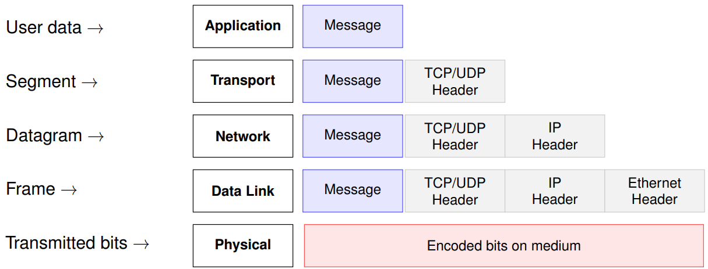
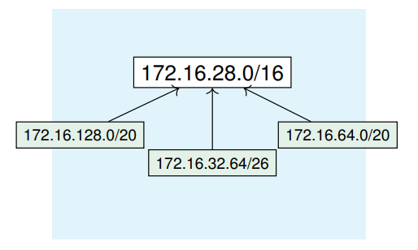

# IP Addressing Recap

## 1. Introduction to IP

### Reference Models: OSI vs TCP/IP

__Internet networking is based on the TCP/IP model, not the OSI model__

- OSI is a 7-layer reference model, often used for conceptual understanding.
- TCP/IP is a 5-layer practical model used in Internet architecture.
- Real-world protocols operate primarily at the Network and Transport layers.
- Data Link and Physical layers govern local transmission details.

### Layer Encapsulation in the TCP/IP Stack

### Network Layer: Core Responsabilities

__Key Functions of the Network Layer__

- __Logical Addressing__: assigns unique IP addresses to interfaces
- __Routing__: determines the best end-to-end path across networks
- __Forwarding__: selects the correct output interface for each packet
- __Fragmentation/Reassembly__: adapts packet size to physical network constraints
- __Core Protocols__: IPv4, IPv6, ICMP
- __Support Protocols__: ARP, NDP

### IP Addressing Basics (IPv4)

- An IPv4 address is a 32-bit identifier assigned to interfaces.
- Expressed in dotted-decimal format: 192.168.1.10
- Internally: composed of four octets (8-bits)

### IP Addressing Basics (IPv6)

- IPv6 addresses are 128 bits long
- Represented as 8 groups of 4 hex digits (16 bits each)
- Groups are separated by colons (:)
- Two simplification rules:
	+ Remove leading zeros in each group
	+ Replace consecutive groups of 0000 with :: (only once)
	

### IP Addressing Modes

__Types of IP Communication__:

- __Unicast__: One-to-one communication
	+ Most common type (e.g., client-server)
	+ Packet is routed to a single, specific destination
- __Multicast__: One-to-many communication (selected receivers).
	+ Efficient group communication (e.g., video streaming, routing protocols).
	+ IPv4: 224.0.0.0/4; IPv6: ff00::/8
- __Anycast__: One-to-nearest communication (in IPv6).
	+ Same address is assigned to multiple nodes
	+ Packet is routed to the topologically closest node.
	+ Used in CDN, DNS root servers.
	

### Global IP Address Management Hierarchy

__IANA (Internet Assignment Numbers Authority)__

Operated by ICANN, it allocates large blocks of IP address space to the RIRs and manages the global IP and AS number registry 

__RIRs (Regional Internet Registries)__

Distribute address space within specific regions. 
Examples: 
- ARIN (North America) 
- RIPE NCC (Europe) 
- APNIC (Asia-Pacific)
- LACNIC (Latin America)
- AFRINIC (Africa).

__LIRs/ISPs (Local Internet Registries)__

Receive allocations from RIRs to assign IP addresses to customers – including enterprises, universities, and end users.

__End Users__

Use assigned IP addresses to connect devices to the Internet or private networks.

### What is a router

A router connects two or more networks and forwards packets based on destination IP, according to its routing table. It may also perform address translation (NAT) to map private IPs to a public address.

### IP Routing vs Forwarding

__Forwarding (Data Plane)__

- Local decision at each router.
- Moves packets from input to output interface.
- Based on routing table lookups.

__Routing (Control Plane)__

- Builds and updates the routing table.
- Involves protocols (OSPF, BGP).
- Chooses best paths across the network.

### Routing Table Lookup and Next-Hop Logic

__Lookup Process__:

1. Extract the destination IP from the packet.
2. Search the routing table for the __longest prefix match__.
3. Use the matched entry to determine:
	1. __Next-hop IP address__
	2. __Outgoing interface__
4. If the destination is directly reachable, resolve MAC with ARP.
5. If no route is found, discard and send an ICMP "destination unreachable".

> __Note__: The destination IP address remains unchanged; only Layer 2 headers are updated at each hop.

### Internet Provider Hierarchy

### Classfull IPv4 Addressing Scheme

__IP Address Class Ranges__:

- __Class A__: 0.0.0.0 – 126.255.255.255
- __Class B__: 128.0.0.0 – 191.255.255.255
- __Class C__: 192.0.0.0 – 223.255.255.255
- __Class D__: 224.0.0.0 – 239.255.255.255
- __Class E__: 240.0.0.0 – 255.255.255.254

> __Note__: Class A addresses starting with 127.x.x.x are reserved for loopback; Class E is reserved and not used publicly

### Reserved IP Address Blocks (not to be routed over the public internet)

| Address Range   | Class | Scope | Usage |
| -------------   | ----- | ----- | ------|
| 0.0.0.0/8       | A | Special       | “This” network, source before config |
| 10.0.0.0/8      | A | Private       | Internal use (RFC 1918) |
| 100.64.0.0/10   | A | Shared        | Carrier-grade NAT (RFC 6598) |
| 127.0.0.0/8     | A | Loopback      | Localhost loopback testing |
| 169.254.0.0/16  | B | Link/local    | Auto-addressing (APIPA) |
| 172.16.0.0/12   | B | Private       | Internal use (RFC 1918) |
| 192.0.0.0/24    | C | Reserved      | Protocol assignments (IETF) |
| 192.0.2.0/24    | C | Documentation | TEST-NET-1 (RFC 5737) |
| 192.88.99.0/24  | C | Deprecated    | 6to4 relay anycast |
| 192.168.0.0/16  | C | Private       | Internal use (RFC 1918) |
| 198.18.0.0/15   | C | Benchmarking  | Device performance testing |
| 198.51.100.0/24 | C | Documentation | TEST-NET-2 (RFC 5737) |
| 203.0.113.0/24  | C | Documentation | TEST-NET-3 (RFC 5737) |
| 224.0.0.0/4     | D | Multicast     | IP multicast addressing |
| 240.0.0.0/4     | E | Reserved      | Future use (not routable) |
| 255.255.255.255 | - | Broadcast     | Limited broadcast (local) |

### IP Addressing Problems

- __IP Address Exaustion__
	+ Class A, B, and C address structure inefficient
	+ Class B too large for most organizations, but future proof
	+ Class C too small
- __IP routing table size__
	+ Growth in # of networks in Internet reflected in # of table entries
	+ Stress on router processing power and memory allocation
- __Short-term solution__:
	+ Classless Interdomain Routing (CIDR), RFC 1518
	+ New allocation policy (RFC 2050)
	+ Private IP Addresses set aside for intranets (NAT)
- __Long/term__:
	+ IPv6 with much bigger address space
	
---

## 2. CIDR and Subnetting

### CIDR: Classless Inter-Domain Routing

__Why CIDR was introduced__:

- Avoid rigid address classes (A/B/C) and their wasteful allocation.
- Enable scalable routing via prefix-based aggregation.

__CIDR notation__

_IP-addr/prefix-legth_ (e.g., 200.23.16.0/113)

Indicates that the first 23 bits are fixed (network), remaining are host bits.

### Subnetting Approaches - FLSM vs VLSM

#### FLSM (Fixed Length Subnet Masking)

- All subnets have the same size.
- Simpler to manage, but often inefficient.
- Example: divide a /24 into 4 equal /26 subnets.

#### VLSM (Variable Length Subnet Masking)

- Subnets with different sizes.
- More efficient use of address space
- Requires classless routing protocols.

### Subnetting and Supernetting (Conceptual View)

#### Subnetting

- The technique of partitioning a large network into smaller networks.
- The well-defined method for the subnetting is FLSM/VLSM.

#### Supernetting

- Combines smaller ranges of addresses into a larger space using CIDR
- Facilitates routing process (reduces size of routing table)

