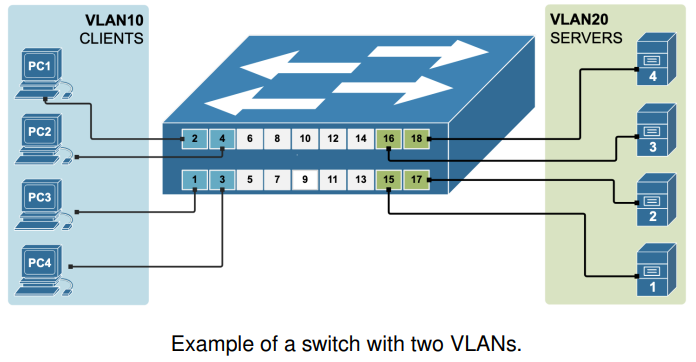
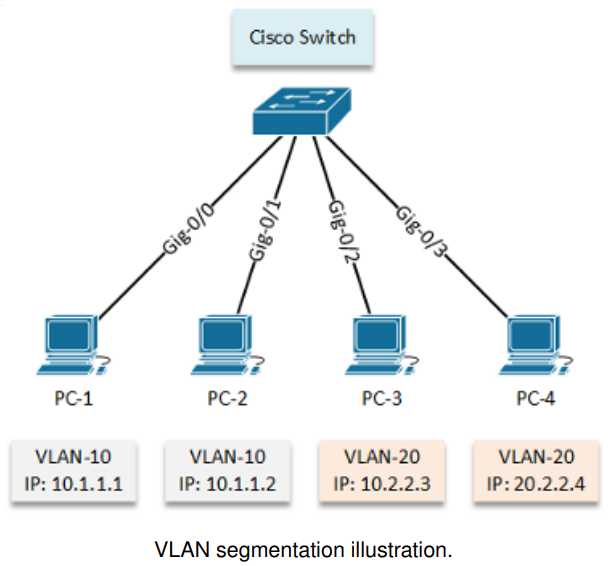
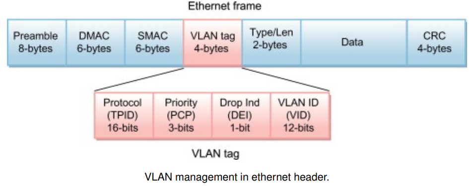
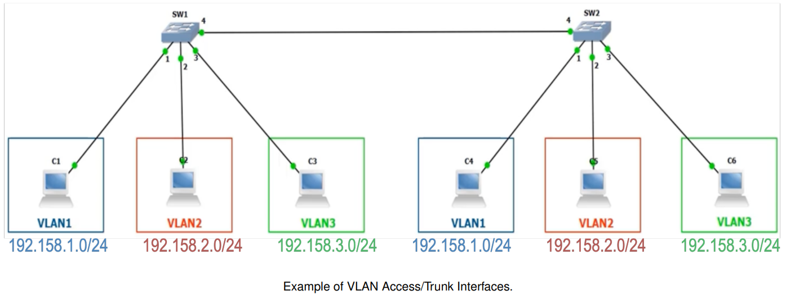
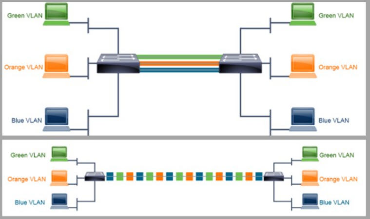
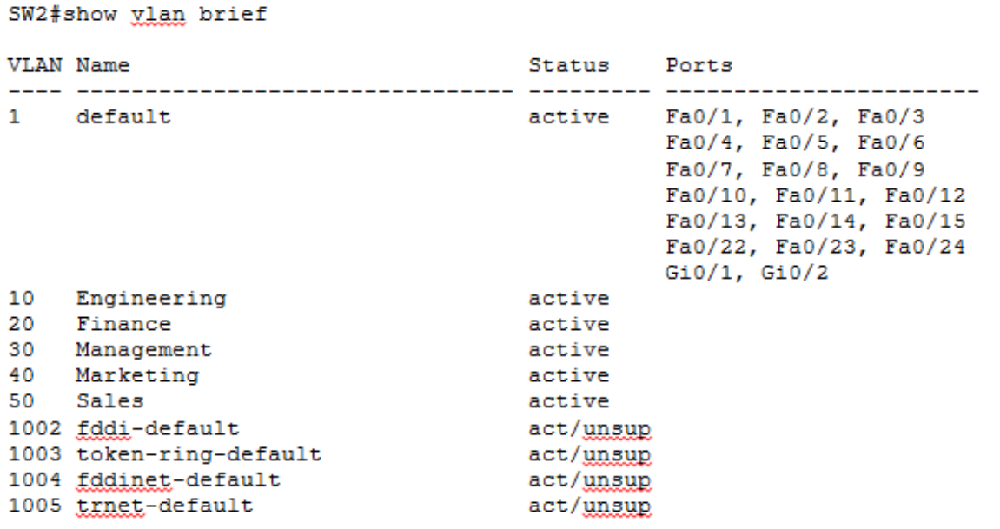
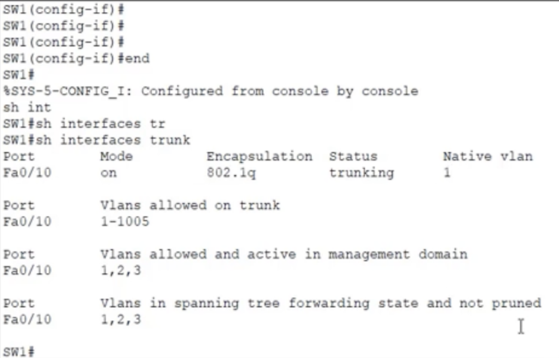
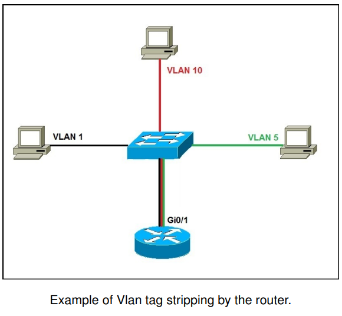
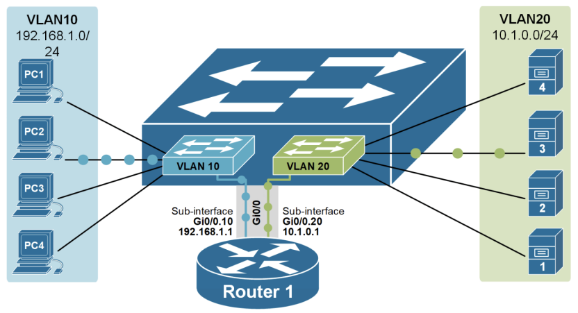
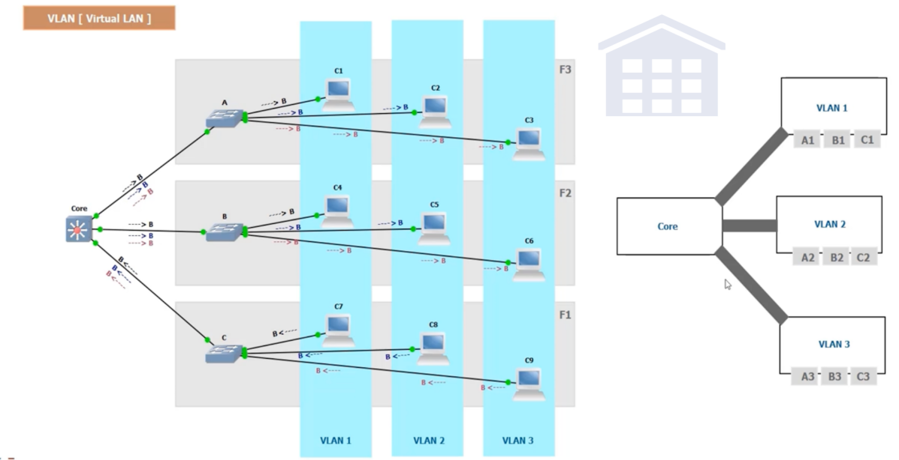

# Switching and Virtual Local Area Networks (VLANs)]

## 1. Introduction

### What is a VLAN?

- VLAN = Virtual Local Area Network
- Logical subdivision of a Layer 2 network into multiple broadcast domains.
- Devices in the same VLAN can communicate directly, regardless of physical location.



### Why use VLANs?

- __Improving Segmentation__: Isolate departments or services logically.
- __Enhancing Security__: Restrict access between sensitive zones
- __Reducing Broadcasts__: Limit broadcast traffic within each VLAN
- __Increasing Flexibility__: Devices can move without reconfiguration
- __Supporting Policy Control__: Apply different QoS or firewall rules



### How VLANs Work at Layer 2: IEEE 802.1Q Tagging

- VLANs are implemented by adding a 4-byte tag to Ethernet frames (__802.1Q__).
- The tag includes, priority bits, DEI (Drop Eligible Indicator, and 12-bit VLAN ID (0–4095, with 0 and 4095 reserved)).
- Switches use this tag to segregate traffic into logical Layer 2 domains.



### VLANs Help in Managing Broadcast Domains

#### Collision Domain

- Devices that share the same physical transmission medium.
- Only one device can transmit at a time in a shared medium (e.g., hub).
- Switches eliminate collisions by isolating each port into its own collision domain.

#### Broadcast Domain

- Group of devices that receive Layer 2 broadcast frames.
- VLANs separate broadcast domains logically within switches.

#### Default device behaviour:

- Each switch port is a separate collision domain.
- Routers separate broadcast domains.
- Switches extend broadcast domains unless VLANs are used.

----

## 2. VLAN Types

- __Static VLANs (Port-based)__:
	+ Each port on the switch is manually assigned to a VLAN.
	+ Most common method in enterprise environments.
	+ Simple and secure, but lacks flexibility.
	+ Preferred in fixed workstation deployments.
	
- __Dynamic VLANs (MAC-based)__:
	+ Devices are assigned to VLANs based on their MAC address
	+ Requires a VLAN Management Policy Server (VMPS)
	+ Offers higher mobility, but adds complexity
	+ Used in environments with frequent device mobility
	
### Special VLAN Types

- __Default VLAN__:
	+ VLAN 1 on Cisco devices
	+ Automatically assigned to all ports
- __Native VLAN__:
	+ VLAN that carries untagged traffic on a trunk (useful for devices that do not support 802.1Q).
	+ Should be changed from VLAN 1 for security
	+ Best practice: assign a non-default and _not-used_ VLAN (e.g., VLAN 99) as native
- __Management VLAN__:
	+ Used for switch administrative access (Telnet, SSH, SNMP)
	+ Typically assigned a dedicated VLAN ID
	+ Serves to isolate switch management from user traffic
- __Voice VLAN__:
	+ Used for IP phones (QoS enabled)
	
---

## 3. VLAN Configuration



### Access and Trunk Ports

- __Access Port__: Connects to end devices; assigned to one VLAN
- __Trunk Port__: Carries traffic from multiple VLANs using 802.1Q tagging
	+ Native VLAN traffic is not tagged on trunks (default is VLAN 1)
	+ Disable Dynamic Trunking Protocol (DTP) with: `switchport nonegotiate`
	


#### Access Port Configuration Example

```shell
Switch(config)# vlan 10
Switch(config-vlan)# name ACCOUNTING
Switch(config)# interface fa0/1
Switch(config-if)# switchport mode access
Switch(config-if)# switchport access vlan 10
Switch(config-if)# switchport nonegotiate
```

#### Trunk Port Configuration Example

```shell
Switch(config)# interface fa0/24
Switch(config-if)# switchport trunk encapsulation dot1q
Switch(config-if)# switchport mode trunk
Switch(config-if)# switchport trunk native vlan 99
Switch(config-if)# switchport trunk allowed vlan 10,20,30
Switch(config-if)# switchport nonegotiate
```

> __note__: nonegotiate disables Dynamic Trunking Protocol (DTP), useful for static trunk setups.

#### VLAN Configuration and Status Checks

```shell
# Show VLANs and port assignments
Switch # show vlan brief

# Check trunk port status and allowed VLANs
Switch # show interfaces trunk

# Verify switchport mode and VLAN on an interface
Switch # show interfaces fa0 /24 switchport

# View the current config of a specific interface
Switch # show running - config interface fa0 /24

# Confirm port status and VLAN assignment
Switch # show interfaces status
```

- Example: show vlan brief output



- Example: show interfaces trunk output



#### VLAN Connectivity and Forwarding Checks

```shell
# Display MAC addresses learned in a VLAN
Switch # show mac address - table vlan 10

# Inspect STP role and status for a VLAN
Switch # show spanning - tree vlan 10

# Test connectivity between VLANs or devices
Switch # ping 192.168.10.1
Switch # traceroute 192.168.10.1
```

## 4. Inter-VLAN Routing

### Tag Stripping in inter-VLAN Routing

- VLAN tags (IEEE 802.1Q) are added to frames on trunk links
- Switches add tags on egress to trunk ports and strip them on access ports
- However, in inter-VLAN routing, it’s the router (or L3 switch) that:
	+ Receives tagged frames on subinterfaces (e.g., Fa0/1.1 for VLAN 1)
	+ Removes the tag (tag stripping)
	+ Forwards a regular (untagged) frame to the destination host
- End hosts never see VLAN tags — all tagging and untagging is handled by network devices



### Router-on-a-Stick (ROAS)

- Used to route traffic between VLANs using a single physical router interface
- Subinterfaces are created and assigned to VLANs using 802.1Q encapsulation
- Trunk connection between switch and router is required



ROAS configuration example:

```shell
Router(config)# interface g0/0.10
Router(config-subif)# encapsulation dot1Q 10
Router(config-subif)# ip address 172.16.10.1 255.255.255.0
Router(config)# interface g0/0.20
Router(config-subif)# encapsulation dot1Q 20
Router(config-subif)# ip address 172.16.20.1 255.255.255.0  
```

### From One Switch to Many: Complexity Increases

- __Single-Switch VLAN Routing__ is simple:
	+ VLANs and routing configured on one device
	+ Trunk link connects switch to router (router-on-a-stick)
- __When expanding to multiple switches__:
	+ VLANs must be __propagated across all switches__
	+ Loop prevention (e.g., STP) becomes essential
	+ Requires __trunk links__ and possibly VLAN Trunking Protocol (VTP)
	+ VTP is a Cisco protocol used to distribute VLAN configuration  across multiple switches, reducing manual configuration by synchronizing VLAN IDs and names automatically
- VTP has three modes:
	+ __Server__: Creates, modifies, and propagates VLANs
	+ __Client__: Receives VLAN info but cannot create/modify
	+ __Transparent__: Forwards VTP messages but manages VLAN locally
	
## 5. VLAN Design Considerations

### Best Practices

- Use descriptive VLAN names and maintain consistent documentation
- Assign unused ports to a dummy VLAN and shut them down
- Avoid VLAN 1 for user data and management
- Disable DTP and configure trunk ports manually

### Example VLAN Design




 