# Spanning Tree Protocol (STP)

## 1. Introduction

### Bridge or Switch Definition

- A __switch__ or __bridge__ is a Layer 2 device that forwards ethernet frames based on destination MAC addresses.
- Frames are forwarded only to the __destination__ port (unicast).
- Broadcast frames are __flooded__ to all ports (except incoming).
- Switches build a MAC address table (__FDB table__) by dynamically associating MAC addresses to ports.

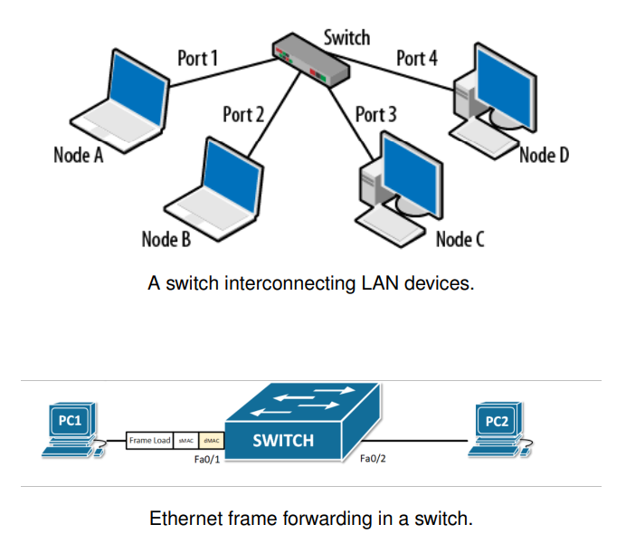

### Switching Modes - Latency vs Reliability

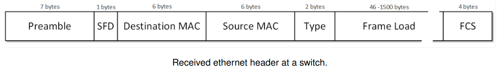

#### Store-and-Forward

- Receives entire frame before forwarding
- Validates FCS (Frame Check Sequence)
- Ensures data integrity
- __High reliability__
- __Higher latency__

#### Fragment-Free

- Waits for first 64 bytes before forwarding.
- Catches most collision errors
- No full-frame check
- __Balanced latency__
- __Moderate reliability__

#### Cut-Through

- Starts forwarding after reading destination MAC
- Does not verify FCS
- Corrupt frames may be forwarded
- __Very low latency__
- __Lower reliability__
- (bad for WiFi)

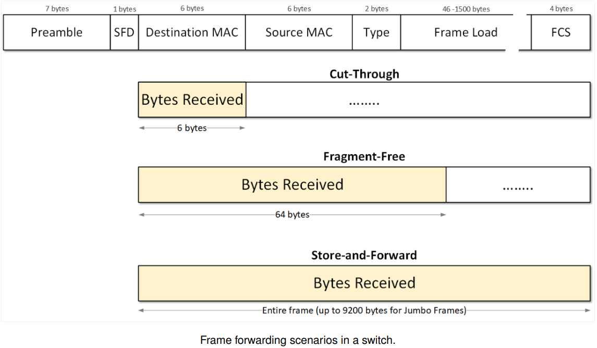

### How Switches Learn and Forward

- The learning process in switches relies on examining the source MAC address of the Ethernet header frame
- The switch records the source MAC and incoming port
- If the destination MAC is known, it forwards to the specific port using the predefined mode
- If not, it floods the frame to all ports except the source

```sh
Switch# show mac address-table dynamic

		Mac Address Table
---------------------------------------------

Vlan		Mac Address		Type			Ports
----		----------		-------		-----
  1		000c.853d.9ec1	DYNAMIC		Fa0/4
  1		0010.1128.4232	DYNAMIC 		Fa0/2
  1		0060.70d2.a343	DYNAMIC		Fa0/3
  1		0090.2b09.0ea7	DYNAMIC		Fa0/1 
```

### MAC Address Table Ageing

- Learned MAC addresses have a limited lifetime in the table
- This is controlled by the __Ageing Time__ parameter
- Ageing Time can range from 10 seconds to over 1 million seconds
- Default value: __300 seconds__ (5 minutes)
- Ensure that:
	+ MAC entries are refreshed if devices remain active
	+ MAC addresses are removed if a device disconnects or moves
	
### Switch Loops: Redundancy vs. Risk

- Redundant links between switches are used to:
	+ Ensure fault tolerance
	+ Provide alternative paths if a link fails
	
- However, loops can create severe issues:
	+ __Broadcast storms__ — repeated flooding of frames
	+ __MAC table instability__ — MAC entries keep changing (...switch will receive for example, the same ARP request in 2 diferent interfaces)
	+ __Multiple frame copies__ — leading to network congestion
	
## 2. STP Fundamentals

### Spanning Tree Protocol (STP)

- STP is defined in __IEEE 802.1D__
- It creates a loop-free logical topology by selectively blocking ports to eliminate redundant paths
- Ensures a __single active path__ between any two devices in the bridged network
- __Elects a Root Bridge__, which serves as the reference point for path calculation and propagates Bridge Protocol Data Units (__BPDUs__)
- Automatically reactivates __blocked ports__ when a topology change occurs (e.g., link failure)
- Adapts dynamically to __topology changes__ to maintain loop-free connectivity

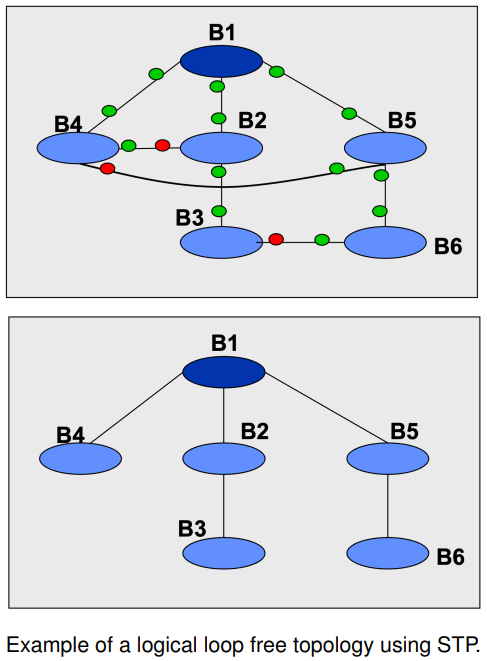

### Bridge ID and Root Bridge Election

- Each switch has a unique Bridge ID (priority + MAC address). Default value for priority: 32768
- The switch with the lowest Bridge ID becomes the root
- BPDUs are used to elect the root and share path cost info
- Upon receiving a superior BPDU (lower root ID or lower path cost), a switch updates its view of the root and forwards the better BPDU

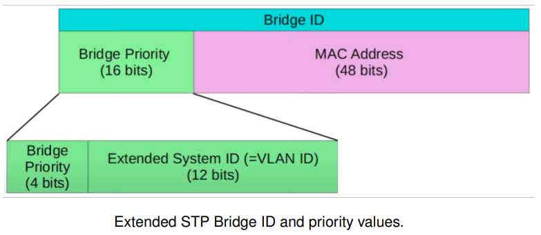

- The Extended Bridge ID is an enhancement over the original Bridge ID used in the standard STP to provide better scalability, particularly when dealing with multiple VLANs

### Decision on the "Best" BPDU - Algorithm

Given two configuration BPDUs, the best one is chosen in the following order:

1. If the __Root Bridge ID__ of one BPDU is lower than the other, the lower value is better (higher priority)
2. If the __Root Bridge ID__ are equal, compare the __path costs (RPC)__. The BPDU with the lower cost is better
3. If both the __Root Bridge ID__ and the cost are equal, compare the __Bridge Name__. The lower Bridge ID wins.
4. If all values are equal, the tie is broken by the __lowest sending port ID__
5. If stil equal, break the tie using the __receiving port ID__ (in cases like `switch -> hub -> two ports on another switch`)

### BPDU Message Exchange

#### Types of BPDU Messages

- __Configuration BPDU (C-BPDU)__ - configuration rules:
	+ 35 bytes total
	+ Sent by the Root Bridge (RB) to all others
- __Topology Change BPDU (TC-BPDU)__ - reset and learn again:
	+ 4 bytes total
	+ Non-root switches send TCN BPDUs (Type 0x80) toward the RB when they detect a topology change
	+ The RB responds with C-BPDUs (Type 0x00) with the TC flag set for 20 seconds out of all designated ports
	
##### C-BPDU Structure (35 bytes)

| Label | Bytes | Field Definitions |
| ----- | ----- | ----------------- |
| Protocol Identifier | 2 | Always `0x0000`, indicates IEEE 802.1D |
| Version Identifier | 1 | Usually `0x00`, for standard STP |
| BPDU Type (Flags: TC or TCA)| 2 | `0x00` for C-BPDU; `0x80` for TC-BPDU |
| Root Identifier | 8 | Bridge ID of the current RB |
| Root Path Cost | 4 | Cummulative cost of the best path to the RB |
| Bridge Identifier | 8 | Bridge ID of the switch sending the BPDU |
| Port Identifier | 2 | Identifies the port through which the BPDU is sent |
| Message Age | 2 | Number of hops (Bridge count) since RB (starts at 0) |
| Max Age | 2 | Maximum lifetime of a BPDU (default: 20s) |
| Hello Time | 2 | Interval between C-BPDUs sent by the RB (default: 2s) |
| Forward Delay | 2 | Time spent in Listening and Learning states (default: 15s) |

##### TC-BPDU Structure (4 bytes)

| Label | Bytes | Field Definitions |
| ----- | ----- | ----------------- |
| Protocol Identifier | 2 | Always `0x0000`, indicates IEEE 802.1D |
| Version Identifier | 1 | Usually `0x00`, for standard STP |
| BPDU Type | 2 | `0x80` for TC-BPDU |

## 3. STP Timers and Port States

### STP Topology Calculation Timers

- __Hello Time__ (default: 2 seconds)
	+ Controls the interval between C-BPDUs sent by the Root Bridge
- __Forward Delay__ (default: 15 seconds)
	+ Allows the Root Bridge to control the transition to the `forwarding` state in a consistent manner
	+ This value is based on the maximum number of bridges between two endpoints in the Layer 2 network
	+ The default assumes a maximum network diameter of 7 bridges (2s X 7 = 14s / 15s)
- __Max Age__ (default: 20 seconds)
	+ Defines how long a BPDU is considered valid
	+ If no BPDU is received within this period, a topology recalculation is triggered assuming a failure
	
### STP - Port States and Transitions

- __Blocking__: Receives BPDUs but does not learn or forward frames
- __Listening__: Participates in BPDU exchange but still does not learn or forward during Forward Delay Timer (default 15s)
- __Learning__: Learns MAC addresses but does not forward yet during Forward Delay Timer
- __Forwarding__: Fully functional – forwards traffic and learns MACs
 
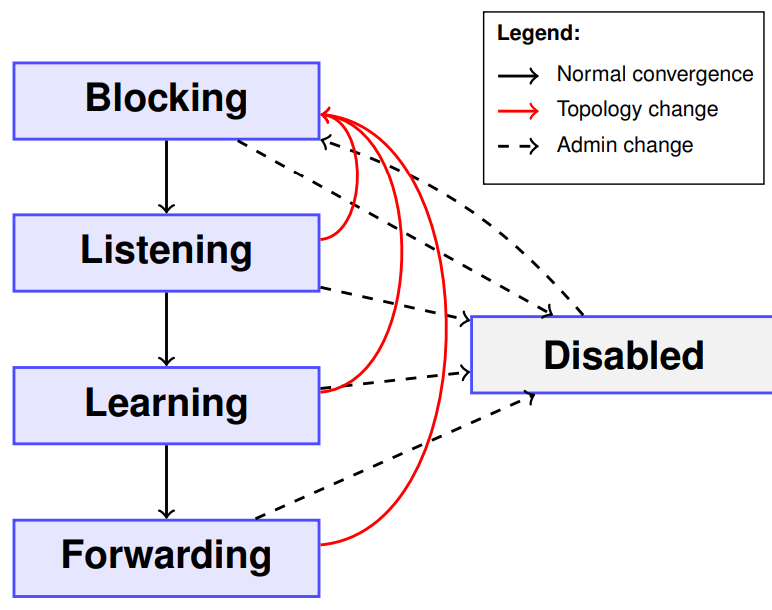

### STP Port States and Interface Behaviour Summary

| STP Port State | Receives BPDUs | Sends BPDUs | Learns MAC addr | Forwards Data Packets |
| ------------- | --- | --- | --- | ---- |
| Forwarding | YES | YES | YES | YES |
| Learning | YES | YES | YES | NO |
| Listening | YES | YES | NO | NO |
| Blocking | YES | NO | NO | NO |
| Disabled | NO | NO | NO | NO |

### STP Worst-Case Convergence Timing

#### Root failure or path loss triggers STP recomputation:

- __Max Age (20s)__: Time waited before considering the Root unreachable
- __Forward Delay (15s + 15s)__: Listening and Learning states before forwarding
resumes

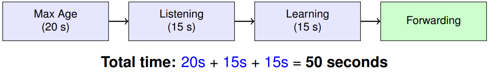

## 4. STP Topology Building

### Defafult STP Port Costs

#### Spanning Tree Path Cost Reference Table

| Port Speed | Original Cost | Revised IEEE Cost |
| ---------- | ------------- | ----------------- |
| 10 Mbps | 100 | 2,000,000 |
| __100 Mbps__ | __19__ | 200,000 |
| __1 Gbps__ | __4__ | 20,000 |
| 10 Gbps | 2 | 2,000 |
| 100 Gbps | N/A | 200 |
| 1 Tbps | N/A | 20 |

> Lower cost means a better path

### STP Port Role Selection Criteria

- __Root Port__ - The port on a switch (other than the Root Bridge) that has the lowest cost path to the Root Bridge. Each non-root switch has exactly one Root Port
- __Designated Port__ - The port on a segment that has the best path to the Root Bridge. This port is responsible for forwarding BPDUs on that segment and is always in the forwarding state
- __Non-Designated (Blocked) Port__ - Any port that is neither a Root Port nor a Designated Port. It is placed in the blocking state to prevent loops

### Spanning Tree Algorithm (3 Steps)

1. Elect the __Root Bridge__ based on the lowest Bridge ID
2. Select the __Root Port__ on each non-root bridge (port with the best path to the Root Bridge)
3. Select the __Designated Port__ on each segment (the port that sends the best
BPDU on that segment)

### Decision on the "Best" BPDU

Given two configuration BPDUs, the best one is chosen in the following order:

1. If the __Root Bridge ID__ of one BPDU is lower than the other, the lower value is better (higher priority)
2. If the __Root Bridge IDs__ are equal, compare the __path costs (RPC)__. The BPDU with the lower cost is better
3. If both the __Root Bridge ID__ and the cost are equal, compare the __Sender Bridge__ ID. The lower Sender Bridge ID wins
4. If all values are equal, the tie is broken by the __lowest sending port ID__
5. If still equal, break the tie using the __receiving port ID__ (in cases like
`switch→hub→two ports on another switch`)

### Rules for Designated Ports and STP Costs

- Each __segment__ is associated with a __Designated Port (DP)__ from a bridge connected to it
- The Designated Port is the port connected to the segment with the __lowest cumulative cost to the Root Bridge__
- The outbound cost (__DPC__) of ports that __are not Root Ports__ equals the __incoming cost (RPC)__ of the Root Port on the same bridge
- The __cost to the Root Bridge is a property of the segment__, not of the individual bridge

#### Example of Root Bridge Selection and Port Roles Definition

1. Elect a Root Bridge. Place root interfaces into Forwarding state
2. Each non-root switch selects its Root Port
3. Remaining links choose a Designated Port. All other ports are put in to a Blocking state

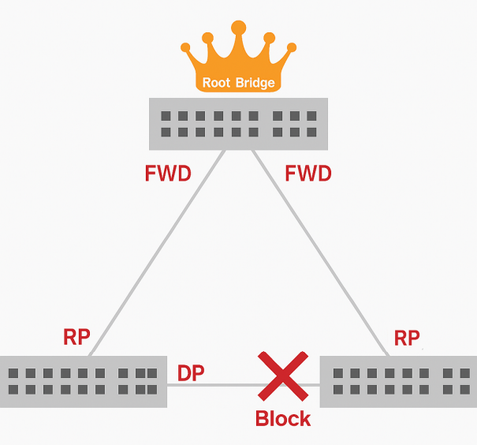

### Spanning Tree Algorithm (Tie-Breakers)

#### Tie-breaking rules when multiple BPDUs have equal path cost:

1. Lower __Sender Bridge ID__
2. Lower __Sender Port ID__ (Port ID = Port Priority . Port Number)
3. Lower __Local Port ID__

#### Example – Port ID (PID) composition:

- Interfacce `Gi0/1`
- PID = `Port Priority . Port Number`
- Example: `PID = 128.25`
- Default Port Priority is `128`, range: `0-255`

### STP: Topology Change Detection

#### When a __Bridge detects a topology change (TC)__, it initiates the TC process

1. __Switches detecting a failure__ send a __TC-BPDU__ (TC Notification) via their __Root Port__
	1. Switches that receive this BPDU respond with a __TCA-BPDU__ (acknowledgement)
	2. They then forward the TC-BPDU towards the __Root Bridge__
2. __Upon receiving a TC-BPDU, the Root Bridge__:
	1. Sends a __TCA-BPDU__ back to acknowledge it
	2. Starts transmitting __Configuration BPDUs (C-BPDUs)__ with the __TC flag set__
	3. All switches then reduce their __MAC aging time__ to the value of the __Forward Delay__ and flush outdated MAC entries
3. __C-BPDUs with the TC flag__ are transmitted through ports in __forwarding or blocking__ states
	1. The TC flag remains active for a period of max age + forward delay seconds (default: __20 + 15 = 35s__)

#### STP Topology Change: two step process

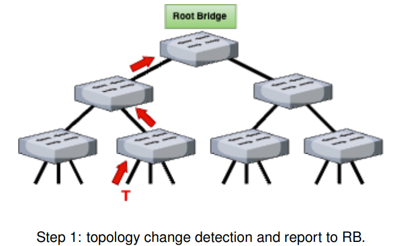

- A topology change is generated on point __T__
- 1st step: A TCN is going up to the root

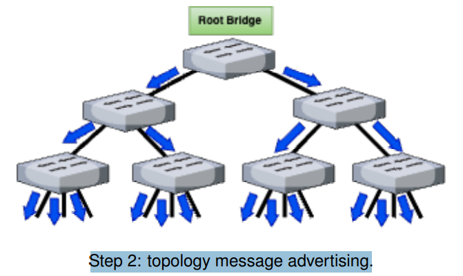

- 2nd step: the root advertises the TC for max-age + forward delay

## 5. STP Exercice

| Switch | Priority | MAC |
| ------ | -------- | --- |
| SW1 | 16384 | 0001.7C1D.3C01..3C1A |
| SW2 | 24576 | 0002.7C1D.3C01..3C1A |
| SW3 | 32768 | 0003.7C1D.3C01..3C1A |
| SW4 | 40960 | 0004.7C1D.3C01..3C1A |
| SW5 | 49152 | 0005.7C1D.3C01..3C1A |
| SW6 | 57344 | 0006.7C1D.3C01..3C1A |

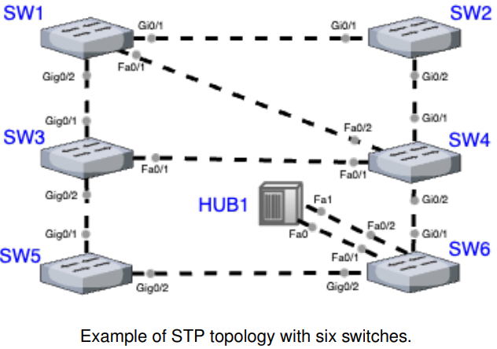

### Determine the STP __roles__ and __path costs__ for each interface, assuming the topology has __converged__.

1. Eleger root bridge - aquele que tiver menor prioridade - SW1
2. Preencher todos os portos por ordem - __Port__
3. Definir os 'port costs' (4 para Gig, 19 para Fa) - __PC__
4. Definir os 'root port costs' (o custo do caminho mais curto para o root bridge) - __RPC__
5. Escolher o menor valor para 'root port' - __RP__
6. Nos segmentos remanescentes (Designated __DP__ e/ou Blocked __BLK__):
	1. Designated, sempre a port com melhor BPDU do segmento (novamente as prioridades dos switches)
	2. Os segmentos que tem Root Port sao Designated Port
	3. Todos os portos do Root Switch sao Designated Ports
	4. Em caso de empate, escolher o port com ID menor
5. Por fim, preencher a coluna DPC (Designated Port  Cost)

| Port      | PC | RPC             | DPC | RP | DP | BLK |
| --------- | -- | --------------- | --- | -- | -- | --- |
| SW1/Gig01 | 4  | -               |     |    |    |     |
| SW1/Gig02 | 4  | -               |     |    |    |     |
| SW1/Fa01  | 19 | -               |     |    |    |     |
| SW2/Gig01 | 4  | 4 + 0 = 4       |     | X  |    |     |
| SW2/Gig02 | 4  | 5 x 4 = 20      | 20  |    | X  |     |
| SW3/Gig01 | 4  | 4 + 0 = 4       |     | X  |    |     |
| SW3/Gig02 | 4  | 5 x 4 = 20      | 20  |    | X  |     |
| SW3/Fa01  | 19 | 19 + 4 x 2 = 27 | 27  |    | X  |     |
| SW4/Gig01 | 4  | 4 + 4 = 8       |     | X  |    |     |
| SW4/Gig02 | 4  | 4 x 4 = 16      | 16  |    | X  |     |
| SW4/Fa01  | 19 | 19 + 4 = 23     |     |    |    | X   |
| SW4/Fa02  | 19 | 19              |     |    |    | X   |
| SW5/Gig01 | 4  | 2 x 4 = 8       |     | X  |    |     |
| SW5/Gig02 | 4  | 4 x 4 = 16      | 16  |    | X  |     |
| SW6/Gig01 | 4  | 3 x 4 = 12      |     | X  |    |     |
| SW6/Gig02 | 4  | 3 x 4 = 12      |     |    |    | X   |
| SW6/Fa01  | 19 | 19 + 3 x 4 = 31 | 31  |    | X  |     |
| SW6/Fa02  | 19 | 19 + 3 x 4 = 31 |     |    |    | X   |

