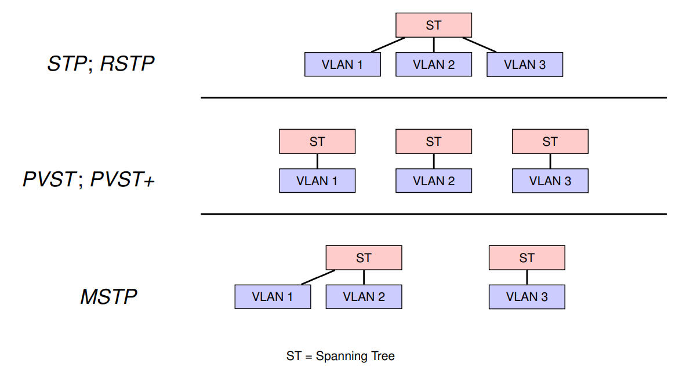
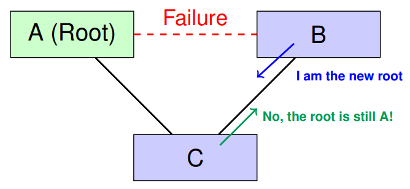
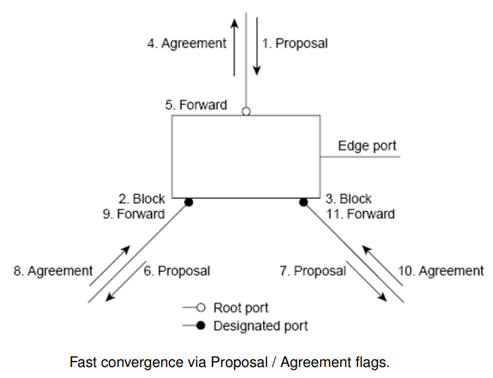
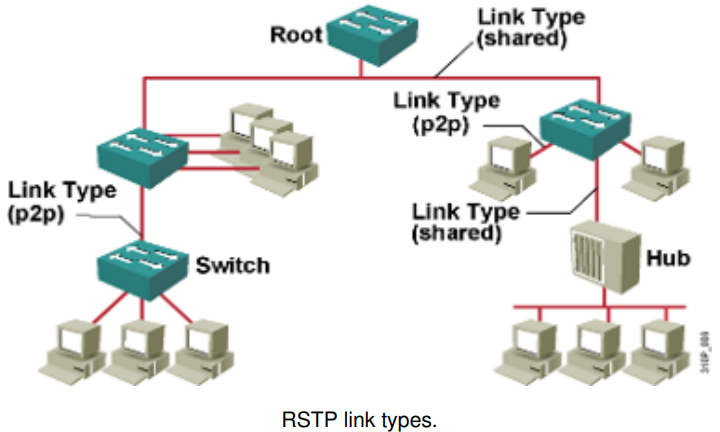
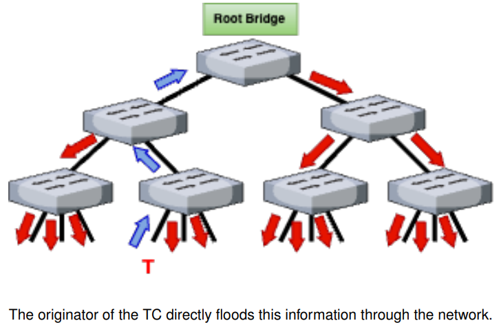
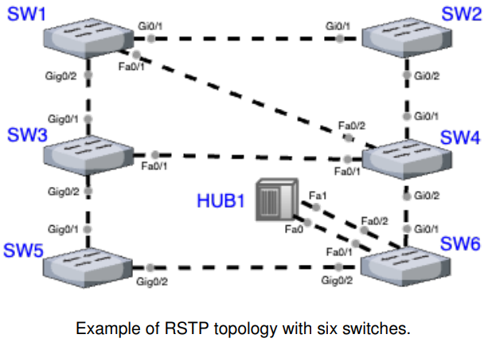
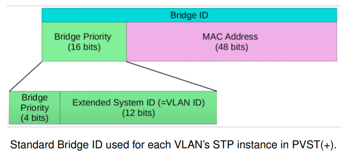
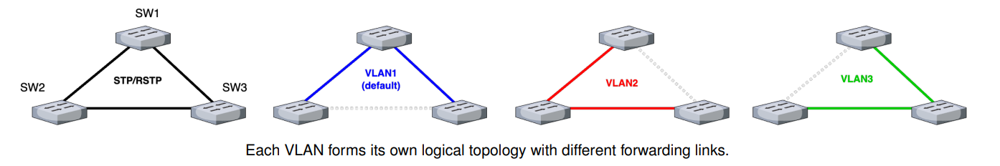
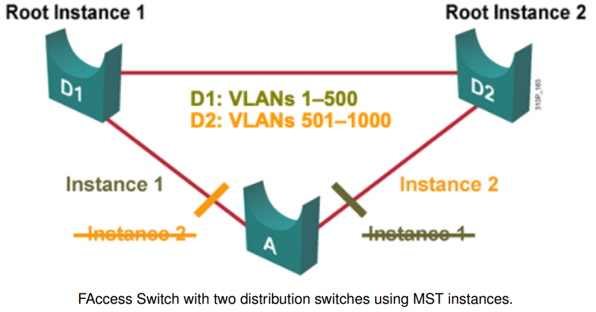
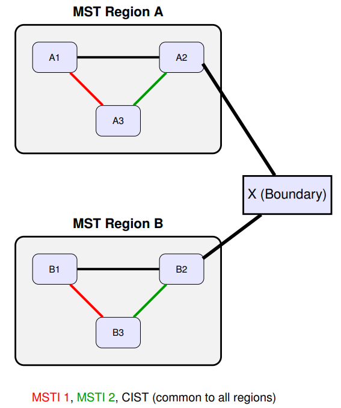

# Spanning Tree Protocol (STP) Advanced

## 1. Introduction

### Evolution and Limitations of Spanning Tree Protocol (STP) - IEEE 802.1D

- Slow convergence: up to 50 seconds
- Not optimized for VLANs or modern link types
- No support for multiple spanning tree per VLAN
- Better solutions emerged:
	+ Rapid Spanning Tree Protocol (__RSTP__)
	+ Per VLAN Spanning Tree Protocol (__PVST__)
	+ Per VLAN Spanning Tree Protocol Plus (__PVST+__) - compatible with IEEE 802.1Q
	+ Multiple Spanning Tree Protocol

	


---

## 2.Rapid Spanning Tree Protocol (RSTP - 802.1w)

- __Standard__: 
	- IEEE 802.w (June 2001)
- __Goal__:
	+ Build a spanning tree in the network in the order of tens of milliseconds
- __Key Features__:
	+ Supports Bridges/Switches with more than 256 ports
	+ Enables Fast Switching / Forwarding on edge ports
	+ Fully compatible with STP:
		* Ports revert to STP if BPDUs are received
		* Ports can operate in different modes (STP or RSTP)
- __Operation__:
	+ Similar to STP in logic
	- BPDUs include extra information
	- Optimized for point-to-point links, which are the norm today
	- The resulting tree is equivalent to that formed by STP

### Port State Mapping: STP vs RSTP

__RSTP simplifies the STP state machine by merging equivalent states__

| Operational State | STP State | RSTP State |
| ----------------- | --------- | ---------- |
| Disabled          | Disabled  | Discarding |
| Enabled           | Blocking  | Discarding |
| Enabled           | Listening | Discarding |
| Enabled           | Learning  | Learning   |
| Enabled           | Forwarding| Forwarding |

- __Discarding__ replaces Blocking, Listening, and administratively Disabled
- __Learning and Forwarding__ retained for gradual traffic activation
- __Faster transitions__ via proposal/agreement handshake

__RSTP introduces two new port roles for faster convergence__

| STP Role        | RSTP Role       | Comments |
| --------------- | --------------- | -------- |
| Root Port       | Root Port       | Same definition. Port with the best path to the root bridge; one per switch. |
| Designated Port | Designated Port | Same logic. Forwarding port selected per segment to send BPDUs and data. |
| Blocking        | Alternate Port  | Alternate path to the root bridge (on another switch); receives better BPDUs |
| Blocking        | Backup Port     | Redundant path to the same segment (same switch); fallback if Designated Port fails. |

- RSTP introduces two additional roles: __Alternate__ and __Backup__ ports
- Both ports remain in the _Discarding_ state but can quickly transition to __Forwarding__ if the active path fails, without relying on STP timers.

### RSTP BPDU Format and Behavior

#### Key Changes in RSTP BPDUs

- __Single BPDU Type__: RSTP uses only the C-BPDU; TC-BPDU is no longer used
- __Immediate Updates__: BPDUs are sent by all bridges, not just the Root Bridge
- __Flags field redefined__:
	+ Bits reused to indicate port roles and state
	+ Includes Agreement, Proposal, and Topology Change flags
- Hello time-based handshake between Designated and Root ports
- Rapid convergence using Proposal/Agreement mechanism

#### RSTP BPDU Structure (35 bytes)

| Function | # bytes |
| ------------------------------------| - |
| Protocol Identifier                 | 2 |
| Protocol Version Identifier (0x02)  | 1 |
| BPDU Type (RSTP = 0x02; STP = 0x00) | 1 |
| Flags (Proposal, Agreement, Role)   | 1 |
| Root Identifier                     | 8 |
| Root Path Cost                      | 4 |
| Bridge Identifier                   | 8 |
| Port Identifier                     | 2 |
| Message Age                         | 2 |
| Max Age                             | 2 |
| Hello Time                          | 2 |
| Forward Delay                       | 2 |

#### STP vs RSTP: Flag Bit Comparison

| Bit | Bit Value | STP Meaning          | RSTP Meaning         |
| --- | --------- | -------------------- | -------------------- |
| 0   |           | Topology Change (TC) | Topology Change (TC) |
| 1   |           | Unused               | Proposal |
| 2-3 | 00        | Unused               | Port Role - Unknown  |
| 2-3 | 01        | Unused               | Port Role - Alternate / Backup |
| 2-3 | 10        | Unused               | Port Role - Root     |
| 2-3 | 11        | Unused               | Port Role - Designated |
| 4   |           | Unused               | Learning |
| 5   |           | Unused               | Forwarding |
| 6   |           | Unused               | Agreement (Proposal response) |
| 7   |           | Topology Change Ack (TCA) | Topology Change Ack (TCA) | 

#### BPDU Handling in RSTP

RSTP includes new handling in four key mechanisms:

1. __BPDU Generation and Aging__

	All bridges generate BPDUs every Hello Time. RSTP does not rely solely on the Root Bridge. Aging of information is based on the Message Age field.

2. __Acceptance of Inferior BPDUs__

	 A port may temporarily accept an inferior BPDU (i.e., one with a worse Root
Path), allowing faster reconfiguration.

3. __Rapid Transition to Forwarding State__

	New port roles (Alternate, Backup) and handshakes (Proposal/Agreement)
enable immediate transition without relying on timers.

4. __Topology Change Mechanisms__

	Topology changes are handled more efficiently - no separate TC BPDUs, and
changes are indicated directly in the RSTP BPDU via flags.


##### RSTP: BPDU Generation and Aging

Key Differences from STP:

- __All switches__ (not just the Root Bridge) generate and send a BPDU every Hello Time seconds (default: __2s__)
- BPDUs act as _keep-alive__ signals between direct neighbors
- If a switch __fails to receive 3 consecutive BPDUs__ from a neighbor (6s timeout), it assumes the link is down
- __Link loss is deteected locally__, not via a broken path to the Root Bridge as in traditional STP (802.1D).
- Enables faster fault detection and topology re-convergence

##### Acceptance of Inferior BPDUs in RSTP

What happens when a bridge receives an inferior BPDU?

- Each port stores the __best BPDU__ received; if a bridge receives an inferior BPDU, it may still accept and store it, adjusting the port role accordingly.
- __Example__:
	+ After a failure, bridge B assumes root role and sends BPDUs to C
	+ Bridge C replies with a superior BPDU from the real root
	+ Bridge B accepts it and updates its root port toward C
	


##### Rapid Transition to Forwarding State in STP

Proposal / Aggreement Mechanism between Bridges in RSTP:

- A bridge receiving a __Proposal__ sets the port as its new root port.
- It blocks non-edge ports temporarily and syncs them with the new root information
- After synchronization, it sends an __Agreement__ back to confirm the change
- This process avoids loops and ensures only synchronized bridges move to __Forwarding__



###### Edge Ports in RSTP

Edge ports allow immediate forwarding without risk of loops

- All ports directly connected to end stations cannot create bridging loops in the network
- __Edge ports__ never connect to other switches
- Transition immediately to Forwarding state
- Similar to PortFast (Cisco) - Cisco calls Edge ports, PortFast
- If an edge port receives a BPDU, it is reclassified as __Non-Edge__

- RSTP Edge Port Configuration: Cisco PortFast Configuration Example:

```sh
# Enable PortFast on a specific access port
Switch ( config ) # interface fa0 /10
Switch ( config - if ) # switchport mode access
Switch ( config - if ) # spanning - tree portfast

# Verify PortFast status
Switch # show spanning - tree interface fa0 /10 portfast

# Confirm operational spanning-tree role and state
Switch # show spanning - tree interface fa0 /10 detail 
```

###### Link Types and Their Role in RSTP

The type of link influences transition to Forwarding state

- __Point-to-point links__ (full-duplex):
	+ Fast handshakes allowed
	- Common between switches.
- __Shared links__ (half-duplex):
	- Assume shared medium (e.g., hubs).
	- Slower transitions, timers may be required.
- The link type is determined automatically but can be overridden by manual port configuration.



##### Topology Change Mechanisms: STP vs RSTP

How does RSTP improve over STP during topology changes?

- STP relies on __TC-BPDUs__, timers, and root bridge coordination
- RSTP acts __proactively__ and avoids timer-based delays
- Only __non-edge ports transitioning to Forwarding__ trigger a topology change
- A __TCWhile timer__ is activated (usually 2× Hello time)
- While active:
	+ BPDUs are sent with the `TC` flag
	+ MAC tables are flushed on designated non-edge ports and the root port
- Each switch propagates changes __locally__, not via the root

How RSTP ensures faster detection and reaction to link failure?

- In STP, only the __root bridge__ sends BPDUs in a stable topology
- In RSTP, __all switches generate and send BPDUs__ every Hello interval (default: 2s)
- Each switch expects to receive BPDUs on its ports regularly
- __If 3 consecutive BPDUs are missed__, the switch assumes the __link to the neighbor is down__
- This acts as a __keep-alive mechanism__, enabling faster topology reconfiguration
- __Contrast__: STP only reacts after upstream detection and propagation

###### Propagation and Effects of Topology Change in RSTP

The type of link influences transition to Forwarding state

- RSTP uses __decentralized, one-step__ topology change propagation — no TC-BPDUs needed
- Each switch detecting a change flushes MAC tables and sets the TC flag in BPDUs
- Local re-learning of paths ensures __faster convergence__



#### RSTP Port Cost Reference (802.1D vs 802.1w)

Port cost values vary by link speed and type:

| Port Speed | Link Type | Original Path Cost | Revised IEEE Path Cost |
| ---------- | --------- | ------------- | ----------------- |
|  10 Mbps   | Half Duplex     | 100 | 2,000,000 |
| 10 Mbps    | Full Duplex     | 95  | 1,999,999 |
| 10 Mbps    | Aggregated Link | 90  | 1,000,000 |
| 100 Mbps   | __Half Duplex__     | __19__  | 200,000   |
| 100 Mbps   | Full Duplex     | 18  | 199,999   |
| 100 Mbps   | Aggregated Link | 15  | 100,000*  |
| 1000 Mbps  | __Full Duplex__     | __4__   | 20,000    |
| 1000 Mbps  | Aggregated Link | 3   | 10,000*   |

> Note: 802.1w path cost scale proportionally with the number of aggregated links (logical links composed of multiple physical interfaces).

#### STP vs RSTP Overview - Comparison

| Aspect            | STP                        | RSTP             |
| ----------------- | -------------------------- | ---------------- |
| IEEE Standard     | 802.1D                     | 802.1w           |
| BPDU Transmission | __Only root bridge__ creates BPDUs | __All bridges__ can create BPDUs |
| Port Roles        | Root, Designated, Blocked  | Root, Designated, Alternate, Backup |
| Port States       | Forwarding, Learning, Listening, Blocking, Disabled | Forwarding, Learning, Discarding |
| Link Types        | Not defined | Point-to-Point and Shared |
| Convergence Speed | Slower | Much faster |
| BPDU Flags Used   | Bit 0 (TCN), Bit 7 (TCA) | Bits 0..7 for TCN, Proposal, Port Role, etc. |

 
#### RSTP Exercice

| Switch | Priority | MAC |
| ------ | -------- | --- |
| SW1	| 16384 | 0001.7C1D.3C01..3C1A |
| SW2	| 24576	| 0002.7C1D.3C01..3C1A |
| SW3	| 32768	| 0003.7C1D.3C01..3C1A |
| SW4	| 40960 | 0004.7C1D.3C01..3C1A |
| SW5	| 49152	| 0005.7C1D.3C01..3C1A |
| SW6	| 57344	| 0006.7C1D.3C01..3C1A |



Determine the RSTP __roles__ and __path costs__ for each interface, assuming the topology has __converged__

| Port       | PC | RPC | RP | DP | Alt/Back |
| ---------- | -- | --- | -- | -- | -------- | 
| SW1/Gig0/1 | 4  |  -  |    | X  |          |
| SW1/Gig0/2 | 4  | -   |    | X  |          |
| SW1/Fa0/1  | 19 | -   |    | X  |          |
| SW2/Gig0/1 | 4  | 4   | X  |    |          | 
| SW2/Gig0/2 | 4  | 23  |    | X  |          |
| SW3/Gig0/1 | 4  | 4   | X  |    |          |
| SW3/Gig0/2 | 4  | 20  |    | X  |          |
| SW3/Fa0/1  | 19 | 27  |    | X  |          |
| SW4/Gig0/1 | 4  | 8   | X  |    |          |
| SW4/Gig0/2 | 4  | 16  |    | X  |          |
| SW4/Fa0/1  | 19 | 23  |    |    |  Alt     |
| SW4/Fa0/2  | 19 | 19  |    |    |  Alt     |
| SW5/Gig0/1 | 4  | 8   | X  |    |          |
| SW5/Gig0/2 | 4  | 16  |    | X  |          |
| SW6/Gig0/1 | 4  | 12  | X  |    |          |
| SW6/Gig0/2 | 4  | 12  |    |    |   Alt    |
| SW6/Fa0/1  | 19 | 31  |    | X  |          |
| SW6/Fa0/2  | 19 | 31  |    |    |   Back   |

---

## 3. Per VLAN Spanning Tree (PVST / PVST+)

### Introduction to PVST and PVST+

- __PVST (Per VLAN Spanning Tree)__ runs a separate STP instance for each VLAN, allowing independent root bridge selection and path calculation
- Port states are __VLAN-dependent__: a port can be blocking for one VLAN and forwarding for another
- __PVST+__ is Cisco’s enhancement that enables PVST to operate over IEEE-standard networks using 802.1Q trunks
- This per-VLAN logic supports __load balancing__, as different VLANs can use different links or root bridges
- Root bridge election is performed __per VLAN__, using the standard Bridge ID (priority + MAC)



> In PVST+, a separate STP topology is created for each VLAN, enabling fine-grained control and load distribution

### PVST+: Load Balancing Example

Why use PVST+ for Load Balancing?

- If a single STP instance is used, blocked links remain unused unless a failure occurs
- With PVST+, each VLAN can have a different Root Bridge - e.g., configuration: `SW<number>(config)# spanning-tree vlan <number> root primary`
- Links that would otherwise be idle can forward traffic for another VLAN



---

## 4. Multiple Spanning Tree Protocol (MSTP - 802.1s)

### Main Conccepts

- __MST Region__: A group of switches that operate as a single MSTP domain. To form a region, switches must share:
	+ The same region name
	+ The same configuration revision number
	+ The same VLAN-to-instance mapping
- __MSTI (Multiple Spanning Tree Instance)__: A logical spanning tree within the region. Each MSTI defines a loop-free topology for one or more VLANs, allowing load balancing and fewer STP processes
- __CIST (Common and Internal Spanning Tree)__: A single spanning tree that spans all MST regions and legacy STP/RSTP domains. It ensures loop-free connectivity between regions and external domains
- __Boundary Switch__: A switch that connects an MST region to a non-MSTP domain. It translates BPDUs between MSTP and STP/RSTP and maintains the continuity of the CIST

### Introduction to MSTP (IEEE 802.1s)

- __MSTP__ extends RSTP by supporting multiple spanning tree instances within a single switching infrastructure
- Each instance (MSTI) is mapped to one or more VLANs, allowing separate logical topologies and enabling __load balancing__ and __redundancy__
- All MSTIs share a common protocol instance and exchange BPDUs using the __CIST (Common and Internal Spanning Tree)__
- Root bridges are elected per instance using the __Extended Bridge ID__ (priority + instance ID + MAC)
- MSTP enhances __scalability__ and reduces overhead by minimizing the number of spanning tree processes needed in VLAN-rich environments

### MSTP Load Balancing and Example Use Case

MST in access switch enables redundancy and load balancing



MSTP (IEEE 802.1s) extends RSTP by allowing VLANs to share spanning tree instances, reducing overhead and aligning better with physical topology


### MSTP Regions

- __Each MST region__ defines its own VLAN-to-instance mappings and internal tree structures
- __CIST__ provides a global spanning tree across all MST regions and legacy STP/RSTP domains
- __Benefits__:
	+ Localized fault domain per region
	+ Simplified management with shared BPDUs per region
	+ Flexible topology control and load balancing via VLAN
grouping
- In the next image example:
	+ Both Region A and B define MSTI 1 and MSTI 2 to load balance VLAN traffic internally
	+ Boundary switch X connects and propagates the CIST tree between regions
	



---

## 5. Comparative Summary

### STP vs RSTP vs PVST+ vs MSTP

| Feature        | STP         | RSTP        | PVST+    | MSTP        |
| -------------- | ----------- | ----------- | -------- | ----------- |
| Convergence    | Slow        | Fast        | Slow     | Fast        |
| Per VLAN Trees | No          | No          | Yes      | Grouped     |
| Standard       | IEEE 802.1D | IEEE 802.1w | Cisco    | IEEE 802.1s |
| BPDU Logic     | Basic       | Enhanced    | Per VLAN | Per Instance |

- __PVST+__ allows independent topologies per VLAN, but increases complexity
- __MSTP__ reduces overhead by grouping VLANs while enabling load balancing


