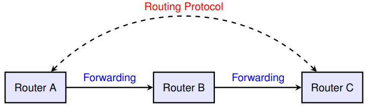
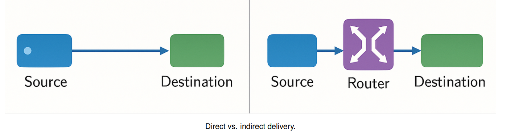
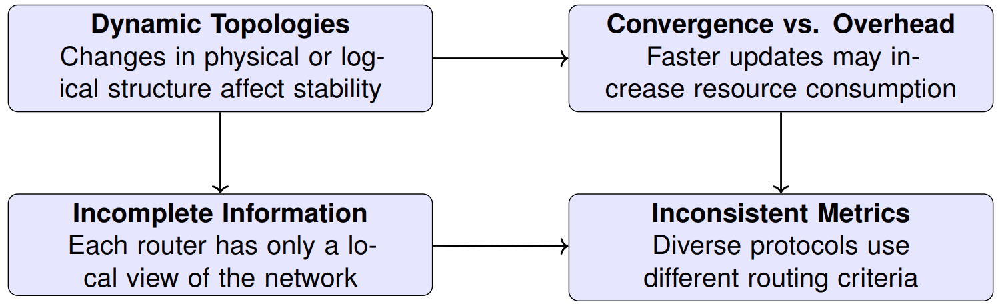
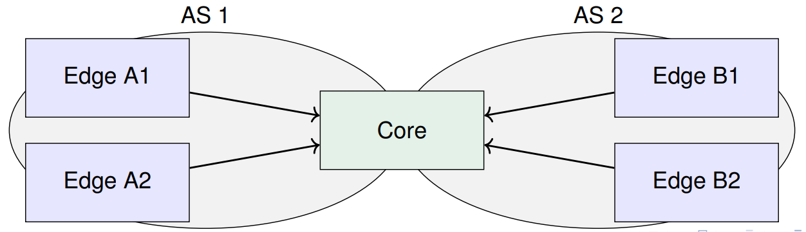
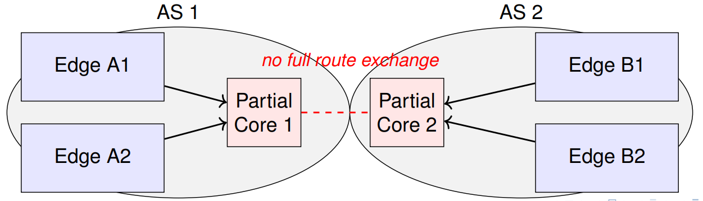
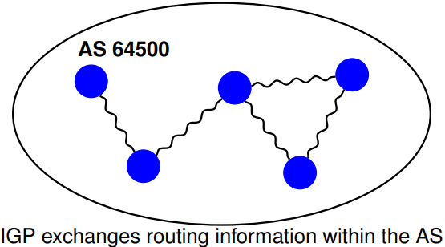
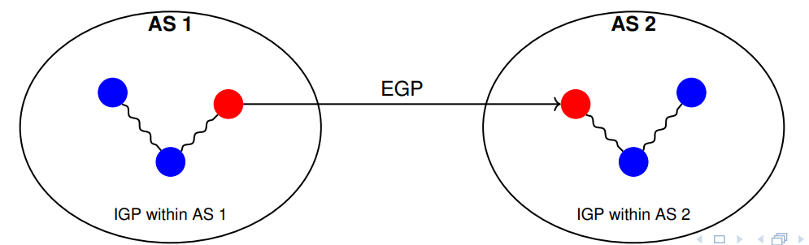
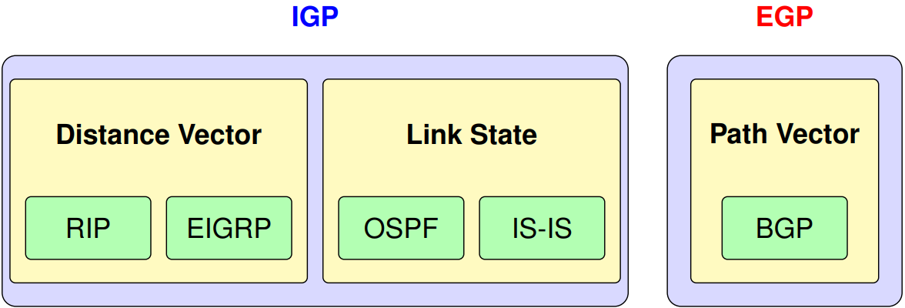
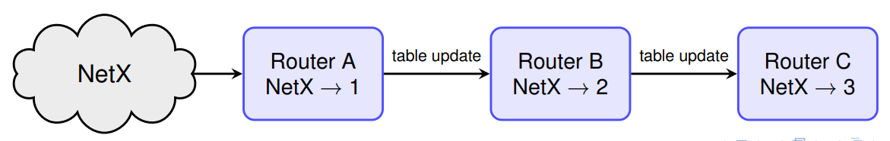
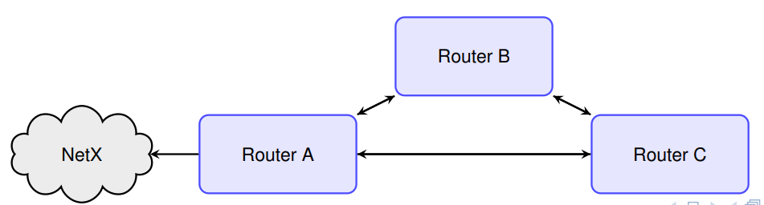

# IP Routing Protocols

## Routing Basics

### IP Routing vs Forwarding

__Forwarding (Data Plane)__:

- Local decision at each router
- Moves packets from input to output interface
- Based on routing table lookups

__Routing (Control Plane)__:

- Builds amd updates the routing table
- Involves protocols (OSPF, BGP)
- Chooses best paths across the network



__Analogy__: Routing = planning the route; Forwarding = following the road signs

### Direct vs Indirect Delivery

__Direct Delivery__:

- Destination is on the same physical network
- User ARP to resolve MAC address

__Indirect Delivery__:

- Destination is outside the local network
- Packet sent to default gateway (router)



### Routing Table Lookup and Next-Hop Logic

__Lookup Process__:

1. Extract the destination IP from the packet
2. Search the routing table for the __longest prefix match__
3. Use the matched entry to determine:
	- __Next-hop IP address__
	- __Outgoing interface__
4. If the destination is directly reachable, resolve MAC with ARP.
5. If no route is found, discard and send an ICMP "destination unreachable".

> __Note__: The destination IP address remains unchanged; only Layer 2 headers are updated at each hop

### Key Challenges in Routing Table Construction

__Open Question__:

- What entries and metrics should be placed in the routing tables?
- How are these entries and metrics obtained?
- How can we know if these metrics reflect the best paths?
- What is the impact of Internet management policies and architectural complexities.

```txt
Routing Logic --> Metrics (eg. cost, delay) --> Routing Tables --> Packet Forwarding
```



## Static vs Dynamic Routing

__Static Routing__

- Manually configured by administrator
- Suitable for small or stable networks
- No automatic adaptation to topology changes
- Used for default routes and simple enterprise setups

__Dynamic Routing__

- Uses routing protocols (e.g., OSPF, RIP, BGP)
- Learns and updates routes automatically
- Reacts to topology changes and failures

### Advantages of Dynamic Routing

- __Automatic Adaptation__ - handles failures and topology changes
- __Scability__ - works in large or dynamic networks
- __Robustness__ - avoids loops and black holes
- __Optimal Paths__ - chooses efficient routes via metrics

### Administrative Distance and Routing Metrics

- __Administrative Distance (AD)__ is a router-specific ranking mechanism (lower AD means higher trust)
- The router uses AD to choose between routes learned from different sources
- Each routing protocol uses its own __internal metric__ (e.g., hop count, cost) to select the best path within that protocol
- Both values are displayed together in routing tables as [AD/Metric].

| Route Source        | AD  | Metric Used |
| ------------------- | --- | ----------- |
| Connected interface | 0   | N/A |
| Static route        | 1   | Manual cost (if any) |
| EIGRP (internal)    | 90  | Bandwidth, delay, reliability |
| OSPF                | 110 | Cumulative cost (interface-based) |
| IS-IS               | 115 | (Cost similar to OSPF) |
| RIP                 | 120 | Hop cost (max 15)       |
| EIGRP (external)    | 170 | Same as internal + tag |
| BGP (external)      | 20  | Path attributes (AS-path, etc.) |
| BGP (internal)      | 200 | Same as above |
| Unknown Source      | 255 | _Never installed in routing table_ |

#### Routing Protocol Metrics: How Routers Evaluate Paths  
  
  - Routing protocols use metrics to quantify and compare the quality of available paths
  - Routers rely on these values to select the best route among alternatives
  
__Some common Metrics__:

- __Hop Count__ - number of intermediate routers
- __Delay__ - estimated transmission latency (e.g., in milliseconds)
- __Cost__ - arbitrary administrative value (e.g., OSPF’s cost based on bandwidth)
- __Bandwidth__ - available transmission rate (higher = better)
- __Load__ - current utilization of the link
- __Reliability__ - historical stability or error rate of the link
- __MTU__ (Maximum Tranfer Unit) - maximum packet size supported on the path 

### Routing Table Example

```txt
Router> show ip route

Codes: C - connected, S - static, R - RIP, O - OSPF, B - BGP
C 192.168.1.0/24 is directly connected, FastEthernet0/0
C 10.0.0.0/8 is directly connected, FastEthernet0/1
S 172.16.0.0/16 [1/0] via 10.0.0.2
R 192.168.2.0/24 [120/1] via 10.0.0.3, 00:00:32, FastEthernet0/1
O 10.1.0.0/16 [110/2] via 192.168.1.2, 00:00:10, FastEthernet0/0  
```

- __O__ - Directly connected: no next hop needed; most preferred
- __S__ - Static: manually configured by admin; AD = 1
- __R__ - RIP-learned: uses hop count metric; AD = 120
- __O__ - OSPF-learned: uses cost as metric; AD = 110
- Values in brackets [AD/Metric] determine preference when multiple paths exist

## Autonomous System (AS)

### Autonomous Systems and the Logical Routing Core

- An Autonomous System (AS) contains routers under a single administrative domain
- A group of routers (the __routing core__) is responsible for maintaining full route visibility
- Edge routers often use default routes pointing toward the core
- The routing core can be geographically distributed — it’s defined by information, not physical layout



#### What Happens When the Routing Core Is Split?

- If the routing core is divided across AS boundaries and loses full synchronization, each side sees only part of the network
- Edge routers may rely on default routes toward a local core fragment
- Without shared visibility, routing may be suboptimal or incomplete
- A distributed core only works if logically unified



### How are ASes Defined?

- An AS is a set of routers and IP networks managed by a single administrative entity
- Each AS is assigned a globally unique 16-bit or 32-bit __AS number (ASN)__
- AS numbers are allocated by __IANA (Internet Assigned Numbers Authority)__ and distributed by __Regional Internet Registries (RIRs)__
- All routers within an AS typically run the same __Interior Gateway Protocol (IGP)__ (e.g., OSPF, IS-IS, EIGRP) to exchange routing information within a domain
- ASes enable scalable inter-domain communication across the Internet



### Interior and Exterior Routers in an ASes

Within an Autonomous System (AS), routers are classified as:
+ __Interior Routers__ - Connect only to routers within the same AS:
	* Exchange internal routing information
	* Run Interior Gateway Protocols (IGPs) like RIP, OSPF, IS-IS, or EIGRP
+ __Exterior Routers__ - Connect to routers in other ASes:
	* Exchange routing information with other Autonomous Systems
	* Advertise limited internal information to the outside
	* Run both IGP (for internal coordination) and EGP (e.g., BGP) for external communication
		


## Routing Protocol Types

### Dynamic Routing Methods

- __Link-State__ - Each router builds a complete map of the network and independently computes the shortest paths using algorithms like Dijkstra. (e.g., OSPF, IS-IS)
- __Distance Vector__ - Routers exchange information only with neighbors, sharing reachable destinations and distance metrics (e.g., hop count). (e.g., RIP)
- __Path Vector__ - Routers advertise entire path vectors (AS sequences) to destinations, enabling policybased routing decisions. (e.g., BGP)

### Routing Protocols by Autonomous System Scope

Routing protocols are categorized based on whether they operate:

- __Inside an AS__ - Interior Gateway Protocols (IGPs)
- __Between ASes__ - Exterior Gateway Protocols (EGPs)



> __INTRA-Domain (IGPs)__ operate within an AS and prioritize fast convergence and simplicity
> __INTER-Domain (EGPs)__ like BGP handle routing between ASes with scalability and policy control in mind

### Distance Vector Routing

__Key Concepts__:

- Determines the best path to a remote network based on distance relying on the algorithms such as Bellman-Ford (e.g., hop count, latency, bandwidth).
- Each router periodically sends its full routing table to directly connected neighbors.
- Routing decisions rely on neighbors’ advertised distances (trust-based).
- Examples: __RIP__, __RIPv2__, __IGRP__.

__Drawbacks__:

- Wastes bandwidth with frequent full-table updates
- Assumes neighbor information is always correct
- May cause routing loops and slow convergence



#### Count to Infinity Problem in Distance Vector Protocols

- __Distance Vector__ protocols share route information periodically with immediate neighbors
- When a link fails, incorrect routes may continue to circulate among routers
- Each router increases the hop count as it believes the destination is farther
away
- This process continues indefinitely — known as __count to infinity__
- __Result__: Slow convergence and persistent loops

__Conceptual Example__:

- A believes B has a path
- B believes C has a path
- C believes A has a path - loop formed!

#### Remedies

__Split Horizon__

- Prevents a router from advertising a route back onto the interface from which it
was learned

__Split Horizon with Poisoned Reverse__

- Advertises the route back to the origin interface but with an infinite metric
- Immediately breaks direct routing loops
- Not effective against certain indirect routing loops

##### Split Horizon Metodology

Split Horizon is based on two enforceable rules:

__Rule 1__ - Updates sent through interface X must not include information about
routes learned via interface X

- Example: If Router A learns a route to network 192.168.1.0/24 via interface X
from Router B, Rule 1 prohibits Router A from advertising this route back to
Router B through the same interface

__Rule 2__ - Updates sent through interface X must not include routes for which
interface X is the outbound path

- Example: If Router A forwards traffic to the network 192.168.2.0/24 using
interface X, Split Horizon prevents A from advertising this route back out of
interface X. This stops simple loops where routing information bounces back and
forth over the same link

### Link-State Routing

__Key Concepts__:

- Each router advertises its directly connected links (neighbors and networks).
- Routers independently compute the shortest paths using Dijkstra’s algorithm
- Updates occur only when topology changes (not periodic)
- Ensures loop-free paths based on full network visibility
- Examples: __OSPF__, __IS-IS__

Example:

- Router A is connected to NatX
- It advertises this in its Link-State Advertisement (LSA)
- Routers B and C learn about this via flooding
- Using the network graph, they compute how to reach NetX



#### Pros and Cons of Link-State Protocols

- They do not suffer from the same convergence issues as Distance Vector protocols, since routes are computed from a topological tree structure that, by definition, has __no routing loops__
- When a topology change occurs, routers flood LSAs to all others, who then update their databases and re-run the shortest path algorithm. As a result, convergence is typically __faster__
- They are __more complex__ and harder to manage
- Topology construction and maintenance require __more resources__: bandwidth,
memory, and CPU

### Routing Protocols Comparison

| Aspect                 | Distance Vector | Link-State  | Path Vector |  
| ---------------------- | --------------- | ----------- | ----------- |
| __Example Protocols__  | RIP, IGRP       | OSPF, IS-IS | BGP |
| __Convergence Speed__  | Slow            | Fast        | Moderate |
| __Loop Prevention__    | Split horizon, poison reverse | Dijkstra tree guarantees | AS path filtering |
| __Knowledge Scope__    | Neighbors only | Full topology | AS path info |
| __Message Type__       | Distance vectors | LSAs (flooded) | Path vectors |
| __Algorithm__          | Bellman-Ford  | Dijkstra | Policy-based |
| __CPU/Memory Usage__   | Low | High | Moderate to High |
| __Scalability__        | Low | Moderate | Very High |
| __Routing Domain__     | Intra-domain | Intra-domain | Inter-domain |
| __Complexity__         | O(V · E) | O((V + E) log V) | Policy-based |


