# Open Shortest Path First (OSPF) Routing

## Basic OSPF Overview

### Motivation for OSPF

__Limitations of RIP (Distance Vector)__

- __Slow convergence__ - prone to routing loops
- __Max 15 hops__ - unsuitable for large networks
- __Flat design__ - no suport for hierarchy
- __One metric only__ - hop count

__OSPF: An Open Link-State Solution__

- __Fast convergence__  via Dijkstra's algorithm
- __Hierarquical ares__ reduce fooding and complexitry
- __Support multiple metrics__ - cost based on bandwidth
- __Built-in route summarization and authentication__

#### Main Advantages of OSPF

- No hop limit
- Suports classless routing
- Reduced signalling traffic withg long update intervals or topology-triggered changes
- Fast convergence
- Loop-free routing
- Reacts quickly to network changes
- Better load balancing
- Logica area segmentation: "divide to conquer"
- External route tagging
- Authentication support

### Scalability of Autonomous Systems and Hierarchical Areas

Knowing all routes implies:

- High memory capacity
- Information exchange about all routes
- Routers exchange info with all others

Computational complexity grows linearly with network size

__Solution__:

- Divide the network into hierarchies
- __Use different routing algorithms for different context__

### OSPF Operation Stages

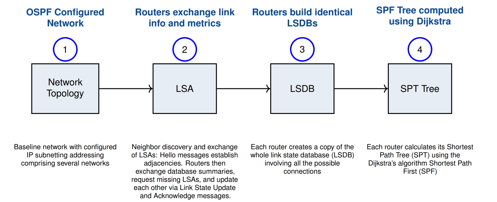

### OSPF and Link-State Routing

Each __OSPF router__ builds and mantains a map of area'a topology:

- Exchange __Link State Updates (LSUs)__ to advertise directly connected links
- Uses __multicast__ (224.0.0.5/6) for efficient communication
- Stores the learned topology in the __Link-State Database (LSDB)__

Routers use __Dijkstra's SPF algorithm__ to compute the shortest path tree:

- SPF is recalculated whenever the LSDB changes
- Results populate the __routing table__

__Hello messages__ are exchanged periodically to maintain neighbor relationships:

- Loss of Hello triggers flooding and SPF recalculation

The routing tables reflects:

- __Intra-area__ SPF paths
- __Inter-area__ routes from ABRs
- __External__ routes from ASBRs

### OSPF Network Types - Behavior and Motivation

__Why define different network tyoes in OSPF?__

- OSPF adapts its behavior based on characteristics of the underlying Layer 2 technology
- Different network types affect how neighbors are discovered, how LSAs are exchanged, and whether Designated Routers (DR/BDR) are needed
- Proper configuration ensures convergence efficiency and avoids unnecessary adjacencies

| Interface Type | Uses DR/BDR | Hello Int. | Needs _neighbor_ cmd? | >2 Hosts Supported |
| -------------------------------------| --- | -- | --- | --- |
| __Broadcast (BMA) - e.g., ethernet__ | Yes | 10 | No  | Yes |
| __Non-Broadcast (NBMA)__             | Yes | 30 | Yes | Yes |
| __Point-to-Multipoint (PTM)__        | No  | 30 | No  | Yes |
| __PTM Non-Broadcast__                | No  | 30 | Yes | Yes |
| __Point-to-Point (Serial)__          | No  | 10 | No  | No  |
| __Loopback__                         | No  | -  | -   | No  |

### OSPF Packet Types - Roles in the Protocol

__Why does OSPF use multiple packet types?__

- OSPF is a reliable link-state protocol that requires coordinated neighbor discovery, database exchange, and update acknowledgment.
- Each packet type has a specific role in building, synchronizing, and maintaining the LSDB (Link-State Database)
- Separating functions improves efficiency, control, and convergence accuracy

| Type | Packet Name | Description |
| ---- | ----------- | ----------- |
| 1    | __Hello__   | Discover neighbors and establish adjacencies |
| 2    | __DBD__     | Database Description — check for LSDB synchronization |
| 3    | __LSR__     | Link-State Request — request specific LSAs |
| 4    | __LSU__     | Link-State Update — send LSAs to neighbors |
| 5    | __LSack__   | Acknowledge receipt of Link-State Updates |

### OSPF Neighbors and Adjacencies

__Neighbor__

- Two routers are __neighbors__ if they have interfaces on the same network (Layer 3 reachable)
- Neighbor relationships are formed and maintained via the __Hello protocol__
- Routers only become neighbors if these match:
	+ __Area ID (area/id)__
	+ __Authentication parameters__
	+ __Hello and Dead intervals__
	+ __Stub area flag__
	
__Adjacency__

- An adjacency is a __deeper relationship__ between two neighbors to exchange and synchronize LSDBs
- Not all neighbors become adjacent
- Routers that are adjacent maintain identical link-state databases (if in the same area)

### Router ID in OSPF

__Definition__ - the __Router ID (RID)__ is a 32-bit number assigned to uniquely identify each OSPF router within an Autonomous System

__Selection Rules__ - The OSPF standard recommends using the __lowest IP address__ among the router’s interfaces. However, __some implementations__ (e.g., Cisco) use the __highest IP address__ instead.

__RID Selection Priority__

1. Manually configured RID (if set)
2. Highest IP address among __loopback interfaces__
3. Highest IP address among __physical interfaces__

### Designated Router (DR) in OSPF

__Why is a DR needed in OSPF?__

- On broadcast (BMA) and NBMA networks, a __Designated Router (DR)__ is elected when more than 2 routers share the segment
- DR election reduces the number of required adjacencies and minimizes OSPF LSA traffic
- __Without a DR__: _n_ routers form _n(n − 1)/2_ adjacencies. 
- __With a DR__: each router only forms adjacency with the DR (and optionally BDR)

__Key Characteristics__

- DRs originate __Type 2 LSAs (network LSAs)__
- All routers on the segment become neighbors, but only DR and BDR form adjacencies with others
- Point-to-point links do __not__ use DR/BDR

__Benefit__: reduces OSPF-related traffic and improves scalability on multi-access networks

### DR/BDR Election Criteria

__Router Priority__:

- Configurable (0–255), default is 1
- Value 0 makes the router __ineligible__ for election
- Highest priority wins. In case of tie, highest Router ID is used

__Router ID (RID)__:

- Highest IP of loopback interfaces is chosen
- If no loopback, highest IP among active interfaces is used
- Can be manually configured

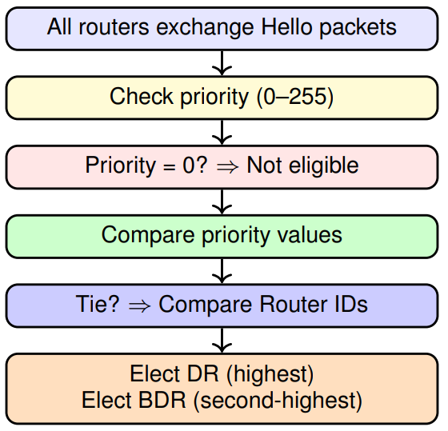

### Loopback Interfaces in OSPF

- __Stability__: Loopback interfaces are only administratively enabled/disabled, so the Router ID remains consistent
- __Preference__: If at least one loopback exists, its IP address is used for the Router ID rather than that of a physical interface
- __LSA Behavior__: Loopbacks are advertised via __Router-LSAs__ as single host routes, appearing as directly reachable destinations

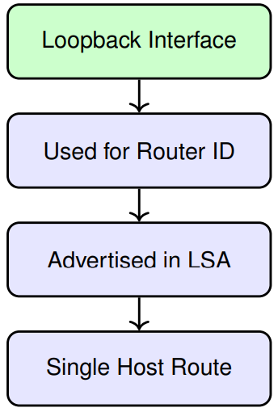

---

## OSPF Areas and Router Types

### OSPF Autonomous Systems and Areas

__Autonomous System (AS)__:

- A group of routers that share routing information using the same protocol — in this case, OSPF
- Typically managed by a single administrative entity

__Motivation for Dividing into Areas__:

- An AS can be divided into smaller groups called __areas__
- This segmentation hides the internal topology of each area from others
- Instability in one area does not affect the rest of the network
- Routers maintain fewer routes and require less memory
- Routes between areas can be summarized, reducing routing table size

> Each OSPF router belongs to exactly one area, but ABRs connect multiple areas

### OSPF Area Splitting Concept

- Network can be segregated using __Areas__
- Traffic between areas must traverse __Area 0__ (Backbone)
- Avoid the exchange of Link State Advertisements (__LSAs__) across too many subnets:
	+ Reduces CPU and memory usage
	+ Improves convergence time
- Each area maintains its own Link State Database (__LSDB__)
- Route summarization at Area Border Routers (__ABRs__) reduces domain-wide routing entries
- Autonomous Systems Border Routers (__ASBRs__) redistribute foreign routes into OSPF

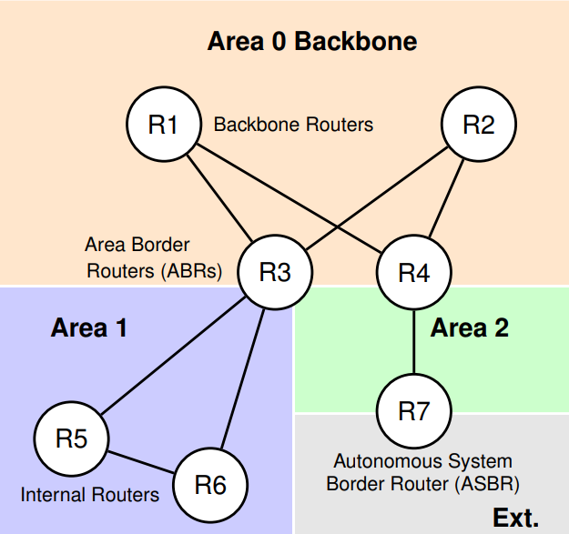

### Types of OSPF Routers

__Internal Router__

- Connected only to routers within the same area

__Area Border Router (ABR)__

- Connects routers from multiple areas (including the backbone)
- Responsible for exchanging routing information between areas
- Summarizes external area costs and injects them into its area
- After SPF is computed, inter-area routes are derived from ABR summaries

__Autonomous System Border Router (ASBR)__

- Connects to routers in other autonomous systems
- May run other routing protocols (IGP or EGP — e.g., RIP, EIGRP, BGP)

__Backbone Router__

- Has at least one interface running OSPF in area 0

### Inter-Area Communication and Backbone Role

- Areas advertise route summaries using a __distance-vector algorithm__
- To prevent routing loops, all inter-area communication passes through __Area 0 (backbone)__
- The backbone ensures a central point of coordination across areas
- When a direct connection to Area 0 is not possible, __virtual links__ allow remote areas to connect
	+ A virtual link is a logical tunnel between two ABRs, using a transit area to reach the backbone.
	+ The transit area must be fully adjacent (full OSPF adjacency) to allow the tunnel.
	
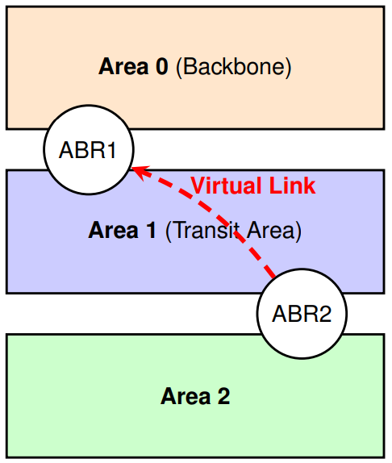

### Link State Database (LSDB)

- Each area maintains its own LSDB — a collection of:
	+ Router LSAs (used by the Dijkstra algorithm)
	+ Network LSAs (used by the Dijkstra algorithm)
	+ Summary LSAs
	+ AS External LSAs
- LSAs are only flooded within the area where they originate
- AS External LSAs are also part of the local __LSDB__, even if they describe external routes
- From the LSAs, each router builds a “map” of its area using the SPF algorithm
- __Important distinctions__:
	+ LSDBs are identical between routers in the same area
	+ LSDBs are different across areas due to summarization and distance-vector format of inter-area/external routes
	
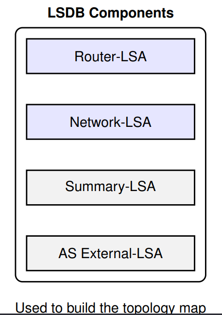


### Intra-area Routing with SPF

- Each router uses its link-state database (LSDB) to build a __shortest-path tree__ rooted at itself
- This tree identifies the optimal path to every destination within the area
- All routers independently run the same SPF algorithm in parallel
- For correctness, all routers must maintain identical LSDBs
- External routes (inter-area or inter-AS) appear as leaves in the tree
	+ These are still link-state entries, but learned via external summarization
	
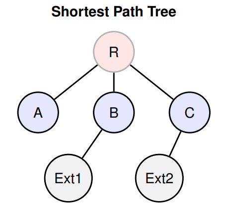

### Differentiated Routing and Type of Service (TOS) in OSPF

- OSPF supports multiple metrics
	+ Default metric: inverse of link bandwidth
	+ Cost = ```(10^8) / link bandwidth (bps)```
- With a single metric, TOS (Type of Service) is not supported
- With multiple metrics, TOS-based routing becomes available:
	+ Separate routing tables for each combination of the 3 TOS bits:
		* _delay_
		* _throughput_
		* _reliability_
- __Example__:
	+ If TOS bits specify low delay, low throughput, and high reliability, OSPF computes a path accordingly
	
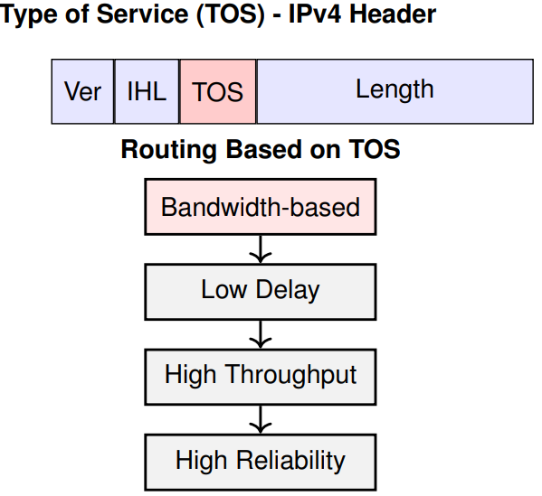

### OSPF Configuration

OSPF can be configured in two alternative approaches:

1. __Using the network statement (global mode)__
	- Most common method
	- Matches interface3s using IP + wildcard mask
	- Configures under the OSPF process
	```txt
	Router(config)# router ospf 1
	Router(config-router)# network 10.1.2.2 0.0.0.0 area 0
	``` 
2. __Interface-specific configuration__
	- Applied directly to interfaces
	- Takes precedence in case of conflict
	```txt
	Router(config)# interface Serial1/1
	Router(config-if)# ip ospf 1 area 1
	```

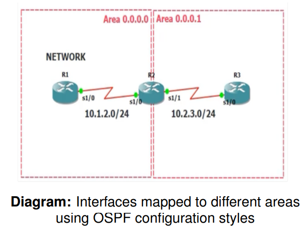

#### Configuration Using Wildcards

__What is a wildcard?__

- Used in `network` statements to match interface IPs
- `0.0.0.0` = exact match (most specific)
- `0.255.255.255` = broader match (more general)

__Examples__:

- `network 10.0.0.0 0.255.255.255` - enables all 10.x.x.x interfaces
- `network 10.2.3.2 0.0.0.0` - enables only exact interface

__OSPF activation vs advertisement__:

- OSPF activates __per interface__
- But LSAs advertise the __entire network segment__

> __OSPF is enabled per interface, but LSAs advertise the entire subnet!__

__Configuration Example__:

```txt
# Global OSPF configuration using network statement
Router ( config ) # router ospf 1
Router ( config - router ) # network 10.1.2.2 0.0.0.0 area 0.0.0.0

# Interface-specific configuration (overrides network cmd if both exist)
Router ( config ) # interface Serial1 /1
Router ( config - if ) # ip ospf 1 area 0.0.0.1

# Passive interface configuration to suppress OSPF Hellos
Router ( config - router ) # passive - interface Serial1 /0

# Check interface OSPF state and process bindings
Router # show ip ospf interface brief
Router # show ip protocols

# Show OSPF processes running on the router
Router # show ip protocols

# Display interfaces running OSPF with area info and metrics
Router # show ip ospf interface brief

# Detailed view for a specific interface
Router # show ip ospf interface GigabitEthernet0 /1

# View OSPF neighbors and their adjacency states
Router # show ip ospf neighbor

# View the LSDB (Link-State Database)
Router # show ip ospf database

# Display the IP routing table filtered by OSPF entries
Router # show ip route ospf

# Restart the OSPF process (resets all neighbors)
Router # clear ip ospf process

# Confirm before resetting the OSPF process
Reset ALL OSPF processes ? [ no ]: yes
```

## OSPF Hello Messages: Fields and Behavior

### OSPF Router-to-Router Communication

__How are OSPF messages exchanged?__

- OSPF messages are sent using IP datagrams:
	+ Protocol number __89__ in IP header
	+ Type of Service (TOS) = 0
	+ Preference = _Internetwork Control_ (if suported)
- Messages are exchanged directly between routers on the same subnet
- __LSU retransmissions__ always use the unicast IP of the neighbor

__Multicast Usage (when possible)__:

- `224.0.0.5` - __AllSPFRouters__ (all OSPF-speaking routers)
- `224.0.0.6` - __AllDRouters__ (DRs and BDRs only)

> Multicast is not used in point-to-point links, devices without multicast support, or NBMA networks

### OSPF Hello Communication Between Neighbors

__Purpose of Hello Messages__

- Responsible for discovering and maintaining neighbor relationships
- Ensure bidirectional communication and router availability

__Key Fields in Hello Packets__

- __Router Priority__ - influences DR election
- __Hello Interval__ - time between Hello packets
- __Dead Interval__ - time to wait before declaring neighbor down
- __Subnet Mask__ - 0.0.0.0 allowed in p2p or virtual links
- __Options Field__ - indicates supported capabilities:
	+ Bit E = AS-external-LSA support (0 in stub areas)
	
#### Transport Mode by Network Type

- __Broadcast & Point-to-Point__: `multicast 224.0.0.5` AllSPFRouters
- __Virtual Links__: `unicast` to remote IP
- __Point-to-Multipoint__: `unicast` - Hello sent individually per link

1. __Networks with _multicast_ support__
	- __Hello packets__ are sent to `224.0.0.5` (AllSPFRouters)
	- __DR and BDR__ send LSUs and LSAcks to `224.0.0.5`
	- __Other routers__ send LSUs and LSAcks to `224.0.0.6` (AllDRRouters)
2. __Networks without _multicast_ support__ (including virtual links)
	- All OSPF messages are sent via __unicast__ to the neighbor’s IP address
3. __Point-to-Point Links__
	- All OSPF messages are sent to `224.0.0.5` (AllSPFRouters)
	
> Note: Multicast usage reduces overhead and improves OSPF scalability

### Receiving OSPF Messages

- __Multicast to AllDRouters__ is only processed if the receiving router is a __DR__ or __BDR__
- The message __must be authenticated__ before being processed
- If the message is a __Hello__, it is handled by the Hello protocol
- __All other OSPF message types__ are exchanged only between __adjacent routers__
- Message must come from an __active neighbor__, or it is discarded
- In __broadcast__, __point-to-multipoint__, and __NBMA__ networks, the origin is identified by the __source IP address__ of the datagram.
- In __point-to-point__ and __virtual links__, the origin is identified by the __Router ID__ field in the OSPF header

> These rules help ensure that only trusted, relevant OSPF messages are processed — minimizing risk and maintaining database synchronization

### OSPF Timers and Their Role

OSPF uses two types of timers to coordinate protocol behavior:

- __Single-shot timers__ - trigger once to initiate an internal event
	+ Example: After detecting a topology change, this timer starts the countdown to flush outdated routing entries
- __Interval timers__ - trigger periodically to send control packets
	+ Example: Used for sending Hello packets at regular intervals
	
__Timer resolution__: 1 second (OSPF uses coarse granularity)

To __avoid synchronization spikes__, OSPF introduces _rando jitter_ when sending periodic messages like Hello or LSAs

### OSPF Message Authentication

- OSPF allows __authentication of routing messages__
- Different interfaces can use different authentication methods
- Ensures secure exchange of routing information between routers
- __Authentication types__:
	+ __None__ - no authentication used
	+ __Simple password__ - key sent in plaintext
	+ __MD5__ - key hash included in the packet
- Authentication can be defined __per instance__ and __per area__

### OSPF Message Header Format

Each OSPF packet begins with a fixed 24-byte header:

| Field                   | # bytes | Notes |
| ----------------------- | ------- | ----- |
| __Version__             | 1 | OSPF version (eg. 2) |
| __Type__                | 1 | Hello, DBD, LSR, LSU, LSack |
| __Packet Length__       | 2 | Total length |
| __Router ID__           | 4 | Originating router |
| __Area ID__             | 4 | Originating area |
| __Checksum__            | 2 | Validates integrity |
| __Authentication Type__ | 2 | no auth, plaintext, md5 |
| __Authentication Data__ | 8 | 64-bit auth info |

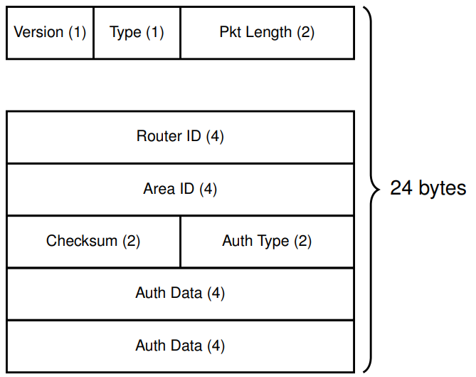

### OSPF Packet Types (Header Field: Type)

All OSPF packets share a common header

The __Type__ field (byte 2) defines the message kind:

| # | Message kind | Notes |
| - | ------------ | ----- |
| 1 | __Hello__    | Used to discover and maintain neighbor relationships |
| 2 | __Database Descritpion (DD)__ | Summarizes LSDB contents for synchronization | 
| 3 | __Link State Request (LSR)__ | Requests specific LSAs from a neighbor |
| 4 | __Link State Update (LSU)__ | Carries one or more LSAs to update neighbors |
| 5 | __Link State Acknowledgment (LSAck)__ | Confirms receipt of LSAs for reliability |


#### Hello Message Format

Structure of an OSPF Hello packet:

- __Header fields__ (common to all OSPF packets):
	+ Version, type __1__
	+ Packet length
	+ Router ID
	+ Area ID
	+ Checksum
	+ Auth Type
	+ Auth Data
- __Hello-specific fields__:
	+ Network Mask
	+ Hello Interval
	+ Dead Interval
	+ Options
	+ Router Priority
	+ Designated Router ID
	+ Backup Designated Router ID
	+ Neighbor List
	
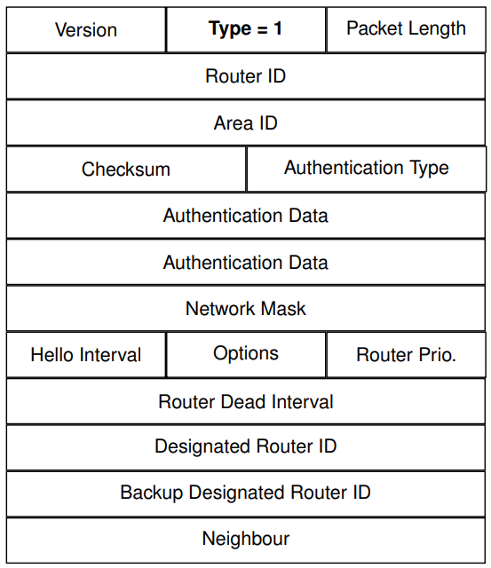

##### Hello Message - Options Field

Bit order in Options field

| 7 | 6 | 5 | 4 | 3 | 2 | 1 | 0 |
| - | - | - | - | - | - | - | - | 
|   |   | DC|EA |N/P|MC | E |   |

The OSPF __Options field__ is included in Hello, DBD, and LSA packets to signal optional capabilities:

- __E-bit__: External routing capability (AS-external-LSA support)
- __MC-bit__: Support for IP multicast routing [RFC 1584]
- __N/P-bit__: NSSA capability (Type-7 LSAs) [RFC 1587]
- __EA-bit__: Router can receive/send AS-external-LSA
- __DC-bit__: Demand Circuit support [RFC 1793]

> Routers must agree on these capabilities to form adjacencies

#### Data Description (DD) Message Format

Structure of a DD message:

- __Header fields__ (common to all OSPF packets):
	+ Version, __type 2__ 
	+ Packet length
	+ Router ID
	+ Area ID
	+ Checksum
	+ Auth Type
	+ Auth Data
- __DD-specific fields__:
	+ __Interface MTU__ - Maximum size of OSPF packets on the link
	+ __Options__ - CApabilities like E-bit, DC-bit, etc
	+ __Flags__ - Init, More, Master/Slave
	+ __LSA Headers[]__ - Summary of LSAs in the router's database
	
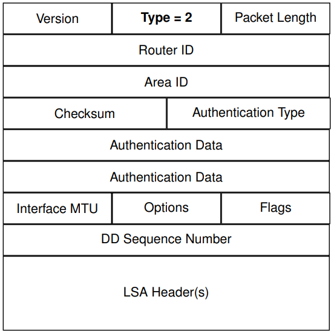

#### Link State Request (LSR) Message Format

Structure of an LSR message:

- __Header fields__ (common to all OSPF packets):
	+ Version, __type 3__ 
	+ Packet length
	+ Router ID
	+ Area ID
	+ Checksum
	+ Auth Type
	+ Auth Data
- __LSR-specific fields__:
	+ __LS Type__ - Type of LSA requested (e.g., Router-LSA, Network-LSA)
	+ __Link-State ID__ - Identifies the specific LSA instance
	+ __Advertising Router__ -  Router ID of the LSA originator

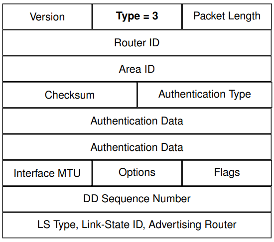

#### Link State Update (LSU) Message Format

Structure of an LSU message:

- __Header fields__ (common to all OSPF packets):
	+ Version, __type 4__ 
	+ Packet length
	+ Router ID
	+ Area ID
	+ Checksum
	+ Auth Type
	+ Auth Data
- __LSU-specific fields__:
	+ __Number of LSAs__ - Indicates how many LSAs are included
	+ __LSAs__ - One or more full LSAs follow in the packet
	
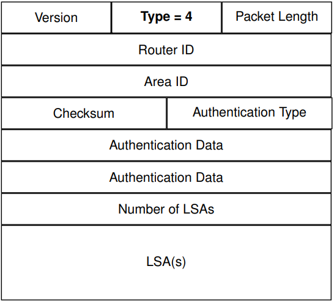

#### Link State Acknowledgment (LSAck) Message Format

Structure of an LSAck message:

- __Header fields__ (common to all OSPF packets):
	+ Version, __type 5__ 
	+ Packet length
	+ Router ID
	+ Area ID
	+ Checksum
	+ Auth Type
	+ Auth Data
- __LSU-specific fields__:
	+ __LSA Header(s)__ - Each acknowledged LSA is represented by its header
	+ One LSAck message may carry multiple LSA Headers
	
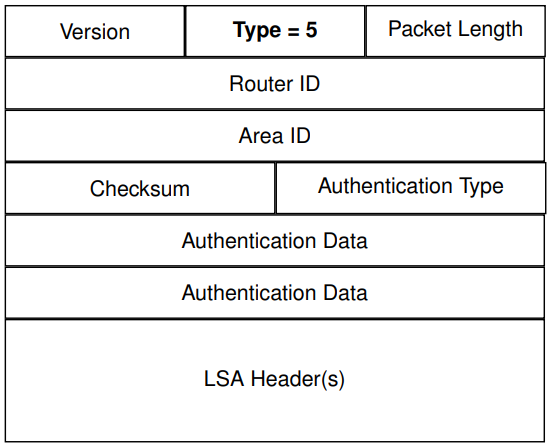

---

## Neighbors and Adjacencies

### OSPF Relations

OSPF defines two levels of router association:

1. NEIGHBOR routers
2. ADJACENT routers

- __Adjacency__ is a stronger relation: routers synchronize __routing tables__
- In a __neighbor__ state, routers only __exchange Hello packets__ to establish potential adjacency

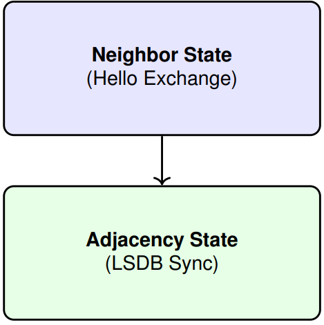

### Establishing OSPF Neighbor and Adjacency Relationships

1. __HELLO PROTOCOL__: OSPF uses this protocol to discover neighbors and establish adjacencies
	- Messages help identify routers and ensure compatibility
	- Exchange happens over IP protocol number 89
	- Multicast address `224.0.0.5` is used whenever possible
2. __ROUTER ID (RID)__: Each router must have a __unique 32-bit identifier__
	- Can be manually assigned or derived from the __highest__ loopback IP
3. __HELLO MESSAGE FIELDS__: Include critical information for compatibility checks
	- __Router ID__, __Area ID__, __Hello/Dead Intervals__, and __Priority__
	- Neighbor list and __authentication information__
	- __Network mask__, stub area flags, and more
4. __COMPATIBILITY__: Only compatible HELLO messages allow routers to become neighbors and eventually6 adajacent

### Hello Protocol in BMA Networks

__Objective__

- Establish and maintain bidirectional neighbor relationships.
- Elect the __Designated Router (DR)__ and __Backup DR (BDR)__ per segment
- DR decides which routers should form adjacencies
- Acts as a “keepalive” mechanism

__Operation__

Routers periodically send __Hello__ messages:

- Use multicast IP `224.0.0.5` (AllSPFRouters)
- List know neighbors' addresses
- Indicates current DR and BDR perceptions

Routers receiving __Hello__ messages:

- Consider sender as a neighbor if their own address is listed
- DR election: highest priority, the highest __Router ID__

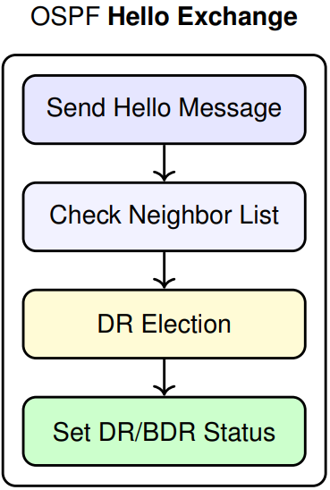

### OSPF Neighbor State Transitions

OSPF neighbor formation follows a Finite State Machine (FSM) with 7 states:

| State | Description |
| ----- | ----------- |
| Down | No Hello received |
| Init | Hello received (router ID not seen) |
| 2-Way | Bidirectional communication established |
| ExStart | Master/Slave negotiation |
| Exchange | DBD packets exchanged |
| Loading | Missing LSAs are requested |
| Full | Databases are synchronized |

- Routers become fully adjacent only with designated peers
- State transitions depend on network type and DR/BDR roles

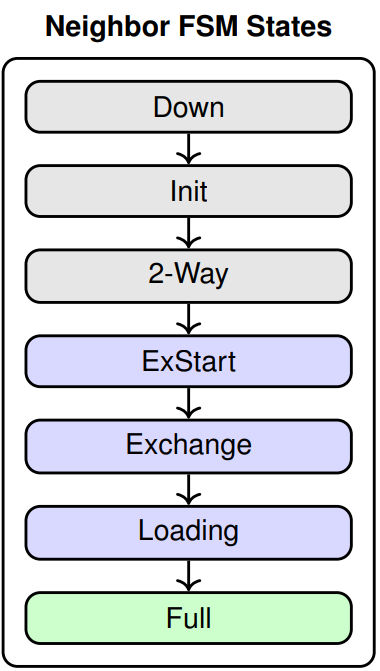

> In gray - computing neighbors

> In violet - computing adjacency

> In green - computations complete

#### OSPF Neighbor and Adjacency Requirements

Conditions for __Neighborship__ (2-Way neighbors):

1. Interfaces must be in the same __area__
2. Interfaces must belong to the same __subnet__ (mask)
3. Matching __Hello__ and __Dead intervals__
4. Same __authentication method__ [optional]
5. Same __area type__ (eg., stub, NSSA)
6. __Router IDs__ must be unique

__Additional Conditions__ for Adjacency (full state adjacencies):

7. On BMA networks, one router must be a __DR__ or __BDR__
8. On __point-to-(multi)point__ links, adjacency forms without DR election

## OSPF Synchronization and Flooding

### OSPF LSDB Synchronization and Flooding

- __ExStart__: Routers exchange empty DBDs to establish Master/Slave roles and synchronize initial sequence number
- __Exchange__: Routers send __DBDs__ listing LSA headers for comparison
- __Loading__: If diferences are detected, routers send __LSRs__ and receive missing __LSAs__ via __LSU__.
- __Full__: LSDBs are __synchronized__ and routers become fully adjacent
- __Flooding__: When new LSAs are generated due to topology changes, they are __flooded__ to all adjacent neighbors according to OSPF's reliable flooding mechanism

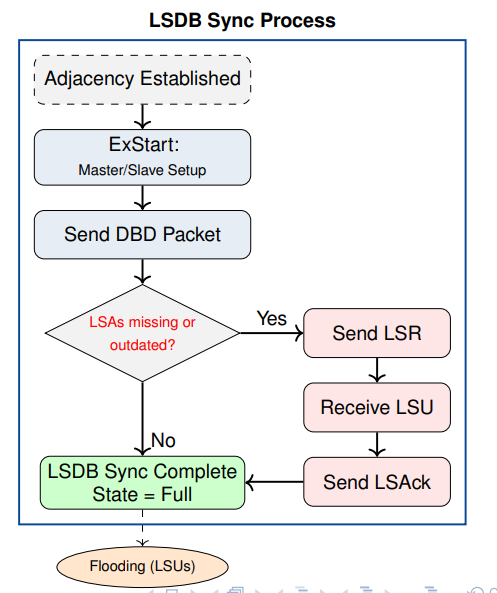

### Flooding in Multi-Access Networks (BMA/NBMA)

- __Designated Router (DR)__ handles LSA flooding to reduce redundancy
- __Backup Designated Router (BDR)__ is elected as a standby
- __Flooding Process__:
	+ Routers flood LSAs only to the DR/BDR
	+ DR floods LSA to all routers (224.0.0.5)
	+ Routers send LSAcks to confirm receipt
- __Efficiency__: Reduces adjacency and signaling overhead from $`O(n^2)` to $`O(n)`
- __Election__: Highest router priority (or RID) wins

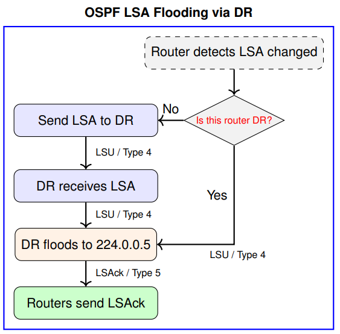

### LSA Types Brief Description (link state ID)

- __LSA Type 1 (Router LSA)__
	- Generate by every router
	- Describes directly connected links
	- Flooded within an area
- __LSA Type 2 (Network LSA)__
	+ Generated by DR
	+ Describes boadcast/multi-access networks
	+ Also flooded within an area
- __LSA Type 3 (Summary LSA)__
	+ Generated by ABRs
	+ Advertises networks in other areas
	+ Flooded into other areas
- __LSA Type 4 (ASBR Summary LSA)__
	+ Also generated by ABRs
	+ Advertises reachability to ASBRs
	+ Flooded into backbone and other areas
- __LSA Type 5 (External LSA)__
	+ Generated by ASBRs
	* Advertises external (non-OSPF) routes
	* Flooded throughout the OSPF domain
+ __LSA Type 7 (NSSA)__
	* Used in NSSA areas
	* Converted to Type 5 by ABR
	
### LSA Propagation Example

- __LSA Scope Across OSPF Areas__:
	+ __LSA Type 1__: Intra-area router and link info
	+ __LSA Type 2__: DR info for broadcast networks
	+ __LSA Type 3__: Inter-area prefix summary (ABR)
	+ __LSA Type 4__: ASBR summary (to reach Type 5)
	+ __LSA Type 5__: External routes redistributed into OSPF. (Redstribuition from RIP into OSPF generates Type 5 LSAs)
- __Area Roles__:
	+ Area 0.0.0.0: __Backbone__ - central transit
	+ Area 0.0.0.1 and 0.0.0.2: standard areas
	+ RIP domain (R4-R5): external to OSPF, requires redestribuition
	
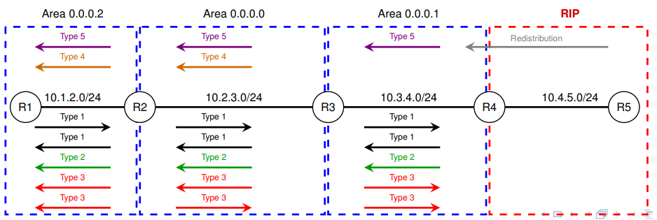

## OSPF Special Areas: Reducing LSA Flooding

### Motivation and Context

- In large OSPF deployments, non-backbone areas may contain routers with limited resources or little need for full topology knowledge
- __Full LSDB synchronization__ across all areas can lead to:
	+ High signaling overhead
	+ Large memory and CPU footprint
	+ Redundant route information at edge routers
- To address this, OSPF defines __special area types__ that reduce control plane load by _limiting LSA propagation_
- These areas trade path flexibility for simplicity - especially useful at the edge of the network

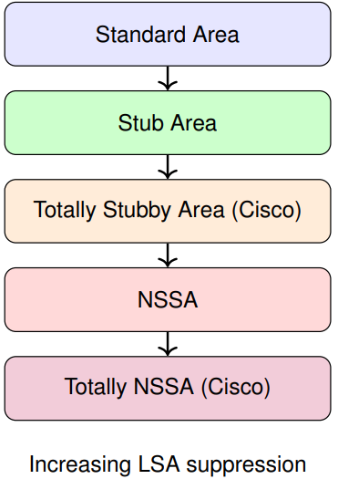

### OSPF Area Types: Summary Comparison

| # | Area Type | LSA 1 | LSA 2 | LSA 3 | LSA 4 | LSA 5 | LSA 7 | Comment |
| - | --------- | ----- | ----- | ----- | ----- | ----- | ----- | ------- |
| 1 | Normal Area | ✓ | ✓ | ✓ | ✓ | ✓ | ✗ | All routes are advertised |
| 2 | Stub Area | ✓ | ✓ | ✓ | ✗ | ✗ | ✗ | Summarized external routes |
| 3 | Totally Stubby Area (Cisco) | ✓ | ✓ | ✗ | ✗ | ✗ | ✗ | Summarized inter-area and external routes |
| 4 | Not So Stubby Area (NSSA) | ✓ | ✓ | ✓ | ✗ | ✗ | ✓ | Like Stub, but allows external routes from attached ASBR |
| 5 | Totally NSSA (Cisco) | ✓ | ✓ | ✗ | ✗ | ✗ | ✓ | Summarizes all routes into a default |

LSA Types:
- 1 - Router
- 2 - Network
- 3 - Summary
- 4 - ASBR Summary
- 5 - External
- 7 - NSSA External

### LSA Propagation Example - Stub Areas

__LSA Scope and Area Restrictions__:

- __Stub Areas__ retrict LSAs to reduce overhead:
	+ __No Type 5__ (External LSAs) are allowed
	+ __No Type 4__ (ASBR Summary LSAs) needed
	+ Instead, an __LSA Type 3__ with default route (0.0.0.0/0) is injected by the ABR
- `O*IA 0.0.0.0/0 M=1`: The M-bit set to 1 marks this LSA as a default summary route

__Routing Table Optimization__:

- Instead of N external routes, a single default route suffices
- LSA Types in stub: __1, 2, 3, + default via ABR__

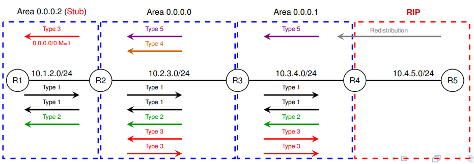

#### OSPF Stub Area Configuration and Verification

```txt
# Configure Area 2 as a stub on both routers
R1 ( config ) # router ospf 1
R1 ( config - router ) # area 2 stub

R2 ( config ) # router ospf 1
R2 ( config - router ) # area 2 stub


# Check stub configuration
R1 # show ip ospf
R1 # show ip ospf database summary

# Confirm default route injected by ABR (LSA Type 3)
R1 # show ip route ospf
```

### LSA Propagation Example – Totally Stubby Areas (Cisco Only)

__LSA Scope and Area Restrictions__:

- __Totally Stubby Areas Restrictions__:
	+ __No Type 5__ (External LSAs) allowed
	+ __No Type 4__ (ASBR Summary LSAs) allowed
	+ __No Type 3__ (Inter-Area LSAs) except for a default route injected by the ABR
- `O*IA 0.0.0.0/0 M=1`: Injected by the ABR as a default summary route

__Routing Table Optimization__:

- All inter-area and external routes replaced by a single default route.
- LSA Types in totally stubby: __1, 2 + default Type 3 via ABR__

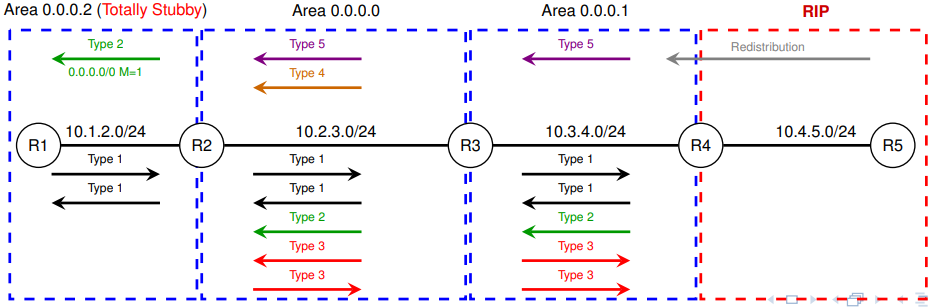

#### OSPF Totally Stubby Area Configuration and Verification

```txt
# Configure Area 2 as a totally stubby area (Cisco-only)
# R2 is the ABR, hence it uses no-summary
R2 ( config ) # router ospf 1
R2 ( config - router ) # area 2 stub no - summary

# R1 is an internal router in Area 2
R1 ( config ) # router ospf 1
R1 ( config - router ) # area 2 stub

# Check area configuration and summarization suppression
R2 # show ip ospf
R2 # show ip ospf database summary

# Confirm default route injected (0.0.0.0/0 via ABR)
R1 # show ip route ospf
```

### LSA Propagation Example - NSSA Areas

__LSA Scope and Area Restrictions__:

- __NSSA (Not So Stubby Area)__ provides partial filtering with local redistribution:
	- __No Type 5__ (External LSAs) allowed from other areas
	- __No Type 4__ (ASBR Summary LSAs) allowed
	- Instead, external routes are imported as __Type 7 LSAs__
	- ABR translates Type 7 to Type 5 when propagating into area 0
- NSSAs allow to exceptionally inject external routes into a stub area

__Routing Table Optimization__:

- Reduced LSA flooding while allowing limited external reachability.
- LSA Types in NSSA: __1, 2, 3, 7 (local)__, with translation to Type 5 by ABR

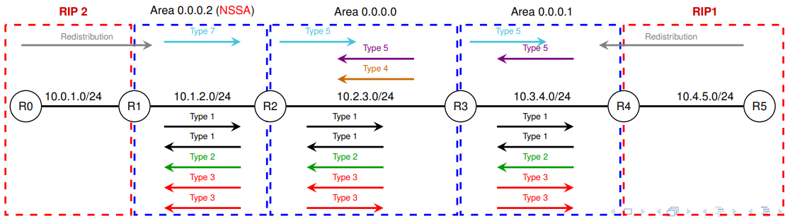

#### OSPF NSSA Area Configuration and Verification

```txt
# Configure Area 2 as an NSSA
R2 ( config ) # router ospf 1
R2 ( config - router ) # area 2 nssa

# Configure Area 2 as NSSA and redistribute RIP into OSPF
R1 ( config ) # router ospf 1
R1 ( config - router ) # area 2 nssa
R1 ( config - router ) # redistribute rip subnets

# Check NSSA configuration and verify Type 7 LSAs
R2 # show ip ospf
R2 # show ip ospf database nssa - external

# Confirm that external RIP routes appear as Type 7 (O N2)
R1 # show ip route ospf
```

### LSA Propagation Example - Totally NSSA Areas (Cisco Only)

__LSA Scope and Area Restrictions__:

- __Totally NSSA__ restricts LSAs while allowing local redistribution:
	- __No Type 5__ (External LSAs) allowed from other areas
	- __No Type 4__ (ASBR Summary LSAs) allowed
	- __No Type 3__ (Inter-Area LSAs) except a default route
	- External routes redistributed locally appear as __Type 7__ LSAs
	- ABR translates Type 7 to Type 5 into area 0.
- Used when redistribution is needed but LSA flooding must be minimized

__Routing Table Optimization__:

- Only a default Type 3 route is injected by ABR
- LSA Types: __1, 2, 7 (local)__ + default Type 3

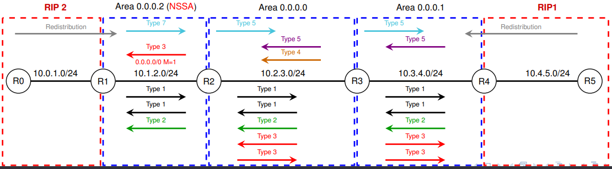

#### OSPF Totally NSSA Area Configuration and Verification (Cisco Only)

```txt
# R1 (ASBR) – Redistributing into OSPF
R1 ( config ) # router ospf 1
R1 ( config - router ) # area 2 nssa

# R2 (ABR) – Declares area as totally NSSA and injects default route
R2 ( config ) # router ospf 1
R2 ( config - router ) # area 2 nssa no - summary

# Verification Commands
R2 # show ip ospf
R2 # show ip ospf database nssa - external
R1 # show ip route ospf
# Confirm that external RIP routes appear as Type 7 (O N2)
R1 # show ip route ospf
```

### Summary of Path Costs in OSPF

__Path Selection Priority__

1. Intra-area routes - 0
2. Iter-area routes - 0 IA
3. External Type 1 - 0 E1 / 0 N1
4. External Type 2 - 0 E2 / 0 N2

__Cost Configuration Commands__

- `ip ospf cost COST` - Manually sets the interface cost
- `auto-cost reference-bandwidth REF-BW` - Adjusts default bandwidth reference (default = 100 Mbps)
- `maximum-paths <1-32>` - Enables equal-cost multipath (ECMP)

__Route Selection Logic__

- Intra-area routes have the highest priority
- Type 1 external routes consider total cost:
	- internal + external metric
- Type 2 external routes use only the external cost
- `O E*` routes are injected in normal OSPF areas
- `O N*` routes are injected in NSSA areas

### Summary of OSPF Link State Advertisement (LSA) Types

| Type            | Scope         | Purpose |
| --------------- | ------------- | ------- |
| __1 (Router)__ | Per router area | Advertises local interfaces, costs, and state. Originated by each router |
| __2 (Network)__ | Per transit network | Advertised by DR to describe multi-access networks and connected routers |
| __3 (Summary)__ | One by ABR per route | ABRs summarize and advertise inter-area routes (e.g., area 0 to area 1) |
| __4 (ASBR Summary)__ | One by ABR per ASBR | Indicates how to reach an ASBR that redistributed external routes |
| __5 (External)__ | One per ASBR per external route | Advertises routes redistributed from other protocols (RIP, EIGRP, BGP) |
| __7 (NSSA External)__ | One per ASBR per route in NSSA | Like Type 5, but used inside NSSA. Translated into Type 5 by ABRs |

- __LSA Types 1-3__: Intra-area and inter-area reachability
- __LSA Types 4-5/7__: External routes and redistribuition support