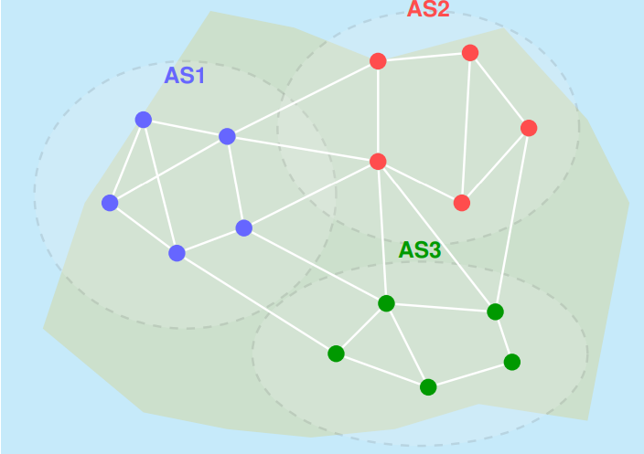
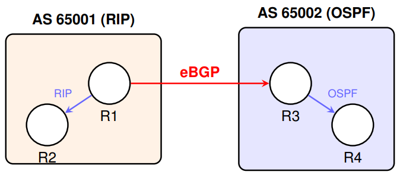
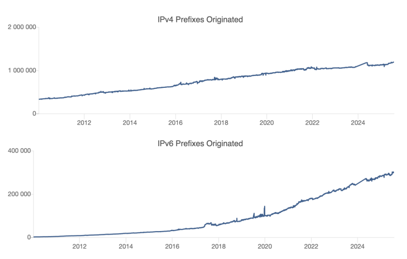
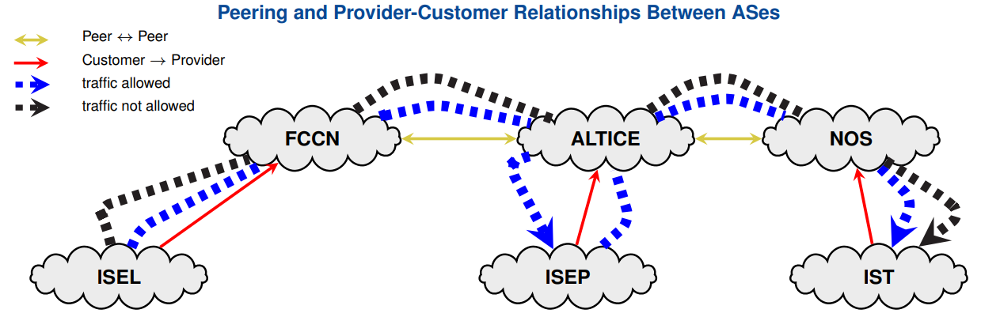
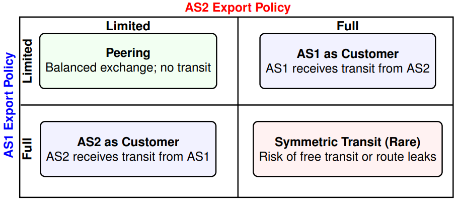
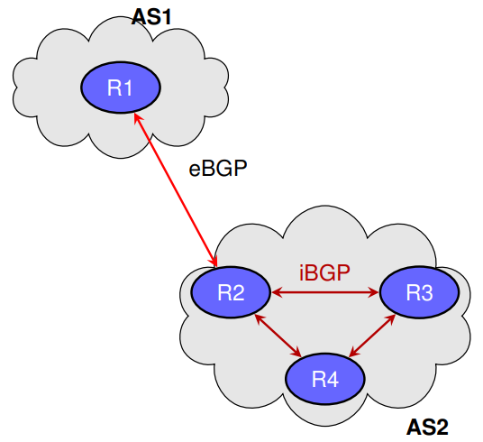
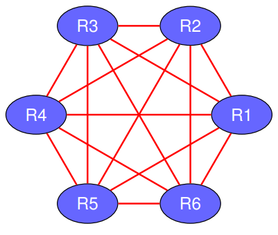

# Border Gateway Protocol (BGP) and Internet Routing

## BGP Overview

- A Routing Protocol used to exchange routing information between different networks
	+ Exterior gateway protocol
- Described in __RFC 4271__
	+ RFC 4276 gives an implementation report on BGP
	+ RFC 4277 describes operational experiences using BGP
	


### Why do We Need BGP? To Manage Inter-AS Traffic

1. No transit traffic through certain ASes
2. Never put __Iraq__ on a route starting at the __Pentagon__
3. __Do not use the United States__ to get from British Columbia to Ontario
4. Only transit __Albania__ if there is no alternative to the destination
5. Traffic starting or ending at __IBM__ should not transit __Microsoft__

> Routing policies are often politically, commercially, or strategically motivated

### BGP Concepts

- __BGP Session__ - TCP connection between two BGP peers. The connection state is regularly monitored (keepalive)
- __BGP Speaker__ – A router (or system) running BGP that participates in routing by exchanging BGP messages with peers
- __Border Router__ – A router connected to one or more ASes
- __Local Traffic__ – Traffic that originates or terminates within the AS
- __Transit Traffic__ – Traffic that neither originates nor terminates in the AS, i.e., it traverses it
- __AS Path__ – List of AS numbers traversed by a route during exchange
- __Announcement__ – BGP advertises all available paths (routes) to reach destinations

### BGP Features

- __Path Vector Protocol__ - Used for loop detection and path control in inter-AS routing
- __Internet Backbone__ - BGP forms the routing backbone of the global Internet
- __Autonomous Systems__ - BGP exchanges routes between independently managed ASes
- __Policy Enforcement__ - Flexible route filtering and path manipulation using attributes
- __CIDR Support__ - Supports Classless InterDomain Routing for address aggregation
- __Incremental Updates__ - Only changed routes are advertised, reducing overhead

### Inter-AS Connections Modes

| Mode        | Notes |
| ----------- | ----- |
| __Multi-homed__ | Interconnects multiple external autonomous systems |
| __Transit__ | Acts as a link between multiple external autonomous systems |
| __Stub__    | Interconnects with only a single external autonomous system |


### AS Numbering and Identification

- An __Autonomous System (AS)__ is identified by a unique number called an __ASN__ (Autonomous System Number)
- ASN characteristics:
	+ Typically 16-bit (with 32-bit ASN in production since 2007)
	+ Assigned by __registrars__ under the coordination of __ICANN__
	+ Reserved private ASNs: `64512 to 65535`
	+ Only __non-stub AS__ require a registered ASN
- Full list and policies: IANA ASN Registry

> _Classless_ and _Subnet Address Extensions_ (CIDR) also apply to AS routing policies

### AS Identification: Why Two Number Formats?

- Initially, ASNs were 16 bits long (2 bytes): easy to manage, written as simple decimals (e.g., 65526)
- The growing number of ASes led to exhaustion of this range
- A new 32-bit format (4 bytes) was introduced—allowing over 4 billion ASNs
- To avoid confusion:
	+ __Asplain__: Decimal form of the full ASN (e.g., 234567)
	+ __Asdot__: Split form as High.Low (e.g., 1.169031)
- Asdot helps visually distinguish legacy 2-byte ASNs from 4-byte ones

| Format  | 2-byte ASN  | 4-byte ASN |
| -----   | ----------- | ---------- |
| Asplain | 1 to 65535  | 65536 to 4294967295 |
| Asdot   | 1 to 65535  | 1.0 to 65535.65535 |

- In Asdot, 2-byte ASNs appear the same. Format matters only for 4-byte ASNs
- In routers, 234567 may appear as 3.559 depending on the configured display mode

### Reserved and Private AS Numbers

__Reserved ASNs (RFC 5398)__

- Reserved for __documentation and examples__
- Prevent conflicts in case configs are copied into production
- Defined by RFC 5398 and registered by IANA

__Private ASNs__

- Used for internal routing domains (e.g., iBGP)
- Not intended for advertisement to the Internet

__BGP Consideration__

- Cisco IOS does __not__ remove private ASNs by default
- ISPs should __filter__ them at egress boundaries\

__Reserved ASN Ranges__:

| Format | Reserved Range |
| ------ | -------------- |
| 2-byte | 64496 to 64511 |
| 4-byte | 65536 to 65551 |

__Private ASN Ranges__:

| Format | Private Range  |
| ------ | -------------- |
| 2-byte | 64512 to 65534 |
| 4-byte | 4200000000 to 4294967294 |

### Path-Vector Routing in BGP

__How does node F learn to reach node D?__

- F receives paths from neighbors:
	+ From B: `BCD`
	+ From G: `GCD`
	+ From I: `IFGCD`
	+ From E: `EFGCD`
- F will select one based on BGP policies (e.g., path length)
- Loops are avoided by checking if own AS appears in path


### BGP – Inter-AS Routing

__BGP (Border Gateway Protocol)__

- Standard protocol for routing between Autonomous Systems (ASes)
- __BGPv4__ is the current version (RFC 4271)

__Main Characteristics__:

- Supports __CIDR__, IPv6, and multicast routing
- Enables route aggregation to reduce routing information
- No restrictions on internal AS topology
- Assumes intra-AS routing is handled by IGPs (e.g., OSPF, RIP)
- Allows interconnection between ASes running different IGPs



### Real-World AS Numbers – Examples of Major ISPs

- __AT&T__ - AS7018 (USA)
- __Vodafone__ - AS1273 (UK)
- __Orange__ - AS3215 (FR)
- __Colt__ - AS8220 (EU-wide)
- __Google__ - AS15169 (USA)
- __Meta (Facebook)__ - AS32934 (USA)

> Source: [bgp.he.net](https://bgp.he.net) - BGP and AS lookup


### Who Owns the Most IPv4 Addresses?

- Not all ASes are equal — some originate massive blocks of IPv4 addresses
- AS749 (DoD NIC) and AS16509 (Amazon) top the global list
- Tier-1 providers (e.g., AT&T – AS7018) also control large IP space
- This impacts routing table size and peering decisions
- IPv4 scarcity adds value to historical allocations


### BGP Prefix Growth Over Time

- __IPv4 Prefixes__: Steady growth since 2010, exceeding 1.1 million entries in 2025
- __IPv6 Prefixes__: Sharper relative increase, indicating ongoing deployment and adoption



---

## Internet Economic Models

### AS Economical Relationships

#### Provider

An AS that offers upstream connectivity to another AS. Example: __FCCN is the provider for ISEL, ISEP, and COLT__.

- It announces all Internet routes to its customers.

#### Customer

An AS that pays another for Internet connectivity. Example: __ISEL, ISEP, and COLT are customers of FCCN or ALTICE__

- Announces only its own prefixes (its address space)
- Imports all Internet routes

#### Peer

A reciprocal agreement to exchange customer routes without payment. Example: __FCCN peering with ALTICE or AT&T__

- __No money is exchanged__ if traffic is symmetric (balanced)
- Each peer announces only the prefixes of its __customers__
- Routes are established by mutual agreement
- Peering links are high-performance, often in IXPs

### Internet Provider Hierarchy with Commercial Relationships


### AS Economic Relationships Example


### Peers vs Customers vs Providers Roles in BGP

__Peer relationships__

- Peers provide transit between their own customers only
- Peers do __not__ provide transit to other peers’ customers
- Peers __often do not exchange money__ (if traffic is symmetric)



### AS Routes Export Strategies as a 2x2 Game



> __Note__: What each AS exports should align with the corresponding BGP relationship, and best practice dictates that only customer routes be shared with peers or providers

### Economic Relations in BGP

__To peer or not to peer__ - business considerations in BGP:

- __Peer__:
	+ reduces upstream transit costs
	+ can increase end-to-end performance (less latency)
	+ may be the only way to reach Tier 1 networks
- __Don't Peer__:
	+ you would rather have customers
	+ peers are often your competition
	+ peering may require renegotiation

---

## BGP Peering

### What is BGP Peering?

__BGP Peering Defined__

- __Peering__ refers to the relationship established between BGP routers to exchange routing information
- A BGP peering session is a __TCP connection over port 179__ used to exchange
route updates

### iBGP and eBGP Peering

__eBGP (External BGP)__

- Peering between routers in __different ASes__
- Requires direct physical or logical connection
- Only incremental updates are exchanged
- Uses __TCP port 179__

__iBGP (Internal BGP)__:

- Peering between routers __within the same AS__
- Sessions do __not require direct connection__ — must be IP reachable
- Relies on __IGP (e.g., OSPF)__ to route iBGP packets
- Uses __TCP port 179__ as well



### iBGP Session Configuration Example

```txt
router bgp <ASN >
  neighbor <ip > remote - as <ASN >
  neighbor <ip > update - source Loopback0
```

```txt
# Scenario: iBGP peering between R1 and R2
# Using loopback interfaces and IGP reachability

R1 ( config )# router bgp 65000
R1 ( config - router ) # neighbor 10.0.0.2 remote - as 65000
R1 ( config - router ) # neighbor 10.0.0.2 update - source Loopback0

R2 ( config )# router bgp 65000
R2 ( config - router ) # neighbor 10.0.0.1 remote - as 65000
R2 ( config - router ) # neighbor 10.0.0.1 update - source Loopback0
```

> __Note__: iBGP sessions are established between routers in the same AS. Loopback interfaces are typically used for increased stability, and IGP must provide reachability to those loopbacks

### eBGP Session Configuration Example

```txt
router bgp <ASN >
  neighbor <ip > remote-as <peer-ASN>
```

```txt
# Scenario: eBGP peering between R1 (AS 65000) and R2 (AS 65100)
# Using directly connected interfaces

R1 ( config )# router bgp 65000
R1 ( config - router ) # neighbor 192.0.2.2 remote - as 65100

R2 ( config )# router bgp 65100
R2 ( config - router ) # neighbor 192.0.2.1 remote - as 65000
```

> __Note__: eBGP sessions are formed between routers in different ASes and typically use directly connected physical interfaces. Loopbacks are optional but require `ebgp-multihop` and manual update-source settings

### iBGP + eBGP + IGP: Integration Strategies

__Goal__: Ensure all internal routers know the external (eBGP-learned) routes

- Option 1 - Redistribuition:
	+ Inject BGP routes into IGP (e.g., OSPF)
	+ Not recommended → excessive route flooding
- Option 2 - Route Injection via iBGP:
	+ All routers run iBGP + IGP
	+ BGP routes inserted into FIB (forwarding table)
	+ Recursive lookup via IGP to reach BGP next hop
	+ Scales with __Route Reflectors__ or __Confederations__
	
#### Option 1: Redistribute eBGP Routes into IGP

```txt
router ospf <process>
	redistribute bgp <ASN> subnets
```

```txt
# Scenario: eBGP-learned prefixes injected into OSPF
R1 ( config )# router ospf 1
R1 ( config - router ) # redistribute bgp 65000 subnets

# All BGP routes are flooded as external LSAs
# Internal routers see BGP routes as OSPF external
```

> __Note__: This method breaks BGP policy control, pollutes the IGP with external prefixes, and increases convergence time. Use only in small or static deployments

#### Option 2: Propagate eBGP Routes via iBGP

```txt
router bgp <ASN>
  neighbor <ip> remote-as <ASN>
  neighbor <ip> update-source Loopback0
```

```txt
# Scenario: eBGP routes injected into BGP
# and propagated via iBGP to internal routers

R1 ( config )# router bgp 65000
R1 ( config - router ) # neighbor 10.0.0.2 remote - as 65000
R1 ( config - router ) # neighbor 10.0.0.2 update - source Loopback0

# Internal routers perform recursive lookup to reach eBGP next-hop
```

> __Note__: This approach preserves BGP policy control, supports route maps and filtering, and scales efficiently with route reflectors or confederations

### iBGP Scaling Challenges



#### Full-Mesh Problems:

- __N(N-1)/2 sessions__ for full connectivity
- Each router must peer with __N-1__ others
- Adding 1 router __requires reconfiguring__ all others
- Routing table size __grows with alternate paths__
- Routers __process updates__ for all neighbors
- Routers __do not forward__ iBGP-learned routes to other iBGP peers
- AS_PATH is not modified in iBGP → loops not detected

#### Scalability Solutions:

- Buy more powerfull routers!...
- Break AS  into __subASes__
- Use __Route Reflectors__
- Use __BGP Confedereations__

### iBGP Optimization with Route Reflector


__Route Reflector (RR) Strategy__:

- __Route Reflectors__ propagate iBGP routes to clients
- Reflectors forward __only best paths__
- Reduces full-mesh overhead: clients peer __only with RRs__
- `ORIGINATOR_ID` marks the router that originated the route
- `CLUSTER_LIST` accumulates the IDs of RRs that reflected the route
- These attributes ensure that routes are __discarded__ if received back from the originator or if they re-enter the same cluster

#### Route Reflector Configuration Example

```txt
router bgp <ASN>
	neighbor <ip> remote-as <ASN>
	neighbor <ip> update-source Loopback0
	neighbor <ip> route-reflector-client  
```

```txt
# Scenario: R1 = RR; R2 and R3 = iBGP clients
R1 ( config )# router bgp 65000
R1 ( config - router ) # neighbor 10.0.0.2 remote - as 65000
R1 ( config - router ) # neighbor 10.0.0.3 remote - as 65000
R1 ( config - router ) # neighbor 10.0.0.2 update - source Loopback0
R1 ( config - router ) # neighbor 10.0.0.3 update - source Loopback0
R1 ( config - router ) # neighbor 10.0.0.2 route - reflector - client
R1 ( config - router ) # neighbor 10.0.0.3 route - reflector - client

R3 ( config )# router bgp 65000
R3 ( config - router ) # neighbor 10.0.0.1 remote - as 65000
R3 ( config - router ) # neighbor 10.0.0.1 update - source Loopback0  
```

#### Cluster ID Setting in a Route Reflector Cluster

__Loop Prevention in iBGP__:

- In a full iBGP mesh, loops are prevented because:
	- Routers __do not forward iBGP-learned routes__ to other iBGP peers
	- Each router learns routes directly from the originator
* Route Reflectors relax this rule by allowing iBGP route reflection, which can cause __loops beteween reflectors__

__Loop Prevention with RRs__:

- `ORIGINATOR_ID` marks the route's originator
- `CLUSTER_LIST` tracks the RRs the route has passed through
- __All the RRs in the same cluster must share the same `CLUSTER_ID`

#### Route Reflector Loop Prevention: Setting CLUSTER_ID

```txt
router bgp <ASN>
	bgp cluster-id <id>
	neighbor <ip> route-reflector-client  
```

```txt
 # Scenario: R1 and R2 are redundant RRs in the same cluster
R1 ( config )# router bgp 65000
R1 ( config - router ) # bgp cluster - id 1.1.1.1
R1 ( config - router ) # neighbor 10.0.0.2 remote - as 65000
R1 ( config - router ) # neighbor 10.0.0.2 route - reflector - client

R2 ( config )# router bgp 65000
R2 ( config - router ) # bgp cluster - id 1.1.1.1
R2 ( config - router ) # neighbor 10.0.0.3 remote - as 65000
R2 ( config - router ) # neighbor 10.0.0.3 route - reflector - client 
```

> __Note__: Redundant Route Reflectors in the same cluster must share the same `CLUSTER_ID`. This ensures that reflected routes are not re-accepted and re-reflected between them, preventing persistent routing loops

### BGP Confederations: Hierarchical iBGP at Scale

__Key Concepts__:

- Confederations break a large AS into __sub-ASes__
- Each sub-AS uses iBGP internally (with or without RRs)
- Sub-ASes are connected via __confederation eBGP__
- `AS_PATH` is preserved internally, but loop checks are relaxed
- To external peers, the network appears as a __single AS__


#### BGP Confederation Configuration

```txt
router bgp <sub-AS>
	bgp confederation identifier <global-AS>
	bgp confederation peers <peer-sub-AS>
	neighbor <ip> remote-as <peer-sub-AS>
```

```txt
# R1 in Sub-AS 65001 (part of Confederation AS 65000) ----------------------------
R1 ( config )# router bgp 65001
R1 ( config - router ) # bgp confederation identifier 65000
R1 ( config - router ) # bgp confederation peers 65002
R1 ( config - router ) # neighbor 10.0.0.2 remote - as 65001
R1 ( config - router ) # neighbor 10.0.0.3 remote - as 65002
R1 ( config - router ) # neighbor 10.0.0.2 update - source Loopback0
R1 ( config - router ) # neighbor 10.0.0.3 update - source Loopback0

# R2 in same sub-AS (65001) ------------------------------------------------------
R2 ( config )# router bgp 65001
R2 ( config - router ) # bgp confederation identifier 65000
R2 ( config - router ) # bgp confederation peers 65002
R2 ( config - router ) # neighbor 10.0.0.1 remote - as 65001
R2 ( config - router ) # neighbor 10.0.0.1 update - source Loopback0

# R3 in Sub-AS 65002 (confederation AS 65000) ------------------------------------
R3 ( config )# router bgp 65002
R3 ( config - router ) # bgp confederation identifier 65000
R3 ( config - router ) # bgp confederation peers 65001
R3 ( config - router ) # neighbor 10.0.0.1 remote - as 65001
R3 ( config - router ) # neighbor 10.0.0.1 update - source Loopback0
```

> __Note__: Routers in the same sub-AS peer via iBGP. Confederation peers must be declared to allow eBGP-like behavior across sub-AS boundaries

> __Note__: eBGP-like sessions between sub-ASes include internal AS numbers in the `AS_PATH` using `AS_CONFED_SEQ`. External peers see only the global AS 65000

### BGP Peers

- In traditional BGP configuration, identical settings are applied to many neighbors manually
- This leads to:
	+ __Redundant lines of configuration__
	+ __Higher risk of inconsistency or typos__
	+ __Scalability issues__ in lage iBGP topologies
- __Peer groups__ allow you to define common parameters once and apply them to multiple peers
- Especially useful in iBGP full meshes or RR topologies with many internal peers
- Especially useful in iBGP full meshes or RR topologies with many internal peers

> __GOAL__: Simplify neighbor configuration by grouping peers with common attributes

#### BGP Configuration: Traditional vs. Peer Group (Example)

__Traditional Configuration__

```txt
router bgp 65000
neighbor 10.0.0.1 remote-as 65001
neighbor 10.0.0.1 update-source lo0
neighbor 10.0.0.1 send-community
neighbor 10.0.0.1 next-hop-self
neighbor 10.0.0.2 remote-as 65001
neighbor 10.0.0.2 update-source lo0
neighbor 10.0.0.2 send-community
neighbor 10.0.0.2 next-hop-self  
```

- Redundant settings repeat for each neighbor
- Tedious to manage in large networks

__With Peer Group__

```txt
router bgp 65000
neighbor IBGP peer-group
neighbor IBGP remote-as 65001
neighbor IBGP update-source lo0
neighbor IBGP send-community
neighbor IBGP next-hop-self
neighbor 10.0.0.1 peer-group IBGP
neighbor 10.0.0.2 peer-group IBGP  
```

- Common parameters defined once
- Easy to update and scale

> Peer groups simplify neighbor configuration, reduce duplication, and lower operational risk

---

## BGP Messages

---

## BGP Route Advertisements

---

## BGP Route Attributes

---

## BGP Traffic Optimization