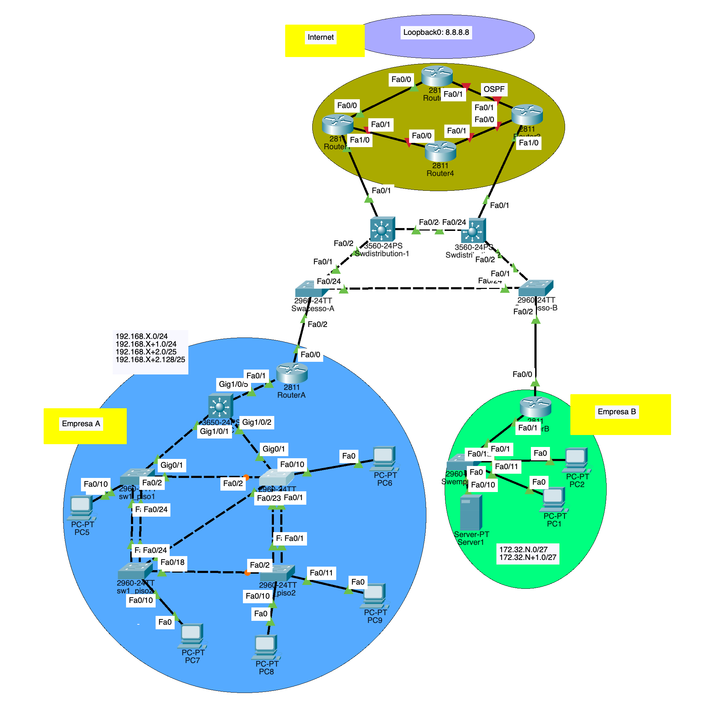

# LAB Project Nº 1 - VLAN/STP/OSPF MONO-AREA

> REDES DE INTERNET (RI)2025-2026

---

## Group 1 - Class 52D??? (not sure)

### Professor Luís Mata 

> luis.mata@isel.pt

- 45824 Nuno Venâncio
- 49420 André Carrilho
- 51454 Hugo Leal

---

## Index

- Introduction
- 1 - Enterprise A — L2 Foundations (VLAN/STP/RSTP)
    - 1.1 Implementation
        - 1.1.1 VLANs
        - 1.1.2 STP
    - 1.2 Tests and Validation
    - 1.3 Practical Questions
- 2 - Enterprise A — VLAN Segmentation & Addressing
    - 2.1 Implementation
        - 2.1.1 VLANs
        - 2.1.2 Access and Trunk Ports
        - 2.1.3 PCs IP Assignments
    - 2.2 Test and Validation
    - 2.3 Practical Questions
- 3 - Enterprise A — Router-on-a-Stick (RoS) & L3 Rules (no ACLs)
    - 3.1 Implementation
        - 3.1.1 Creation and configuration of sub interfaces to implement the L3 (Rules without ACLs)
        - 3.1.2 Trunk link between Router A and SW_DC
        - 3.1.3 Sub interfaces with encapsulation dot1Q and IPs (parent interface no IP)
    - 3.2 Test and Validation
    - 3.3 Practical Questions 
- 4 - Enterprise B — Segmentation & ISP L2 Interconnection
    - 4.1 Implementation
        - 4.1.1 Company B VLANs and IP Assignments
        - 4.1.2 Implementation of the ISP topology for interconnection with customers
        - 4.1.3 Building of VLAN paths in the switch fabric
        - 4.1.4 Assignment of IP address to Router 1, Router 3, Router A, and Router B
    - 4.2 Test and Validation
    - 4.3 Practical Questions
- 5 - Static Routing → OSPF Core & “Internet” Loopback → Public Addressing Test
    - 5.1 Implementation
        - 5.1.1 Static routing (initial)
            - 5.1.1.1 Default static routes on company routers toward the ISP; identify next-hop and purpose.
            - 5.1.1.2 Static routing on R1–R4, add required static routes to reach company blocks.
            - 5.1.1.3 Verification of which pings succeed before OSPF and why.
        - 5.1.2 OSPF (ISP core)
            - 5.1.2.1 Configuration of OSPF on R1–R4 (single area) per design
            - 5.1.2.2 Internet Simulation - Configuration of R2 Loopback0 = 8.8.8.8/32
            - 5.1.2.3 Global connectivity with redundancy
        - 5.1.3 Public addressing test
            - 5.1.3.1 Change of configs so each company and the operator use public IPs
    - 5.2 Test and Validation
    - 5.3 Practical Questions
- Conclusion

---

## Introduction

In this project we explore Internet Networks topics like VLAN segmentation, L2 loop protection (STP/RSTP), inter-VLAN routing (router-on-a-stick), static routing, and single-area OSPF.

To accomplish this we will configure and simulate a network between two enterprises (A and B) and an ISP (Internet Service Provider).

The Enterprise A will be constituted of 1 router, 5 switches, 5 PCs and 4 VLANs.... __TODO__

The Enterprise B will be constituted of 1 router, 1 switch, 1 server, 1 pc and 2 VLANs.... __TODO__

The ISP will be constituted by 4 routers and 4 switches, that connects to "Internet" using a Loopback.... __TODO__

__TODO__



___

## 1. Enterprise A - L2 Foundations (VLAN/STP/RSTP)

### 1.1 Implementation

#### 1.1.1 VLANs

To configure the static VLANs according to the table in the point 4.2.1 it was necessary to remove in each switch the previous VLANs:

```txt
Switch(config)# no vlan 20
Switch(config)# no vlan 30
Switch(config)# no vlan 40
Switch(config)# no vlan 45
``` 

__TODO__: Meter a `Native VLAN` para a 99 ou outra para não coincidir com a `Default VLAN` (VLAN 1) por razões de segurança. Não temos a certeza se falta fazer `no spanning-tree vlan 1`

To create and name our VLANs we use:

```txt
Switch(config)# vlan 11
Switch(config-vlan)# name Accounting
Switch(config)# vlan 12
Switch(config-vlan)# name Secretariat
Switch(config)# vlan 13
Switch(config-vlan)# name Computer_science
```

The only PC that uses __VLAN 13 - Computer_science__ is the `PC6`, witch is connected to `sw2_piso1` and this switch to `SW_DC`, but because of connection redundancy reasons, it was decided to add this VLAN to all the switches. 

| VLAN | NAME             | IP GATEWAY    | NETWORK          | PCs |
| -- | ------------------ | ------------- | -----------------| -------- |
| 11 | Accounting         | 172.20.11.254 | 172.20.11.0/24   | PC7, PC9 |
| 12 | Secretariat        | 172.20.12.254 | 172.20.12.0/24   | PC5, PC8 |
| 13 | Computer science   | 172.20.13.126 | 172.20.13.0/25   | PC6 |

table 1 - Enterprise A VLANs

#### 1.1.2 STP (RB/roles/costs)

For the switch `SW_DC` to be the __Root Bridge__ in all VLANs, we force his priority. Previously it was __Root Bridge__ only to VLANs 11, 12 and 13, but VLAN 1 has his __Root Bridge__ at `sw1_piso2`. 

__TODO__: comando para baixar a prioridade do SW_DC
__TODO__: A porta Gig1/0/1 do SW_DC não tem a VLAN 13, falta meter

- Table built using command `show spanning-tree`, ordered by priorities and MAC

| Switch    | Priority        | MAC            | Root MAC       |
| --------- |---------------- | -------------- | -------------- |
| SW_DC     | 24577 (VLAN 1)  | 0002.4AE4.E093 | Same |
| SW_DC     | 32779 (VLAN 11) | 0002.4AE4.E093 | Same |
| SW_DC     | 32780 (VLAN 12) | 0002.4AE4.E093 | Same |
| SW_DC     | 32781 (VLAN 13) | 0002.4AE4.E093 | Same |
| sw1_piso1 | 32769 (VLAN 1)  | 0009.7C65.BA4B | 0002.4AE4.E093 (SW_DC) |
| sw1_piso1 | 32779 (VLAN 11) | 0009.7C65.BA4B | 0002.4AE4.E093 (SW_DC) |
| sw1_piso1 | 32780 (VLAN 12) | 0009.7C65.BA4B | 0002.4AE4.E093 (SW_DC) |
| sw1_piso1 | 32781 (VLAN 13) | 0009.7C65.BA4B | 0002.4AE4.E093 (SW_DC) |
| sw2_piso2 | 32769 (VLAN 1)  | 00E0.8FE1.53D7 | 0002.4AE4.E093 (SW_DC) |
| sw2_piso2 | 32779 (VLAN 11) | 00E0.8FE1.53D7 | 0002.4AE4.E093 (SW_DC) |
| sw2_piso2 | 32780 (VLAN 12) | 00E0.8FE1.53D7 | 0002.4AE4.E093 (SW_DC) |
| sw2_piso2 | 32781 (VLAN 13) | 00E0.8FE1.53D7 | 0002.4AE4.E093 (SW_DC) |
| sw1_piso2 | 28673 (VLAN 1)  | 00E0.A3CE.4A46 | 0002.4AE4.E093 (SW_DC) |
| sw1_piso2 | 32779 (VLAN 11) | 00E0.A3CE.4A46 | 0002.4AE4.E093 (SW_DC) |
| sw1_piso2 | 32780 (VLAN 12) | 00E0.A3CE.4A46 | 0002.4AE4.E093 (SW_DC) |
| sw1_piso2 | 32781 (VLAN 13) | 00E0.A3CE.4A46 | 0002.4AE4.E093 (SW_DC) |
| sw2_piso1 | 32769 (VLAN 1)  | 00E0.F950.631A | 0002.4AE4.E093 (SW_DC) |
| sw2_piso1 | 32779 (VLAN 11) | 00E0.F950.631A | 0002.4AE4.E093 (SW_DC) |
| sw2_piso1 | 32780 (VLAN 12) | 00E0.F950.631A | 0002.4AE4.E093 (SW_DC) |
| sw2_piso1 | 32781 (VLAN 13) | 00E0.F950.631A | 0002.4AE4.E093 (SW_DC) |


table 2 - Root Bridge and VLAN priorities


- Root Bridge, Port Roles and Port Costs __TODO__: Port cost...

| Switch    | VLANs      | Port    | PC | RPC | RP     | DP     | ALT/BLK |
| --------- | ---------- | ------- | -- | --- | ------ | ------ | ------- |
| SW_DC     | 1,11,12    | Gi1/0/1 | 4  | -   |        | X      |         |
| SW_DC     | 1,11,12,13 | Gi1/0/2 | 4  | -   |        | X      |         |
| SW_DC     | 1,11,12,13 | Gi1/0/5 | 19 | -   |        | X      |         |
| sw1_piso1 | 1,11,12,13 | Gi0/1   | 4  |     |  X     | X (13) |         | 
| sw1_piso1 | 1,11,12,13 | Fa0/2   | 19 |     | X (13) | X      |         |
| sw1_piso1 | 12         | Fa0/10  | 19 |     |        | X      |         |
| sw1_piso1 | 1,11,12,13 | Fa0/23  | 19 |     |        | X      |         |
| sw1_piso1 | 1,11,12    | Fa0/24  | 19 |     |        | X      |         |
| sw2_piso2 | 1,11,12,13 | Fa0/1   | 19 |     | X      |        |         |
| sw2_piso2 | 1,11,12,13 | Fa0/2   | 19 |     |        | X      | X (1)   |    
| sw2_piso2 | 12         | Fa0/10  | 19 |     |        | X      |         |
| sw2_piso2 | 11         | Fa0/11  | 19 |     |        | X      |         |
| sw2_piso2 | 1,11,12    | Fa0/24  | 19 |     |        |        | X       |
| sw1_piso2 | 1,11,12,13 | Fa0/2   | 19 |     |        | X (1)  | X       |
| sw1_piso2 | 11         | Fa0/10  | 19 |     |        | X      |         |
| sw1_piso2 | 1,11,12,13 | Fa0/18  | 19 |     | X (13) |        | X       |
| sw1_piso2 | 1,11,12,13 | Fa0/23  | 19 |     | X      |        | X (13)  |
| sw1_piso2 | 1,11,12,13 | Fa0/24  | 19 |     |        | X (13) | X       |
| sw2_piso1 | 1,11,12,13 | Gi0/1   | 4  |     | X      |        |         |
| sw2_piso1 | 1,11,12,13 | Fa0/1   | 19 |     |        | X      |         |
| sw2_piso1 | 1,11,12,13 | Fa0/2   | 19 |     |        | X (13) | X       |
| sw2_piso1 | 13         | Fa0/10  | 19 |     |        | X      |         |
| sw2_piso1 | 1,11,12,13 | Fa0/23  | 19 |     |        | X      |         |
| sw2_piso1 | 1,11,12,13 | Fa0/24  | 19 |     |        | X      |         |
 
 table 3 - Root Bridge, Port Roles and Port Costs


### 1.2 Tests and Validation

__TODO__

#### Summary of Spanning-Tree by Switch

> `show spanning-tree summary`

- __SW_DC__

```shell
Switch is in pvst mode
Root bridge for: default Accounting Secretariat Computer_science
Extended system ID           is enabled
Portfast Default             is disabled
PortFast BPDU Guard Default  is disabled
Portfast BPDU Filter Default is disabled
Loopguard Default            is disabled
EtherChannel misconfig guard is disabled
UplinkFast                   is disabled
BackboneFast                 is disabled
Configured Pathcost method used is short

Name                   Blocking Listening Learning Forwarding STP Active
---------------------- -------- --------- -------- ---------- ----------
VLAN0001                     0         0        0          3          3
VLAN0011                     0         0        0          3          3
VLAN0012                     0         0        0          3          3
VLAN0013                     0         0        0          3          3

---------------------- -------- --------- -------- ---------- ----------
4 vlans                      0         0        0         12         12
```

- __sw1_piso1__

```shell
Switch is in pvst mode
Root bridge for:
Extended system ID           is enabled
Portfast Default             is disabled
PortFast BPDU Guard Default  is disabled
Portfast BPDU Filter Default is disabled
Loopguard Default            is disabled
EtherChannel misconfig guard is disabled
UplinkFast                   is disabled
BackboneFast                 is disabled
Configured Pathcost method used is short

Name                   Blocking Listening Learning Forwarding STP Active
---------------------- -------- --------- -------- ---------- ----------
VLAN0001                     0         0        0          4          4
VLAN0011                     0         0        0          4          4
VLAN0012                     0         0        0          5          5
VLAN0013                     0         0        0          3          3

---------------------- -------- --------- -------- ---------- ----------
4 vlans                      0         0        0         16         16
```

- __sw2_piso1__

```shell
Switch is in pvst mode
Root bridge for:
Extended system ID           is enabled
Portfast Default             is disabled
PortFast BPDU Guard Default  is disabled
Portfast BPDU Filter Default is disabled
Loopguard Default            is disabled
EtherChannel misconfig guard is disabled
UplinkFast                   is disabled
BackboneFast                 is disabled
Configured Pathcost method used is short

Name                   Blocking Listening Learning Forwarding STP Active
---------------------- -------- --------- -------- ---------- ----------
VLAN0001                     1         0        0          4          5
VLAN0011                     1         0        0          4          5
VLAN0012                     1         0        0          4          5
VLAN0013                     0         0        0          6          6

---------------------- -------- --------- -------- ---------- ----------
4 vlans                      3         0        0         18         21
```

- __sw1_piso2__

```shell
Switch is in pvst mode
Root bridge for:
Extended system ID           is enabled
Portfast Default             is disabled
PortFast BPDU Guard Default  is disabled
Portfast BPDU Filter Default is disabled
Loopguard Default            is disabled
EtherChannel misconfig guard is disabled
UplinkFast                   is disabled
BackboneFast                 is disabled
Configured Pathcost method used is short

Name                   Blocking Listening Learning Forwarding STP Active
---------------------- -------- --------- -------- ---------- ----------
VLAN0001                     2         0        0          2          4
VLAN0011                     3         0        0          2          5
VLAN0012                     3         0        0          1          4
VLAN0013                     2         0        0          2          4

---------------------- -------- --------- -------- ---------- ----------
4 vlans                     10         0        0          7         17
```

- __sw2_piso2__

```shell
Switch is in pvst mode
Root bridge for:
Extended system ID           is enabled
Portfast Default             is disabled
PortFast BPDU Guard Default  is disabled
Portfast BPDU Filter Default is disabled
Loopguard Default            is disabled
EtherChannel misconfig guard is disabled
UplinkFast                   is disabled
BackboneFast                 is disabled
Configured Pathcost method used is short

Name                   Blocking Listening Learning Forwarding STP Active
---------------------- -------- --------- -------- ---------- ----------
VLAN0001                     2         0        0          1          3
VLAN0011                     1         0        0          3          4
VLAN0012                     1         0        0          3          4
VLAN0013                     1         0        0          2          3

---------------------- -------- --------- -------- ---------- ----------
4 vlans                      5         0        0          9         14
```


### 1.3 Practical Questions

#### 1. What is the purpose of this command - "no ip domain-lookup"?

The `no ip domain-lookup` command in Cisco Packet Tracer is used to __disable the router or switch's default behaviour of trying to resolve any mistyped command as a hostname__.

By default, when is typed an unrecognised word at the command line, a Cisco device assumes that we are trying to connect via Telnet to a host with that name. The device then attempts a DNS lookup to find that host's IP address. In a lab environment without a DNS server, this causes the command line to freeze for a minute or more while the device broadcasts a request that will never be answered.

Using `no ip domain-lookup` prevents this delay. After entering this command, a mistyped command results in an immediate error message, allowing the correction of the mistake without waiting

[no ip domain lookup command](https://study-ccna.com/no-ip-domain-lookup-command/)

#### 2. What default VLANs exist before any VLAN is configured on any equipment?

Before any configuration is done, all Cisco switches come with a set of **default VLANs** that are created automatically.

The most crucial one, which is always present, is:

 __1. VLAN 1__
This is the **default native VLAN**.
*   **Purpose:** By default, all switch ports are members of VLAN 1. All traffic traversing a trunk port (a port that carries multiple VLANs) that is not specifically tagged with a VLAN ID will be assumed to belong to the native VLAN, which is VLAN 1 by default.
*   **Important Note:** For security reasons, it is a universal best practice **never to use VLAN 1 for user data traffic**. It should only be used for control plane traffic (mentioned below). Many network administrators create a different VLAN (e.g., VLAN 99) to act as the native VLAN and remove VLAN 1 from all trunks and access ports.

__Other Pre-Configured VLANs__

Depending on the switch model and IOS version, we might also see one or both of the following VLANs pre-created. They are used for internal switch management and communication.

- VLAN 1002
- VLAN 1003
- VLAN 1004
- VLAN 1005

These are **default VLANs for legacy Token Ring and FDDI networks**.
*   **Purpose:** They exist for backward compatibility with very old network types (Token Ring and FDDI) that modern networks no longer use.
*   **Key Characteristic:** We **cannot delete these VLANs** (1002-1005). They are permanently reserved by the system.

| VLAN ID | Name | Purpose | Can it be deleted? |
| :--- | :--- | :--- | :--- |
| **1** | **default** | Default Native VLAN. Carries control protocols like CDP, DTP, VTP, and PAgP. | **No** (but we can shut it down) |
| **1002** | fddi-default | Legacy FDDI network default. | **No** |
| **1003** | token-ring-default | Legacy Token Ring network default. | **No** |
| **1004** | fddinet-default | Legacy FDDI Net default. | **No** |
| **1005** | trnet-default | Legacy Token Ring Net default. | **No** |


#### 3. What is the format of the tags introduced in Ethernet frames in trunk connections?

The format used for tagging Ethernet frames on trunk connections is defined by the **IEEE 802.1Q** standard, often called **"dot1q."**

On an **access link** (a link connected to a normal device like a PC), frames are untagged. The switch adds or removes the VLAN information internally. On a **trunk link** (a link between switches, or to a router), frames from multiple VLANs must travel over the same physical cable. The tag is what allows the receiving switch to identify which VLAN the frame belongs to.

__The 802.1Q Tag Format__

The 802.1Q tag is a **4-byte (32-bit)** field that is inserted into the original Ethernet frame, right after the **Source MAC Address** field.

Here is a visual representation and breakdown of the frame structure:

```
BEFORE 802.1Q TAGGING (Standard Ethernet Frame):
| Destination MAC (6 bytes) | Source MAC (6 bytes) | Type/Length (2 bytes) | Data (46-1500 bytes) | FCS (4 bytes) |

AFTER 802.1Q TAGGING (VLAN Tagged Frame on a Trunk):
| Destination MAC | Source MAC | 802.1Q TAG (4 bytes) | Type/Length | Data | FCS |
```

__Breakdown of the 4-Byte 802.1Q Tag Field:__

The 4-byte tag itself is composed of the following parts:

1.  **TPID (Tag Protocol Identifier) - 2 Bytes**
    *   **Value:** `0x8100` (in hexadecimal)
    *   **Purpose:** This is a special, well-known value that identifies the frame as an 802.1Q-tagged frame. When a network device sees `0x8100` in the "EtherType" position, it knows to look for a VLAN tag in the next 2 bytes.

2.  **TCI (Tag Control Information) - 2 Bytes**
    This 16-bit field is further subdivided into three parts:
    *   **Priority (PCP) - 3 Bits**
        *   **Purpose:** **Class of Service (CoS)** or **Priority Code Point**. It's used for quality of service (QoS) to prioritize different types of traffic (e.g., voice, video, data). Values 0 (lowest) to 7 (highest).
    *   **CFI (Canonical Format Indicator) - 1 Bit**
        *   **Purpose:** Primarily used for compatibility between Ethernet and Token Ring networks. It is almost always set to `0` for Ethernet networks.
    *   **VLAN ID (VID) - 12 Bits**
        *   **Purpose:** This is the most important part. It identifies the **VLAN** the frame belongs to.
        *   **Range:** Because it's 12 bits, the VLAN ID range is from `0` to `4095`.
            *   **VLAN 0:** Reserved for 802.1P priority-tagged frames.
            *   **VLAN 1:** The default VLAN.
            *   **VLANs 2-1001:** Normal range for user VLANs.
            *   **VLAN 1002-1005:** Legacy default VLANs (FDDI, Token Ring).
            *   **VLAN 1006-4094:** Extended range VLANs (not all switches support these).
            *   **VLAN 4095:** Reserved.

#### 4. Why is it that on a LAN that uses VLANs, on an Access-type connection the frames do not include tags?

The reason frames are **untagged on Access ports** is fundamentally about **compatibility with end-user devices**. Most end devices (like PCs, printers, IP phones, servers) are completely unaware of VLANs and expect to send and receive standard, untagged Ethernet frames.

An Access port is like a "VLAN translator" that sits between the switched network and the end device.

1. **Transmitting from the Switch to the End Device (Egress)**
    *   **On the Trunk/Inside the Switch:** The frame is tagged with a VLAN ID (e.g., VLAN 10).
    *   **At the Access Port:** Before the switch sends the frame out the Access port, it **strips off the 802.1Q tag**.
    *   **Result:** The end device receives a perfectly normal, standard Ethernet frame that it can understand. It has no idea the frame ever belonged to a VLAN.

2. **Receiving from the End Device to the Switch (Ingress)**
    *   **From the End Device:** The PC or server sends a standard, **untagged** Ethernet frame.
    *   **At the Access Port:** The switch receives this untagged frame. Because the port is configured as an Access port for a specific VLAN (e.g., `switchport access vlan 10`), the switch **internally adds a VLAN 10 tag** to the frame.
    *   **Result:** Now that the frame is tagged, the switch can process it correctly—forward it to other ports in VLAN 10, or tag it again to send it over a trunk to another switch.

__Objective of this design__

1.  **Simplicity and Universality:** It allows you to introduce VLANs into your network without having to upgrade or reconfigure every single PC, printer, and server to understand 802.1Q tags.
2.  **Clear Separation of Responsibilities:**
    *   **Switches** are the "VLAN-aware" devices. They handle the complexity of tagging, filtering, and trunking.
    *   **End-devices** are "VLAN-unaware." They just send and receive standard network traffic.

#### 5. What is the tag that the wefts belonging to VLAN 1 carry?

__TODO__

#### 6. When a machine receives an Ethernet frame, how does it differ if it includes the Type/Length field after the source address field or if it includes the fields associated with a VLAN?

The key difference lies in how the network interface card (NIC) and its driver **interpret the two bytes that follow the Source MAC Address**.

There are two different scenarios:

- __Scenario 1: Standard Ethernet Frame (No VLAN Tag)__

    This is the original Ethernet II frame format.

    **Frame Structure:**
    ```
    | Destination MAC (6) | Source MAC (6) | Type/Length (2) | Data & Padding   (46-1500) | FCS (4) |
    ```

    **Processing from the receiving machine processes:**
    The machine looks at the **Type/Length field** (officially called the **EtherType** field when used as a type identifier). It checks the value in this 2-byte field:

    *   **If the value is 0x0600 (1536) or greater:** It is interpreted as an **EtherType**. This indicates the protocol of the payload contained in the "Data" field. The machine hands the frame's payload to the appropriate network protocol stack (e.g., the IPv4 stack, the IPv6 stack, etc.).
        *   **Common Examples:**
            *   `0x0800` = IPv4
            *   `0x86DD` = IPv6
            *   `0x0806` = ARP

    *   **If the value is 0x05DC (1500) or less:** It is interpreted as the **Length** of the frame. This is used by the legacy IEEE 802.3 standard (which is less common today). The machine would then need to look at the "Data" portion to find a separate LLC (Logical Link Control) header to determine the protocol type.

    **Key Takeaway:** In a modern standard frame, the field is an **EtherType** that directly tells the OS what's inside.

- __Scenario 2: VLAN-Tagged Frame (802.1Q)__

    This is the frame after the 4-byte VLAN tag has been inserted.

    **Frame Structure:**
    ```
    | Dest MAC (6) | Source MAC (6) | 0x8100 (2) | TCI (2) | Type/Length (2) | Data & Padding (46-1500) | FCS (4) |
    ```

    **Processing by the receiving machine processes:**
    The machine starts reading the frame as usual. After the Source MAC address, it encounters the next 2 bytes:

    1. **It reads the value `0x8100`.**
        *   This specific value is a **well-known, reserved EtherType** that means "**This is an 802.1Q tagged frame**."
        *   When the NIC sees `0x8100`, it knows that the **next 4 bytes are not the payload's protocol type, but are instead a VLAN tag**.

    1. **It skips the next 2 bytes (the TCI field containing Priority, CFI, and VLAN ID).**
        *   The machine's driver might read the VLAN ID here if it needs it for software-based VLAN processing, but for basic protocol demultiplexing, it just knows to look *past* this tag.

    1. **It now looks at the *next* 2-byte field, which is the *real* Type/Length field.**
        *   This field now contains the actual EtherType (e.g., `0x0800` for IPv4) that describes the protocol of the encapsulated payload that follows.

__Side-by-Side Comparison__

| Step | Standard Frame (No VLAN) | VLAN-Tagged Frame (802.1Q) |
| :--- | :--- | :--- |
| **1. Read Dest/Src MAC** | Reads 6-byte Destination, then 6-byte Source. | Same. Reads 6-byte Destination, then 6-byte Source. |
| **2. Interpret Next 2 Bytes** | Sees value (e.g., `0x0800`). **This is the payload's Type.** | Sees value `0x8100`. **This is a signal that a VLAN tag follows.** |
| **3. Action** | Sends "Data" to the protocol stack indicated by the Type (e.g., IPv4 stack). | **Reads the next 4 bytes as the VLAN Tag,** then moves to the next 2-byte field. |
| **4. Find Payload Type** | (Already found in step 2) | Reads the *next* 2-byte field. This value (e.g., `0x0800`) is the **real payload Type.** |
| **5. Final Action** | Processes payload. | Sends "Data" to the protocol stack indicated by the Type found in step 4. |

#### 7. What are the possible consequences of passing the timers "Max Age"=20 sec and "Forward Delay"= 15 sec to half of these values?

Adjusting the STP timers to half their default values can speed up network convergence but carries significant risks. The consequences depend heavily on the network's **physical size and stability**.

__Weighing the Consequences: Faster Convergence vs. Stability Risks__

The table below summarizes the potential outcomes:

| Timer Change | Potential Benefit | Risks and Consequences |
| :--- | :--- | :--- |
| **Max Age: 20s → 10s** | Faster detection of link failures. | **Unstable Links**: Ports may flap between blocking/forwarding on poor links. **Topology Instability**: Increased risk of transient loops if BPDUs are delayed. |
| **Forward Delay: 15s → 7s** | Drastically reduced time for ports to become active (from 30-50s to 15-25s). | **Network Loops**: High risk of temporary Layer 2 loops and broadcast storms. **Frame Duplication**: Switches may forward data frames from old topology. |

The default values (Max Age=20, Forward Delay=15) are calculated based on a **maximum network diameter of seven switches** and account for BPDU propagation delays. Halving them assumes your network is smaller and has lower latency.

[Understand and Tune Spanning Tree Protocol Timers](https://www.cisco.com/c/en/us/support/docs/lan-switching/spanning-tree-protocol/19120-122.html)

#### 8. What is the Root Bridge (RB)? Justify.

In a network using the Spanning Tree Protocol (STP), the **Root Bridge** acts as the logical center or "boss" of the network. Its primary purpose is to serve as a common reference point that all other switches use to build a loop-free topology, allowing for redundant links without the risk of switching loops or broadcast storms.

The Root Bridge is a switch elected by the STP algorithm to be the root of the spanning tree. All paths in the network are calculated relative to this switch. Wwe can think of the STP topology as an inverted tree, where the Root Bridge is the root, and all other switches connect to it through branches.

Its key roles include:
*   **BPDU Originator**: The Root Bridge is the source for Bridge Protocol Data Units (BPDUs), the special frames that switches use to share STP information. These BPDUs are relayed throughout the network from the root bridge "down" to all other switches.
*   **Timer Keeper**: The Root Bridge dictates critical STP timers for the entire network, including the Hello Time, Forward Delay, and Max Age.
*   **Topology Baseline**: All other switches determine the "best" path to the Root Bridge. The ports that connect switches to their best path toward the Root Bridge are called **Root Ports**.

[Spanning Tree Protocol](https://community.cisco.com/t5/networking-blogs/spanning-tree-protocol-from-a-feature-ccna-s-perspective-by/ba-p/3101592)

#### 9. By default, what is the type of active Spanning-Tree (STP) [hint: use sh span]? 

Using the command `sh spanning-tree summary` it says `Switch is in pvst mode` which corresponds to __Per-VLAN Spanning Tree Plus (PVST+)__. Using the hint command, only says `Spanning tree enabled protocol ieee`.

#### 10. How many spanning trees are there in the implemented topology? 

In the implemented topology there are 4 spanning trees, one for each VLAN. VLAN 1, VLAN 11, VLAN 12 and VLAN 13.

#### 11.  For company A, build the table for calculating the cost of the paths and determining which are the Root, Designated and Blocking ports and calculate the respective values (check in the PT which cost values are used in the calcula[ons of the spanning trees). Are the final results you arrived at consistent with those that the PT simulator presents?

__TODO__

#### 12. What is the cost of the shortest path to Router A since PC9? 

__TODO__

---

## 2. Enterprise A - VLAN Segmentation and Addressing

### 2.1 Implementation

__TODO__

#### 2.1.1 VLANs

__TODO__: add table and show configurations

| VLAN | NAME             | IP GATEWAY    | NETWORK          | PCs |
| -- | ------------------ | ------------- | -----------------| -------- |
| 11 | Accounting         | 172.20.11.254 | 172.20.11.0/24   | PC7, PC9 |
| 12 | Secretariat        | 172.20.12.254 | 172.20.12.0/24   | PC5, PC8 |
| 13 | Computer science   | 172.20.13.126 | 172.20.13.0/25   | PC6 |

#### 1.1.2 Access and Trunk Ports

__TODO__: maybe a table

#### 2.1.3 PCs IP Assignments

__TODO__: maybe a table

### 2.2 Test and Validation

__TODO__

### 2.3 Practical Questions

#### 1. What is the cost of the shortest path to Router A since PC9? 

__TODO__

#### 2. Explain what ac[ons were required to accommodate the topology requirements.

__TODO__

#### 3. Did you achieve inter vlan connectivity in this phase? Explain the observed behaviour.

---
## 3. Enterprise A — Router-on-a-Stick (RoS) & L3 Rules (no ACLs)

### 3.1 Implementation

__TODO__

#### 3.1.1 Creation and configuration of sub interfaces to implement the L3 (Rules without ACLs)

- Accounting & Secretariat: no access to any other internal or external VLAN/network
- IT: access to Secretariat and outside Company A
- Net-Management: mutual access (all support equipment must be reachable from PC6 for remote management)

__TODO__

#### 3.1.2 Trunk link between Router A and SW_DC

__TODO__

#### 3.1.3 Sub interfaces with encapsulation dot1Q and IPs (parent interface no IP)

__TODO__

### 3.2 Test and Validation

__TODO__

### 3.3 Practical Questions

#### 1. Explain the advantages and disadvantages of the Router-on-a-stick functionality

__TODO__

#### 2. Explain how you enforced the three communication rules __without ACLs__

__TODO__

#### 3. Provide short command outputs proving each rule is satisfied/blocked as required

__TODO__

---

## 4. Enterprise B — Segmentation & ISP L2 Interconnection

### 4.1 Implementation

#### 4.1.1 Company B VLANs and IP Assignments

__TODO__

#### 4.1.2 Implementation of the ISP topology for interconnection with customers

__TODO__

#### 4.1.3 Building of VLAN paths in the switch fabric

__TODO__

#### 4.1.4 Assignment of IP address to Router 1, Router 3, Router A, and Router B

__TODO__

### 4.2 Test and Validation

__TODO__

### 4.3 Practical Questions

#### 1. Count STP trees; list blocked ports in VLANs 90 and 95 and justify.

__TODO__

#### 2. State the advantage/goal of trunk pruning in the ISP fabric.

__TODO__

#### 3. Explain the chosen RB priori[es and observed blocked ports.

__TODO__

---

## 5. Static Routing → OSPF Core & “Internet” Loopback → Public Addressing Test

### 5.1 Implementation

#### 5.1.1 Static routing (initial)

##### 5.1.1.1 Default static routes on company routers toward the ISP; identify next-hop and purpose.

__TODO__

##### 5.1.1.2 Static routing on R1–R4, add required static routes to reach company blocks.

__TODO__

##### 5.1.1.3 Verification of which pings succeed before OSPF and why.

__TODO__

#### 5.1.2 OSPF (ISP core)

##### 5.1.2.1 Configuration of OSPF on R1–R4 (single area) per design

__TODO__

##### 5.1.2.2 Internet Simulation - Configuration of R2 Loopback0 = 8.8.8.8/32

__TODO__

##### 5.1.2.3 Global connectivity with redundancy

__TODO__

#### 5.1.3 Public addressing test

##### 5.1.3.1 Change of configs so each company and the operator use public IPs

__TODO__

### 5.2 Testing and Validation

__TODO__

### 5.3 Practical Questions

#### 1. Can corporate PCs ping the ISP router before OSPF? Justify.

__TODO__

#### 2. What is the __next-hop__ of your default routes and why?

__TODO__

#### 3. Describe the purpose of static routes on R1–R4 and what changes once OSPF runs. 

__TODO__

#### 4. After enabling OSPF, explain the path selection you observe towards __8.8.8.8.__

__TODO__

---

## Conclusion

__TODO__


