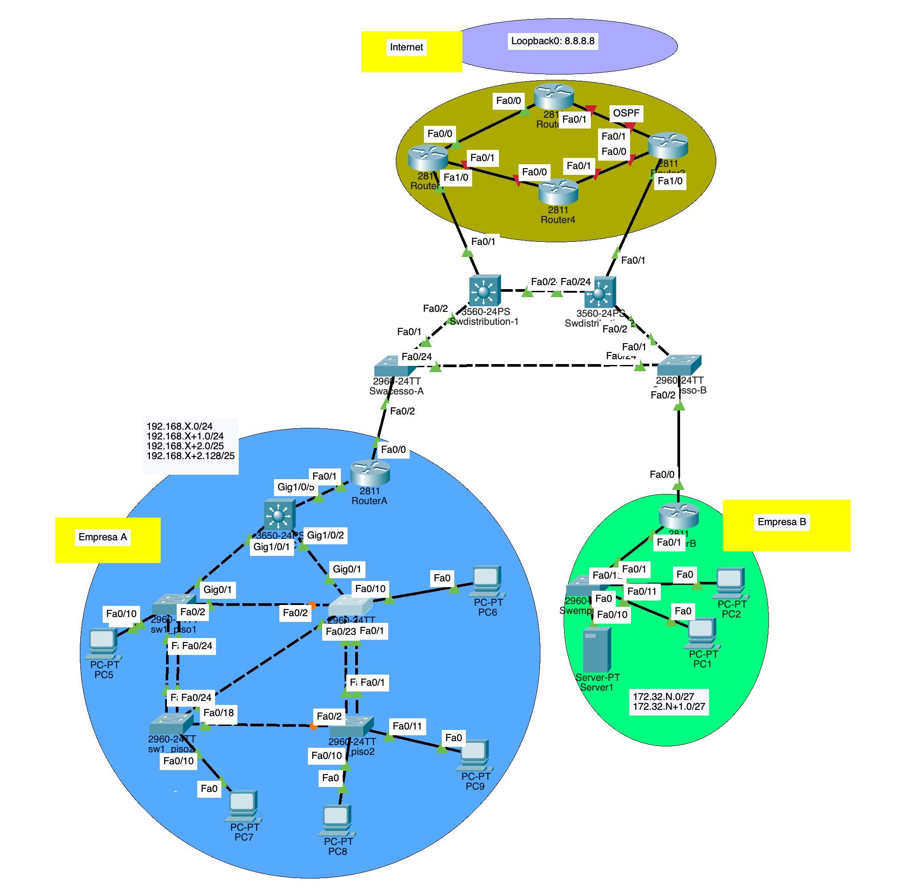

# LAB Project Nº 1 - VLAN/STP/OSPF MONO-AREA

> REDES DE INTERNET (RI)2025-2026

---

## Group 1 - Class 51D

### Professor Luís Mata 

> luis.mata@isel.pt

- 45824 Nuno Venâncio
- 49420 André Carrilho
- 51454 Hugo Leal

---

<div style="page-break-after: always"></div>

## Index

- Introduction
- 1 - Enterprise A — L2 Foundations (VLAN/STP/RSTP)
    - 1.1 Implementation
        - 1.1.1 VLANs
        - 1.1.2 STP
        - 1.1.3 Rapid PVST
    - 1.2 Tests and Validation
        - 1.2.1 Root bridge (RB), designated/blocked ports, and path costs
        - 1.2.2 SW_DC as the RB (lower priority) and reassessment of blocked links
        - 1.2.3 Modification of settings between `sw1_piso1` and `sw1_piso2` to exchange blocked by forward links
    - 1.3 Practical Questions
- 2 - Enterprise A — VLAN Segmentation & Addressing
    - 2.1 Implementation
        - 2.1.1 VLANs
        - 2.1.2 Access and Trunk Ports
        - 2.1.3 PCs IP Assignments
    - 2.2 Test and Validation
        - 2.2.1 Intra-VLAN and Inter-VLAN connectivity
        - 2.2.2 Connectivity between the PCs on each VLAN
    - 2.3 Practical Questions
- 3 - Enterprise A — Router-on-a-Stick (RoS) & L3 Rules (no ACLs)
    - 3.1 Implementation
        - 3.1.1 Creation and configuration of sub interfaces to implement the L3 (Rules without ACLs)
        - 3.1.2 Trunk link between Router A and SW_DC
        - 3.1.3 Sub interfaces with encapsulation dot1Q and IPs (parent interface no IP)
        - 3.1.4 Name routers/switches
        - 3.1.5 Router / Switches initial message
    - 3.2 Test and Validation
    - 3.3 Practical Questions 
- 4 - Enterprise B — Segmentation & ISP L2 Interconnection
    - 4.1 Implementation
        - 4.1.1 Company B VLANs and IP Assignments
        - 4.1.2 Implementation of the ISP topology for interconnection with customers
        - 4.1.3 Building of VLAN paths in the switch fabric
        - 4.1.4 Assignment of IP address to Router 1, Router 3, Router A, and Router B
    - 4.2 Test and Validation
        - 4.2.1 End to end L3 connectivity: R1 <-> RA and R2 <-> RB
    - 4.3 Practical Questions
- 5 - Static Routing → OSPF Core & “Internet” Loopback → Public Addressing Test
    - 5.1 Implementation
        - 5.1.1 Static routing (initial)
            - 5.1.1.1 Default static routes on company routers toward the ISP; identify next-hop and purpose.
            - 5.1.1.2 Static routing on R1–R4, add required static routes to reach company blocks.
            - 5.1.1.3 Verification of which pings succeed before OSPF and why.
        - 5.1.2 OSPF (ISP core)
            - 5.1.2.1 Configuration of OSPF on R1–R4 (single area) per design
            - 5.1.2.2 Internet Simulation - Configuration of R2 Loopback0 = 8.8.8.8/32
            - 5.1.2.3 Global connectivity with redundancy
        - 5.1.3 Public addressing test
            - 5.1.3.1 Change of configs so each company and the operator use public IPs
    - 5.2 Test and Validation
    - 5.3 Practical Questions
- Conclusion

---

<div style="page-break-after: always"></div>

## Introduction

In this project we explore Internet Networks topics like VLAN segmentation, L2 loop protection (STP/RSTP), inter-VLAN routing (router-on-a-stick), static routing, and single-area OSPF.

To accomplish this we will configure and simulate a network between two enterprises (A and B) and an ISP (Internet Service Provider).

The Enterprise A will be constituted of 1 router, 5 switches, 5 PCs and 3 VLANs, VLAN 11 (Accounting), VLAN 12 (Secretariat) and VLAN 13 (Computer_science).

The Enterprise B will be constituted of 1 router, 1 switch, 1 server, 1 pc and 2 VLANs, VLAN 2 (Servers) and VLAN 3 (Engineering).

The ISP will be constituted by 4 routers and 4 switches, that connects to "Internet" using a Loopback



___

<div style="page-break-after: always"></div>

## 1. Enterprise A - L2 Foundations (VLAN/STP/RSTP)

### 1.1 Implementation

#### 1.1.1 VLANs

To configure the static VLANs according to the table in the point 4.2.1 it was necessary to remove in each switch the previous VLANs:

```txt
Switch(config)# no vlan 20
Switch(config)# no vlan 30
Switch(config)# no vlan 40
Switch(config)# no vlan 45
``` 

For security reasons, we assigned the `Native VLAN` to __VLAN 99__ in all the switches:

```txt
Switch(config) vlan 99
Switch(config) interfaces range [desired interfaces]
Switch(config-if)# switchport trunk native vlan 99
Switch(config-if)# switchport trunk allowed vlan add 99
Switch(config-if)# switchport nonegociate
```

To create and name our VLANs we used:

```txt
Switch(config)# vlan 11
Switch(config-vlan)# name Accounting
Switch(config)# vlan 12
Switch(config-vlan)# name Secretariat
Switch(config)# vlan 13
Switch(config-vlan)# name Computer_science
```
Then, interface configuration by switch:

```txt
# Switch SW_DC ##########################################
# Gig1/0/1 -> sw1_piso1 - trunk
# Gig1/0/2 -> sw2_piso1 - trunk
# Gig1/0/5 -> Router A  - trunk

SW_DC(config)# interface range gig1/0/1-2,gig1/0/5
SW_DC(config-if-range)# switchport mode trunk
SW_DC(config-if-range)# switchport trunk native vlan 99
SW_DC(config-if-range)# switchport trunk allowed vlan 11-13
SW_DC(config-if-range)# switchport nonegociate

# Switch sw1_piso1 #######################################
# Fa0/2     -> sw2_piso1 - trunk
# Fa0/10    -> PC5       - access
# Fa0/23-24 -> sw1_piso2 - trunk
# Gig0/1    -> SW_DC     - trunk

sw1_piso1(config)# interface range fa0/2,fa0/23-24,Gig0/1
sw1_piso1(config-if-range)# switchport mode trunk
sw1_piso1(config-if-range)# switchport trunk native vlan 99
sw1_piso1(config-if-range)# switchport trunk allowed 11-13
sw1_piso1(config-if-range)# switchport nonegociate
sw1_piso1(config-if-range)#
sw1_piso1(config-if-range)# interface fa0/10
sw1_piso1(config-if)# switchport mode access
sw1_piso1(config-if)# switchport access vlan 12
sw1_piso1(config-if)# switchport nonegociate

# Switch sw2_piso1 #######################################
# Fa0/1     -> sw2_piso2 - trunk
# Fa0/2     -> sw1_piso1 - trunk
# Fa0/10    -> PC6       - access
# Fa0/23    -> sw2_piso2 - trunk
# Fa0/24    -> sw1_piso2 - trunk
# Gig0/1    -> SW_DC     - trunk

sw2_piso1(config)# interface range fa0/1-2,fa0/23-24,Gig0/1
sw2_piso1(config-if-range)# switchport mode trunk
sw2_piso1(config-if-range)# switchport trunk native vlan 99
sw2_piso1(config-if-range)# switchport trunk allowed 11-13
sw2_piso1(config-if-range)# switchport nonegociate
sw2_piso1(config-if-range)#
sw2_piso1(config-if-range)# interface fa0/10
sw2_piso1(config-if)# switchport mode access
sw2_piso1(config-if)# switchport access vlan 13
sw2_piso1(config-if)# switchport nonegociate

# Switch sw1_piso2 #######################################
# Fa0/2     -> sw2_piso1 - trunk
# Fa0/10    -> PC7       - access
# Fa0/18    -> sw2_piso2 - trunk
# Fa0/23-24 -> sw1_piso1 - trunk

sw1_piso2(config)# interface range fa0/2,fa0/18,fa0/23-24
sw1_piso2(config-if-range)# switchport mode trunk
sw1_piso2(config-if-range)# switchport trunk native vlan 99
sw1_piso2(config-if-range)# switchport trunk allowed 11-13
sw1_piso2(config-if-range)# switchport nonegociate
sw1_piso2(config-if-range)#
sw1_piso2(config-if-range)# interface fa0/10
sw1_piso2(config-if)# switchport mode access
sw1_piso2(config-if)# switchport access vlan 11
sw1_piso2(config-if)# switchport nonegociate

# Switch sw2_piso2 #######################################
# Fa0/1     -> sw2_piso1 - trunk
# Fa0/2     -> sw1_piso2 - trunk
# Fa0/10    -> PC8       - access
# Fa0/11    -> PC9       - access
# Fa0/24    -> sw2_piso1 - trunk

sw2_piso2(config)# interface range fa0/1-2,fa0/24
sw2_piso2(config-if-range)# switchport mode trunk
sw2_piso2(config-if-range)# switchport trunk native vlan 99
sw2_piso2(config-if-range)# switchport trunk allowed 11-13
sw2_piso2(config-if-range)# switchport nonegociate
sw2_piso2(config-if-range)#
sw2_piso2(config-if-range)# interface fa0/10
sw2_piso2(config-if)# switchport mode access
sw2_piso2(config-if)# switchport access vlan 12
sw2_piso2(config-if)# switchport nonegociate
sw2_piso2(config-if)#
sw2_piso2(config-if)# interface fa0/11
sw2_piso2(config-if)# switchport mode access
sw2_piso2(config-if)# switchport access vlan 11
sw2_piso2(config-if)# switchport nonegociate
```

The only PC that uses __VLAN 13 - Computer_science__ is the `PC6`, witch is connected to `sw2_piso1` and this switch to `SW_DC`, but because of connection redundancy reasons, it was decided to add this VLAN to all the switches. 

| VLAN | NAME             | IP GATEWAY    | NETWORK          | PCs |
| -- | ------------------ | ------------- | -----------------| -------- |
| 11 | Accounting         | 172.20.11.254 | 172.20.11.0/24   | PC7, PC9 |
| 12 | Secretariat        | 172.20.12.254 | 172.20.12.0/24   | PC5, PC8 |
| 13 | Computer science   | 172.20.13.126 | 172.20.13.0/25   | PC6 |

table 1 - Enterprise A VLANs

#### 1.1.2 STP (RB/roles/costs)

##### Switches / Bridges Priorities (All VLANs)

| Switch    | Priority | MAC Address    | Root MAC Address |
| --------- | -------- | -------------- | ---------------- |
| SW_DC     | 32779    | 0002.4AE4.E093 | same             |
| sw1_piso1 | 32779    | 0009.7C65.BA4B | 0002.4AE4.E093   |
| sw2_piso2 | 32779    | 00E0.8FE1.53D7 | 0002.4AE4.E093   |
| sw1_piso2 | 32779    | 00E0.A3CE.4A46 | 0002.4AE4.E093   |
| sw2_piso1 | 32779    | 00E0.F950.631A | 0002.4AE4.E093   |

table 2 - Switches / Bridges Priorities (All VLANs)

##### VLAN 11 (Accounting) - Root Bridge, Port Roles and Root Port Costs

| Switch    | Port     | PC | RPC | RP | DP | BLK | Notes |
| --------- | -------- | -- | --- | -- | -- | --- | ------|
| SW_DC     | Gig1/0/1 | 4  | -   |    |    |     | |
| SW_DC     | Gig1/0/2 | 4  | -   |    |    |     | |
| SW_DC     | Gig1/0/5 | 19 | -   |    |    |     | to Fa port at RouterA |
| sw1_piso1 | Gig0/1   | 4  | 4   | X  |    |     | |
| sw1_piso1 | Fa0/2    | 19 | 19  |    | X  |     | |
| sw1_piso1 | Fa0/23   | 19 | 19  |    | X  |     | |
| sw1_piso1 | Fa0/24   | 19 | 19  |    | X  |     | |
| sw2_piso2 | Fa0/1    | 19 | 23  | X  |    |     | |
| sw2_piso2 | Fa0/2    | 19 | 42  |    | X  |     |
| sw2_piso2 | Fa0/11   | 19 | -   |    | X  |     | to PC11 |
| sw2_piso2 | Fa0/24   | 19 | 23  |    |    | X   | |
| sw1_piso2 | Fa0/2    | 19 | 42  |    |    | X   | |
| sw1_piso2 | Fa0/10   | 19 | -   |    | X  |     | to PC7 |
| sw1_piso2 | Fa0/18   | 19 | 23  |    |    | X   | |
| sw1_piso2 | Fa0/23   | 19 | 23  | X  |    |     | |
| sw1_piso2 | Fa0/24   | 19 | 23  |    |    | X   | |
| sw2_piso1 | Gig0/1   | 4  | 4   | X  |    |     | |
| sw2_piso1 | Fa0/1    | 19 | 61  |    | X  |     | |
| sw2_piso1 | Fa0/2    | 19 | 23  |    |    | X   | |
| sw2_piso1 | Fa0/23   | 19 | 61  |    | X  |     | |
| sw2_piso1 | Fa0/24   | 19 | 42  |    | X  |     | |

table 3 - Root Bridge, port Roles and Root Port Costs (VLAN 11)

##### VLAN 12 (Secretariat) - Root Bridge, Port Roles and Root Port Costs

| Switch    | Port     | PC | RPC | RP | DP | BLK | Notes |
| --------- | -------- | -- | --- | -- | -- | --- | ------|
| SW_DC     | Gig1/0/1 | 4  | -   |    |    |     | |
| SW_DC     | Gig1/0/2 | 4  | -   |    |    |     | |
| SW_DC     | Gig1/0/5 | 19 | -   |    |    |     | to Fa port at RouterA |
| sw1_piso1 | Gig0/1   | 4  | 4   | X  |    |     | |
| sw1_piso1 | Fa0/2    | 19 | 23  |    | X  |     | |
| sw1_piso1 | Fa0/10   | 19 | -   |    | X  |     | to PC5 |
| sw1_piso1 | Fa0/23   | 19 | 42  |    | X  |     | |
| sw1_piso1 | Fa0/24   | 19 | 42  |    | X  |     | |
| sw2_piso2 | Fa0/1    | 19 | 23  | X  |    |     | |
| sw2_piso2 | Fa0/2    | 19 | 42  |    | X  |     | |
| sw2_piso2 | Fa0/10   | 19 | -   |    | X  |     | to PC8 |
| sw2_piso2 | Fa0/24   | 19 | 23  |    |    | X   | |
| sw1_piso2 | Fa0/2    | 19 | 42  |    |    | X   | |
| sw1_piso2 | Fa0/18   | 19 | 23  |    |    | X   | |
| sw1_piso2 | Fa0/23   | 19 | 23  | X  |    |     | |
| sw1_piso2 | Fa0/24   | 19 | 23  |    |    | X   | |
| sw2_piso1 | Gig0/1   | 4  | 4   | X  |    |     | |
| sw2_piso1 | Fa0/1    | 19 | 61  |    | X  |     | |
| sw2_piso1 | Fa0/2    | 19 | 23  |    |    | X   | |
| sw2_piso1 | Fa0/23   | 19 | 61  |    | X  |     | |
| sw2_piso1 | Fa0/24   | 19 | 42  |    | X  |     | |

table 4 - Root Bridge, port Roles and Root Port Costs (VLAN 12)

##### VLAN 13 (Computer_science) - Root Bridge, Port Roles and Root Port Costs

| Switch    | Port     | PC | RPC | RP | DP | BLK | Notes |
| --------- | -------- | -- | --- | -- | -- | --- | ------|
| SW_DC     | Gig1/0/1 | 4  | -   |    |    |     | |
| SW_DC     | Gig1/0/2 | 4  | -   |    |    |     | |
| SW_DC     | Gig1/0/5 | 19 | -   |    |    |     | to Fa port at RouterA |
| sw1_piso1 | Gig0/1   | 4  | 4   | X  |    |     | |
| sw1_piso1 | Fa0/2    | 19 | 23  |    | X  |     | |
| sw1_piso1 | Fa0/23   | 19 | 42  |    | X  |     | |
| sw2_piso2 | Fa0/1    | 19 | 23  | X  |    |     | |
| sw2_piso2 | Fa0/2    | 19 | 42  |    | X  |     | |
| sw2_piso2 | Fa0/24   | 19 | 23  |    |    |  X  | |
| sw1_piso2 | Fa0/2    | 19 | 42  |    |    | X   | |
| sw1_piso2 | Fa0/18   | 19 | 23  |    |    | X   | |
| sw1_piso2 | Fa0/23   | 19 | 23  | X  |    |     | |
| sw1_piso2 | Fa0/24   | 19 | 23  |    | X  |     | |
| sw2_piso1 | Gig0/1   | 4  | 4   | X  |    |     | |
| sw2_piso1 | Fa0/1    | 19 | 61  |    | X  |     | |
| sw2_piso1 | Fa0/2    | 19 | 23  |    |    | X   | |
| sw2_piso1 | Fa0/10   | 19 | -   |    | X  |     | to PC6 |
| sw2_piso1 | Fa0/23   | 19 | 61  |    | X  |     | |
| sw2_piso1 | Fa0/24   | 19 | 42  |    | X  |     | |

table 5 - Root Bridge, port Roles and Root Port Costs (VLAN 13)

##### VLAN 99 (Native) - Root Bridge, Port Roles and Root Port Costs

| Switch    | Port     | PC | RPC | RP | DP | BLK | Notes |
| --------- | -------- | -- | --- | -- | -- | --- | ------|
| SW_DC     | Gig1/0/1 | 4  | -   |    |    |     | |
| SW_DC     | Gig1/0/2 | 4  | -   |    |    |     | |
| SW_DC     | Gig1/0/5 | 19 | -   |    |    |     | to Fa port at RouterA |
| sw1_piso1 | Gig0/1   | 4  | 4   | X  |    |     | |
| sw1_piso1 | Fa0/2    | 19 | 23  |    | X  |     | |
| sw1_piso1 | Fa0/23   | 19 | 42  |    | X  |     | |
| sw1_piso1 | Fa0/24   | 19 | 42  |    | X  |     | |
| sw2_piso2 | Fa0/1    | 19 | 23  | X  |    |     | |
| sw2_piso2 | Fa0/2    | 19 | 42  |    | X  |     | |
| sw2_piso2 | Fa0/24   | 19 | 23  |    |    |  X  | |
| sw1_piso2 | Fa0/2    | 19 | 42  |    |    | X   | |
| sw1_piso2 | Fa0/18   | 19 | 23  |    |    | X   | |
| sw1_piso2 | Fa0/23   | 19 | 23  | X  |    |     | |
| sw1_piso2 | Fa0/24   | 19 | 23  |    |    |  X  | |
| sw2_piso1 | Gig0/1   | 4  |  4  | X  |    |     | |
| sw2_piso1 | Fa0/1    | 19 | 61  |    | X  |     | |
| sw2_piso1 | Fa0/2    | 19 | 23  |    |    | X   | |
| sw2_piso1 | Fa0/23   | 19 | 61  |    | X  |     | |
| sw2_piso1 | Fa0/24   | 19 | 42  |    | X  |     | |

table 6 - Root Bridge, port Roles and Root Port Costs (VLAN 99)

#### 1.1.2 Rapid PVST

To convert to Rapid PVST we need to do in all switches:

```txt
SWITCH(config)# spanning-tree mode rapid-pvst
```

In the ports connected to PCs, we convert them to `port fast` and enable the `bpdu guard`

```txt
# sw1_piso1 --------------------------------------------
sw1_piso1(config)# interface fa0/10
sw1_piso1(config-if)# spanning-tree portfast
sw1_piso1(config-if)# spanning-tree bpduguard enable

# sw2_piso1 --------------------------------------------
sw2_piso1(config)# interface fa0/10
sw2_piso1(config-if)# spanning-tree portfast
sw2_piso1(config-if)# spanning-tree bpduguard enable

# sw1_piso2 --------------------------------------------
sw1_piso2(config)# interface fa0/10
sw1_piso2(config-if)# spanning-tree portfast
sw1_piso2(config-if)# spanning-tree bpduguard enable

# sw1_piso1 --------------------------------------------
sw1_piso1(config)# interface range fa0/10-11
sw1_piso1(config-if-range)# spanning-tree portfast
sw1_piso1(config-if-range)# spanning-tree bpduguard enable
``` 

__TODO__: verify per-VLAN instances and changes in roles/timers.

##### SW_DC

```txt
SW_DC#sh spanning-tree detail 

VLAN0011 is executing the rstp compatible Spanning Tree Protocol
  Bridge Identifier has priority of 32768, sysid 11, 0002.4AE4.E093
  Configured hello time 2, max age 20, forward delay 15
  We are the root of the spanning tree
  Topology change flag not set, detected flag not set
  Number of topology changes 0 last change occurred 00:00:00 ago
	        from FastEthernet0/1
  Times:  hold 1, topology change 35, notification 2
  		hello 2, max age 20, forward delay 15
  Timers: hello 0, topology change 0, notification 0, aging 300

Port 1 (GigabitEthernet1/0/1) of VLAN0011 is designated forwarding
  Port path cost 4, Port priority 128, Port Identifier 128.1
  Designated root has priority 32779, address 0002.4AE4.E093
  Designated bridge has priority 32779, address 0002.4AE4.E093
  Designated port id is 128.1, designated path cost 4
  Timers: message age 16, forward delay 0, hold 0
  Number of transitions to forwarding state: 1
  Link type is point-to-point by default

Port 2 (GigabitEthernet1/0/2) of VLAN0011 is designated forwarding
  Port path cost 4, Port priority 128, Port Identifier 128.2
  Designated root has priority 32779, address 0002.4AE4.E093
  Designated bridge has priority 32779, address 0002.4AE4.E093
  Designated port id is 128.2, designated path cost 4
  Timers: message age 16, forward delay 0, hold 0
  Number of transitions to forwarding state: 1
  Link type is point-to-point by default

Port 5 (GigabitEthernet1/0/5) of VLAN0011 is designated forwarding
  Port path cost 19, Port priority 128, Port Identifier 128.5
  Designated root has priority 32779, address 0002.4AE4.E093
  Designated bridge has priority 32779, address 0002.4AE4.E093
  Designated port id is 128.5, designated path cost 19
  Timers: message age 16, forward delay 0, hold 0
  Number of transitions to forwarding state: 1
  Link type is point-to-point by default

VLAN0012 is executing the rstp compatible Spanning Tree Protocol
  Bridge Identifier has priority of 32768, sysid 12, 0002.4AE4.E093
  Configured hello time 2, max age 20, forward delay 15
  We are the root of the spanning tree
  Topology change flag not set, detected flag not set
  Number of topology changes 0 last change occurred 00:00:00 ago
	        from FastEthernet0/1
  Times:  hold 1, topology change 35, notification 2
  		hello 2, max age 20, forward delay 15
  Timers: hello 0, topology change 0, notification 0, aging 300

Port 1 (GigabitEthernet1/0/1) of VLAN0012 is designated forwarding
  Port path cost 4, Port priority 128, Port Identifier 128.1
  Designated root has priority 32780, address 0002.4AE4.E093
  Designated bridge has priority 32780, address 0002.4AE4.E093
  Designated port id is 128.1, designated path cost 4
  Timers: message age 16, forward delay 0, hold 0
  Number of transitions to forwarding state: 1
  Link type is point-to-point by default

Port 2 (GigabitEthernet1/0/2) of VLAN0012 is designated forwarding
  Port path cost 4, Port priority 128, Port Identifier 128.2
  Designated root has priority 32780, address 0002.4AE4.E093
  Designated bridge has priority 32780, address 0002.4AE4.E093
  Designated port id is 128.2, designated path cost 4
  Timers: message age 16, forward delay 0, hold 0
  Number of transitions to forwarding state: 1
  Link type is point-to-point by default

Port 5 (GigabitEthernet1/0/5) of VLAN0012 is designated forwarding
  Port path cost 19, Port priority 128, Port Identifier 128.5
  Designated root has priority 32780, address 0002.4AE4.E093
  Designated bridge has priority 32780, address 0002.4AE4.E093
  Designated port id is 128.5, designated path cost 19
  Timers: message age 16, forward delay 0, hold 0
  Number of transitions to forwarding state: 1
  Link type is point-to-point by default

VLAN0013 is executing the rstp compatible Spanning Tree Protocol
  Bridge Identifier has priority of 32768, sysid 13, 0002.4AE4.E093
  Configured hello time 2, max age 20, forward delay 15
  We are the root of the spanning tree
  Topology change flag not set, detected flag not set
  Number of topology changes 0 last change occurred 00:00:00 ago
	        from FastEthernet0/1
  Times:  hold 1, topology change 35, notification 2
  		hello 2, max age 20, forward delay 15
  Timers: hello 0, topology change 0, notification 0, aging 300

Port 1 (GigabitEthernet1/0/1) of VLAN0013 is designated forwarding
  Port path cost 4, Port priority 128, Port Identifier 128.1
  Designated root has priority 32781, address 0002.4AE4.E093
  Designated bridge has priority 32781, address 0002.4AE4.E093
  Designated port id is 128.1, designated path cost 4
  Timers: message age 16, forward delay 0, hold 0
  Number of transitions to forwarding state: 1
  Link type is point-to-point by default

Port 2 (GigabitEthernet1/0/2) of VLAN0013 is designated forwarding
  Port path cost 4, Port priority 128, Port Identifier 128.2
  Designated root has priority 32781, address 0002.4AE4.E093
  Designated bridge has priority 32781, address 0002.4AE4.E093
  Designated port id is 128.2, designated path cost 4
  Timers: message age 16, forward delay 0, hold 0
  Number of transitions to forwarding state: 1
  Link type is point-to-point by default

Port 5 (GigabitEthernet1/0/5) of VLAN0013 is designated forwarding
  Port path cost 19, Port priority 128, Port Identifier 128.5
  Designated root has priority 32781, address 0002.4AE4.E093
  Designated bridge has priority 32781, address 0002.4AE4.E093
  Designated port id is 128.5, designated path cost 19
  Timers: message age 16, forward delay 0, hold 0
  Number of transitions to forwarding state: 1
  Link type is point-to-point by default

VLAN0099 is executing the rstp compatible Spanning Tree Protocol
  Bridge Identifier has priority of 32768, sysid 99, 0002.4AE4.E093
  Configured hello time 2, max age 20, forward delay 15
  We are the root of the spanning tree
  Topology change flag not set, detected flag not set
  Number of topology changes 0 last change occurred 00:00:00 ago
	        from FastEthernet0/1
  Times:  hold 1, topology change 35, notification 2
  		hello 2, max age 20, forward delay 15
  Timers: hello 0, topology change 0, notification 0, aging 300

Port 1 (GigabitEthernet1/0/1) of VLAN0099 is designated forwarding
  Port path cost 4, Port priority 128, Port Identifier 128.1
  Designated root has priority 32867, address 0002.4AE4.E093
  Designated bridge has priority 32867, address 0002.4AE4.E093
  Designated port id is 128.1, designated path cost 4
  Timers: message age 16, forward delay 0, hold 0
  Number of transitions to forwarding state: 1
  Link type is point-to-point by default

Port 2 (GigabitEthernet1/0/2) of VLAN0099 is designated forwarding
  Port path cost 4, Port priority 128, Port Identifier 128.2
  Designated root has priority 32867, address 0002.4AE4.E093
  Designated bridge has priority 32867, address 0002.4AE4.E093
  Designated port id is 128.2, designated path cost 4
  Timers: message age 16, forward delay 0, hold 0
  Number of transitions to forwarding state: 1
  Link type is point-to-point by default

Port 5 (GigabitEthernet1/0/5) of VLAN0099 is designated forwarding
  Port path cost 19, Port priority 128, Port Identifier 128.5
  Designated root has priority 32867, address 0002.4AE4.E093
  Designated bridge has priority 32867, address 0002.4AE4.E093
  Designated port id is 128.5, designated path cost 19
  Timers: message age 16, forward delay 0, hold 0
  Number of transitions to forwarding state: 1
  Link type is point-to-point by default
```

##### sw1_piso1

```txt
sw1_piso1#sh spanning-tree detail 

VLAN0011 is executing the rstp compatible Spanning Tree Protocol
  Bridge Identifier has priority of 32768, sysid 11, 0009.7C65.BA4B
  Configured hello time 2, max age 20, forward delay 15
  Current root has priority 32779
  Root port is 25 (GigabitEthernet0/1), cost of root path is 4
  Topology change flag not set, detected flag not set
  Number of topology changes 0 last change occurred 00:00:00 ago
	        from FastEthernet0/1
  Times:  hold 1, topology change 35, notification 2
  		hello 2, max age 20, forward delay 15
  Timers: hello 0, topology change 0, notification 0, aging 300

Port 2 (FastEthernet0/2) of VLAN0011 is designated forwarding
  Port path cost 19, Port priority 128, Port Identifier 128.2
  Designated root has priority 32779, address 0002.4AE4.E093
  Designated bridge has priority 32779, address 0009.7C65.BA4B
  Designated port id is 128.2, designated path cost 19
  Timers: message age 16, forward delay 0, hold 0
  Number of transitions to forwarding state: 1
  Link type is point-to-point by default

Port 23 (FastEthernet0/23) of VLAN0011 is designated forwarding
  Port path cost 19, Port priority 128, Port Identifier 128.23
  Designated root has priority 32779, address 0002.4AE4.E093
  Designated bridge has priority 32779, address 0009.7C65.BA4B
  Designated port id is 128.23, designated path cost 19
  Timers: message age 16, forward delay 0, hold 0
  Number of transitions to forwarding state: 1
  Link type is point-to-point by default

Port 24 (FastEthernet0/24) of VLAN0011 is designated forwarding
  Port path cost 19, Port priority 128, Port Identifier 128.24
  Designated root has priority 32779, address 0002.4AE4.E093
  Designated bridge has priority 32779, address 0009.7C65.BA4B
  Designated port id is 128.24, designated path cost 19
  Timers: message age 16, forward delay 0, hold 0
  Number of transitions to forwarding state: 1
  Link type is point-to-point by default

Port 25 (GigabitEthernet0/1) of VLAN0011 is root forwarding
  Port path cost 4, Port priority 128, Port Identifier 128.25
  Designated root has priority 32779, address 0002.4AE4.E093
  Designated bridge has priority 32779, address 0002.4AE4.E093
  Timers: message age 16, forward delay 0, hold 0
  Number of transitions to forwarding state: 1
  Link type is point-to-point by default

VLAN0012 is executing the rstp compatible Spanning Tree Protocol
  Bridge Identifier has priority of 32768, sysid 12, 0009.7C65.BA4B
  Configured hello time 2, max age 20, forward delay 15
  Current root has priority 32780
  Root port is 25 (GigabitEthernet0/1), cost of root path is 4
  Topology change flag not set, detected flag not set
  Number of topology changes 0 last change occurred 00:00:00 ago
	        from FastEthernet0/1
  Times:  hold 1, topology change 35, notification 2
  		hello 2, max age 20, forward delay 15
  Timers: hello 0, topology change 0, notification 0, aging 300

Port 2 (FastEthernet0/2) of VLAN0012 is designated forwarding
  Port path cost 19, Port priority 128, Port Identifier 128.2
  Designated root has priority 32780, address 0002.4AE4.E093
  Designated bridge has priority 32780, address 0009.7C65.BA4B
  Designated port id is 128.2, designated path cost 19
  Timers: message age 16, forward delay 0, hold 0
  Number of transitions to forwarding state: 1
  Link type is point-to-point by default

Port 10 (FastEthernet0/10) of VLAN0012 is designated forwarding
  Port path cost 19, Port priority 128, Port Identifier 128.10
  Designated root has priority 32780, address 0002.4AE4.E093
  Designated bridge has priority 32780, address 0009.7C65.BA4B
  Designated port id is 128.10, designated path cost 19
  Timers: message age 16, forward delay 0, hold 0
  Number of transitions to forwarding state: 1
  Link type is point-to-point by default

Port 23 (FastEthernet0/23) of VLAN0012 is designated forwarding
  Port path cost 19, Port priority 128, Port Identifier 128.23
  Designated root has priority 32780, address 0002.4AE4.E093
  Designated bridge has priority 32780, address 0009.7C65.BA4B
  Designated port id is 128.23, designated path cost 19
  Timers: message age 16, forward delay 0, hold 0
  Number of transitions to forwarding state: 1
  Link type is point-to-point by default

Port 24 (FastEthernet0/24) of VLAN0012 is designated forwarding
  Port path cost 19, Port priority 128, Port Identifier 128.24
  Designated root has priority 32780, address 0002.4AE4.E093
  Designated bridge has priority 32780, address 0009.7C65.BA4B
  Designated port id is 128.24, designated path cost 19
  Timers: message age 16, forward delay 0, hold 0
  Number of transitions to forwarding state: 1
  Link type is point-to-point by default

Port 25 (GigabitEthernet0/1) of VLAN0012 is root forwarding
  Port path cost 4, Port priority 128, Port Identifier 128.25
  Designated root has priority 32780, address 0002.4AE4.E093
  Designated bridge has priority 32780, address 0002.4AE4.E093
  Timers: message age 16, forward delay 0, hold 0
  Number of transitions to forwarding state: 1
  Link type is point-to-point by default

VLAN0013 is executing the rstp compatible Spanning Tree Protocol
  Bridge Identifier has priority of 32768, sysid 13, 0009.7C65.BA4B
  Configured hello time 2, max age 20, forward delay 15
  Current root has priority 32781
  Root port is 25 (GigabitEthernet0/1), cost of root path is 4
  Topology change flag not set, detected flag not set
  Number of topology changes 0 last change occurred 00:00:00 ago
	        from FastEthernet0/1
  Times:  hold 1, topology change 35, notification 2
  		hello 2, max age 20, forward delay 15
  Timers: hello 0, topology change 0, notification 0, aging 300

Port 2 (FastEthernet0/2) of VLAN0013 is designated forwarding
  Port path cost 19, Port priority 128, Port Identifier 128.2
  Designated root has priority 32781, address 0002.4AE4.E093
  Designated bridge has priority 32781, address 0009.7C65.BA4B
  Designated port id is 128.2, designated path cost 19
  Timers: message age 16, forward delay 0, hold 0
  Number of transitions to forwarding state: 1
  Link type is point-to-point by default

Port 23 (FastEthernet0/23) of VLAN0013 is designated forwarding
  Port path cost 19, Port priority 128, Port Identifier 128.23
  Designated root has priority 32781, address 0002.4AE4.E093
  Designated bridge has priority 32781, address 0009.7C65.BA4B
  Designated port id is 128.23, designated path cost 19
  Timers: message age 16, forward delay 0, hold 0
  Number of transitions to forwarding state: 1
  Link type is point-to-point by default

Port 25 (GigabitEthernet0/1) of VLAN0013 is root forwarding
  Port path cost 4, Port priority 128, Port Identifier 128.25
  Designated root has priority 32781, address 0002.4AE4.E093
  Designated bridge has priority 32781, address 0002.4AE4.E093
  Timers: message age 16, forward delay 0, hold 0
  Number of transitions to forwarding state: 1
  Link type is point-to-point by default

VLAN0099 is executing the rstp compatible Spanning Tree Protocol
  Bridge Identifier has priority of 32768, sysid 99, 0009.7C65.BA4B
  Configured hello time 2, max age 20, forward delay 15
  Current root has priority 32867
  Root port is 25 (GigabitEthernet0/1), cost of root path is 4
  Topology change flag not set, detected flag not set
  Number of topology changes 0 last change occurred 00:00:00 ago
	        from FastEthernet0/1
  Times:  hold 1, topology change 35, notification 2
  		hello 2, max age 20, forward delay 15
  Timers: hello 0, topology change 0, notification 0, aging 300

Port 2 (FastEthernet0/2) of VLAN0099 is designated forwarding
  Port path cost 19, Port priority 128, Port Identifier 128.2
  Designated root has priority 32867, address 0002.4AE4.E093
  Designated bridge has priority 32867, address 0009.7C65.BA4B
  Designated port id is 128.2, designated path cost 19
  Timers: message age 16, forward delay 0, hold 0
  Number of transitions to forwarding state: 1
  Link type is point-to-point by default

Port 23 (FastEthernet0/23) of VLAN0099 is designated forwarding
  Port path cost 19, Port priority 128, Port Identifier 128.23
  Designated root has priority 32867, address 0002.4AE4.E093
  Designated bridge has priority 32867, address 0009.7C65.BA4B
  Designated port id is 128.23, designated path cost 19
  Timers: message age 16, forward delay 0, hold 0
  Number of transitions to forwarding state: 1
  Link type is point-to-point by default

Port 24 (FastEthernet0/24) of VLAN0099 is designated forwarding
  Port path cost 19, Port priority 128, Port Identifier 128.24
  Designated root has priority 32867, address 0002.4AE4.E093
  Designated bridge has priority 32867, address 0009.7C65.BA4B
  Designated port id is 128.24, designated path cost 19
  Timers: message age 16, forward delay 0, hold 0
  Number of transitions to forwarding state: 1
  Link type is point-to-point by default

Port 25 (GigabitEthernet0/1) of VLAN0099 is root forwarding
  Port path cost 4, Port priority 128, Port Identifier 128.25
  Designated root has priority 32867, address 0002.4AE4.E093
  Designated bridge has priority 32867, address 0002.4AE4.E093
  Timers: message age 16, forward delay 0, hold 0
  Number of transitions to forwarding state: 1
  Link type is point-to-point by default
```

##### sw2_piso2

```txt
sw2_piso1#sh spanning-tree detail 

VLAN0011 is executing the rstp compatible Spanning Tree Protocol
  Bridge Identifier has priority of 32768, sysid 11, 00E0.F950.631A
  Configured hello time 2, max age 20, forward delay 15
  Current root has priority 32779
  Root port is 25 (GigabitEthernet0/1), cost of root path is 4
  Topology change flag not set, detected flag not set
  Number of topology changes 0 last change occurred 00:00:00 ago
	        from FastEthernet0/1
  Times:  hold 1, topology change 35, notification 2
  		hello 2, max age 20, forward delay 15
  Timers: hello 0, topology change 0, notification 0, aging 300

Port 1 (FastEthernet0/1) of VLAN0011 is designated forwarding
  Port path cost 19, Port priority 128, Port Identifier 128.1
  Designated root has priority 32779, address 0002.4AE4.E093
  Designated bridge has priority 32779, address 00E0.F950.631A
  Designated port id is 128.1, designated path cost 19
  Timers: message age 16, forward delay 0, hold 0
  Number of transitions to forwarding state: 1
  Link type is point-to-point by default

Port 2 (FastEthernet0/2) of VLAN0011 is alternate blocking
  Port path cost 19, Port priority 128, Port Identifier 128.2
  Designated root has priority 32779, address 0002.4AE4.E093
  Designated bridge has priority 32779, address 0009.7C65.BA4B
  Timers: message age 16, forward delay 0, hold 0
  Number of transitions to forwarding state: 1
  Link type is point-to-point by default

Port 23 (FastEthernet0/23) of VLAN0011 is alternate blocking
  Port path cost 19, Port priority 128, Port Identifier 128.23
  Designated root has priority 32779, address 0002.4AE4.E093
  Designated bridge has priority 32779, address 00E0.A3CE.4A46
  Timers: message age 16, forward delay 0, hold 0
  Number of transitions to forwarding state: 1
  Link type is point-to-point by default

Port 24 (FastEthernet0/24) of VLAN0011 is designated forwarding
  Port path cost 19, Port priority 128, Port Identifier 128.24
  Designated root has priority 32779, address 0002.4AE4.E093
  Designated bridge has priority 32779, address 00E0.F950.631A
  Designated port id is 128.24, designated path cost 19
  Timers: message age 16, forward delay 0, hold 0
  Number of transitions to forwarding state: 1
  Link type is point-to-point by default

Port 25 (GigabitEthernet0/1) of VLAN0011 is root forwarding
  Port path cost 4, Port priority 128, Port Identifier 128.25
  Designated root has priority 32779, address 0002.4AE4.E093
  Designated bridge has priority 32779, address 0002.4AE4.E093
  Timers: message age 16, forward delay 0, hold 0
  Number of transitions to forwarding state: 1
  Link type is point-to-point by default

VLAN0012 is executing the rstp compatible Spanning Tree Protocol
  Bridge Identifier has priority of 32768, sysid 12, 00E0.F950.631A
  Configured hello time 2, max age 20, forward delay 15
  Current root has priority 32780
  Root port is 25 (GigabitEthernet0/1), cost of root path is 4
  Topology change flag not set, detected flag not set
  Number of topology changes 0 last change occurred 00:00:00 ago
	        from FastEthernet0/1
  Times:  hold 1, topology change 35, notification 2
  		hello 2, max age 20, forward delay 15
  Timers: hello 0, topology change 0, notification 0, aging 300

Port 1 (FastEthernet0/1) of VLAN0012 is designated forwarding
  Port path cost 19, Port priority 128, Port Identifier 128.1
  Designated root has priority 32780, address 0002.4AE4.E093
  Designated bridge has priority 32780, address 00E0.F950.631A
  Designated port id is 128.1, designated path cost 19
  Timers: message age 16, forward delay 0, hold 0
  Number of transitions to forwarding state: 1
  Link type is point-to-point by default

Port 2 (FastEthernet0/2) of VLAN0012 is alternate blocking
  Port path cost 19, Port priority 128, Port Identifier 128.2
  Designated root has priority 32780, address 0002.4AE4.E093
  Designated bridge has priority 32780, address 0009.7C65.BA4B
  Timers: message age 16, forward delay 0, hold 0
  Number of transitions to forwarding state: 1
  Link type is point-to-point by default

Port 23 (FastEthernet0/23) of VLAN0012 is alternate blocking
  Port path cost 19, Port priority 128, Port Identifier 128.23
  Designated root has priority 32780, address 0002.4AE4.E093
  Designated bridge has priority 32780, address 00E0.A3CE.4A46
  Timers: message age 16, forward delay 0, hold 0
  Number of transitions to forwarding state: 1
  Link type is point-to-point by default

Port 24 (FastEthernet0/24) of VLAN0012 is designated forwarding
  Port path cost 19, Port priority 128, Port Identifier 128.24
  Designated root has priority 32780, address 0002.4AE4.E093
  Designated bridge has priority 32780, address 00E0.F950.631A
  Designated port id is 128.24, designated path cost 19
  Timers: message age 16, forward delay 0, hold 0
  Number of transitions to forwarding state: 1
  Link type is point-to-point by default

Port 25 (GigabitEthernet0/1) of VLAN0012 is root forwarding
  Port path cost 4, Port priority 128, Port Identifier 128.25
  Designated root has priority 32780, address 0002.4AE4.E093
  Designated bridge has priority 32780, address 0002.4AE4.E093
  Timers: message age 16, forward delay 0, hold 0
  Number of transitions to forwarding state: 1
  Link type is point-to-point by default

VLAN0013 is executing the rstp compatible Spanning Tree Protocol
  Bridge Identifier has priority of 32768, sysid 13, 00E0.F950.631A
  Configured hello time 2, max age 20, forward delay 15
  Current root has priority 32781
  Root port is 25 (GigabitEthernet0/1), cost of root path is 4
  Topology change flag not set, detected flag not set
  Number of topology changes 0 last change occurred 00:00:00 ago
	        from FastEthernet0/1
  Times:  hold 1, topology change 35, notification 2
  		hello 2, max age 20, forward delay 15
  Timers: hello 0, topology change 0, notification 0, aging 300

Port 1 (FastEthernet0/1) of VLAN0013 is designated forwarding
  Port path cost 19, Port priority 128, Port Identifier 128.1
  Designated root has priority 32781, address 0002.4AE4.E093
  Designated bridge has priority 32781, address 00E0.F950.631A
  Designated port id is 128.1, designated path cost 19
  Timers: message age 16, forward delay 0, hold 0
  Number of transitions to forwarding state: 1
  Link type is point-to-point by default

Port 2 (FastEthernet0/2) of VLAN0013 is alternate blocking
  Port path cost 19, Port priority 128, Port Identifier 128.2
  Designated root has priority 32781, address 0002.4AE4.E093
  Designated bridge has priority 32781, address 0009.7C65.BA4B
  Timers: message age 16, forward delay 0, hold 0
  Number of transitions to forwarding state: 1
  Link type is point-to-point by default

Port 10 (FastEthernet0/10) of VLAN0013 is designated forwarding
  Port path cost 19, Port priority 128, Port Identifier 128.10
  Designated root has priority 32781, address 0002.4AE4.E093
  Designated bridge has priority 32781, address 00E0.F950.631A
  Designated port id is 128.10, designated path cost 19
  Timers: message age 16, forward delay 0, hold 0
  Number of transitions to forwarding state: 1
  Link type is point-to-point by default

Port 23 (FastEthernet0/23) of VLAN0013 is designated forwarding
  Port path cost 19, Port priority 128, Port Identifier 128.23
  Designated root has priority 32781, address 0002.4AE4.E093
  Designated bridge has priority 32781, address 00E0.F950.631A
  Designated port id is 128.23, designated path cost 19
  Timers: message age 16, forward delay 0, hold 0
  Number of transitions to forwarding state: 1
  Link type is point-to-point by default

Port 24 (FastEthernet0/24) of VLAN0013 is designated forwarding
  Port path cost 19, Port priority 128, Port Identifier 128.24
  Designated root has priority 32781, address 0002.4AE4.E093
  Designated bridge has priority 32781, address 00E0.F950.631A
  Designated port id is 128.24, designated path cost 19
  Timers: message age 16, forward delay 0, hold 0
  Number of transitions to forwarding state: 1
  Link type is point-to-point by default

Port 25 (GigabitEthernet0/1) of VLAN0013 is root forwarding
  Port path cost 4, Port priority 128, Port Identifier 128.25
  Designated root has priority 32781, address 0002.4AE4.E093
  Designated bridge has priority 32781, address 0002.4AE4.E093
  Timers: message age 16, forward delay 0, hold 0
  Number of transitions to forwarding state: 1
  Link type is point-to-point by default

VLAN0099 is executing the rstp compatible Spanning Tree Protocol
  Bridge Identifier has priority of 32768, sysid 99, 00E0.F950.631A
  Configured hello time 2, max age 20, forward delay 15
  Current root has priority 32867
  Root port is 25 (GigabitEthernet0/1), cost of root path is 4
  Topology change flag not set, detected flag not set
  Number of topology changes 0 last change occurred 00:00:00 ago
	        from FastEthernet0/1
  Times:  hold 1, topology change 35, notification 2
  		hello 2, max age 20, forward delay 15
  Timers: hello 0, topology change 0, notification 0, aging 300

Port 1 (FastEthernet0/1) of VLAN0099 is designated forwarding
  Port path cost 19, Port priority 128, Port Identifier 128.1
  Designated root has priority 32867, address 0002.4AE4.E093
  Designated bridge has priority 32867, address 00E0.F950.631A
  Designated port id is 128.1, designated path cost 19
  Timers: message age 16, forward delay 0, hold 0
  Number of transitions to forwarding state: 1
  Link type is point-to-point by default

Port 2 (FastEthernet0/2) of VLAN0099 is alternate blocking
  Port path cost 19, Port priority 128, Port Identifier 128.2
  Designated root has priority 32867, address 0002.4AE4.E093
  Designated bridge has priority 32867, address 0009.7C65.BA4B
  Timers: message age 16, forward delay 0, hold 0
  Number of transitions to forwarding state: 1
  Link type is point-to-point by default

Port 23 (FastEthernet0/23) of VLAN0099 is designated forwarding
  Port path cost 19, Port priority 128, Port Identifier 128.23
  Designated root has priority 32867, address 0002.4AE4.E093
  Designated bridge has priority 32867, address 00E0.F950.631A
  Designated port id is 128.23, designated path cost 19
  Timers: message age 16, forward delay 0, hold 0
  Number of transitions to forwarding state: 1
  Link type is point-to-point by default

Port 24 (FastEthernet0/24) of VLAN0099 is designated forwarding
  Port path cost 19, Port priority 128, Port Identifier 128.24
  Designated root has priority 32867, address 0002.4AE4.E093
  Designated bridge has priority 32867, address 00E0.F950.631A
  Designated port id is 128.24, designated path cost 19
  Timers: message age 16, forward delay 0, hold 0
  Number of transitions to forwarding state: 1
  Link type is point-to-point by default

Port 25 (GigabitEthernet0/1) of VLAN0099 is root forwarding
  Port path cost 4, Port priority 128, Port Identifier 128.25
  Designated root has priority 32867, address 0002.4AE4.E093
  Designated bridge has priority 32867, address 0002.4AE4.E093
  Timers: message age 16, forward delay 0, hold 0
  Number of transitions to forwarding state: 1
  Link type is point-to-point by default
```

##### sw1_piso2

```txt
sw1_piso2#sh spanning-tree detail 

VLAN0011 is executing the rstp compatible Spanning Tree Protocol
  Bridge Identifier has priority of 32768, sysid 11, 00E0.A3CE.4A46
  Configured hello time 2, max age 20, forward delay 15
  Current root has priority 32779
  Root port is 23 (FastEthernet0/23), cost of root path is 23
  Topology change flag not set, detected flag not set
  Number of topology changes 0 last change occurred 00:00:00 ago
	        from FastEthernet0/1
  Times:  hold 1, topology change 35, notification 2
  		hello 2, max age 20, forward delay 15
  Timers: hello 0, topology change 0, notification 0, aging 300

Port 2 (FastEthernet0/2) of VLAN0011 is alternate blocking
  Port path cost 19, Port priority 128, Port Identifier 128.2
  Designated root has priority 32779, address 0002.4AE4.E093
  Designated bridge has priority 32779, address 00E0.8FE1.53D7
  Timers: message age 16, forward delay 0, hold 0
  Number of transitions to forwarding state: 1
  Link type is point-to-point by default

Port 10 (FastEthernet0/10) of VLAN0011 is designated forwarding
  Port path cost 19, Port priority 128, Port Identifier 128.10
  Designated root has priority 32779, address 0002.4AE4.E093
  Designated bridge has priority 32779, address 00E0.A3CE.4A46
  Designated port id is 128.10, designated path cost 19
  Timers: message age 16, forward delay 0, hold 0
  Number of transitions to forwarding state: 1
  Link type is point-to-point by default

Port 18 (FastEthernet0/18) of VLAN0011 is designated forwarding
  Port path cost 19, Port priority 128, Port Identifier 128.18
  Designated root has priority 32779, address 0002.4AE4.E093
  Designated bridge has priority 32779, address 00E0.A3CE.4A46
  Designated port id is 128.18, designated path cost 19
  Timers: message age 16, forward delay 0, hold 0
  Number of transitions to forwarding state: 1
  Link type is point-to-point by default

Port 23 (FastEthernet0/23) of VLAN0011 is root forwarding
  Port path cost 19, Port priority 128, Port Identifier 128.23
  Designated root has priority 32779, address 0002.4AE4.E093
  Designated bridge has priority 32779, address 0009.7C65.BA4B
  Timers: message age 16, forward delay 0, hold 0
  Number of transitions to forwarding state: 1
  Link type is point-to-point by default

Port 24 (FastEthernet0/24) of VLAN0011 is alternate blocking
  Port path cost 19, Port priority 128, Port Identifier 128.24
  Designated root has priority 32779, address 0002.4AE4.E093
  Designated bridge has priority 32779, address 0009.7C65.BA4B
  Timers: message age 16, forward delay 0, hold 0
  Number of transitions to forwarding state: 1
  Link type is point-to-point by default

VLAN0012 is executing the rstp compatible Spanning Tree Protocol
  Bridge Identifier has priority of 32768, sysid 12, 00E0.A3CE.4A46
  Configured hello time 2, max age 20, forward delay 15
  Current root has priority 32780
  Root port is 23 (FastEthernet0/23), cost of root path is 23
  Topology change flag not set, detected flag not set
  Number of topology changes 0 last change occurred 00:00:00 ago
	        from FastEthernet0/1
  Times:  hold 1, topology change 35, notification 2
  		hello 2, max age 20, forward delay 15
  Timers: hello 0, topology change 0, notification 0, aging 300

Port 2 (FastEthernet0/2) of VLAN0012 is alternate blocking
  Port path cost 19, Port priority 128, Port Identifier 128.2
  Designated root has priority 32780, address 0002.4AE4.E093
  Designated bridge has priority 32780, address 00E0.8FE1.53D7
  Timers: message age 16, forward delay 0, hold 0
  Number of transitions to forwarding state: 1
  Link type is point-to-point by default

Port 18 (FastEthernet0/18) of VLAN0012 is designated forwarding
  Port path cost 19, Port priority 128, Port Identifier 128.18
  Designated root has priority 32780, address 0002.4AE4.E093
  Designated bridge has priority 32780, address 00E0.A3CE.4A46
  Designated port id is 128.18, designated path cost 19
  Timers: message age 16, forward delay 0, hold 0
  Number of transitions to forwarding state: 1
  Link type is point-to-point by default

Port 23 (FastEthernet0/23) of VLAN0012 is root forwarding
  Port path cost 19, Port priority 128, Port Identifier 128.23
  Designated root has priority 32780, address 0002.4AE4.E093
  Designated bridge has priority 32780, address 0009.7C65.BA4B
  Timers: message age 16, forward delay 0, hold 0
  Number of transitions to forwarding state: 1
  Link type is point-to-point by default

Port 24 (FastEthernet0/24) of VLAN0012 is alternate blocking
  Port path cost 19, Port priority 128, Port Identifier 128.24
  Designated root has priority 32780, address 0002.4AE4.E093
  Designated bridge has priority 32780, address 0009.7C65.BA4B
  Timers: message age 16, forward delay 0, hold 0
  Number of transitions to forwarding state: 1
  Link type is point-to-point by default

VLAN0013 is executing the rstp compatible Spanning Tree Protocol
  Bridge Identifier has priority of 32768, sysid 13, 00E0.A3CE.4A46
  Configured hello time 2, max age 20, forward delay 15
  Current root has priority 32781
  Root port is 23 (FastEthernet0/23), cost of root path is 23
  Topology change flag not set, detected flag not set
  Number of topology changes 0 last change occurred 00:00:00 ago
	        from FastEthernet0/1
  Times:  hold 1, topology change 35, notification 2
  		hello 2, max age 20, forward delay 15
  Timers: hello 0, topology change 0, notification 0, aging 300

Port 2 (FastEthernet0/2) of VLAN0013 is alternate blocking
  Port path cost 19, Port priority 128, Port Identifier 128.2
  Designated root has priority 32781, address 0002.4AE4.E093
  Designated bridge has priority 32781, address 00E0.8FE1.53D7
  Timers: message age 16, forward delay 0, hold 0
  Number of transitions to forwarding state: 1
  Link type is point-to-point by default

Port 18 (FastEthernet0/18) of VLAN0013 is alternate blocking
  Port path cost 19, Port priority 128, Port Identifier 128.18
  Designated root has priority 32781, address 0002.4AE4.E093
  Designated bridge has priority 32781, address 00E0.F950.631A
  Timers: message age 16, forward delay 0, hold 0
  Number of transitions to forwarding state: 1
  Link type is point-to-point by default

Port 23 (FastEthernet0/23) of VLAN0013 is root forwarding
  Port path cost 19, Port priority 128, Port Identifier 128.23
  Designated root has priority 32781, address 0002.4AE4.E093
  Designated bridge has priority 32781, address 0009.7C65.BA4B
  Timers: message age 16, forward delay 0, hold 0
  Number of transitions to forwarding state: 1
  Link type is point-to-point by default

Port 24 (FastEthernet0/24) of VLAN0013 is designated forwarding
  Port path cost 19, Port priority 128, Port Identifier 128.24
  Designated root has priority 32781, address 0002.4AE4.E093
  Designated bridge has priority 32781, address 00E0.A3CE.4A46
  Designated port id is 128.24, designated path cost 19
  Timers: message age 16, forward delay 0, hold 0
  Number of transitions to forwarding state: 1
  Link type is point-to-point by default

VLAN0099 is executing the rstp compatible Spanning Tree Protocol
  Bridge Identifier has priority of 32768, sysid 99, 00E0.A3CE.4A46
  Configured hello time 2, max age 20, forward delay 15
  Current root has priority 32867
  Root port is 23 (FastEthernet0/23), cost of root path is 23
  Topology change flag not set, detected flag not set
  Number of topology changes 0 last change occurred 00:00:00 ago
	        from FastEthernet0/1
  Times:  hold 1, topology change 35, notification 2
  		hello 2, max age 20, forward delay 15
  Timers: hello 0, topology change 0, notification 0, aging 300

Port 2 (FastEthernet0/2) of VLAN0099 is alternate blocking
  Port path cost 19, Port priority 128, Port Identifier 128.2
  Designated root has priority 32867, address 0002.4AE4.E093
  Designated bridge has priority 32867, address 00E0.8FE1.53D7
  Timers: message age 16, forward delay 0, hold 0
  Number of transitions to forwarding state: 1
  Link type is point-to-point by default

Port 18 (FastEthernet0/18) of VLAN0099 is alternate blocking
  Port path cost 19, Port priority 128, Port Identifier 128.18
  Designated root has priority 32867, address 0002.4AE4.E093
  Designated bridge has priority 32867, address 00E0.F950.631A
  Timers: message age 16, forward delay 0, hold 0
  Number of transitions to forwarding state: 1
  Link type is point-to-point by default

Port 23 (FastEthernet0/23) of VLAN0099 is root forwarding
  Port path cost 19, Port priority 128, Port Identifier 128.23
  Designated root has priority 32867, address 0002.4AE4.E093
  Designated bridge has priority 32867, address 0009.7C65.BA4B
  Timers: message age 16, forward delay 0, hold 0
  Number of transitions to forwarding state: 1
  Link type is point-to-point by default

Port 24 (FastEthernet0/24) of VLAN0099 is alternate blocking
  Port path cost 19, Port priority 128, Port Identifier 128.24
  Designated root has priority 32867, address 0002.4AE4.E093
  Designated bridge has priority 32867, address 0009.7C65.BA4B
  Timers: message age 16, forward delay 0, hold 0
  Number of transitions to forwarding state: 1
  Link type is point-to-point by default
```

##### sw2_piso2

```txt
sw2_piso2#sh spanning-tree detail 

VLAN0011 is executing the rstp compatible Spanning Tree Protocol
  Bridge Identifier has priority of 32768, sysid 11, 00E0.8FE1.53D7
  Configured hello time 2, max age 20, forward delay 15
  Current root has priority 32779
  Root port is 1 (FastEthernet0/1), cost of root path is 23
  Topology change flag not set, detected flag not set
  Number of topology changes 0 last change occurred 00:00:00 ago
	        from FastEthernet0/1
  Times:  hold 1, topology change 35, notification 2
  		hello 2, max age 20, forward delay 15
  Timers: hello 0, topology change 0, notification 0, aging 300

Port 1 (FastEthernet0/1) of VLAN0011 is root forwarding
  Port path cost 19, Port priority 128, Port Identifier 128.1
  Designated root has priority 32779, address 0002.4AE4.E093
  Designated bridge has priority 32779, address 00E0.F950.631A
  Timers: message age 16, forward delay 0, hold 0
  Number of transitions to forwarding state: 1
  Link type is point-to-point by default

Port 2 (FastEthernet0/2) of VLAN0011 is designated forwarding
  Port path cost 19, Port priority 128, Port Identifier 128.2
  Designated root has priority 32779, address 0002.4AE4.E093
  Designated bridge has priority 32779, address 00E0.8FE1.53D7
  Designated port id is 128.2, designated path cost 19
  Timers: message age 16, forward delay 0, hold 0
  Number of transitions to forwarding state: 1
  Link type is point-to-point by default

Port 11 (FastEthernet0/11) of VLAN0011 is designated forwarding
  Port path cost 19, Port priority 128, Port Identifier 128.11
  Designated root has priority 32779, address 0002.4AE4.E093
  Designated bridge has priority 32779, address 00E0.8FE1.53D7
  Designated port id is 128.11, designated path cost 19
  Timers: message age 16, forward delay 0, hold 0
  Number of transitions to forwarding state: 1
  Link type is point-to-point by default

Port 24 (FastEthernet0/24) of VLAN0011 is alternate blocking
  Port path cost 19, Port priority 128, Port Identifier 128.24
  Designated root has priority 32779, address 0002.4AE4.E093
  Designated bridge has priority 32779, address 00E0.F950.631A
  Timers: message age 16, forward delay 0, hold 0
  Number of transitions to forwarding state: 1
  Link type is point-to-point by default

VLAN0012 is executing the rstp compatible Spanning Tree Protocol
  Bridge Identifier has priority of 32768, sysid 12, 00E0.8FE1.53D7
  Configured hello time 2, max age 20, forward delay 15
  Current root has priority 32780
  Root port is 1 (FastEthernet0/1), cost of root path is 23
  Topology change flag not set, detected flag not set
  Number of topology changes 0 last change occurred 00:00:00 ago
	        from FastEthernet0/1
  Times:  hold 1, topology change 35, notification 2
  		hello 2, max age 20, forward delay 15
  Timers: hello 0, topology change 0, notification 0, aging 300

Port 1 (FastEthernet0/1) of VLAN0012 is root forwarding
  Port path cost 19, Port priority 128, Port Identifier 128.1
  Designated root has priority 32780, address 0002.4AE4.E093
  Designated bridge has priority 32780, address 00E0.F950.631A
  Timers: message age 16, forward delay 0, hold 0
  Number of transitions to forwarding state: 1
  Link type is point-to-point by default

Port 2 (FastEthernet0/2) of VLAN0012 is designated forwarding
  Port path cost 19, Port priority 128, Port Identifier 128.2
  Designated root has priority 32780, address 0002.4AE4.E093
  Designated bridge has priority 32780, address 00E0.8FE1.53D7
  Designated port id is 128.2, designated path cost 19
  Timers: message age 16, forward delay 0, hold 0
  Number of transitions to forwarding state: 1
  Link type is point-to-point by default

Port 10 (FastEthernet0/10) of VLAN0012 is designated forwarding
  Port path cost 19, Port priority 128, Port Identifier 128.10
  Designated root has priority 32780, address 0002.4AE4.E093
  Designated bridge has priority 32780, address 00E0.8FE1.53D7
  Designated port id is 128.10, designated path cost 19
  Timers: message age 16, forward delay 0, hold 0
  Number of transitions to forwarding state: 1
  Link type is point-to-point by default

Port 24 (FastEthernet0/24) of VLAN0012 is alternate blocking
  Port path cost 19, Port priority 128, Port Identifier 128.24
  Designated root has priority 32780, address 0002.4AE4.E093
  Designated bridge has priority 32780, address 00E0.F950.631A
  Timers: message age 16, forward delay 0, hold 0
  Number of transitions to forwarding state: 1
  Link type is point-to-point by default

VLAN0013 is executing the rstp compatible Spanning Tree Protocol
  Bridge Identifier has priority of 32768, sysid 13, 00E0.8FE1.53D7
  Configured hello time 2, max age 20, forward delay 15
  Current root has priority 32781
  Root port is 1 (FastEthernet0/1), cost of root path is 23
  Topology change flag not set, detected flag not set
  Number of topology changes 0 last change occurred 00:00:00 ago
	        from FastEthernet0/1
  Times:  hold 1, topology change 35, notification 2
  		hello 2, max age 20, forward delay 15
  Timers: hello 0, topology change 0, notification 0, aging 300

Port 1 (FastEthernet0/1) of VLAN0013 is root forwarding
  Port path cost 19, Port priority 128, Port Identifier 128.1
  Designated root has priority 32781, address 0002.4AE4.E093
  Designated bridge has priority 32781, address 00E0.F950.631A
  Timers: message age 16, forward delay 0, hold 0
  Number of transitions to forwarding state: 1
  Link type is point-to-point by default

Port 2 (FastEthernet0/2) of VLAN0013 is designated forwarding
  Port path cost 19, Port priority 128, Port Identifier 128.2
  Designated root has priority 32781, address 0002.4AE4.E093
  Designated bridge has priority 32781, address 00E0.8FE1.53D7
  Designated port id is 128.2, designated path cost 19
  Timers: message age 16, forward delay 0, hold 0
  Number of transitions to forwarding state: 1
  Link type is point-to-point by default

Port 24 (FastEthernet0/24) of VLAN0013 is alternate blocking
  Port path cost 19, Port priority 128, Port Identifier 128.24
  Designated root has priority 32781, address 0002.4AE4.E093
  Designated bridge has priority 32781, address 00E0.F950.631A
  Timers: message age 16, forward delay 0, hold 0
  Number of transitions to forwarding state: 1
  Link type is point-to-point by default

VLAN0099 is executing the rstp compatible Spanning Tree Protocol
  Bridge Identifier has priority of 32768, sysid 99, 00E0.8FE1.53D7
  Configured hello time 2, max age 20, forward delay 15
  Current root has priority 32867
  Root port is 1 (FastEthernet0/1), cost of root path is 23
  Topology change flag not set, detected flag not set
  Number of topology changes 0 last change occurred 00:00:00 ago
	        from FastEthernet0/1
  Times:  hold 1, topology change 35, notification 2
  		hello 2, max age 20, forward delay 15
  Timers: hello 0, topology change 0, notification 0, aging 300

Port 1 (FastEthernet0/1) of VLAN0099 is root forwarding
  Port path cost 19, Port priority 128, Port Identifier 128.1
  Designated root has priority 32867, address 0002.4AE4.E093
  Designated bridge has priority 32867, address 00E0.F950.631A
  Timers: message age 16, forward delay 0, hold 0
  Number of transitions to forwarding state: 1
  Link type is point-to-point by default

Port 2 (FastEthernet0/2) of VLAN0099 is designated forwarding
  Port path cost 19, Port priority 128, Port Identifier 128.2
  Designated root has priority 32867, address 0002.4AE4.E093
  Designated bridge has priority 32867, address 00E0.8FE1.53D7
  Designated port id is 128.2, designated path cost 19
  Timers: message age 16, forward delay 0, hold 0
  Number of transitions to forwarding state: 1
  Link type is point-to-point by default

Port 24 (FastEthernet0/24) of VLAN0099 is alternate blocking
  Port path cost 19, Port priority 128, Port Identifier 128.24
  Designated root has priority 32867, address 0002.4AE4.E093
  Designated bridge has priority 32867, address 00E0.F950.631A
  Timers: message age 16, forward delay 0, hold 0
  Number of transitions to forwarding state: 1
  Link type is point-to-point by default
```

### 1.2 Tests and Validation

#### 1.2.1 Root bridge (RB), designated/blocked ports, and path costs (VLAN 1)

##### Switches / Bridges priorities for VLAN 1

| Switch    | Priority        | MAC            | Root MAC       |
| --------- |---------------- | -------------- | -------------- |
| sw1_piso2 | 28673           | 00E0.A3CE.4A46 | same           |
| SW_DC     | 32769           | 0002.4AE4.E093 | 00E0.A3CE.4A46 |
| sw1_piso1 | 32769           | 0009.7C65.BA4B | 00E0.A3CE.4A46 |
| sw2_piso2 | 32769           | 00E0.8FE1.53D7 | 00E0.A3CE.4A46 |
| sw2_piso1 | 32769           | 00E0.F950.631A | 00E0.A3CE.4A46 |

table 2 - Switches / Bridges priorities (VLAN 1)

##### Root Bridge, Port Roles and Root Port Costs for VLAN 1

| Switch    | Port    | PC | RPC | RP     | DP     | ALT/BLK |
| --------- | ------- | -- | --- | ------ | ------ | ------- |
| sw1_piso2 | Fa0/2   | 19 |  -  |        |        |         |
| sw1_piso2 | Fa0/10  | 19 |  -  |        |        |         |
| sw1_piso2 | Fa0/18  | 19 |  -  |        |        |         |
| sw1_piso2 | Fa0/23  | 19 |  -  |        |        |         |
| sw1_piso2 | Fa0/24  | 19 |  -  |        |        |         |
| SW_DC     | Gig1/0/1| 4  |  23 |   X    |        |         |
| SW_DC     | Gig1/0/2| 4  | 23  |        |        |   X     |
| SW_DC     | Gig1/0/5| 4  |  ?  |        |   X    |         |
| sw1_piso1 | Gig0/1  | 4  |  -  |        |    X   |         |
| sw1_piso1 | Fa0/2   | 19 | 38  |        |    X   |         |
| sw1_piso1 | Fa0/10  | 19 |(PC5)|        |    X   |         |
| sw1_piso1 | Fa0/23  | 19 | 19  |        |        |   X     |
| sw1_piso1 | Fa0/24  | 19 | 19  |    X   |        |         |
| sw2_piso2 | Fa0/1   | 19 | 38  |    X   |        |         |
| sw2_piso2 | Fa0/2   | 19 | 19  |        |        |   X     |
| sw2_piso2 | Fa0/10  | 19 |(PC8)|        |    X   |         |
| sw2_piso2 | Fa0/11  | 19 |(PC9)|        |    X   |         |
| sw2_piso2 | Fa0/24  | 19 | 38  |        |        |    X    |
| sw2_piso1 | Gi0/1   | 4  | 27  |        |    X   |         |
| sw2_piso1 | Fa0/1   | 19 | 38  |        |    X   |         |
| sw2_piso1 | Fa0/2   | 19 | 38  |        |        |    X    |
| sw2_piso1 | Fa0/10  | 19 |(PC6)|        |    X   |         |
| sw2_piso1 | Fa0/23  | 19 | 19  |    X   |        |         |
| sw2_piso1 | Fa0/24  | 19 | 38  |        |   X    |         |
  
table 3 - Port Roles and Root Port Costs (VLAN 1)

#### 1.2.2 SW_DC as the RB (lower priority) and reassessment of blocked links (VLAN 1)

For the switch `SW_DC` to be the __Root Bridge__ in all VLANs, we force his priority. Previously it was __Root Bridge__ only to VLANs 11, 12 and 13, but VLAN 1 has his __Root Bridge__ at `sw1_piso2`. 

__TODO__: comando para baixar a prioridade do SW_DC

__TODO__: mostrar as novas portas root/designated/blocked

#### 1.2.3 Modification of settings between `sw1_piso1` and `sw1_piso2` to exchange blocked by forward links

In VLAN 1, to change the port roles between `sw1_piso1` and `sw1_piso2`, we _force_ the cost of the _blocked_ port (`sw1_piso1 - Fa0/23`) to have the value __18__ instead of __19__.

```txt
sw1_piso1(config)#int fa0/23
sw1_piso1(config-if)#spanning-tree cost 18
```

After doing this, this port changed from `Blocked` to `Root`, and the port `sw1_piso1 - fa0/24` from `Root` to `Blocked`. This was achieved because from the point of view of the spanning tree protocol, the port with lower cost is the one that is chosen.


### 1.3 Practical Questions

#### 1. What is the purpose of this command - "no ip domain-lookup"?

The `no ip domain-lookup` command in Cisco Packet Tracer is used to __disable the router or switch's default behaviour of trying to resolve any mistyped command as a hostname__.

By default, when it is typed an unrecognised word at the command line, a Cisco device assumes that we are trying to connect via Telnet to a host with that name. The device then attempts a DNS lookup to find that host's IP address. In a lab environment without a DNS server, this causes the command line to freeze for a minute or more while the device broadcasts a request that will never be answered.

Using `no ip domain-lookup` prevents this delay. After entering this command, a mistyped command results in an immediate error message, allowing the correction of the mistake without waiting

[no ip domain lookup command](https://study-ccna.com/no-ip-domain-lookup-command/)

#### 2. What default VLANs exist before any VLAN is configured on any equipment?

Before any configuration is done, all Cisco switches come with a set of **default VLANs** that are created automatically.

The most crucial one, which is always present, is:

 __1. VLAN 1__
This is the **default native VLAN**.
*   **Purpose:** By default, all switch ports are members of VLAN 1. All traffic traversing a trunk port (a port that carries multiple VLANs) that is not specifically tagged with a VLAN ID will be assumed to belong to the native VLAN, which is VLAN 1 by default.
*   **Important Note:** For security reasons, it is a universal best practice **never to use VLAN 1 for user data traffic**. It should only be used for control plane traffic (mentioned below). Many network administrators create a different VLAN (e.g., VLAN 99) to act as the native VLAN and remove VLAN 1 from all trunks and access ports.

__Other Pre-Configured VLANs__

Depending on the switch model and IOS version, we might also see one or both of the following VLANs pre-created. They are used for internal switch management and communication.

- VLAN 1002
- VLAN 1003
- VLAN 1004
- VLAN 1005

These are **default VLANs for legacy Token Ring and FDDI networks**.
*   **Purpose:** They exist for backward compatibility with very old network types (Token Ring and FDDI) that modern networks no longer use.
*   **Key Characteristic:** We **cannot delete these VLANs** (1002-1005). They are permanently reserved by the system.

| VLAN ID | Name | Purpose | Can it be deleted? |
| :--- | :--- | :--- | :--- |
| **1** | **default** | Default Native VLAN. Carries control protocols like CDP, DTP, VTP, and PAgP. | **No** (but we can shut it down) |
| **1002** | fddi-default | Legacy FDDI network default. | **No** |
| **1003** | token-ring-default | Legacy Token Ring network default. | **No** |
| **1004** | fddinet-default | Legacy FDDI Net default. | **No** |
| **1005** | trnet-default | Legacy Token Ring Net default. | **No** |


#### 3. What is the format of the tags introduced in Ethernet frames in trunk connections?

The format used for tagging Ethernet frames on trunk connections is defined by the **IEEE 802.1Q** standard, often called **"dot1q."**

On an **access link** (a link connected to a normal device like a PC), frames are untagged. The switch adds or removes the VLAN information internally. On a **trunk link** (a link between switches, or to a router), frames from multiple VLANs must travel over the same physical cable. The tag is what allows the receiving switch to identify which VLAN the frame belongs to.

__The 802.1Q Tag Format__

The 802.1Q tag is a **4-byte (32-bit)** field that is inserted into the original Ethernet frame, right after the **Source MAC Address** field.

Here is a visual representation and breakdown of the frame structure:


__BEFORE 802.1Q TAGGING (Standard Ethernet Frame)__:

| Destination MAC | Source MAC | Type/Length | Data          | FCS     |
| --------------- | ---------- | ----------- | ------------- | ------- |
| 6 bytes         | 6 bytes    | 2 bytes     | 46-1500 bytes | 4 bytes |

__AFTER 802.1Q TAGGING (VLAN Tagged Frame on a Trunk)__:

| Destination MAC | Source MAC | 802.1Q TAG | Type/Length | Data | FCS |
| --------------- | ---------- | ---------- | -------- | ----------- | -- |
| 6 bytes         | 6 bytes    | 4 bytes    | 2 bytes  | 46-1500 bytes | 4 bytes |

__Breakdown of the 4-Byte 802.1Q Tag Field:__

The 4-byte tag itself is composed of the following parts:

1.  **TPID (Tag Protocol Identifier) - 2 Bytes**
    *   **Value:** `0x8100` (in hexadecimal)
    *   **Purpose:** This is a special, well-known value that identifies the frame as an 802.1Q-tagged frame. When a network device sees `0x8100` in the "EtherType" position, it knows to look for a VLAN tag in the next 2 bytes.

2.  **TCI (Tag Control Information) - 2 Bytes**
    This 16-bit field is further subdivided into three parts:
    *   **Priority (PCP) - 3 Bits**
        *   **Purpose:** **Class of Service (CoS)** or **Priority Code Point**. It's used for quality of service (QoS) to prioritize different types of traffic (e.g., voice, video, data). Values 0 (lowest) to 7 (highest).
    *   **CFI (Canonical Format Indicator) - 1 Bit**
        *   **Purpose:** Primarily used for compatibility between Ethernet and Token Ring networks. It is almost always set to `0` for Ethernet networks.
    *   **VLAN ID (VID) - 12 Bits**
        *   **Purpose:** This is the most important part. It identifies the **VLAN** the frame belongs to.
        *   **Range:** Because it's 12 bits, the VLAN ID range is from `0` to `4095`.
            *   **VLAN 0:** Reserved for 802.1P priority-tagged frames.
            *   **VLAN 1:** The default VLAN.
            *   **VLANs 2-1001:** Normal range for user VLANs.
            *   **VLAN 1002-1005:** Legacy default VLANs (FDDI, Token Ring).
            *   **VLAN 1006-4094:** Extended range VLANs (not all switches support these).
            *   **VLAN 4095:** Reserved.

#### 4. Why is it that on a LAN that uses VLANs, on an Access-type connection the frames do not include tags?

The reason frames are **untagged on Access ports** is fundamentally about **compatibility with end-user devices**. Most end devices (like PCs, printers, IP phones, servers) are completely unaware of VLANs and expect to send and receive standard, untagged Ethernet frames.

An Access port is like a "VLAN translator" that sits between the switched network and the end device.

1. **Transmitting from the Switch to the End Device (Egress)**
    *   **On the Trunk/Inside the Switch:** The frame is tagged with a VLAN ID (e.g., VLAN 10).
    *   **At the Access Port:** Before the switch sends the frame out the Access port, it **strips off the 802.1Q tag**.
    *   **Result:** The end device receives a perfectly normal, standard Ethernet frame that it can understand. It has no idea the frame ever belonged to a VLAN.

2. **Receiving from the End Device to the Switch (Ingress)**
    *   **From the End Device:** The PC or server sends a standard, **untagged** Ethernet frame.
    *   **At the Access Port:** The switch receives this untagged frame. Because the port is configured as an Access port for a specific VLAN (e.g., `switchport access vlan 11`), the switch **internally adds a VLAN 11 tag** to the frame.
    *   **Result:** Now that the frame is tagged, the switch can process it correctly—forward it to other ports in VLAN 11, or tag it again to send it over a trunk to another switch.

__Objective of this design__

1.  **Simplicity and Universality:** It allows the introduction of VLANs into the network without having to upgrade or reconfigure every single PC, printer, and server to understand 802.1Q tags.
2.  **Clear Separation of Responsibilities:**
    *   **Switches** are the _VLAN-aware_ devices. They handle the complexity of tagging, filtering, and trunking.
    *   **End-devices** are _VLAN-unaware_. They just send and receive standard network traffic.

#### 5. What is the tag that the ports/interfaces belonging to VLAN 1 carry?

Ports belonging to VLAN 1 do not carry a tag; they are untagged. This is because VLAN 1 is the default Native VLAN on Cisco switches.

The behaviour of a port in VLAN 1 depends on whether the port is configured as an access port or a trunk port.

| Port Mode | VLAN 1 Traffic | Explanation |
| :--- | :--- | :--- |
| Access Port | Untagged | An access port is assigned to a single VLAN and does not add VLAN tags to frames. |
| Trunk Port | Untagged | A trunk port carries multiple VLANs. Frames in the Native VLAN are sent without a tag, which by default is VLAN 1. |

__TODO__: tenho dúvidas porque embora a nossa default seja a VLAN 1 (para processos Cisco entre switches), a nossa Native VLAN foi alterada para a VLAN 99 

#### 6. When a machine receives an Ethernet frame, how does it differ if it includes the Type/Length field after the source address field or if it includes the fields associated with a VLAN?

The key difference lies in how the network interface card (NIC) and its driver **interpret the two bytes that follow the Source MAC Address**.

There are two different scenarios:

- __Scenario 1: Standard Ethernet Frame (No VLAN Tag)__

    This is the original Ethernet II frame format.

    **Frame Structure:**
    
    | Destination MAC (6) | Source MAC (6) | Type/Length (2) | Data & Padding   (46-1500) | FCS (4) |
    | --------- | ------- | ------- | -------| ------ |
    

    **Processing from the receiving machine processes:**
    The machine looks at the **Type/Length field** (officially called the **EtherType** field when used as a type identifier). It checks the value in this 2-byte field:

    *   **If the value is 0x0600 (1536) or greater:** It is interpreted as an **EtherType**. This indicates the protocol of the payload contained in the "Data" field. The machine hands the frame's payload to the appropriate network protocol stack (e.g., the IPv4 stack, the IPv6 stack, etc.).
        *   **Common Examples:**
            *   `0x0800` = IPv4
            *   `0x86DD` = IPv6
            *   `0x0806` = ARP

    *   **If the value is 0x05DC (1500) or less:** It is interpreted as the **Length** of the frame. This is used by the legacy IEEE 802.3 standard (which is less common today). The machine would then need to look at the "Data" portion to find a separate LLC (Logical Link Control) header to determine the protocol type.

    **Key Takeaway:** In a modern standard frame, the field is an **EtherType** that directly tells the OS what's inside.

- __Scenario 2: VLAN-Tagged Frame (802.1Q)__

    This is the frame after the 4-byte VLAN tag has been inserted.

    **Frame Structure:**
    
    | Dest MAC (6) | Source MAC (6) | 0x8100 (2) | TCI (2) | Type/Length (2) | Data & Padding (46-1500) | FCS (4) |
    | --- | --- | ---- | --- | ---- | ---- | ---- |

    **Processing by the receiving machine processes:**
    The machine starts reading the frame as usual. After the Source MAC address, it encounters the next 2 bytes:

    1. **It reads the value `0x8100`.**
        *   This specific value is a **well-known, reserved EtherType** that means "**This is an 802.1Q tagged frame**."
        *   When the NIC sees `0x8100`, it knows that the **next 4 bytes are not the payload's protocol type, but are instead a VLAN tag**.

    1. **It skips the next 2 bytes (the TCI field containing Priority, CFI, and VLAN ID).**
        *   The machine's driver might read the VLAN ID here if it needs it for software-based VLAN processing, but for basic protocol demultiplexing, it just knows to look *past* this tag.

    1. **It now looks at the *next* 2-byte field, which is the *real* Type/Length field.**
        *   This field now contains the actual EtherType (e.g., `0x0800` for IPv4) that describes the protocol of the encapsulated payload that follows.

__Side-by-Side Comparison__

| Step | Standard Frame (No VLAN) | VLAN-Tagged Frame (802.1Q) |
| :--- | :--- | :--- |
| **1. Read Dest/Src MAC** | Reads 6-byte Destination, then 6-byte Source. | Same. Reads 6-byte Destination, then 6-byte Source. |
| **2. Interpret Next 2 Bytes** | Sees value (e.g., `0x0800`). **This is the payload's Type.** | Sees value `0x8100`. **This is a signal that a VLAN tag follows.** |
| **3. Action** | Sends "Data" to the protocol stack indicated by the Type (e.g., IPv4 stack). | **Reads the next 4 bytes as the VLAN Tag,** then moves to the next 2-byte field. |
| **4. Find Payload Type** | (Already found in step 2) | Reads the *next* 2-byte field. This value (e.g., `0x0800`) is the **real payload Type.** |
| **5. Final Action** | Processes payload. | Sends "Data" to the protocol stack indicated by the Type found in step 4. |

#### 7. What are the possible consequences of passing the timers "Max Age"=20 sec and "Forward Delay"= 15 sec to half of these values?

Adjusting the STP timers to half their default values can speed up network convergence but carries significant risks. The consequences depend heavily on the network's **physical size and stability**.

__Weighing the Consequences: Faster Convergence vs. Stability Risks__

The table below summarizes the potential outcomes:

| Timer Change | Potential Benefit | Risks and Consequences |
| :--- | :--- | :--- |
| **Max Age: 20s → 10s** | Faster detection of link failures. | **Unstable Links**: Ports may flap between blocking/forwarding on poor links. **Topology Instability**: Increased risk of transient loops if BPDUs are delayed. |
| **Forward Delay: 15s → 7s** | Drastically reduced time for ports to become active (from 30-50s to 15-25s). | **Network Loops**: High risk of temporary Layer 2 loops and broadcast storms. **Frame Duplication**: Switches may forward data frames from old topology. |

The default values (Max Age=20, Forward Delay=15) are calculated based on a **maximum network diameter of seven switches** and account for BPDU propagation delays. Halving them assumes your network is smaller and has lower latency.

[Understand and Tune Spanning Tree Protocol Timers](https://www.cisco.com/c/en/us/support/docs/lan-switching/spanning-tree-protocol/19120-122.html)

#### 8. What is the Root Bridge (RB)? Justify.

In a network using the Spanning Tree Protocol (STP), the **Root Bridge** acts as the logical center or _boss_ of the network. Its primary purpose is to serve as a common reference point that all other switches use to build a loop-free topology, allowing for redundant links without the risk of switching loops or broadcast storms.

The Root Bridge is a switch elected by the STP algorithm to be the root of the spanning tree. All paths in the network are calculated relative to this switch. We can think of the STP topology as an inverted tree, where the Root Bridge is the root, and all other switches connect to it through branches.

Its key roles include:
*   **BPDU Originator**: The Root Bridge is the source for Bridge Protocol Data Units (BPDUs), the special frames that switches use to share STP information. These BPDUs are relayed throughout the network from the root bridge _down_ to all other switches.
*   **Timer Keeper**: The Root Bridge dictates critical STP timers for the entire network, including the `Hello Time`, `Forward Delay`, and `Max Age`.
*   **Topology Baseline**: All other switches determine the _best_ path to the Root Bridge.

[Spanning Tree Protocol](https://community.cisco.com/t5/networking-blogs/spanning-tree-protocol-from-a-feature-ccna-s-perspective-by/ba-p/3101592)

#### 9. By default, what is the type of active Spanning-Tree (STP) [hint: use sh span]? 

Using the command `sh spanning-tree summary` it says `Switch is in pvst mode` which corresponds to __Per-VLAN Spanning Tree Plus (PVST+)__. Using the hint command, only says `Spanning tree enabled protocol ieee`.

#### 10. How many spanning trees are there in the implemented topology? 

In the implemented topology there are 4 spanning trees, one for each VLAN. VLAN 1, VLAN 11, VLAN 12 and VLAN 13.

#### 11.  For company A, build the table for calculating the cost of the paths and determining which are the Root, Designated and Blocking ports and calculate the respective values (check in the PT which cost values are used in the calculations of the spanning trees). Are the final results you arrived at consistent with those that the PT simulator presents?

View point 1.2.1

#### 12. What is the cost of the shortest path to Router A since PC9? 

| Device out | Interface out | Device in | Interface in | Cost |
| ---------- | ------------- | --------- | ------------ | ---- |
| PC9        | Fa0           | sw2_piso2 | Fa0/11       | 19 |
| sw2_piso2  | Fa0/1         | sw2_piso1 | Fa0/1        | 19 |
| sw2_piso1  | Gig0/1        | SW_DC     | Gig1/0/2     | 4 |
| SW_DC      | Gig1/0/5      | RouterA   | Fa0/1        | 19 |

The cost of the shortest path to Router A since PC9 is `19 + 19 + 4 + 19 = 61`

---

<div style="page-break-after: always"></div>

## 2. Enterprise A - VLAN Segmentation and Addressing

### 2.1 Implementation

#### 2.1.1 VLANs

| VLAN | NAME             | IP GATEWAY    | NETWORK          | PCs |
| -- | ------------------ | ------------- | -----------------| -------- |
| 11 | Accounting         | 172.20.11.254 | 172.20.11.0/24   | PC7, PC9 |
| 12 | Secretariat        | 172.20.12.254 | 172.20.12.0/24   | PC5, PC8 |
| 13 | Computer science   | 172.20.13.126 | 172.20.13.0/25   | PC6 |

__TODO__: add table nº x

Already configured, view point 1.1.1 VLANs

#### 1.1.2 Access and Trunk Ports

Already configured, in the point 1.1.1 VLANs

#### 2.1.3 PCs IP Assignments

| PC  | VLAN | IP address  | Gateway |
| --- | ---- | ----------- | ------- |
| PC5 | 12   | 172.20.12.5 | 172.20.12.254 |
| PC6 | 13   | 172.20.13.6 | 172.20.13.126 |
| PC7 | 11   | 172.20.11.7 | 172.20.11.254 |
| PC8 | 12   | 172.20.12.8 | 172.20.12.254 |
| PC9 | 11   | 172.20.11.9 | 172.20.11.254 |

We decided, that the last octet of the assigned IP address corresponds to the PC number

### 2.2 Test and Validation

#### 2.2.1 Intra-VLAN and Inter-VLAN connectivity

With the configuration that we made, we have connectivity intra-VLAN but not inter-VLAN. To achieve inter-VLAN connectivity we need to configure the Router A with `Router-in-a-Stick`, switches cannot change the VLAN tag, so we have not connectivity inter-VLANs

#### 2.2.2 Connectivity between the PCs on each VLAN

##### SW_DC `show vlan brief` and `show interfaces trunk`

```txt
SW_DC#sh vlan brief

VLAN Name                             Status    Ports
---- -------------------------------- --------- -------------------------------
1    default                          active    Gig1/0/3, Gig1/0/4, Gig1/0/6, Gig1/0/7
                                                Gig1/0/8, Gig1/0/9, Gig1/0/10, Gig1/0/11
                                                Gig1/0/12, Gig1/0/13, Gig1/0/14, Gig1/0/15
                                                Gig1/0/16, Gig1/0/17, Gig1/0/18, Gig1/0/19
                                                Gig1/0/20, Gig1/0/21, Gig1/0/22, Gig1/0/23
                                                Gig1/0/24, Gig1/1/1, Gig1/1/2, Gig1/1/3
                                                Gig1/1/4
11   Accounting                       active    
12   Secretariat                      active    
13   Computer_science                 active    
99   VLAN0099                         active    
1002 fddi-default                     active    
1003 token-ring-default               active    
1004 fddinet-default                  active    
1005 trnet-default                    active 

SW_DC#sh int trunk
Port        Mode         Encapsulation  Status        Native vlan
Gig1/0/1    on           802.1q         trunking      99
Gig1/0/2    on           802.1q         trunking      99
Gig1/0/5    on           802.1q         trunking      99

Port        Vlans allowed on trunk
Gig1/0/1    11-13
Gig1/0/2    11-13
Gig1/0/5    11-13

Port        Vlans allowed and active in management domain
Gig1/0/1    11,12,13
Gig1/0/2    11,12,13
Gig1/0/5    11,12,13

Port        Vlans in spanning tree forwarding state and not pruned
Gig1/0/1    11,12,13
Gig1/0/2    11,12,13
Gig1/0/5    11,12,13
```

##### sw1_piso1 `show vlan brief` and `show interfaces trunk`

```txt
sw1_piso1#sh vlan brief

VLAN Name                             Status    Ports
---- -------------------------------- --------- -------------------------------
1    default                          active    Fa0/1, Fa0/3, Fa0/4, Fa0/5
                                                Fa0/6, Fa0/7, Fa0/8, Fa0/9
                                                Fa0/11, Fa0/12, Fa0/13, Fa0/14
                                                Fa0/15, Fa0/16, Fa0/17, Fa0/18
                                                Fa0/19, Fa0/20, Fa0/21, Fa0/22
                                                Gig0/2
11   Accounting                       active    
12   Secretariat                      active    Fa0/10
13   Computer_science                 active    
99   VLAN0099                         active    
1002 fddi-default                     active    
1003 token-ring-default               active    
1004 fddinet-default                  active    
1005 trnet-default                    active

sw1_piso1#sh int trunk
Port        Mode         Encapsulation  Status        Native vlan
Fa0/2       on           802.1q         trunking      99
Fa0/23      on           802.1q         trunking      99
Fa0/24      on           802.1q         trunking      99
Gig0/1      on           802.1q         trunking      99

Port        Vlans allowed on trunk
Fa0/2       11-13
Fa0/23      11-13
Fa0/24      11-13
Gig0/1      11-13

Port        Vlans allowed and active in management domain
Fa0/2       11,12,13
Fa0/23      11,12,13
Fa0/24      11,12,13
Gig0/1      11,12,13

Port        Vlans in spanning tree forwarding state and not pruned
Fa0/2       11,12,13
Fa0/23      11,12,13
Fa0/24      11,12,13
Gig0/1      11,12,13
```

##### sw2_piso1 `show vlan brief` and `show interfaces trunk`

```txt
sw1_piso2#sh vlan brief

VLAN Name                             Status    Ports
---- -------------------------------- --------- -------------------------------
1    default                          active    Fa0/1, Fa0/3, Fa0/4, Fa0/5
                                                Fa0/6, Fa0/7, Fa0/8, Fa0/9
                                                Fa0/11, Fa0/12, Fa0/13, Fa0/14
                                                Fa0/15, Fa0/16, Fa0/17, Fa0/19
                                                Fa0/20, Fa0/21, Fa0/22, Gig0/1
                                                Gig0/2
11   Accounting                       active    Fa0/10
12   Secretariat                      active    
13   Computer_science                 active    
99   VLAN0099                         active    
1002 fddi-default                     active    
1003 token-ring-default               active    
1004 fddinet-default                  active    
1005 trnet-default                    active    

sw1_piso2#sh int trunk
Port        Mode         Encapsulation  Status        Native vlan
Fa0/2       on           802.1q         trunking      99
Fa0/18      on           802.1q         trunking      99
Fa0/23      on           802.1q         trunking      99
Fa0/24      on           802.1q         trunking      99

Port        Vlans allowed on trunk
Fa0/2       11-13
Fa0/18      11-13
Fa0/23      11-13
Fa0/24      11-13

Port        Vlans allowed and active in management domain
Fa0/2       11,12,13
Fa0/18      11,12,13
Fa0/23      11,12,13
Fa0/24      11,12,13

Port        Vlans in spanning tree forwarding state and not pruned
Fa0/2       none
Fa0/18      none
Fa0/23      11,12,13
Fa0/24      none
```

##### sw2_piso2 `show vlan brief` and `show interfaces trunk`

```txt
sw2_piso2#sh vlan brief

VLAN Name                             Status    Ports
---- -------------------------------- --------- -------------------------------
1    default                          active    Fa0/3, Fa0/4, Fa0/5, Fa0/6
                                                Fa0/7, Fa0/8, Fa0/9, Fa0/12
                                                Fa0/13, Fa0/14, Fa0/15, Fa0/16
                                                Fa0/17, Fa0/18, Fa0/19, Fa0/20
                                                Fa0/21, Fa0/22, Fa0/23, Gig0/1
                                                Gig0/2
11   Accounting                       active    Fa0/11
12   Secretariat                      active    Fa0/10
13   Computer_science                 active    
99   VLAN0099                         active    
1002 fddi-default                     active    
1003 token-ring-default               active    
1004 fddinet-default                  active    
1005 trnet-default                    active 
   
sw2_piso2#sh int trunk
Port        Mode         Encapsulation  Status        Native vlan
Fa0/1       on           802.1q         trunking      99
Fa0/2       on           802.1q         trunking      99
Fa0/24      on           802.1q         trunking      99

Port        Vlans allowed on trunk
Fa0/1       11-13
Fa0/2       11-13
Fa0/24      11-13

Port        Vlans allowed and active in management domain
Fa0/1       11,12,13
Fa0/2       11,12,13
Fa0/24      11,12,13

Port        Vlans in spanning tree forwarding state and not pruned
Fa0/1       11,12,13
Fa0/2       11,12,13
Fa0/24      none
```

##### VLAN 11 - Accounting connectivity between PC7 and PC9

```txt
C:\>ipconfig

FastEthernet0 Connection:(default port)

   Connection-specific DNS Suffix..: 
   Link-local IPv6 Address.........: FE80::201:43FF:FE2A:258E
   IPv6 Address....................: ::
   IPv4 Address....................: 172.20.11.7
   Subnet Mask.....................: 255.255.255.0
   Default Gateway.................: ::
                                     172.20.11.254


C:\>ping 172.20.11.9

Pinging 172.20.11.9 with 32 bytes of data:

Reply from 172.20.11.9: bytes=32 time<1ms TTL=128
Reply from 172.20.11.9: bytes=32 time<1ms TTL=128
Reply from 172.20.11.9: bytes=32 time<1ms TTL=128
Reply from 172.20.11.9: bytes=32 time<1ms TTL=128

Ping statistics for 172.20.11.9:
    Packets: Sent = 4, Received = 4, Lost = 0 (0% loss),
Approximate round trip times in milli-seconds:
    Minimum = 0ms, Maximum = 0ms, Average = 0ms
```

##### VLAN 12 - Accounting connectivity between PC5 and PC8

```txt
C:\>ipconfig

FastEthernet0 Connection:(default port)

   Connection-specific DNS Suffix..: 
   Link-local IPv6 Address.........: FE80::230:A3FF:FEB5:B871
   IPv6 Address....................: ::
   IPv4 Address....................: 172.20.12.5
   Subnet Mask.....................: 255.255.255.0
   Default Gateway.................: ::
                                     172.20.12.254


C:\>ping 172.20.12.8

Pinging 172.20.12.8 with 32 bytes of data:

Reply from 172.20.12.8: bytes=32 time<1ms TTL=128
Reply from 172.20.12.8: bytes=32 time<1ms TTL=128
Reply from 172.20.12.8: bytes=32 time<1ms TTL=128
Reply from 172.20.12.8: bytes=32 time<1ms TTL=128

Ping statistics for 172.20.12.8:
    Packets: Sent = 4, Received = 4, Lost = 0 (0% loss),
Approximate round trip times in milli-seconds:
    Minimum = 0ms, Maximum = 0ms, Average = 0ms
```

VLAN 13 (Computer_science) has only one PC connected, PC6

### 2.3 Practical Questions

#### 1. What is the cost of the shortest path to Router A since PC9? 

| Device out | Interface out | Device in | Interface in | Cost |
| ---------- | ------------- | --------- | ------------ | ---- |
| PC9        | Fa0           | sw2_piso2 | Fa0/11       | 19 |
| sw2_piso2  | Fa0/1         | sw2_piso1 | Fa0/1        | 19 |
| sw2_piso1  | Gig0/1        | SW_DC     | Gig1/0/2     | 4 |
| SW_DC      | Gig1/0/5      | RouterA   | Fa0/1        | 19 |

The cost of the shortest path to Router A since PC9 is `19 + 19 + 4 + 19 = 61`

#### 2. Explain what actions were required to accommodate the topology requirements.

To accommodate this topology requirements we need to configure, the VLANs, trunk and access interfaces on the switches, and configure VLAN IP addresses on SW_DC (VLAN gateways)

#### 3. Did you achieve inter vlan connectivity in this phase? Explain the observed behavior.

No. Because switches cannot change VLAN tags, we cannot communicate between PCs that are connected in distinct VLANs. To achieve that we need to configure a Router with Router-on-a-Stick.

---

<div style="page-break-after: always"></div>

## 3. Enterprise A — Router-on-a-Stick (RoS) & L3 Rules (no ACLs)

### 3.1 Implementation

#### 3.1.1 Creation and configuration of sub interfaces to implement the L3 (Rules without ACLs)

- Accounting & Secretariat: no access to any other internal or external VLAN/network
- Computer_science: access to Secretariat and outside Company A

__Rule 1__: Accounting & Secretariat Isolation
- To achieve this we didn't create routes between VLAN 11 and VLAN 12
- These VLANs remain isolated by default since there's no routing between them

__Rule 2__: Computer_science Access
- Computer_science (VLAN 13) can access Secretariat (VLAN 12) because both have routes through the router
- For "outside Company A" access, we will need to configure routing toward the ISP in a later phases

__Configuration of default Gateways on PCs__
- PC7 & PC9 (Accounting): Default gateway = 172.20.11.254
- PC5 & PC8 (Secretariat): Default gateway = 172.20.12.254
- PC6 (Computer_science): Default gateway = 172.20.13.126

```txt
# VLAN 11 Accounting -----------------------------------------
RouterA(config)# interface FastEthernet0/1.11
RouterA(config-subif)# description VLAN 11
RouterA(config-subif)# encapsulation dot1Q 11
RouterA(config-subif)# ip address 172.20.11.254 255.255.255.0
RouterA(config-subif)# no shutdown
RouterA(config-subif)# exit

# VLAN 12 Secretariat -----------------------------------------
RouterA(config)# interface FastEthernet0/1.12
RouterA(config-subif)# description VLAN 12
RouterA(config-subif)# encapsulation dot1Q 12
RouterA(config-subif)# ip address 172.20.12.254 255.255.255.0
RouterA(config-subif)# shutdown
RouterA(config-if)# exit

# VLAN 13 Computer_science -------------------------------------
RouterA(config)# interface FastEthernet0/1.13
RouterA(config-subif)# description VLAN 13
RouterA(config-subif)# encapsulation dot1Q 13
RouterA(config-subif)# ip address 172.20.13.126 255.255.255.128
RouterA(config-subif)# no shutdown
RouterA(config-subif)# exit
```

#### 3.1.2 Trunk link between Router A and SW_DC

To configure a trunk link between Router A and SW_DC, we made the next configuration on Router A

```txt
RouterA(config)# interface fa0/1
RouterA(config-if)# description Trunk_to_SW_DC
RouterA(config-if)# no shutdown
RouterA(config-if)# no ip address
```

#### 3.1.3 Sub interfaces with encapsulation dot1Q and IPs (parent interface no IP)

```txt
# VLAN 11 Accounting
RouterA(config)# interface FastEthernet0/1.11
RouterA(config-subif)# description VLAN 11
RouterA(config-subif)# encapsulation dot1Q 11
RouterA(config-subif)# ip address 172.20.11.254 255.255.255.0
RouterA(config-subif)# no shutdown
RouterA(config-subif)# exit

# VLAN 12 Secretariat
RouterA(config)# interface FastEthernet0/1.12
RouterA(config-subif)# description VLAN 12
RouterA(config-subif)# encapsulation dot1Q 12
RouterA(config-subif)# ip address 172.20.12.254 255.255.255.0
RouterA(config-subif)# shutdown
RouterA(config-if)# exit

# VLAN 13 Computer_science
RouterA(config)# interface FastEthernet0/1.13
RouterA(config-subif)# description VLAN 13
RouterA(config-subif)# encapsulation dot1Q 13
RouterA(config-subif)# ip address 172.20.13.126 255.255.255.128
RouterA(config-subif)# no shutdown
RouterA(config-subif)# exit
```

#### 3.1.4 Name routers/switches 

To name router/switches we used the `hostname` command:

```txt
Router(config)# hostname RouterN
RouterN(config)#
```

#### 3.1.5 Router / Switches initial message

To set up an initial menssage for those who enter the machines, we use the command:

```txt
RouterN (config)# banner login ^C
--- Router N ---
--- ---------------------------------------------- ---
--- UNAUTHORIZED ACCESS IS PROHIBITED ---
--- Entries not authorized by lei ---
--- (Law 109/2009 of 15 September) ---
^C 
```

### 3.2 Test and Validation

__TODO__

```txt
# Verify subinterfaces ---------------------------------------------------------
RouterA# show ip interface brief
Interface              IP-Address      OK? Method Status                Protocol 
FastEthernet0/0        10.20.1.2       YES NVRAM  up                    up 
FastEthernet0/1        unassigned      YES NVRAM  up                    up 
FastEthernet0/1.11     172.20.11.254   YES manual administratively down down 
FastEthernet0/1.12     172.20.12.254   YES manual administratively down down 
FastEthernet0/1.13     172.20.13.126   YES manual administratively down down 
Vlan1                  unassigned      YES unset  administratively down down

RouterA# show interfaces trunk
TODO: not configured yet ============================

# Verify routing table ---------------------------------------------------------
RouterA# show ip route
Codes: C - connected, S - static, I - IGRP, R - RIP, M - mobile, B - BGP
       D - EIGRP, EX - EIGRP external, O - OSPF, IA - OSPF inter area
       N1 - OSPF NSSA external type 1, N2 - OSPF NSSA external type 2
       E1 - OSPF external type 1, E2 - OSPF external type 2, E - EGP
       i - IS-IS, L1 - IS-IS level-1, L2 - IS-IS level-2, ia - IS-IS inter area
       * - candidate default, U - per-user static route, o - ODR
       P - periodic downloaded static route

Gateway of last resort is 10.20.1.1 to network 0.0.0.0

     10.0.0.0/30 is subnetted, 1 subnets
C       10.20.1.0 is directly connected, FastEthernet0/0
S*   0.0.0.0/0 [1/0] via 10.20.1.1


# Test connectivity -----------------------------------------------------------
# Test Accounting PCs
RouterA# ping 172.20.11.7

RouterA# ping 172.20.11.9

# Test Secretariat PC
RouterA# ping 172.20.12.5
RouterA# ping 172.20.12.8

# Test Computer_science PC    
RouterA# ping 172.20.13.6    
```

### 3.3 Practical Questions

#### 1. Explain the advantages and disadvantages of the Router-on-a-stick functionality

##### Advantages of Router-on-a-Stick

1.  **Cost-Effectiveness:**
    *   This is the primary advantage. It conserves physical router interfaces. High-speed router interfaces can be very expensive. By using a single interface to handle routing for many VLANs, you save significant hardware costs.

2.  **Simplified Cabling:**
    *   Only a single physical cable is required between the router and the switch. This reduces cable clutter and simplifies the physical network layout.

3.  **Scalability for VLANs:**
    *   It's very easy to add a new VLAN. You simply create a new subinterface on the router and configure the switch accordingly. There's no need to install a new physical module or card.

4.  **Efficient Use of Hardware:**
    *   It allows you to leverage the routing capability of a router you already own without requiring a more advanced (and expensive) layer 3 switch.

5.  **Clear Separation of Duties:**
    *   It enforces a clear network design: the switch handles layer 2 VLAN segmentation and trunking, while the router handles layer 3 inter-VLAN routing.

##### Disadvantages of Router-on-a-Stick

1.  **Single Point of Failure:**
    *   The single physical link and the single router interface become critical points of failure. If either fails, *all* inter-VLAN communication is severed.

2.  **Performance and Latency Bottleneck:**
    *   This is the most significant disadvantage. **All inter-VLAN traffic must pass through this single interface.**
    *   The throughput is limited by the speed of that one interface (e.g., 1 Gbps). If VLANs are communicating heavily, this link can become saturated, causing network congestion and high latency.
    *   The router's CPU has to process every single packet moving between VLANs, which can be taxing on older or less powerful routers.

3.  **Limited by Router Processing Power:**
    *   Unlike a Layer 3 switch, which uses specialized hardware (ASICs) for high-speed switching, a router uses its general-purpose CPU for routing. This process is much slower, adding more latency.

4.  **Increased Complexity in Configuration:**
    *   While the cabling is simple, the configuration is more complex than on a Layer 3 switch. You must configure subinterfaces, 802.1Q tagging, and ensure the switch trunk is set up correctly. A misconfiguration on one subinterface can affect multiple VLANs.

5.  **Potential for Congestion:**
    *   Traffic has to make **two trips** across the same link for a single communication flow (in to the router, then back out to the destination VLAN). This "hairpinning" effect is inherently less efficient.

#### 2. Explain how you enforced the three communication rules __without ACLs__

To isolate VLAN 12 (Secretariat) from the rest of the network, in the `Router A`, we shutdown the sub interface fa0/1.12.

To make VLAN 13 (Computer Science) communicate with VLAN 11 (Accounting), the other two sub interfaces must be `no shutdown`. But this way, without `ACLs` we cannot block VLAN 11 (Accounting) to communicate with VLAN 13 (Computer Science)

#### 3. Provide short command outputs proving each rule is satisfied/blocked as required

##### Communications from/to VLAN 11 (Accounting)

```txt
# From PC7 - VLAN 11 -------------------------------------------------
C:\>ipconfig

FastEthernet0 Connection:(default port)

   Connection-specific DNS Suffix..: 
   Link-local IPv6 Address.........: FE80::201:43FF:FE2A:258E
   IPv6 Address....................: ::
   IPv4 Address....................: 172.20.11.7
   Subnet Mask.....................: 255.255.255.0
   Default Gateway.................: ::
                                     172.20.11.254
                                     
# To PC9 - VLAN 11 ---------------------------------------------------
C:\>ping 172.20.11.9

Pinging 172.20.11.9 with 32 bytes of data:

Reply from 172.20.11.9: bytes=32 time<1ms TTL=128
Reply from 172.20.11.9: bytes=32 time<1ms TTL=128
Reply from 172.20.11.9: bytes=32 time<1ms TTL=128
Reply from 172.20.11.9: bytes=32 time<1ms TTL=128

Ping statistics for 172.20.11.9:
    Packets: Sent = 4, Received = 4, Lost = 0 (0% loss),
Approximate round trip times in milli-seconds:
    Minimum = 0ms, Maximum = 0ms, Average = 0ms
    
# To PC5 - VLAN 12 ---------------------------------------------------
C:\>ping 172.20.12.5

Pinging 172.20.12.5 with 32 bytes of data:

Request timed out.
Request timed out.
Request timed out.
Request timed out.

Ping statistics for 172.20.12.5:
    Packets: Sent = 4, Received = 0, Lost = 4 (100% loss)

# To PC6 - VLAN 13 ---------------------------------------------------
C:\>ping 172.20.13.6

Pinging 172.20.13.6 with 32 bytes of data:

Request timed out.
Request timed out.
Request timed out.
Request timed out.

Ping statistics for 172.20.13.6:
    Packets: Sent = 4, Received = 0, Lost = 4 (100% loss)
```

##### Communications from/to VLAN 12 (Secretariat)   

```txt
# From PC5 - VLAN 12 -------------------------------------------------
C:\>ipconfig

FastEthernet0 Connection:(default port)

   Connection-specific DNS Suffix..: 
   Link-local IPv6 Address.........: FE80::230:A3FF:FEB5:B871
   IPv6 Address....................: ::
   IPv4 Address....................: 172.20.12.5
   Subnet Mask.....................: 255.255.255.0
   Default Gateway.................: ::
                                     172.20.12.254

# To PC6 - VLAN 13 ---------------------------------------------------
C:\>ping 172.20.13.6

Pinging 172.20.13.6 with 32 bytes of data:

Reply from 172.20.13.6: bytes=32 time=16ms TTL=127
Reply from 172.20.13.6: bytes=32 time<1ms TTL=127
Reply from 172.20.13.6: bytes=32 time<1ms TTL=127
Reply from 172.20.13.6: bytes=32 time<1ms TTL=127

Ping statistics for 172.20.13.6:
    Packets: Sent = 4, Received = 4, Lost = 0 (0% loss),
Approximate round trip times in milli-seconds:
    Minimum = 0ms, Maximum = 16ms, Average = 4ms
    
# To PC7 - VLAN 11 ---------------------------------------------------
C:\>ping 172.20.11.7

Pinging 172.20.11.7 with 32 bytes of data:

Request timed out.
Request timed out.
Request timed out.
Request timed out.

Ping statistics for 172.20.11.7:
    Packets: Sent = 4, Received = 0, Lost = 4 (100% loss)

# To PC8 - VLAN 12 ---------------------------------------------------
C:\>ping 172.20.12.8

Pinging 172.20.12.8 with 32 bytes of data:

Reply from 172.20.12.8: bytes=32 time<1ms TTL=128
Reply from 172.20.12.8: bytes=32 time=12ms TTL=128
Reply from 172.20.12.8: bytes=32 time<1ms TTL=128
Reply from 172.20.12.8: bytes=32 time<1ms TTL=128

Ping statistics for 172.20.12.8:
    Packets: Sent = 4, Received = 4, Lost = 0 (0% loss),
Approximate round trip times in milli-seconds:
    Minimum = 0ms, Maximum = 12ms, Average = 3ms
```


##### Communications from/to VLAN 13 (Computer Science)

```txt
# From PC6 - VLAN 13 -----------------------------------------------
C:\>ipconfig

FastEthernet0 Connection:(default port)

   Connection-specific DNS Suffix..: 
   Link-local IPv6 Address.........: FE80::290:CFF:FEC9:2A2
   IPv6 Address....................: ::
   IPv4 Address....................: 172.20.13.6
   Subnet Mask.....................: 255.255.255.128
   Default Gateway.................: ::
                                     172.20.13.127
                                     
# To PC8 - VLAN 12 -------------------------------------------------
C:\>ping 172.20.12.8

Pinging 172.20.12.8 with 32 bytes of data:

Request timed out.
Request timed out.
Reply from 172.20.12.8: bytes=32 time=1ms TTL=127
Reply from 172.20.12.8: bytes=32 time<1ms TTL=127

Ping statistics for 172.20.12.8:
    Packets: Sent = 4, Received = 2, Lost = 2 (50% loss),
Approximate round trip times in milli-seconds:
    Minimum = 0ms, Maximum = 1ms, Average = 0ms

# To PC9 - VLAN 11 -------------------------------------------------
C:\>ping 172.20.11.9

Pinging 172.20.11.9 with 32 bytes of data:

Request timed out.
Request timed out.
Request timed out.
Request timed out.

Ping statistics for 172.20.11.9:
    Packets: Sent = 4, Received = 0, Lost = 4 (100% loss),
```

---

<div style="page-break-after: always"></div>

## 4. Enterprise B — Segmentation & ISP L2 Interconnection

### 4.1 Implementation

#### 4.1.1 Company B VLANs and IP Assignments

Remove previous configuration

```txt
SwEmpresaB(config)#no vlan 20
SwEmpresaB(config)#no vlan 40
```

Change native VLAN from VLAN 1 to VLAN 99

```txt
SwEmpresaB(config)#vlan 99
SwEmpresaB(config-vlan)#interface fa0/1
SwEmpresaB(config-if)#switchport mode trunk
SwEmpresaB(config-if)#switchport trunk native vlan 99
SwEmpresaB(config-if)#switchport trunk allowed vlan 99
SwEmpresaB(config-if)#switchport nonegotiate 
```

Add VLAN 2 (Servers) and VLAN 3 (Engineering)

```txt
SwEmpresaB(config)#vlan 2
SwEmpresaB(config-vlan)#name Servers
SwEmpresaB(config-vlan)#vlan 3
SwEmpresaB(config-vlan)#name Engineering

SwEmpresaB(config-vlan)#interface fa0/1
SwEmpresaB(config-if)#switchport mode trunk
SwEmpresaB(config-if)#switchport trunk allowed vlan add 2,3
SwEmpresaB(config-if)#switchport nonegotiate
```

Configure access ports to end-devices

```txt
SwEmpresaB(config)#int fa0/10
SwEmpresaB(config-if)#switchport mode access
SwEmpresaB(config-if)#switchport access vlan 2
SwEmpresaB(config-if)#switchport nonegotiate 

SwEmpresaB(config-if)#int fa0/11
SwEmpresaB(config-if)#switchport mode access
SwEmpresaB(config-if)#switchport access vlan 3
SwEmpresaB(config-if)#switchport nonegotiate

SwEmpresaB(config-if)#int fa0/12
SwEmpresaB(config-if)#switchport mode access
SwEmpresaB(config-if)#switchport access vlan 3
SwEmpresaB(config-if)#switchport nonegotiate 
```

At router, we made a configuration router-in-a-stick and assign IP addresses to sub interfaces

```txt
# Remove previous configurations ----------------------------
RouterB(config)#no int fa0/1.20
RouterB(config)#no int fa0/1.40

# New configurations ----------------------------------------
RouterB(config)#int fa0/1.2
RouterB(config-subif)#description VLAN 2 Servers
RouterB(config-subif)#encapsulation dot1Q 2
RouterB(config-subif)#ip address 192.168.1.30 255.255.255.224

RouterB(config-subif)#int fa0/1.3
RouterB(config-subif)#description VLAN 3 Engineering
RouterB(config-subif)#encapsulation dot1Q 3
RouterB(config-subif)#ip address 192.168.2.30 255.255.255.224
```

__TODO__: Maybe convert to rapid-PVST and convert access ports to `port fast` and enable the `bpdu guard`


#### 4.1.2 Implementation of the ISP topology for interconnection with customers

In all the router we turned of RIP with the command:

```txt
Router(config)#no router rip
```

Router 1 - to Company A

```txt
interface FastEthernet1/0
 ip address 10.20.1.1 255.255.255.252
 duplex auto
 speed auto
```

Router 3 - to Company B

```txt
interface FastEthernet1/0
 ip address 10.20.1.5 255.255.255.252
 duplex auto
 speed auto
```

__TODO__

#### 4.1.3 Building of VLAN paths in the switch fabric

The switch fabric was already configured, using PVST, with VLAN 90 (Company A) and VLAN 95 (Company B) with layer 2 redundancy for trunk ports and access ports, as shown in the tables bellow:

##### Swacesso-A 

| Interface | Mode   | VLAN   | connected to |
| --------- | ------ | ------ | ------------ |
| Fa0/1     | trunk  | 90, 95 | swdistribution-1 |
| Fa0/2     | access | 90     | RouterA |
| Fa0/24    | trunk  | 90, 95 | swacesso-B |

__TODO__: tabela nº X - Interfaces configuration for Swacesso-A

##### Swacesso-B 

| Interface | Mode   | VLAN   | connected to |
| --------- | ------ | ------ | ------------ |
| Fa0/1     | trunk  | 90, 95 | swdistribution-2 |
| Fa0/2     | access | 95     | RouterB |
| Fa0/24    | trunk  | 90, 95 | swacesso-A |

__TODO__: tabela nº X - Interfaces configuration for Swacesso-B

##### Sdistribution-1 

| Interface | Mode   | VLAN   | connected to |
| --------- | ------ | ------ | ------------ |
| Fa0/1     | access | 90     | Router1 |
| Fa0/2     | trunk  | 90, 95 | swacesso-A |
| Fa0/24    | trunk  | 90, 95 | swdistribution-2 |

__TODO__: tabela nº X - Interfaces configuration for Sdistribution-1

##### Sdistribution-2 

| Interface | Mode   | VLAN   | Connected to |
| --------- | ------ | ------ | ------------ |
| Fa0/1     | access | 95     | Router3 |
| Fa0/2     | trunk  | 90, 95 | swacesso-B |
| Fa0/24    | trunk  | 90, 95 | swdistribution-1 |

__TODO__: tabela nº X - Interfaces configuration for Sdistribution-2

__TODO__: Rapid-PVST? Access ports to port fast, VLAN 99

#### 4.1.4 Assignment of IP address to Router 1, Router 3, Router A, and Router B

Interfaces already correctly configured in the `.pkt` file:

| Router  | Interface | IP address   | Connected to |
| ------- | --------- | ------------ | ------------ |
| Router1 | Fa1/0     | 10.20.1.1/30 | Swdistribution-1 |
| Router3 | Fa1/0     | 10.20.2.5/30 | Swdistribution-2 |
| RouterA | Fa0/0     | 10.20.1.2/30 | Swacesso-A |
| RouterB | Fa0/0     | 10.20.1.6/30 | Swacesso-B |

__TODO__: tabela nº X - Interfaces configuration for Routers 1, 2, A and B

### 4.2 Test and Validation

#### 4.2.1 End-to-end L3 connectivity: R1 <-> RA and R2 <-> RB

##### Connectivity: R1 <-> RA

```txt
Router1>ping 10.20.1.2

Type escape sequence to abort.
Sending 5, 100-byte ICMP Echos to 10.20.1.2, timeout is 2 seconds:
!!!!!
Success rate is 100 percent (5/5), round-trip min/avg/max = 0/2/12 ms
```

##### Connectivity: R2 <-> RB

```txt
Router3>ping 10.20.1.6

Type escape sequence to abort.
Sending 5, 100-byte ICMP Echos to 10.20.1.6, timeout is 2 seconds:
!!!!!
Success rate is 100 percent (5/5), round-trip min/avg/max = 0/0/0 ms
```

### 4.3 Practical Questions

#### 1. Count STP trees; list blocked ports in VLANs 90 and 95 and justify.

__TODO__

#### 2. State the advantage/goal of trunk pruning in the ISP fabric.

__TODO__

#### 3. Explain the chosen RB priori[es and observed blocked ports.

__TODO__

---

<div style="page-break-after: always"></div>

## 5. Static Routing → OSPF Core & “Internet” Loopback → Public Addressing Test

### 5.1 Implementation

#### 5.1.1 Static routing (initial)

##### 5.1.1.1 Default static routes on company routers toward the ISP; identify next-hop and purpose.

__TODO__

##### 5.1.1.2 Static routing on R1–R4, add required static routes to reach company blocks.

__TODO__

##### 5.1.1.3 Verification of which pings succeed before OSPF and why.

__TODO__

#### 5.1.2 OSPF (ISP core)

##### 5.1.2.1 Configuration of OSPF on R1–R4 (single area) per design

__TODO__

##### 5.1.2.2 Internet Simulation - Configuration of R2 Loopback0 = 8.8.8.8/32

__TODO__

##### 5.1.2.3 Global connectivity with redundancy

__TODO__

#### 5.1.3 Public addressing test

##### 5.1.3.1 Change of configs so each company and the operator use public IPs

__TODO__

### 5.2 Testing and Validation

__TODO__

### 5.3 Practical Questions

#### 1. Can corporate PCs ping the ISP router before OSPF? Justify.

__TODO__

#### 2. What is the __next-hop__ of your default routes and why?

__TODO__

#### 3. Describe the purpose of static routes on R1–R4 and what changes once OSPF runs. 

__TODO__

#### 4. After enabling OSPF, explain the path selection you observe towards __8.8.8.8.__

__TODO__

---

<div style="page-break-after: always"></div>

## Conclusion

__TODO__

In the first part we did not understand that the objective was to only observe and describe the given Packet Tracer file, and we start implementing VLANS from part 2


