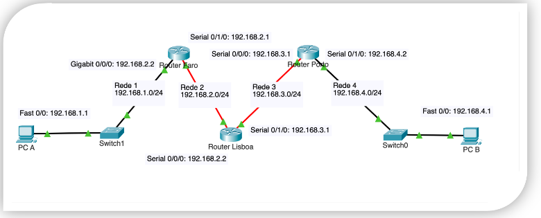

# IP Routing Protocols

## IP Addressing, Static Routing and NAT example



### Routers Configuration

```txt
! Router Faro -----------------------------------------------------------------
! Give name to router
Router(config)# hostname Router-Faro

! Secure with password
Router-Faro(config)# enable secret faro
Router-Faro(config)# line console 0
Router-Faro(config-line)# password faro
Router-Faro(config-line)# login
Router-Faro(config)# line aux 0
Router-Faro(config-line)# password faro
Router-Faro(config-line)# login

! Assign IPs to Interfaces
Router-Faro(config)# interface Gig0/0/0
Router-Faro(config-if)# ip address 192.168.1.2 255.255.255.0
Router-Faro(config-if)# description Ligacao LAN de Faro
Router-Faro(config-if)# no shutdown

Router-Faro(configif)# interface serial 0/1/0
Router-Faro(config-if)# ip address 192.168.2.1 255.255.255.0
Router-Faro(config-if)# description Ligacao WAN a Lisboa
Router-Faro(config)# no shutdown

! Router Lisboa --------------------------------------------------------------
! Give name to router
Router(config)# hostname Router-Lisboa

! Secure with password
Router-Lisboa(config)# enable secret lisboa
Router-Lisboa(config)# line console 0
Router-Lisboa(config-line)# password lisboa
Router-Lisboa(config-line)# login
Router-Lisboa(config)# line aux 0
Router-Lisboa(config-line)# password lisboa
Router-Lisboa(config-line)# login

! Assign IPs to Interfaces
Router-Lisboa(config)# interface serial 0/1/0
Router-Lisboa(config-if)# ip address 192.168.2.2 255.255.255.0
Router-Lisboa(config-if)# description Ligacao WAN Lisboa-Faro
Router-Lisboa(config-if)# no shutdown

Router-Lisboa(configif)# interface serial 0/1/1
Router-Lisboa(config-if)# ip address 192.168.3.1 255.255.255.0
Router-Lisboa(config-if)# description Ligacao WAN Lisboa-Porto
Router-Lisboa(config)# no shutdown

! Router Porto -----------------------------------------------------------------
! Give name to router
Router(config)# hostname Router-Porto

! Secure with password
Router-Porto(config)# enable secret porto
Router-Porto(config)# line console 0
Router-Porto(config-line)# password porto
Router-Porto(config-line)# login
Router-Porto(config)# line aux 0
Router-Porto(config-line)# password porto
Router-Porto(config-line)# login

! Assign IPs to Interfaces
Router-Porto(config)# interface Gig0/0/0
Router-Porto(config-if)# ip address 192.168.4.2 255.255.255.0
Router-Porto(config-if)# description Ligacao LAN de Porto
Router-Porto(config-if)# no shutdown

Router-Porto(config-if)# interface serial 0/1/0
Router-Porto(config-if)# ip address 192.168.3.2 255.255.255.0
Router-Porto(config-if)# description Ligacao WAN a Lisboa
Router-Porto(config)# no shutdown
 ```
 
### Static Routes

```txt
! Router Faro -----------------------------------------------------------------
Router-Faro(config)# ip route 192.168.3.0 255.255.255.0 192.168.2.2
Router-Faro(config)# ip route 192.168.3.0 255.255.255.0 192.168.2.2

! Router Lisboa ---------------------------------------------------------------
Router-Lisboa(config)# ip route 192.168.1.0 255.255.255.0 192.168.2.1
Router-Lisboa(config)# ip route 192.168.4.0 255.255.255.0 192.168.3.2

! Router Porto ----------------------------------------------------------------
Router-Porto(config)# ip route 192.168.1.0 255.255.255.0 192.168.3.1
Router-Porto(config)# ip route 192.168.2.0 255.255.255.0 192.168.3.1
```

### NAT Configuration

Consider Lisboa now has an additional Ethernet interface (g0/0/0) connected to Internet. This interface uses public address 200.100.50.1, allowing machines on the internal network to access the Internet through NAT

```txt
! Static NAT ------------------------------------------------------------------
Router-Lisboa(config)# interface g0/0/0
Router-Lisboa(config-if)# ip nat outside
Router-Lisboa(config-if)# interface Serial0/1/0
Router-Lisboa(config-if)# ip nat inside
Router-Lisboa(config-if)# ip nat inside source static 192.168.1.1 200.100.50.1  

! Dynamic NAT -----------------------------------------------------------------
Router-Lisboa(config)# interface g0/0/0
Router-Lisboa(config-if)# ip nat outside
Router-Lisboa(config-if)# interface Serial0/1/0
Router-Lisboa(config-if)# ip nat inside
Router-Lisboa(config)# ip nat pool NAT_POOL 200.100.50.1 200.100.50.10 netmask 255.255.255.0
Router-Lisboa(config)# ip nat inside source list 1 pool NAT_POOL
Router-Lisboa(config)# access-list 1 permit 192.168.1.0 0.0.0.255 
```