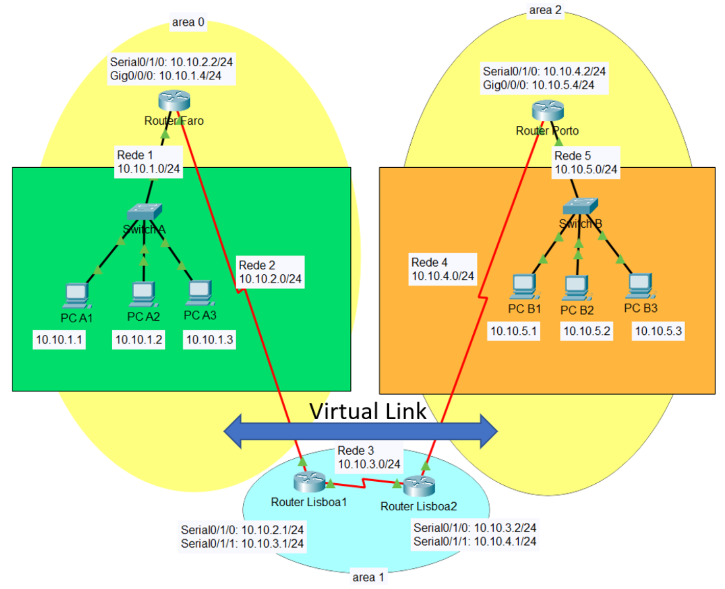

# OSPF Routing

## OSPF Configuration

### Using network statement (global mode)

```txt
Router(config)# router ospf 1
Router(config-router)# network 10.1.2.2 0.0.0.0 area 0
```

### Interface-specific configuration

```txt
Router(config)# interface Serial1/1
Router(config-if)# ip ospf 1 area 1
```

### Configuration Example

```txt
! Global OSPF configuration using network statement ----------------------------
Router(config)# router ospf 1
Router(config-router)# network 10.1.2.2 0.0.0.0 area 0.0.0.0

! Interface-specific configuration (overrides network cmd if both exist) -------
Router(config)# interface Serial1 /1
Router(config-if)# ip ospf 1 area 0.0.0.1

! Passive interface configuration to suppress OSPF Hellos ----------------------
Router(config-router)# passive-interface Serial1/0

! Check interface OSPF state and process bindings ------------------------------
Router# show ip ospf interface brief
Router# show ip protocols

! Show OSPF processes running on the router ------------------------------------
Router# show ip protocols

! Display interfaces running OSPF with area info and metrics -------------------
Router# show ip ospf interface brief

! Detailed view for a specific interface ---------------------------------------
Router# show ip ospf interface GigabitEthernet0/1

! View OSPF neighbors and their adjacency states -------------------------------
Router# show ip ospf neighbor

! View the LSDB (Link-State Database) ------------------------------------------
Router# show ip ospf database

! Display the IP routing table filtered by OSPF entries ------------------------
Router# show ip route ospf

! Restart the OSPF process (resets all neighbors) ------------------------------
Router# clear ip ospf process

! Confirm before resetting the OSPF process
Reset ALL OSPF processes ? [ no ]: yes
```

## Stub Area Configuration and Verification

```txt
! Configure Area 2 as a stub on both routers ----------------------------------
R1(config)# router ospf 1
R1(config-router)# area 2 stub

R2(config)# router ospf 1
R2(config-router)# area 2 stub


! Check stub configuration ----------------------------------------------------
R1# show ip ospf
R1# show ip ospf database summary

! Confirm default route injected by ABR (LSA Type 3) --------------------------
R1# show ip route ospf
```

## Totally Stubby Area Configuration and Verification

```txt
! Configure Area 2 as a totally stubby area (Cisco-only)
! R2 is the ABR, hence it uses no-summary --------------------------------------
R2(config)# router ospf 1
R2(config-router)# area 2 stub no-summary

! R1 is an internal router in Area 2 -------------------------------------------
R1(config)# router ospf 1
R1(config-router)# area 2 stub

! Check area configuration and summarization suppression -----------------------
R2# show ip ospf
R2# show ip ospf database summary

! Confirm default route injected (0.0.0.0/0 via ABR) ---------------------------
R1# show ip route ospf
```

## NSSA Area Configuration and Verification

```txt
! Configure Area 2 as an NSSA -------------------------------------------------
R2(config)# router ospf 1
R2(config-router)# area 2 nssa

! Configure Area 2 as NSSA and redistribute RIP into OSPF ---------------------
R1(config)# router ospf 1
R1(config-router)# area 2 nssa
R1(config-router)# redistribute rip subnets

! Check NSSA configuration and verify Type 7 LSAs -----------------------------
R2# show ip ospf
R2# show ip ospf database nssa-external

! Confirm that external RIP routes appear as Type 7 (O N2) --------------------
R1# show ip route ospf
```

## OSPF Totally NSSA Area Configuration and Verification (Cisco Only)

```txt
! R1 (ASBR) – Redistributing into OSPF -----------------------------------------
R1(config)# router ospf 1
R1(config-router)# area 2 nssa

! R2 (ABR) – Declares area as totally NSSA and injects default route -----------
R2(config)# router ospf 1
R2(config-router)# area 2 nssa no-summary

! Verification Commands --------------------------------------------------------
R2# show ip ospf
R2# show ip ospf database nssa-external
R1# show ip route ospf
! Confirm that external RIP routes appear as Type 7 (O N2) ---------------------
R1# show ip route ospf
```

## Virtual Link Configuration



```txt
! Router Faro ------------------------------------------------------------------
Router-Faro(config)# router ospf 100
Router-Faro(config-router)# network 10.10.0.0 0.0.255.255 area 0

! Router Porto ----------------------------------------------------------------
Router-Porto(config)# router ospf 100
Router-Porto(config-router)# network 10.10.4.0 0.0.0.255 area 2
Router-Porto(config-router)# network 10.10.5.0 0.0.0.255 area 2

! Router Lisboa 1 -------------------------------------------------------------
Router1-Lisboa(config)# router ospf 100
Router1-Lisboa(config-router)# network 10.10.2.0 0.0.0.255 area 0
Router1-Lisboa(config-router)# network 10.10.3.0 0.0.0.255 area 1 
Router1-Lisboa(config-router)# area 1 virtual-link 10.10.4.1

! Router Lisboa 2 -------------------------------------------------------------
Router2-Lisboa(config)# router ospf 100
Router2-Lisboa(config-router)# network 10.10.3.0 0.0.0.255 area 1
Router2-Lisboa(config-router)# network 10.10.4.0 0.0.0.255 area 2 
Router2-Lisboa(config-router)# area 1 virtual-link 10.10.3.1
```