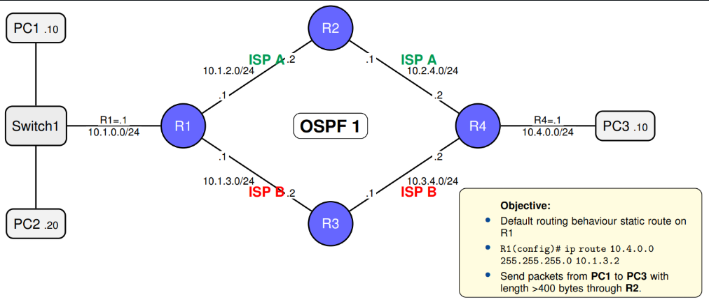
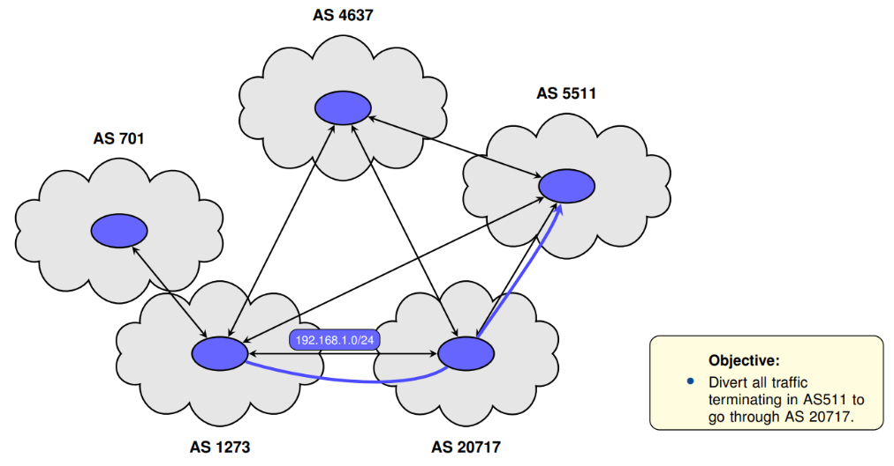

# Policy Based Routing

## Extended ACL Configuration

```txt
access-list <number> <permit|deny> <protocol> <source> <src-wildcard> <destination> <dst-wildcard> [operator <port>]
```

### First Example

```txt
! Deny traffic from 192.168.10.0/24, permit all else ---------------------------
Router(config)# access-list 10 deny 192.168.10.0  0.0.0.255
Router(config)# access-list 10 permit any

! Apply ACL to inbound traffic on interface ------------------------------------
Router(config)# interface GigabitEthernet0/1
Router(config-if)# ip access-group 10 in

! Verify ACL and interface binding ---------------------------------------------
Router# show access-lists
Router# show ip interface GigabitEthernet0/1
```

### Second Example

```txt
! Allow HTTP from 192.168.1.0/24 to host 172.16.0.10 ---------------------------
Router(config)# access-list 100 permit tcp 192.168.1.0 0.0.0.255 host 172.16.0.10 eq 80
Router(config)# access-list 100 deny ip any any

! Apply ACL to traffic leaving the interface -----------------------------------
Router(config)# interface GigabitEthernet0/0
Router(config-if)# ip access-group 100 out

! Verify ACL entries and interface bindings ------------------------------------
Router# show access-lists
Router# show ip interface GigabitEthernet0/0
```

## Route Maps

```txt
route-map <NAME> permit|deny <SEQ>
	match <classifier> (e.g. ip address <ACL>, legth, protocol, dscp)
	set <action> (e.g. ip next-hop, interface, vrf, dscp)  
```

## Wildcards

```txt
! ACL definition (used by a route-map match) -------------------------------
access-list 10 permit 10.1.2.0 0.0.0.255

! Route-map consuming the ACL ----------------------------------------------
route-map PBR-EXAMPLE permit 10
match ip address 10
set ip next-hop 192.0.2.254  
```

## Regular Expressions (regex)

```txt
! 1) Regex to match neighbor AS 65010 at path start ----------------------------
ip as-path access-list 10 permit ^65010_

! 2) Policy : prefer routes learned from AS 65010 ------------------------------
route-map FROM-PROV permit 10	
match as-path 10
set local-preference 150
route-map FROM-PROV permit 100

! 3) Attach to the BGP neighbor (inbound) --------------------------------------
router bgp 65000
neighbor 198.51.100.2 remote-as 65010
neighbor 198.51.100.2 route-map FROM-PROV in
```

## Lab Topology Examples

### Example 1 - Packet Size Filtering Route Map



```txt
! Create access list (selects all traffic from PC1) ----------------------------
R1(config)# access-list 1 permit host 10.1.0.10

! Create route map (traffic matching ACL1 and packet length 401-2000 bytes
! is send to next-hop 10.1.2.2) ------------------------------------------------
R1(config)# route-map RULE2 permit 10
R1(config-route-map)# match ip address 1
R1(config-route-map)# match length 401 2000
R1(config-route-map)# set ip next-hop 10.1.2.2 

! Attach the Route Map to an Interface (Activates RULE2 on the interface) -----
R1(config)# interface f0/0
R1(config-if)# ip policy route-map RULE2
```

### Example 2 - BGP Traffic Engineering 



```txt
! Create AS-PATH Access List (regex) 
! Matches paths that contain AS 20717 and end in AS 5511.
! (_ = AS boundary; $ = end). --------------------------------------------------
R1(config)# ip as-path access-list 1 permit _20727_5511$

! Create Route Map (Clause 10: for routes whose AS-PATH matches ACL 1,
! raise weight to 300 so R1 prefers this path) ---------------------------------
R1(config)# route-map RM_PREF_LOCAL_AS5511 permit 10
R1(config-route-map)# match as-path 1
R1(config-route-map)# set weight 300

! Attach the Route Map to the Neighbor (inbound)
! Apply policy on updates received from the AS 20717 neighbor
! (influences R1’s best path selection) ----------------------------------------
R1(config)# router bgp 1273
R1(config-router)# neighbor 192.168.1.2 remote-as 20717
R1(config-router)# neighbor 192.168.1.2 route-map RM_PREF_LOCAL_AS5511 in
```


