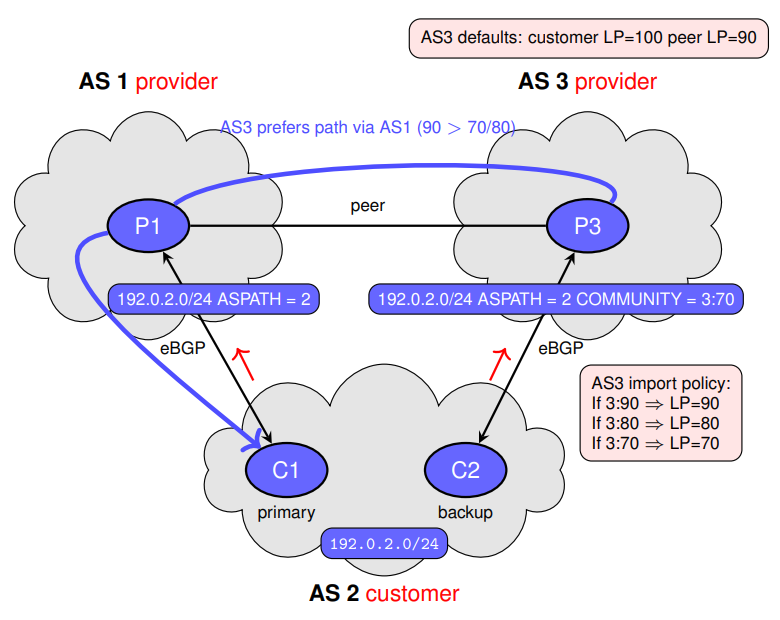
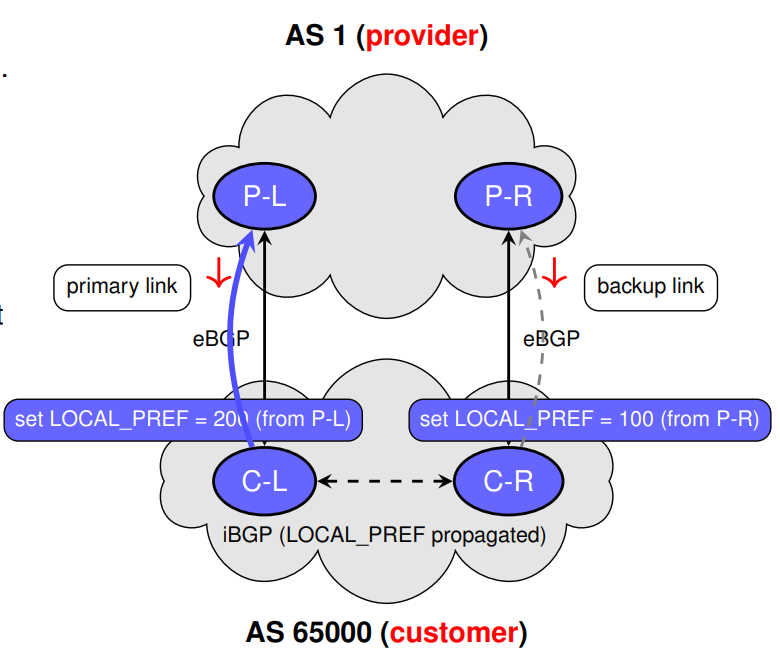
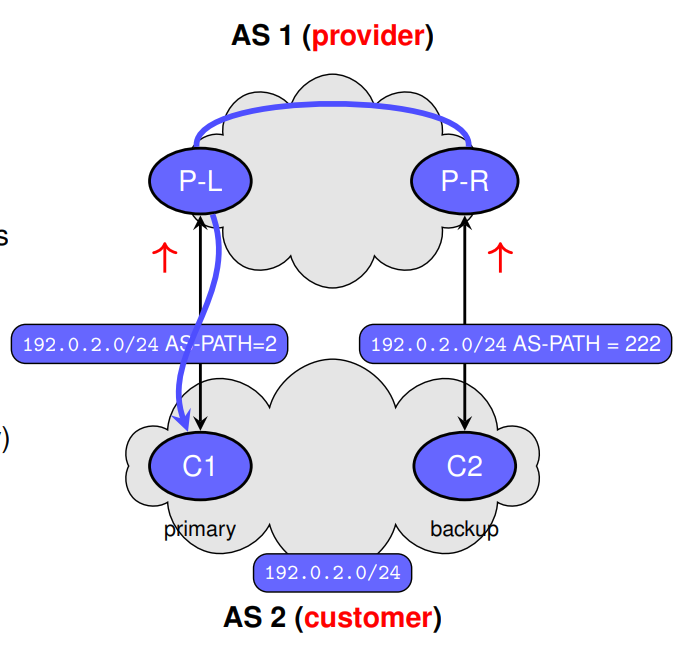
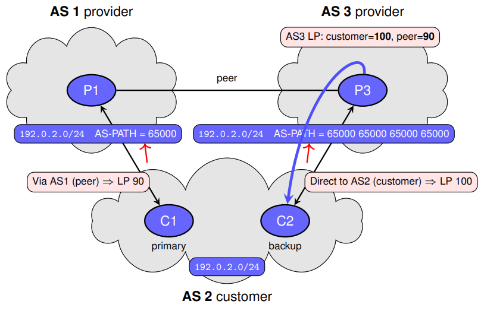

# BGP Routing

## iBGP Session Configuration Example

```ios
router bgp <ASN>
  neighbor <ip> remote-as <ASN>
  neighbor <ip> update-source Loopback0
```

```ios
! Scenario: iBGP peering between R1 and R2
! Using loopback interfaces and IGP reachability

R1(config)# router bgp 65000
R1(config-router)# neighbor 10.0.0.2 remote-as 65000
R1(config-router)# neighbor 10.0.0.2 update-source Loopback0

R2(config)# router bgp 65000
R2(config-router)# neighbor 10.0.0.1 remote-as 65000
R2(config-router)# neighbor 10.0.0.1 update-source Loopback0
```

> __Note__: iBGP sessions are established between routers in the same AS. Loopback interfaces are typically used for increased stability, and IGP must provide reachability to those loopbacks

## eBGP Session Configuration Example

```txt
router bgp <ASN>
  neighbor <ip> remote-as <peer-ASN>
```

```txt
! Scenario: eBGP peering between R1 (AS 65000) and R2 (AS 65100)
! Using directly connected interfaces

R1(config)# router bgp 65000
R1(config-router)# neighbor 192.0.2.2 remote-as 65100

R2(config)# router bgp 65100
R2(config-router)# neighbor 192.0.2.1 remote-as 65000
```

> __Note__: eBGP sessions are formed between routers in different ASes and typically use directly connected physical interfaces. Loopbacks are optional but require `ebgp-multihop` and manual update-source settings

## iBGP + eBGP + IGP: Integration Strategies

### Option 1: Redistribute eBGP Routes into IGP

```txt
router ospf <process>
	redistribute bgp <ASN> subnets
```

```txt
! Scenario: eBGP-learned prefixes injected into OSPF
R1(config)# router ospf 1
R1(config-router)# redistribute bgp 65000 subnets

! All BGP routes are flooded as external LSAs
! Internal routers see BGP routes as OSPF external
```

> __Note__: This method breaks BGP policy control, pollutes the IGP with external prefixes, and increases convergence time. Use only in small or static deployments

### Option 2: Propagate eBGP Routes via iBGP

```txt
router bgp <ASN>
  neighbor <ip> remote-as <ASN>
  neighbor <ip> update-source Loopback0  
```

```txt
! Scenario: eBGP routes injected into BGP
! and propagated via iBGP to internal routers

R1(config)# router bgp 65000
R1(config-router)# neighbor 10.0.0.2 remote-as 65000
R1(config-router)# neighbor 10.0.0.2 update-source Loopback0

! Internal routers perform recursive lookup to reach eBGP next-hop  
```

> __Note__: This approach preserves BGP policy control, supports route maps and filtering, and scales efficiently with route reflectors or confederations

## Router Refletor (RR) - iBGP Optimization Strategy


```txt
router bgp <ASN>
	neighbor <ip> remote-as <ASN>
	neighbor <ip> update-source Loopback0
	neighbor <ip> route-reflector-client    
```

```txt
! Scenario: R1 = RR; R2 and R3 = iBGP clients
R1(config)# router bgp 65000
R1(config-router)# neighbor 10.0.0.2 remote-as 65000
R1(config-router)# neighbor 10.0.0.3 remote-as 65000
R1(config-router)# neighbor 10.0.0.2 update-source Loopback0
R1(config-router)# neighbor 10.0.0.3 update-source Loopback0
R1(config-router)# neighbor 10.0.0.2 route-reflector-client
R1(config-router)# neighbor 10.0.0.3 route-reflector-client

R3(config)# router bgp 65000
R3(config-router)# neighbor 10.0.0.1 remote-as 65000
R3(config-router)# neighbor 10.0.0.1 update-source Loopback0    
```

### Route Reflector Loop Prevention: Setting CLUSTER_ID

```txt
router bgp <ASN>
	bgp cluster-id <id>
	neighbor <ip> route-reflector-client  
```

```txt
! Scenario: R1 and R2 are redundant RRs in the same cluster
R1(config)# router bgp 65000
R1(config-router)# bgp cluster-id 1.1.1.1
R1(config-router)# neighbor 10.0.0.2 remote-as 65000
R1(config-router)# neighbor 10.0.0.2 route-reflector-client

R2(config)# router bgp 65000
R2(config-router)# bgp cluster-id 1.1.1.1
R2(config-router)# neighbor 10.0.0.3 remote-as 65000
R2(config-router)# neighbor 10.0.0.3 route-reflector-client   
```

## Confederations: Hierarchical iBGP at Scale


```txt
router bgp <sub-AS>
	bgp confederation identifier <global-AS>
	bgp confederation peers <peer-sub-AS>
	neighbor <ip> remote-as <peer-sub-AS>  
```

```txt
! R1 in Sub-AS 65001 (part of Confederation AS 65000) -------------------------
R1(config)# router bgp 65001
R1(config-router)# bgp confederation identifier 65000
R1(config-router)# bgp confederation peers 65002
R1(config-router)# neighbor 10.0.0.2 remote-as 65001
R1(config-router)# neighbor 10.0.0.3 remote-as 65002
R1(config-router)# neighbor 10.0.0.2 update-source Loopback0
R1(config-router)# neighbor 10.0.0.3 update-source Loopback0

! R2 in same sub-AS (65001) ---------------------------------------------------
R2(config)# router bgp 65001
R2(config-router)# bgp confederation identifier 65000
R2(config-router)# bgp confederation peers 65002
R2(config-router)# neighbor 10.0.0.1 remote-as 65001
R2(config-router)# neighbor 10.0.0.1 update-source Loopback0

! R3 in Sub-AS 65002 (confederation AS 65000) ---------------------------------
R3(config)# router bgp 65002
R3(config-router)# bgp confederation identifier 65000
R3(config-router)# bgp confederation peers 65001
R3(config-router)# neighbor 10.0.0.1 remote-as 65001
R3(config-router)# neighbor 10.0.0.1 update-source Loopback0  
```

> __Note__: Routers in the same sub-AS peer via iBGP. Confederation peers must be declared to allow eBGP-like behavior across sub-AS boundaries

> __Note__: eBGP-like sessions between sub-ASes include internal AS numbers in the `AS_PATH` using `AS_CONFED_SEQ`. External peers see only the global AS 65000

## Peers Configuration

Traditional configuration

```txt
R1(config)# router bgp 65000
R1(config-router)# neighbor 10.0.0.1 remote-as 65001
R1(config-router)# neighbor 10.0.0.1 update-source lo0
R1(config-router)# neighbor 10.0.0.1 send-community
R1(config-router)# neighbor 10.0.0.1 next-hop-self
R1(config-router)# neighbor 10.0.0.2 remote-as 65001
R1(config-router)# neighbor 10.0.0.2 update-source lo0
R1(config-router)# neighbor 10.0.0.2 send-community
R1(config-router)# neighbor 10.0.0.2 next-hop-self  
```

With Peers Group

```txt
R1(config)# router bgp 65000
R1(config-router)# neighbor IBGP peer-group
R1(config-router)# neighbor IBGP remote-as 65001
R1(config-router)# neighbor IBGP update-source lo0
R1(config-router)# neighbor IBGP send-community
R1(config-router)# neighbor IBGP next-hop-self
R1(config-router)# neighbor 10.0.0.1 peer-group IBGP
R1(config-router)# neighbor 10.0.0.2 peer-group IBGP    
```

> __Note__: Peer groups simplify neighbor configuration, reduce duplication, and lower operational risk

## BGP Messages

### Consulting `Adj-RIB-In` (as received)

```txt
router bgp 65000
	neighbor 192.0.2.2 remote-as 65100
	neighbor 192.0.2.2 soft-reconfiguration inbound
```

Option A - Store Adj-RIB-In (classic way)

```txt
! Shows routes exactly as learned (pre-import policy)
R1# show ip bgp neighbors 192.0.2.2 received-routes
```

Option B - Without storing (modern route-refresh)

```txt
! Shows routes accepted from the neighbor (post-import policy)
R1# clear ip bgp 192.0.2.2 in refresh
R1# show ip bgp neighbors 192.0.2.2 routes
```

> Notes:
> - `received-routes` = _pre-policy_; requires `soft-reconfiguration inbound`
> - `routes` = _post-policy_ (what made into your Adj-RIB-In after import policy)

### Consulting Loc-RIB (best path per prefix)

```txt
! Global BGP table; best path per prefix is marked (e.g., *>) ------------------
R1# show ip bgp

! Drill into a single prefix (NLRI) to see attributes and the selected best ----
R1# show ip bgp 203.0.113.0

! Filter entries whose AS-PATH ends in 65100 -----------------------------------
R1# show ip bgp regexp _65100$

! Context: sessions, prefixes received/advertised, memory, timers --------------
R1# show ip bgp summary  
```

> Notes:
> - The __Loc-RIB__ holds one best path per prefix (result of the decision process)
> - In Cisco outputs, the best is typically marked (e.g., `*>`); only bests are candidates to install in the FIB
> If a best path isn’t installed, check show ip `bgp rib-failure` for the reason (AD, IGP, etc.)

### Consulting Adj-RIB-Out (advertised to a neighbor)

```txt
ip prefix-list TO-NBR seq 5 permit 203.0.113.0/24
route-map TO-NBR permit 10
match ip address prefix-list TO-NBR

router bgp 65000
neighbor 192.0.2.2 remote-as 65100
neighbor 192.0.2.2 route-map TO-NBR out  
```

Export policy example (optional)

```txt
! What your router advertises to 192.0.2.2 (post-export policy, per-neighbor Adj-RIB-Out)
R1# show ip bgp neighbors 192.0.2.2 advertised-routes  
```

> Notes:
> - Reflects post-export policy content prepared for that neighbor
> - Use it to verify route-maps, communities, MED, next-hop rewrites, etc.
> - If the session is down, output may show what would be advertised (platform-dependent)

### Consulting the FIB (forwarding table)

```txt
! Installed route used by the data plane (FIB entry) -------------------------
R1# show ip route 203.0.113.0

! Next-hop adjacency / interface resolution for that prefix ------------------
R1# show ip cef 203.0.113.0 detail
```

> Notes:
> - The FIB is programmed from Loc-RIB best paths; it’s distinct from BGP RIBs
> - `show ip route` confirms which path is installed; `show ip cef` shows actual forwarding
> - For ECMP, expect multiple next-hops in CEF; for unresolved next-hops, check IGP reachability


## BGP Route Attributes

### WEIGHT (Cisco Proprietary)


Per-Neighbor Configuration (default)

- Applies the same WEIGHT to all routers learned from a neighbor
- All routes from R2 are prefered over R3

```txt
router bgp 100
	neighbor 192.0.2.2 remote-as 200         ! R2
	neighbor 192.0.2.3 remote-as 200         ! R3
	neighbor 192.0.2.2 weight 100
	neighbor 192.0.2.3 weight 50 
```

Route Map Configuration (advanced filtering)

- Only `10.20.30.0/24` from R2 is given higher priority
- Using this method, the higher WEIGHT is only applied to selected prefixes and selected neighbours

```txt
ip prefix-list PFX10 seq 5 permit 10.20.30.0/24
route-map PREFER-R2 permit 10
	match ip address prefix-list PFX10
	set weight 100
router bgp 100
	neighbor 192.0.2.2 route-map PREFER-R2 in  
```

> Note: Both methods are local (to R1) and not advertised to other ASes

### LOCAL_PREF (Well-Known Discretionary)


LOCAL_PREF - Configuration Examples on R6

Uniform LOCAL_PREF by Neighbor (all routes)

```txt
! On R6 (iBGP with R4 and R5) ---------------------------------------------
router bgp 100
neighbor 10.0.0.4 remote-as 100

! R4 ----------------------------------------------------------------------
neighbor 10.0.0.4 update-source lo0
neighbor 10.0.0.4 route-map LP_FROM_R4 in
neighbor 10.0.0.5 remote-as 100

! R5 ----------------------------------------------------------------------
neighbor 10.0.0.5 update-source lo0
neighbor 10.0.0.5 route-map LP_FROM_R5 in
route-map LP_FROM_R4 permit 10
set local-preference 200
route-map LP_FROM_R5 permit 10
set local-preference 100  
```

> Effect: R6 tags R4-learned paths with LP=200 and LP=100 from R5, then propagates across iBGP peers

Selective LOCAL_PREF by Prefix (from R4)

- Boost only `10.20.30.0/24` (from R4) to LP=200
- All other routes (from R4 or R5) keep default

```txt
! On R6 ----------------------------------------------------------------------
ip prefix-list PFX30 seq 5 permit 10.20.30.0/24
route-map LP_FROM_R4_SEL permit 10
	match ip address prefix-list PFX30
	set local-preference 200
route-map LP_FROM_R4_SEL permit 20
	set local-preference 100

# all other prefixes ----------------------------------------------------------
router bgp 100
	neighbor 10.0.0.4 route-map
LP_FROM_R4_SEL in  
```

> Effect: Only 10.20.30.0/24 via R4 is LP=200; AS100 prefers the R4→R2 exit just for that prefix

### Locally Originated (Implicit)


Routes injected with the `network` statement and / or advertised with `aggregate-address`

### Multi-Exit Discrriminator (MED) - Optional-Non transitive


BGP Attribute MED — Configuration Examples (on AS200)

Uniform MED per eBGP Neighbor

- R2 advertises all routes to AS100 with MED 50
- R3 advertises all routes to AS100 with MED 200

```txt
! R2 (AS200) toward R4 in AS100 -----------------------------------------------
router bgp 200
neighbor 192.0.2.4 remote-as 100             ! R4
neighbor 192.0.2.4 route-map MED_50 out
route-map MED_50 permit 10
set metric 50                                ! MED

! R3 (AS200) toward R4 in AS100 -----------------------------------------------
router bgp 200
neighbor 192.0.2.14 remote-as 100            ! R4
neighbor 192.0.2.14 route-map MED_200 out
route-map MED_200 permit 10
set metric 200  
```

Selective MED by Prefix (same neighbor)

- Only `10.20.30.0/24` gets MED 50 from R2
- Other prefixes keep default

```txt
! R2 (AS200) — MED only for 10.20.30.0/24 --------------------------------------
ip prefix-list PFX30 seq 5 permit 10.20.30.0/24
route-map MED_50_PFX permit 10
match ip address prefix-list PFX30
set metric 50
route-map MED_50_PFX permit 20
set metric 0 # or omit to leave MED unchanged
router bgp 200
neighbor 192.0.2.4 remote-as 100
neighbor 192.0.2.4 route-map MED_50_PFX out  
```

> Notes: AS100 (R4/R1) prefers the R2 path since both paths are from the same neighbor AS

### BGP Well-Known Community - no-export


__Objective__: Prevent advertising 10.20.30.0/24 to eBGP peers outside AS 100 while sharing with iBGP peers

Configuration on R1 (Cisco IOS)

- Define a route-map to set the no-export community for the prefix
- Apply the route-map to the network statement or redistribution process

```txt
ip prefix-list PFX-NOEXPORT seq 5 permit 10.20.30.0/24
route-map SET-NOEXPORT permit 10
	match ip address prefix-list PFX-NOEXPORT
	set community no-export additive
router bgp 100
	neighbor 192.0.2.2 route-map SET-NOEXPORT out
```

> Key Notes:
> - The keyword additive ensures existing communities are preserved
> - The community attribute is carried in the BGP UPDATE message
> - Optional Transitive — preserved across AS boundaries unless filtered


### BGP Well-Known Community - no-advertise


__Objective__: Prevent advertising 10.20.30.0/24 to any BGP peer (iBGP or eBGP)

Configuration on R1 (Cisco IOS)

- Define a route-map to set the no-advertise community for the prefix
- Apply the route-map to the network statement or redistribution process

```txt
ip prefix-list PFX-NOADVERTISE seq 5 permit 10.20.30.0/24
route-map SET-NOADVERTISE permit 10
	match ip address prefix-list PFX-NOADVERTISE
	set community no-advertise additive
router bgp 100
	neighbor 192.0.2.2 route-map SET-NOADVERTISE out
```

> Key Notes:
> - This community prevents the route from leaving the local router’s BGP table
> - Commonly used for internal testing or diagnostics
> - Optional Transitive — preserved if sent, but this prevents sending entirely

### BGP Well-Known Community - internet


__Objective__: Ensure 10.20.30.0/24 is advertised to all BGP peers globally

Configuration on R1 (Cisco IOS)

- Define a route-map to set the internet community for the prefix
- Apply the route-map to the network statement or redistribution process

```txt
ip prefix-list PFX-INTERNET seq 5 permit 10.20.30.0/24
route-map SET-INTERNET permit 10
	match ip address prefix-list PFX-INTERNET
	set community internet additive
router bgp 100
	neighbor 192.0.2.2 route-map SET-INTERNET out
```

> Key Notes:
> - Indicates the route is suitable for advertisement to the entire Internet
> - Common for public service prefixes (e.g., web, email)
> - Optional Transitive — retained across AS boundaries

### BGP Well-Known Community - local-as


__Objective__: Prevent advertising `10.20.30.0/24` to peers outside the local confederation

Configuration on R1 (Cisco IOS)

- Define a route-map to set the local-as community for the prefix
- Apply the route-map to the network statement or redistribution process

```txt
ip prefix-list PFX-LOCALAS seq 5 permit 10.20.30.0/24
route-map SET-LOCALAS permit 10
	match ip address prefix-list PFX-LOCALAS
	set community local-as additive
router bgp 65000
	neighbor 198.51.100.2 route-map SET-LOCALAS out  
```

> Key Notes:
> - Used in BGP confederations to hide routes from external peers
> - Maintains control over routing visibility across sub-AS boundaries
> - Optional Transitive — preserved if passed within the confederation

### BGP Well-Known Community - ATOMIC_AGGREGATE


Concept

- Often appears with ATOMIC_AGGREGATE when aggregation removes AS_PATH detail
- Optional, Transitive attribute; length = 6 bytes (ASN + IPv4 address of the router that formed the aggregate)
- Automatically added when a router creates an aggregate using aggregate-address
- Records the ASN and BGP Identifier (router ID) of the summarising router
- Used for auditing, troubleshooting, and policy decisions by downstream ASes

Forwarding / Policy Role

- Provides traceability for where and by whom the route was summarised
- Helps operators understand the path history when specifics are not advertised

Benefit: Improves route transparency without increasing routing table size

Example:

- AS 100 aggregates `10.20.30.0/24` and `10.20.31.0/24` into `10.20.0.0/16`
- BGP UPDATE to AS 200:
	- ATOMIC_AGGREGATE
	- AGGREGATOR: AS100, 1.1.1.1
- Meaning:
	- ASN = 100 → summarising AS
	- Router ID = 1.1.1.1 → device that performed the aggregation

ATOMIC_AGGREGATE — Configuration (Cisco IOS)

Baseline

- R1 (AS 100) aggregates `10.20.30.0/24` and `10.20.31.0/24` into `10.20.0.0/16`
- eBGP to R2 (AS 200)

Case A - Without as-set (ATOMIC_AGGREGATE expected)

```txt
router bgp 100
	neighbor 198.51.100.2 remote-as 200
	! Summarise and hide specifics
	
! Ensure a matching route exists for the summary
ip route 10.20.0.0 255.255.0.0 Null0
```

Case B - With as-set (preserves ASN union)

```txt
router bgp 100
	neighbor 198.51.100.2 remote-as 200
	aggregate-address 10.20.0.0 255.255.0.0 summary-only as-set
ip route 10.20.0.0 255.255.0.0 Null0 
```

ATOMIC_AGGREGATE — Verification (Case A: No as-set)

On R1 (AS 100)

```txt
R1# show ip bgp 10.20.0.0
BGP routing table entry for 10.20.0.0/16
	Local
		0.0.0.0 from 0.0.0.0 (1.1.1.1)
			Origin IGP, localpref 100, weight 32768
			ATOMIC_AGGREGATE
			Aggregator: AS100, 1.1.1.1  
```

On R2 (AS 200) - Received UPDATE

```txt
R2# show ip bgp 10.20.0.0
BGP routing table entry for 10.20.0.0/16
	Received from 198.51.100.1 (eBGP)
	ATOMIC_AGGREGATE
	Aggregator: AS100, 1.1.1.1
	AS_PATH: 100  
```

ATOMIC_AGGREGATE — Verification (Case B: With as-set)

On R1 (AS 100)

```txt
R1# show ip bgp 10.20.0.0
BGP routing table entry for 10.20.0.0/16
	Local
		0.0.0.0 from 0.0.0.0 (1.1.1.1)
		Origin IGP, localpref 100, weight 32768
		Aggregator: AS100, 1.1.1.1  
```

On R2 (AS 200) — Received UPDATE

```txt
R2# show ip bgp 10.20.0.0
BGP routing table entry for 10.20.0.0/16
	Received from 198.51.100.1 (eBGP)
	Aggregator: AS100, 1.1.1.1
	AS_PATH: {65010 65020} 100
```

### CLUSTER_LIST


BGP Route Reflection — Cluster ID Configuration (Cisco IOS)

Baseline

- R1 and R3 are Route Reflectors in AS 100
- They serve the same clients (R2 and R4) in a single cluster
- To ensure loop prevention, both RRs must share the same Cluster ID

Default behaviour

- If not configured, the Cluster ID = BGP Router ID
- This can cause different IDs in the same cluster, breaking loop detection

Manual configuration (recommended)

```txt
router bgp 100
	bgp cluster-id 10.10.10.10
	neighbor 192.0.2.2 route-reflector-client
	neighbor 192.0.2.3 route-reflector-client  
```

> Notes:
> - Use the same `bgp cluster-id` on all RRs in the cluster
> - Ensures the CLUSTER_LIST is consistent and loop prevention works


## BGP Traffic Optimization

### Inbound Traffic Engineering with Provider Communities (AS2 multi-homed)

Goal

- AS2 wants traffic from/through AS3 to reach AS2 via AS1 (make AS3 a backup)

Provider policy at AS3 (example)

- Default LOCAL_PREF: customer=100, peer=90
- Comunities from AS2:
	- 3:90 -> set LOCAL_PREF=90
	- 3:80 -> set LOCAL_PREF=80
	- 3:70 -> set LOCAL_PREF=70
	


Action

- AS2 tags routes to AS3 with 3:70 and sends comunities

Effect

- At AS3: direct-to-AS2 path LP becomes 70; peer path via AS1 is 90 ⇒ AS3 prefers via AS1

> Notes: provider communities are provider-specific; must send-community

```txt
! Tag only the AS3 - facing advertisement with 3:70 and send communities
ip prefix-list AS2-PFX seq 5 permit 192.0.2.0/24

route-map TO-AS3-TAG permit 10
match ip address prefix-list AS2-PFX
set community 3:70 additive ! provider AS3 interprets 3:70 = > LP =70
route-map TO-AS1- NORMAL permit 10
match ip address prefix-list AS2-PFX
! no community change toward AS1

router bgp 65002
! Primary provider (AS1)
neighbor 198.51.100.1 remote-as 65001
neighbor 198.51.100.1 send-community both
neighbor 198.51.100.1 route-map TO-AS1-NORMAL out
!
! Backup provider (AS3) -- tag with provider community 3:70
neighbor 203.0.113.1 remote-as 65003
neighbor 203.0.113.1 send-community both
neighbor 203.0.113.1 route-map TO-AS3-TAG out
```

### Outbound Traffic Engineering with LOCAL_PREF (primary/backup exit)

Goal

- AS 65000 is dual-homed to provider AS 1 (2 links)
- Make the left link the primary exit; use the right link only as backup

Action

- Import policy on routes learned from the left neighbor: set LOCAL_PREF = 200
- Import policy on routes from the right neighbor: set LOCAL_PREF = 100
- The best path in the Loc-RIB points to the left eBGP neighbor (higher wins), so all iBGP speakers send traffic out the primary link



Effect

- Outbound traffic from AS 65000 follows left link
- Left link fails -> right neighbor wins (backup)

> Notes: LOCAL_PREF is iBGP-only and controls engress; it doesn't influence inbound traffic

```txt
! Loopback for stable iBGP
interface Loopback0
ip address 10.0.0.1 255.255.255.255

ip prefix-list ANY seq 5 permit 0.0.0.0/0 le 32
route-map FROM-PL-IN permit 10
match ip address prefix-list ANY
set local-preference 200   ! higher = prefer exit via C-L

router bgp 65000
bgp log-neighbor-changes
! iBGP to C-R
neighbor 10.0.0.2 remote-as 65000
neighbor 10.0.0.2 update-source Loopback0
neighbor 10.0.0.2 next-hop-self
!
! eBGP to provider P-L (primary link)
neighbor 198.51.100.1 remote-as 65001
neighbor 198.51.100.1 route-map FROM-PL-IN in
! (activate/address-family lines if using AF mode)
```

### Inbound Traffic Engineering with AS-PATH Prepending

Goal

- AS2 is dual-homed to AS1. Make inbound traffic from AS1 enter via the primary link

Action

- Advertise the same prefix on both links
- On the backup link, prepend AS2’s ASN multiple times in AS-PATH
- In AS1, `LOCAL_PREF` is equal for both (customer ⇒ same), so shorter AS-PATH wins



Effect

- AS1 prefers the advertisement wit AS_PATH 2 (primary) over 2 2 2 (backup)

> Notes: Prepending is advisory — it works when competing paths have the same LOCAL_PREF. Provider policies (e.g., LP tuning, hot-potato) can override it

#### Traffic Engineering – beware of choice precedence

Concept

- Attribute order matters: LOCAL_PREF > AS_PATH length
- AS3 policy: customer routes LP=100, peer routes LP=90
- AS2 advertises its prefix both ways:
	- To AS1 (primary): normal advertisement
	- To AS3 (backup): heavy AS_PATH prepending
- Result: AS3 still prefers the direct costumer path (LP100) to AS2, not the peer path via AS1 (LP90), despite the longer AS_PATH



Takeaway / Fix

- Prepending only helps when LP is equal
- To make AS3 use AS1, lower AS3’s LP for your prefix (e.g., provider communities like 3:70) or ask the provider to adjust LP

AS2 (customer) — advertise normally on primary, prepend on backup

```txt
ip prefix-list AS2-PFX seq 5 permit 192.0.2.0/24

route-map TO-AS1-PRIMARY permit 10
match ip address prefix-list AS2-PFX
! no prepend on primary

route-map TO-AS1-BACKUP permit 10
match ip address prefix-list AS2-PFX
set as-path prepend 65000 65000 65000

router bgp 65000
neighbor 203.0.113.1 remote-as 65001              ! AS1 left (primary)
neighbor 203.0.113.1 route-map TO-AS1-PRIMARY out
neighbor 203.0.113.2 remote-as 65001              ! AS1 right (backup)
neighbor 203.0.113.2 route-map TO-AS1-BACKUP out
```