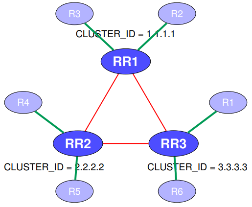
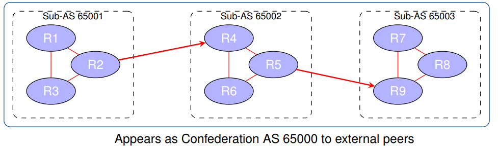

# BGP Routing

## iBGP Session Configuration Example

```ios
router bgp <ASN>
  neighbor <ip> remote-as <ASN>
  neighbor <ip> update-source Loopback0
```

```ios
! Scenario: iBGP peering between R1 and R2
! Using loopback interfaces and IGP reachability

R1(config)# router bgp 65000
R1(config-router)# neighbor 10.0.0.2 remote-as 65000
R1(config-router)# neighbor 10.0.0.2 update-source Loopback0

R2(config)# router bgp 65000
R2(config-router)# neighbor 10.0.0.1 remote-as 65000
R2(config-router)# neighbor 10.0.0.1 update-source Loopback0
```

> __Note__: iBGP sessions are established between routers in the same AS. Loopback interfaces are typically used for increased stability, and IGP must provide reachability to those loopbacks

## eBGP Session Configuration Example

```txt
router bgp <ASN>
  neighbor <ip> remote-as <peer-ASN>
```

```txt
! Scenario: eBGP peering between R1 (AS 65000) and R2 (AS 65100)
! Using directly connected interfaces

R1(config)# router bgp 65000
R1(config-router)# neighbor 192.0.2.2 remote - as 65100

R2(config)# router bgp 65100
R2(config-router)# neighbor 192.0.2.1 remote - as 65000
```

> __Note__: eBGP sessions are formed between routers in different ASes and typically use directly connected physical interfaces. Loopbacks are optional but require `ebgp-multihop` and manual update-source settings

## iBGP + eBGP + IGP: Integration Strategies

### Option 1: Redistribute eBGP Routes into IGP

```txt
router ospf <process>
	redistribute bgp <ASN> subnets
```

```txt
! Scenario: eBGP-learned prefixes injected into OSPF
R1(config)# router ospf 1
R1(config-router)# redistribute bgp 65000 subnets

! All BGP routes are flooded as external LSAs
! Internal routers see BGP routes as OSPF external
```

> __Note__: This method breaks BGP policy control, pollutes the IGP with external prefixes, and increases convergence time. Use only in small or static deployments

### Option 2: Propagate eBGP Routes via iBGP

```txt
router bgp <ASN>
  neighbor <ip> remote-as <ASN>
  neighbor <ip> update-source Loopback0  
```

```txt
! Scenario: eBGP routes injected into BGP
! and propagated via iBGP to internal routers

R1(config)# router bgp 65000
R1(config-router)# neighbor 10.0.0.2 remote-as 65000
R1(config-router)# neighbor 10.0.0.2 update-source Loopback0

! Internal routers perform recursive lookup to reach eBGP next-hop  
```

> __Note__: This approach preserves BGP policy control, supports route maps and filtering, and scales efficiently with route reflectors or confederations

## Router Refletor (RR) - iBGP Optimization Strategy



```txt
router bgp <ASN>
	neighbor <ip> remote-as <ASN>
	neighbor <ip> update-source Loopback0
	neighbor <ip> route-reflector-client    
```

```txt
! Scenario: R1 = RR; R2 and R3 = iBGP clients
R1(config)# router bgp 65000
R1(config-router)# neighbor 10.0.0.2 remote-as 65000
R1(config-router)# neighbor 10.0.0.3 remote-as 65000
R1(config-router)# neighbor 10.0.0.2 update-source Loopback0
R1(config-router)# neighbor 10.0.0.3 update-source Loopback0
R1(config-router)# neighbor 10.0.0.2 route-reflector-client
R1(config-router)# neighbor 10.0.0.3 route-reflector-client

R3(config)# router bgp 65000
R3(config-router)# neighbor 10.0.0.1 remote-as 65000
R3(config-router)# neighbor 10.0.0.1 update-source Loopback0    
```

### Route Reflector Loop Prevention: Setting CLUSTER_ID

```txt
router bgp <ASN>
	bgp cluster-id <id>
	neighbor <ip> route-reflector-client  
```

```txt
! Scenario: R1 and R2 are redundant RRs in the same cluster
R1(config)# router bgp 65000
R1(config-router)# bgp cluster-id 1.1.1.1
R1(config-router)# neighbor 10.0.0.2 remote-as 65000
R1(config-router)# neighbor 10.0.0.2 route-reflector-client

R2(config)# router bgp 65000
R2(config-router)# bgp cluster-id 1.1.1.1
R2(config-router)# neighbor 10.0.0.3 remote-as 65000
R2(config-router)# neighbor 10.0.0.3 route-reflector-client   
```

## Confederations: Hierarchical iBGP at Scale



```txt
router bgp <sub-AS>
	bgp confederation identifier <global-AS>
	bgp confederation peers <peer-sub-AS>
	neighbor <ip> remote-as <peer-sub-AS>  
```

```txt
! R1 in Sub-AS 65001 (part of Confederation AS 65000) -------------------------
R1(config)# router bgp 65001
R1(config-router)# bgp confederation identifier 65000
R1(config-router)# bgp confederation peers 65002
R1(config-router)# neighbor 10.0.0.2 remote-as 65001
R1(config-router)# neighbor 10.0.0.3 remote-as 65002
R1(config-router)# neighbor 10.0.0.2 update-source Loopback0
R1(config-router)# neighbor 10.0.0.3 update-source Loopback0

! R2 in same sub-AS (65001) ---------------------------------------------------
R2(config)# router bgp 65001
R2(config-router)# bgp confederation identifier 65000
R2(config-router)# bgp confederation peers 65002
R2(config-router)# neighbor 10.0.0.1 remote-as 65001
R2(config-router)# neighbor 10.0.0.1 update-source Loopback0

! R3 in Sub-AS 65002 (confederation AS 65000) ---------------------------------
R3(config)# router bgp 65002
R3(config-router)# bgp confederation identifier 65000
R3(config-router)# bgp confederation peers 65001
R3(config-router)# neighbor 10.0.0.1 remote-as 65001
R3(config-router)# neighbor 10.0.0.1 update-source Loopback0  
```

> __Note__: Routers in the same sub-AS peer via iBGP. Confederation peers must be declared to allow eBGP-like behavior across sub-AS boundaries

> __Note__: eBGP-like sessions between sub-ASes include internal AS numbers in the `AS_PATH` using `AS_CONFED_SEQ`. External peers see only the global AS 65000

## Peers Configuration

Traditional configuration

```txt
R1(config)# router bgp 65000
R1(config-router)# neighbor 10.0.0.1 remote-as 65001
R1(config-router)# neighbor 10.0.0.1 update-source lo0
R1(config-router)# neighbor 10.0.0.1 send-community
R1(config-router)# neighbor 10.0.0.1 next-hop-self
R1(config-router)# neighbor 10.0.0.2 remote-as 65001
R1(config-router)# neighbor 10.0.0.2 update-source lo0
R1(config-router)# neighbor 10.0.0.2 send-community
R1(config-router)# neighbor 10.0.0.2 next-hop-self  
```

With Peers Group

```txt
R1(config)# router bgp 65000
R1(config-router)# neighbor IBGP peer-group
R1(config-router)# neighbor IBGP remote-as 65001
R1(config-router)# neighbor IBGP update-source lo0
R1(config-router)# neighbor IBGP send-community
R1(config-router)# neighbor IBGP next-hop-self
R1(config-router)# neighbor 10.0.0.1 peer-group IBGP
R1(config-router)# neighbor 10.0.0.2 peer-group IBGP    
```

> __Note__: Peer groups simplify neighbor configuration, reduce duplication, and lower operational risk