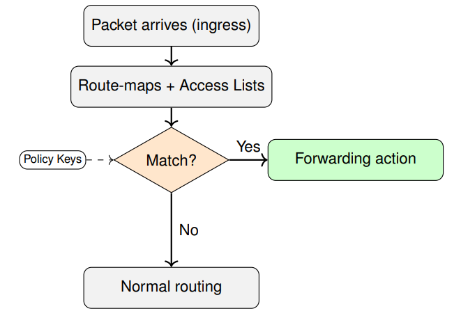
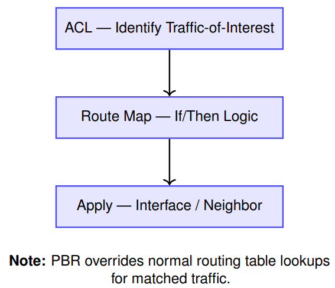
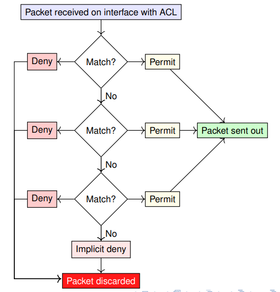
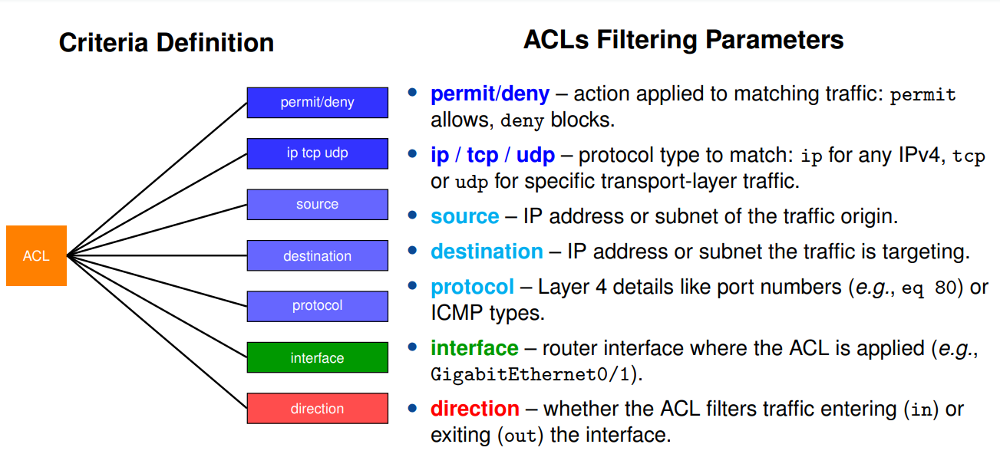
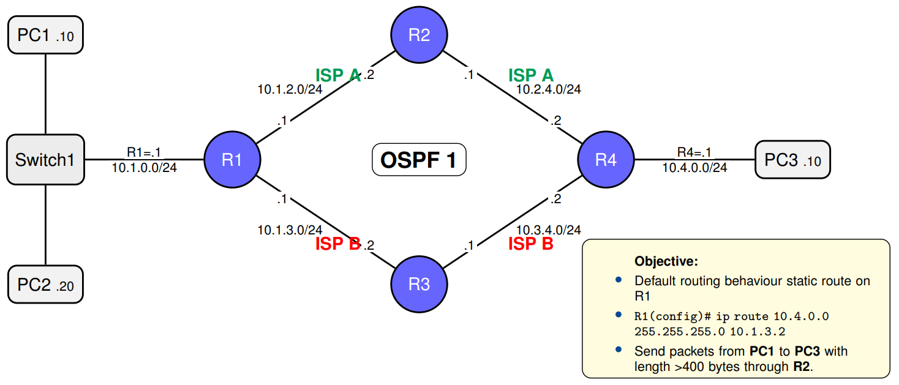
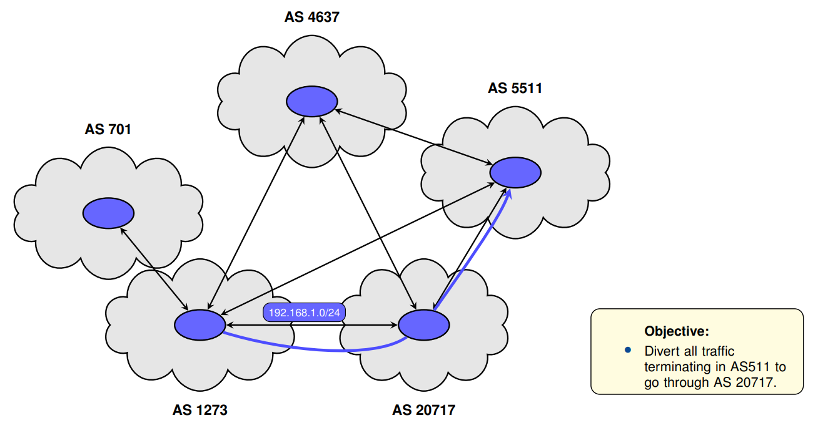

# Policy Based Routing (PBR)

## PBR Motivation

### Limitations of “Normal” (Destination-Based) Routing

__Key Limitations of Traditional Routing__

- __Destination-only__: based on longest prefix matching, ignores source, VLAN/interface, DSCP/class, app/port, time
- __One best path for all__: no per-app / per-tenant / per-user steering
- __Week engress control__: egress chosen based on lowest IGP cost
- __No time/business context__: can't change treatment by schedule or policy events
- __Inbound is external__: we can't dictate how others enter in our AS
- __Coarse knobs__: changing behavior means prefix/metric tweks -> large blast radius

> PBR adds match→set logic on ingress for targeted exceptions; default routing still handles the rest

### Policy-Based Routing (PBR): Expanding Routing Decisions

__Policy-Based Routing Key Points__:

- Default forwarding: __Longest Prefix Match (LPM)__ — destination only
- __PBR extends keys__: source/VLAN/interface, DSCP, ports/apps, time, etc
- Implemented with __route-maps__ (ordered clauses) + __match objects__ (ACLs/prefix-lists)
- Applied __inbound__ on interfaces: `ip policy route-map <NAME>` 
- On match: __set__ action (next-hop / egress / VRF / marking)
- No match: __fallback to normal routing__; applied inbound via `ip policy route-map`



### Policy-Based Routing (PBR) — Key Configuration Steps

1. __Define an Access Control List (ACL)__
	- Specifies the _traffic-of-interest_ to be matched
	- Example: Source/destination IP, protocol, port
2. __Create a Route Map__
	- Acts as an _if/then_ logic block
	- If traffic matches the ACL → modify processing (e.g., set next-hop, output interface)
	- Can include multiple `match` and `set` clauses
3. __Apply the Route Map__
	- Bound to an _interface_ (for incoming traffic) or a _BGP/neighbor_ relation (for routing policies)
	- Determines where and when PBR takes effect
	


---

## Access Control Lists (ACLs)

### ACLs Overview

__ACL Objectives__

- ACLs are packet filter rules applied to the router interfaces
- Control traffic based on:
	+ Source/destination IP
	+ Protocols (TCP, UDP, ICMP)
	+ Ports (e.g., HTTP, Telnet)
- Evaluated top-down (first-match wins)
- End with an __implicit deny all__



### ACLs: Logic Flow and Match Criteria



### Types of Access Control Lists (ACLs)

1. __Standard ACL__ (Layer 3 - source IP only)
	- Matches only the __source IP address__
	- Cannot distinguish traffic by protocol or port
	- Common use: restrict access to management or internal networks
	- Applied __closer to the destination__
2. __Extended ACL__ (Layer 3+4 - IP, protocol, port)
	- Matches __source and destination IP__, plus __protocol and port__
	- Supports precise filtering (e.g., allow HTTP, block Telnet)
	- Applied __closer to the source__
3. __Named ACL__ (Standart or Extended in named format)
	- Uses a __text label__ instead of a number
	- Allows modular editing and better readability
	- Functionally identical to numbered ACLs
4. __Dynamic ACL (Lock-and-Key)__
	- Blocks all traffic until a user __authenticates via Telnet or HTTP__
	- Creates temporary ACL entries based on login session
	- Used for __controlled remote access__ or user-triggered openings
5. __Reflexive ACL__
	- Monitors outbound sessions and __automatically creates inbound rules__
	- Acts like a simple __stateful inspection__ for TCP/UDP
	- Deletes return-path rules when the session ends
	- Suitable for securing outbound-initiated traffic
	
> __Note__: Both types 4 and 5 are configured using extended ACLs, but introduce __session-awareness__

### Extended ACL Configuration Examples

```txt
access-list <number> <permit|deny> <protocol> <source> <src-wildcard> <destination> <dst-wildcard> [operator <port >]
```

__First example__

```txt
# Deny traffic from 192.168.10.0/24, permit all else ---------------------------
Router (config) # access-list 10 deny 192.168.10.0  0.0.0.255
Router (config) # access-list 10 permit any

# Apply ACL to inbound traffic on interface ------------------------------------
Router (config) # interface GigabitEthernet0/1
Router (config-if) # ip access-group 10 in

# Verify ACL and interface binding ---------------------------------------------
Router # show access-lists
Router # show ip interface GigabitEthernet0/1 
```

__Second example__

```txt
# Allow HTTP from 192.168.1.0/24 to host 172.16.0.10 ---------------------------
Router(config# access-list 100 permit tcp 192.168.1.0 0.0.0.255 host 172.16.0.10 eq 80
Router(config)# access-list 100 deny ip any any

# Apply ACL to traffic leaving the interface -----------------------------------
Router(config)# interface GigabitEthernet0/0
Router(config-if)# ip access-group 100 out

# Verify ACL entries and interface bindings ------------------------------------
Router# show access-lists
Router# show ip interface GigabitEthernet0/0
```

---

## Route Maps

__What it is__

- An __ordered list of clauses__: each clause has `permit|deny` and a __sequence number__
- Each clause contains zero or more __match__ conditions and optional __set__ actions

__Syntax sketc__

```txt
route-map <NAME> permit|deny <SEQ>
	match <classifier> (e.g. ip address <ACL>, legth, protocol, dscp)
	set <action> (e.g. ip next-hop, interface, vrf, dscp)  
```

__Evaluation Rules (PBR)__

1. Clauses are tried __in order__ (lowest sequence first)
2. __First clause that matches wins__
3. If it is `permit` ⇒ apply the __set__ actions
4. If it is `deny` or nothing matches ⇒ __fallback__ to normal routing

__Where it is used__

- __Packet PBR__: attach on ingress interface with `ip policy route-map <NAME>`
- __BGP policy__: same construct, but matches/sets on _routes_, not packets

---

## Wildcards

__How it works__

- A __wildcard mask__ is the inverse of a subnet mask
- Bit rule: __0 = must match, 1 = don’t care__
- Shorthands:
	+ `host A.B.C.D ≡ mask 0.0.0.0` (check all bits)
	+ `any ≡ mask 255.255.255.255` (ignore all bits)
- Used by `route-map ... match ip address <ACL>` (ACL entries carry the wildcard logic)

__Common examples__

| ACL IP   | Wildcard        | Matches |
| -------- | --------------- | ------- |
| 10.1.2.3 | 0.0.0.0         | only 10.1.2.3 |
| 0.0.0.0  | 255.255.255.255 | any IP |
| 10.1.2.0 | 0.0.0.255       | 10.1.2.0/24 |
| 10.1.2.0 | 0.0.0.3         | 10.1.2.0/30 |
| 10.1.2.0 | 0.0.0.1         | even last-bit hosts |

__Configuration example__

```txt
! ACL definition (used by a route-map match) -------------------------------
access-list 10 permit 10.1.2.0 0.0.0.255

! Route-map consuming the ACL ----------------------------------------------
route-map PBR-EXAMPLE permit 10
match ip address 10
set ip next-hop 192.0.2.254  
```

---

## Regular Expressions

### Regular Expressions (REGEX) - Core Concept

__Concept__

- __ACLs/prefix-lists__ classify packets (IPs, ports) using __wildcards/masks__
- __Route-maps__ apply _policy_ (match → set) to routes or packets
- __Regex__ matches text _patterns_ — perfect for __route attributes__ and __CLI filtering__

__Complementary roles__

- __Packet plane (PBR)__: ACL wildcards decide which flows hit a route-map
- __Control plane (BGP policy)__: Regex selects routes by __AS-PATH/communities__
- __Operations__: Regex filters show/logs to see only the lines you care about

> __Rule of thumb__: Use __wildcards__ for _packet_ matching; use __regex__ for _text/attributes_. Wildcard != regex, they complement each other

### Regular Expressions (REGEX) — Mini Dictionary

Tokens

| token | matches |
| ----- | ------- |
| ^ | start of the line |
| $ | end of the line |
| . | any character |
| .* | any text |
| [abc] | a or b or c |
| [^abc] | not a, b, or c |
| [a-z] | range a..z |

Operators

| operator | matches |
| -------- | ------- |
| * | 0 or more |
| + | 1 or more |
| ? | 0 or 1 (optional) |
| {m,n} | between m and n |
| ( ) | group |
| A\|B | OR (alternation) |
| \ | escape next character |

### BGP AS_PATH Regex — Quick Reference

| Regex Pattern | Meaning | Example AS_PATHs |
| ------------- | ------- | ---------------- |
| ^65050_ | AS path starting with 65050 | 65050 64500, 65050 20717 5511 |
| _20717_ | Any path containing AS 20717 | 65000 20717 5511, 20717 64500 |
| _20717_5511$ | 20717 directly followed by 5511 at end | 20717 5511, 65000 20717 5511 |
| _5511$ | AS path ending in 5511 | 65000 64500 5511, 5511 |
| ^$ | Locally originated routes (empty AS_PATH) | — |

> __Legend__: ˆ = start of path, $ = end of path, _ = AS boundary (start/end/space)

### Regular Expressions (REGEX) — Example in Route Map Definition

BGP route-map using AS-PATH regex

```txt
! 1) Regex to match neighbor AS 65010 at path start ----------------------------
ip as-path access-list 10 permit ^65010_

! 2) Policy : prefer routes learned from AS 65010 ------------------------------
route-map FROM-PROV permit 10	
match as-path 10
set local-preference 150
route-map FROM-PROV permit 100

! 3) Attach to the BGP neighbor (inbound) --------------------------------------
router bgp 65000
neighbor 198.51.100.2 remote-as 65010
neighbor 198.51.100.2 route-map FROM-PROV in  
```

---

## Lab Topology Examples


### Lab Topology Example 1 — Packet Size Filtering Route Map



1. __Create Access List__
	```txt
	R1(config)# access-list 1 permit host 10.1.0.10
	```
	- selects all traffic sourced from PC1
2. __Create Route Map__
	 ```txt
	  R1(config)# route-map RULE2 permit 10
	  R1(config-route-map)# match ip address 1
      R1(config-route-map)# match length 401 2000
      R1(config-route-map)# set ip next-hop 10.1.2.2 
	```
	- Clause 10: traffic matching ACL 1 and packet length 401–2000 bytes is sent to next-hop 10.1.2.2
3. __Attach the Route Map to an Interface__
	```txt
	R1(config)# interface f0/0
	R1(config-if)# ip policy route-map RULE2
	```
	- Activates RULE2 on the interface (PBR is applied inbound)
	
### Lab Topology Example 2 — BGP Traffic Engineering



1. __Create AS-PATH Access-List (regex)__
	```txt
	R1(config)# ip as-path access-list 1 permit _20727_5511$
	```
	- Matches paths that contain AS 20717 and end in AS 5511. (_ = AS boundary; $ = end).
2. __Create Route Map__
	 ```txt
	  R1(config)# route-map RM_PREF_LOCAL_AS5511 permit 10
	  R1(config-route-map)# match as-path 1
      R1(config-route-map)# set weight 300
	```
	- Clause 10: for routes whose AS-PATH matches ACL 1, __raise__ weight to 300 so R1 prefers this path
3. __Attach the Route Map to the Neighbor (inbound)__
	```txt
	R1(config)# router bgp 1273
	R1(config-router)# neighbor 192.168.1.2 remote-as 20717
	R1(config-router)# neighbor 192.168.1.2 route-map RM_PREF_LOCAL_AS5511 in
	```
	- Apply policy on updates __received__ from the AS 20717 neighbor (influences R1’s best path selection)
	
	

