# Border Gateway Protocol (BGP) and Internet Routing

## BGP Overview

- A Routing Protocol used to exchange routing information between different networks
	+ Exterior gateway protocol
- Described in __RFC 4271__
	+ RFC 4276 gives an implementation report on BGP
	+ RFC 4277 describes operational experiences using BGP
	


### Why do We Need BGP? To Manage Inter-AS Traffic

1. No transit traffic through certain ASes
2. Never put __Iraq__ on a route starting at the __Pentagon__
3. __Do not use the United States__ to get from British Columbia to Ontario
4. Only transit __Albania__ if there is no alternative to the destination
5. Traffic starting or ending at __IBM__ should not transit __Microsoft__

> Routing policies are often politically, commercially, or strategically motivated

### BGP Concepts

- __BGP Session__ - TCP connection between two BGP peers. The connection state is regularly monitored (keepalive)
- __BGP Speaker__ – A router (or system) running BGP that participates in routing by exchanging BGP messages with peers
- __Border Router__ – A router connected to one or more ASes
- __Local Traffic__ – Traffic that originates or terminates within the AS
- __Transit Traffic__ – Traffic that neither originates nor terminates in the AS, i.e., it traverses it
- __AS Path__ – List of AS numbers traversed by a route during exchange
- __Announcement__ – BGP advertises all available paths (routes) to reach destinations

### BGP Features

- __Path Vector Protocol__ - Used for loop detection and path control in inter-AS routing
- __Internet Backbone__ - BGP forms the routing backbone of the global Internet
- __Autonomous Systems__ - BGP exchanges routes between independently managed ASes
- __Policy Enforcement__ - Flexible route filtering and path manipulation using attributes
- __CIDR Support__ - Supports Classless InterDomain Routing for address aggregation
- __Incremental Updates__ - Only changed routes are advertised, reducing overhead

### Inter-AS Connections Modes

| Mode        | Notes |
| ----------- | ----- |
| __Multi-homed__ | Interconnects multiple external autonomous systems |
| __Transit__ | Acts as a link between multiple external autonomous systems |
| __Stub__    | Interconnects with only a single external autonomous system |

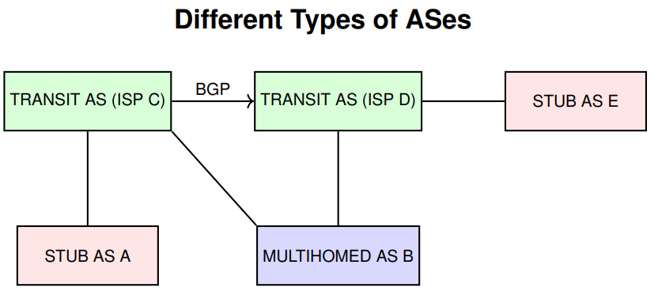

### AS Numbering and Identification

- An __Autonomous System (AS)__ is identified by a unique number called an __ASN__ (Autonomous System Number)
- ASN characteristics:
	+ Typically 16-bit (with 32-bit ASN in production since 2007)
	+ Assigned by __registrars__ under the coordination of __ICANN__
	+ Reserved private ASNs: `64512 to 65535`
	+ Only __non-stub AS__ require a registered ASN
- Full list and policies: IANA ASN Registry

> _Classless_ and _Subnet Address Extensions_ (CIDR) also apply to AS routing policies

### AS Identification: Why Two Number Formats?

- Initially, ASNs were 16 bits long (2 bytes): easy to manage, written as simple decimals (e.g., 65526)
- The growing number of ASes led to exhaustion of this range
- A new 32-bit format (4 bytes) was introduced—allowing over 4 billion ASNs
- To avoid confusion:
	+ __Asplain__: Decimal form of the full ASN (e.g., 234567)
	+ __Asdot__: Split form as High.Low (e.g., 1.169031)
- Asdot helps visually distinguish legacy 2-byte ASNs from 4-byte ones

| Format  | 2-byte ASN  | 4-byte ASN |
| -----   | ----------- | ---------- |
| Asplain | 1 to 65535  | 65536 to 4294967295 |
| Asdot   | 1 to 65535  | 1.0 to 65535.65535 |

- In Asdot, 2-byte ASNs appear the same. Format matters only for 4-byte ASNs
- In routers, 234567 may appear as 3.559 depending on the configured display mode

### Reserved and Private AS Numbers

__Reserved ASNs (RFC 5398)__

- Reserved for __documentation and examples__
- Prevent conflicts in case configs are copied into production
- Defined by RFC 5398 and registered by IANA

__Private ASNs__

- Used for internal routing domains (e.g., iBGP)
- Not intended for advertisement to the Internet

__BGP Consideration__

- Cisco IOS does __not__ remove private ASNs by default
- ISPs should __filter__ them at egress boundaries\

__Reserved ASN Ranges__:

| Format | Reserved Range |
| ------ | -------------- |
| 2-byte | 64496 to 64511 |
| 4-byte | 65536 to 65551 |

__Private ASN Ranges__:

| Format | Private Range  |
| ------ | -------------- |
| 2-byte | 64512 to 65534 |
| 4-byte | 4200000000 to 4294967294 |

### Path-Vector Routing in BGP

__How does node F learn to reach node D?__

- F receives paths from neighbors:
	+ From B: `BCD`
	+ From G: `GCD`
	+ From I: `IFGCD`
	+ From E: `EFGCD`
- F will select one based on BGP policies (e.g., path length)
- Loops are avoided by checking if own AS appears in path

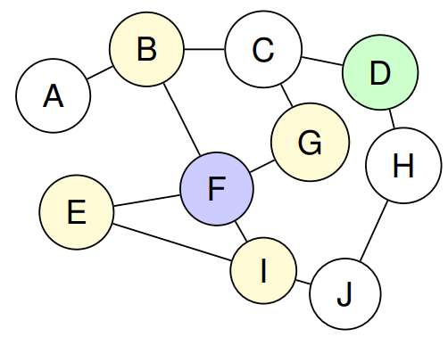

### BGP – Inter-AS Routing

__BGP (Border Gateway Protocol)__

- Standard protocol for routing between Autonomous Systems (ASes)
- __BGPv4__ is the current version (RFC 4271)

__Main Characteristics__:

- Supports __CIDR__, IPv6, and multicast routing
- Enables route aggregation to reduce routing information
- No restrictions on internal AS topology
- Assumes intra-AS routing is handled by IGPs (e.g., OSPF, RIP)
- Allows interconnection between ASes running different IGPs


### Real-World AS Numbers – Examples of Major ISPs

- __AT&T__ - AS7018 (USA)
- __Vodafone__ - AS1273 (UK)
- __Orange__ - AS3215 (FR)
- __Colt__ - AS8220 (EU-wide)
- __Google__ - AS15169 (USA)
- __Meta (Facebook)__ - AS32934 (USA)

> Source: [bgp.he.net](https://bgp.he.net) - BGP and AS lookup


### Who Owns the Most IPv4 Addresses?

- Not all ASes are equal — some originate massive blocks of IPv4 addresses
- AS749 (DoD NIC) and AS16509 (Amazon) top the global list
- Tier-1 providers (e.g., AT&T – AS7018) also control large IP space
- This impacts routing table size and peering decisions
- IPv4 scarcity adds value to historical allocations

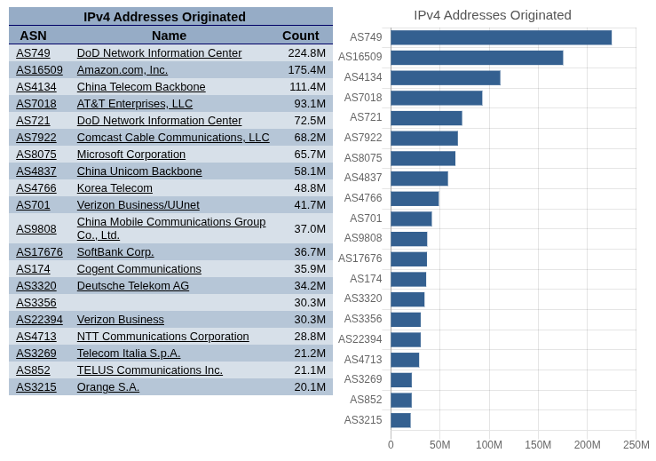

### BGP Prefix Growth Over Time

- __IPv4 Prefixes__: Steady growth since 2010, exceeding 1.1 million entries in 2025
- __IPv6 Prefixes__: Sharper relative increase, indicating ongoing deployment and adoption


---

## Internet Economic Models

### AS Economical Relationships

#### Provider

An AS that offers upstream connectivity to another AS. Example: __FCCN is the provider for ISEL, ISEP, and COLT__.

- It announces all Internet routes to its customers.

#### Customer

An AS that pays another for Internet connectivity. Example: __ISEL, ISEP, and COLT are customers of FCCN or ALTICE__

- Announces only its own prefixes (its address space)
- Imports all Internet routes

#### Peer

A reciprocal agreement to exchange customer routes without payment. Example: __FCCN peering with ALTICE or AT&T__

- __No money is exchanged__ if traffic is symmetric (balanced)
- Each peer announces only the prefixes of its __customers__
- Routes are established by mutual agreement
- Peering links are high-performance, often in IXPs

### Internet Provider Hierarchy with Commercial Relationships

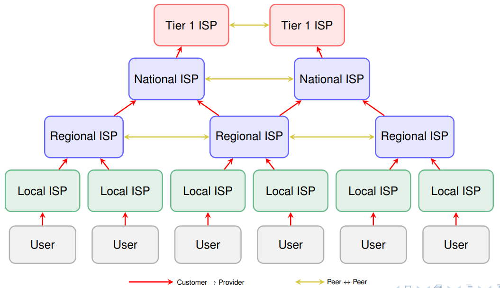

### AS Economic Relationships Example

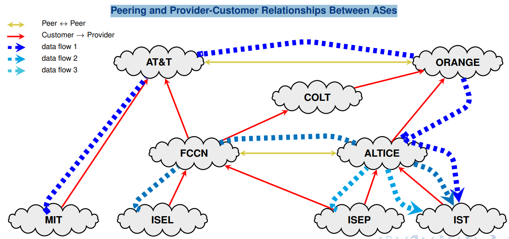

### Peers vs Customers vs Providers Roles in BGP

__Peer relationships__

- Peers provide transit between their own customers only
- Peers do __not__ provide transit to other peers’ customers
- Peers __often do not exchange money__ (if traffic is symmetric)


### AS Routes Export Strategies as a 2x2 Game


> __Note__: What each AS exports should align with the corresponding BGP relationship, and best practice dictates that only customer routes be shared with peers or providers

### Economic Relations in BGP

__To peer or not to peer__ - business considerations in BGP:

- __Peer__:
	+ reduces upstream transit costs
	+ can increase end-to-end performance (less latency)
	+ may be the only way to reach Tier 1 networks
- __Don't Peer__:
	+ you would rather have customers
	+ peers are often your competition
	+ peering may require renegotiation

---

## BGP Peering

### What is BGP Peering?

__BGP Peering Defined__

- __Peering__ refers to the relationship established between BGP routers to exchange routing information
- A BGP peering session is a __TCP connection over port 179__ used to exchange
route updates

### iBGP and eBGP Peering

__eBGP (External BGP)__

- Peering between routers in __different ASes__
- Requires direct physical or logical connection
- Only incremental updates are exchanged
- Uses __TCP port 179__

__iBGP (Internal BGP)__:

- Peering between routers __within the same AS__
- Sessions do __not require direct connection__ — must be IP reachable
- Relies on __IGP (e.g., OSPF)__ to route iBGP packets
- Uses __TCP port 179__ as well


### iBGP Session Configuration Example

```txt
router bgp <ASN >
  neighbor <ip > remote - as <ASN >
  neighbor <ip > update - source Loopback0
```

```txt
# Scenario: iBGP peering between R1 and R2
# Using loopback interfaces and IGP reachability

R1 ( config )# router bgp 65000
R1 ( config - router ) # neighbor 10.0.0.2 remote - as 65000
R1 ( config - router ) # neighbor 10.0.0.2 update - source Loopback0

R2 ( config )# router bgp 65000
R2 ( config - router ) # neighbor 10.0.0.1 remote - as 65000
R2 ( config - router ) # neighbor 10.0.0.1 update - source Loopback0
```

> __Note__: iBGP sessions are established between routers in the same AS. Loopback interfaces are typically used for increased stability, and IGP must provide reachability to those loopbacks

### eBGP Session Configuration Example

```txt
router bgp <ASN >
  neighbor <ip > remote-as <peer-ASN>
```

```txt
# Scenario: eBGP peering between R1 (AS 65000) and R2 (AS 65100)
# Using directly connected interfaces

R1 ( config )# router bgp 65000
R1 ( config - router ) # neighbor 192.0.2.2 remote - as 65100

R2 ( config )# router bgp 65100
R2 ( config - router ) # neighbor 192.0.2.1 remote - as 65000
```

> __Note__: eBGP sessions are formed between routers in different ASes and typically use directly connected physical interfaces. Loopbacks are optional but require `ebgp-multihop` and manual update-source settings

### iBGP + eBGP + IGP: Integration Strategies

__Goal__: Ensure all internal routers know the external (eBGP-learned) routes

- Option 1 - Redistribuition:
	+ Inject BGP routes into IGP (e.g., OSPF)
	+ Not recommended → excessive route flooding
- Option 2 - Route Injection via iBGP:
	+ All routers run iBGP + IGP
	+ BGP routes inserted into FIB (forwarding table)
	+ Recursive lookup via IGP to reach BGP next hop
	+ Scales with __Route Reflectors__ or __Confederations__
	
#### Option 1: Redistribute eBGP Routes into IGP

```txt
router ospf <process>
	redistribute bgp <ASN> subnets
```

```txt
# Scenario: eBGP-learned prefixes injected into OSPF
R1 ( config )# router ospf 1
R1 ( config - router ) # redistribute bgp 65000 subnets

# All BGP routes are flooded as external LSAs
# Internal routers see BGP routes as OSPF external
```

> __Note__: This method breaks BGP policy control, pollutes the IGP with external prefixes, and increases convergence time. Use only in small or static deployments

#### Option 2: Propagate eBGP Routes via iBGP

```txt
router bgp <ASN>
  neighbor <ip> remote-as <ASN>
  neighbor <ip> update-source Loopback0
```

```txt
# Scenario: eBGP routes injected into BGP
# and propagated via iBGP to internal routers

R1 ( config )# router bgp 65000
R1 ( config - router ) # neighbor 10.0.0.2 remote - as 65000
R1 ( config - router ) # neighbor 10.0.0.2 update - source Loopback0

# Internal routers perform recursive lookup to reach eBGP next-hop
```

> __Note__: This approach preserves BGP policy control, supports route maps and filtering, and scales efficiently with route reflectors or confederations

### iBGP Scaling Challenges


#### Full-Mesh Problems:

- __N(N-1)/2 sessions__ for full connectivity
- Each router must peer with __N-1__ others
- Adding 1 router __requires reconfiguring__ all others
- Routing table size __grows with alternate paths__
- Routers __process updates__ for all neighbors
- Routers __do not forward__ iBGP-learned routes to other iBGP peers
- AS_PATH is not modified in iBGP → loops not detected

#### Scalability Solutions:

- Buy more powerfull routers!...
- Break AS  into __subASes__
- Use __Route Reflectors__
- Use __BGP Confedereations__

### iBGP Optimization with Route Reflector

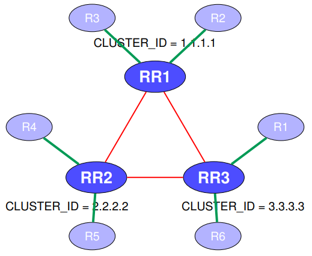

__Route Reflector (RR) Strategy__:

- __Route Reflectors__ propagate iBGP routes to clients
- Reflectors forward __only best paths__
- Reduces full-mesh overhead: clients peer __only with RRs__
- `ORIGINATOR_ID` marks the router that originated the route
- `CLUSTER_LIST` accumulates the IDs of RRs that reflected the route
- These attributes ensure that routes are __discarded__ if received back from the originator or if they re-enter the same cluster

#### Route Reflector Configuration Example

```txt
router bgp <ASN>
	neighbor <ip> remote-as <ASN>
	neighbor <ip> update-source Loopback0
	neighbor <ip> route-reflector-client  
```

```txt
# Scenario: R1 = RR; R2 and R3 = iBGP clients
R1 ( config )# router bgp 65000
R1 ( config - router ) # neighbor 10.0.0.2 remote - as 65000
R1 ( config - router ) # neighbor 10.0.0.3 remote - as 65000
R1 ( config - router ) # neighbor 10.0.0.2 update - source Loopback0
R1 ( config - router ) # neighbor 10.0.0.3 update - source Loopback0
R1 ( config - router ) # neighbor 10.0.0.2 route - reflector - client
R1 ( config - router ) # neighbor 10.0.0.3 route - reflector - client

R3 ( config )# router bgp 65000
R3 ( config - router ) # neighbor 10.0.0.1 remote - as 65000
R3 ( config - router ) # neighbor 10.0.0.1 update - source Loopback0  
```

#### Cluster ID Setting in a Route Reflector Cluster

__Loop Prevention in iBGP__:

- In a full iBGP mesh, loops are prevented because:
	- Routers __do not forward iBGP-learned routes__ to other iBGP peers
	- Each router learns routes directly from the originator
* Route Reflectors relax this rule by allowing iBGP route reflection, which can cause __loops beteween reflectors__

__Loop Prevention with RRs__:

- `ORIGINATOR_ID` marks the route's originator
- `CLUSTER_LIST` tracks the RRs the route has passed through
- __All the RRs in the same cluster must share the same `CLUSTER_ID`

#### Route Reflector Loop Prevention: Setting CLUSTER_ID

```txt
router bgp <ASN>
	bgp cluster-id <id>
	neighbor <ip> route-reflector-client  
```

```txt
 # Scenario: R1 and R2 are redundant RRs in the same cluster
R1 ( config )# router bgp 65000
R1 ( config - router ) # bgp cluster - id 1.1.1.1
R1 ( config - router ) # neighbor 10.0.0.2 remote - as 65000
R1 ( config - router ) # neighbor 10.0.0.2 route - reflector - client

R2 ( config )# router bgp 65000
R2 ( config - router ) # bgp cluster - id 1.1.1.1
R2 ( config - router ) # neighbor 10.0.0.3 remote - as 65000
R2 ( config - router ) # neighbor 10.0.0.3 route - reflector - client 
```

> __Note__: Redundant Route Reflectors in the same cluster must share the same `CLUSTER_ID`. This ensures that reflected routes are not re-accepted and re-reflected between them, preventing persistent routing loops

### BGP Confederations: Hierarchical iBGP at Scale

__Key Concepts__:

- Confederations break a large AS into __sub-ASes__
- Each sub-AS uses iBGP internally (with or without RRs)
- Sub-ASes are connected via __confederation eBGP__
- `AS_PATH` is preserved internally, but loop checks are relaxed
- To external peers, the network appears as a __single AS__

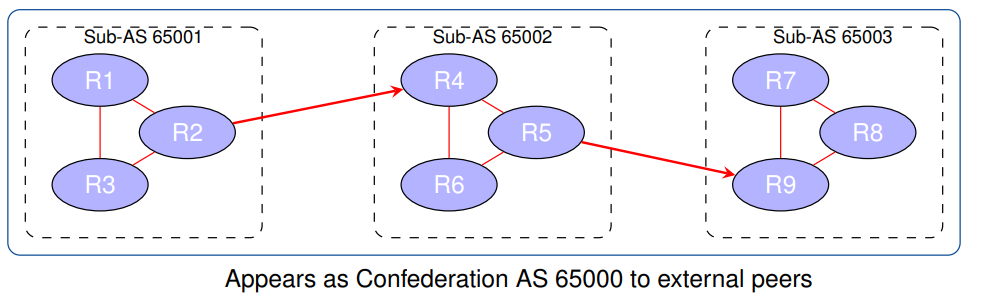

#### BGP Confederation Configuration

```txt
router bgp <sub-AS>
	bgp confederation identifier <global-AS>
	bgp confederation peers <peer-sub-AS>
	neighbor <ip> remote-as <peer-sub-AS>
```

```txt
# R1 in Sub-AS 65001 (part of Confederation AS 65000) ----------------------------
R1 ( config )# router bgp 65001
R1 ( config - router ) # bgp confederation identifier 65000
R1 ( config - router ) # bgp confederation peers 65002
R1 ( config - router ) # neighbor 10.0.0.2 remote - as 65001
R1 ( config - router ) # neighbor 10.0.0.3 remote - as 65002
R1 ( config - router ) # neighbor 10.0.0.2 update - source Loopback0
R1 ( config - router ) # neighbor 10.0.0.3 update - source Loopback0

# R2 in same sub-AS (65001) ------------------------------------------------------
R2 ( config )# router bgp 65001
R2 ( config - router ) # bgp confederation identifier 65000
R2 ( config - router ) # bgp confederation peers 65002
R2 ( config - router ) # neighbor 10.0.0.1 remote - as 65001
R2 ( config - router ) # neighbor 10.0.0.1 update - source Loopback0

# R3 in Sub-AS 65002 (confederation AS 65000) ------------------------------------
R3 ( config )# router bgp 65002
R3 ( config - router ) # bgp confederation identifier 65000
R3 ( config - router ) # bgp confederation peers 65001
R3 ( config - router ) # neighbor 10.0.0.1 remote - as 65001
R3 ( config - router ) # neighbor 10.0.0.1 update - source Loopback0
```

> __Note__: Routers in the same sub-AS peer via iBGP. Confederation peers must be declared to allow eBGP-like behavior across sub-AS boundaries

> __Note__: eBGP-like sessions between sub-ASes include internal AS numbers in the `AS_PATH` using `AS_CONFED_SEQ`. External peers see only the global AS 65000

### BGP Peers

- In traditional BGP configuration, identical settings are applied to many neighbors manually
- This leads to:
	+ __Redundant lines of configuration__
	+ __Higher risk of inconsistency or typos__
	+ __Scalability issues__ in lage iBGP topologies
- __Peer groups__ allow you to define common parameters once and apply them to multiple peers
- Especially useful in iBGP full meshes or RR topologies with many internal peers
- Especially useful in iBGP full meshes or RR topologies with many internal peers

> __GOAL__: Simplify neighbor configuration by grouping peers with common attributes

#### BGP Configuration: Traditional vs. Peer Group (Example)

__Traditional Configuration__

```txt
router bgp 65000
neighbor 10.0.0.1 remote-as 65001
neighbor 10.0.0.1 update-source lo0
neighbor 10.0.0.1 send-community
neighbor 10.0.0.1 next-hop-self
neighbor 10.0.0.2 remote-as 65001
neighbor 10.0.0.2 update-source lo0
neighbor 10.0.0.2 send-community
neighbor 10.0.0.2 next-hop-self  
```

- Redundant settings repeat for each neighbor
- Tedious to manage in large networks

__With Peer Group__

```txt
router bgp 65000
neighbor IBGP peer-group
neighbor IBGP remote-as 65001
neighbor IBGP update-source lo0
neighbor IBGP send-community
neighbor IBGP next-hop-self
neighbor 10.0.0.1 peer-group IBGP
neighbor 10.0.0.2 peer-group IBGP  
```

- Common parameters defined once
- Easy to update and scale

> Peer groups simplify neighbor configuration, reduce duplication, and lower operational risk

---

## BGP Messages

### Overview

- __OPEN__ - start TCP session (port 179) and authenticates peer
- __UPDATE__ - advertises new path (or withdraws a route)
- __KEEPALIVE__ - keeps session alive; also ACKs OPEN
- __NOTIFICATION__ - reports errors and closes session

### BGP OPEN Message Format (Type=1)

- Sent after TCP connection is established
- Required to initiate a BGP session
- Acknoledge with a __KEEPALIVE__ message
- Errors trigger a __NOTIFICATION__ message
- Contains key fields:
	+ __Version__ (BGP-3 or BGP-4)
	+ __My AS__: sender's Autonomous System
	+ __Hold Time__: time between messages
	+ __BGP Identifier__: router ID
	+ __Optional Parameters__: list in `<type, length, value>`
	

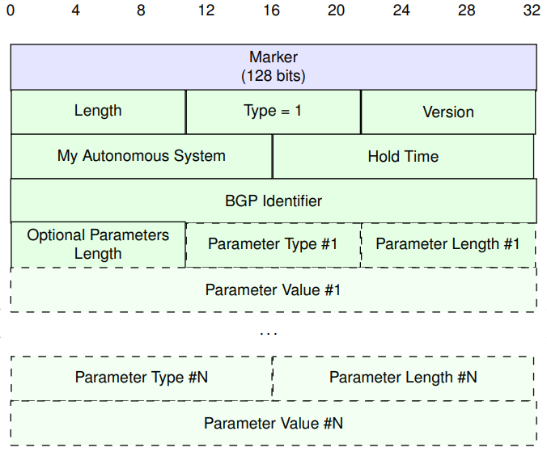

### BGP UPDATE Message Format (Type=2)

- Used to advertise or withdraw routes
- Sent after session is established with OPEN
- Contains 4 main sections:
	+ __Witdraw Routes Length__
	+ __Withdrawn Routes__: list of prefixes to withdraw
	+ __Path Attributes__: BGP attributes (AS_PATH, NEXT_HOP, etc.)
	+ __Network Layer Reachability Information (NLRI)__: prefixes to be advertised
- If length = 0, section is omitted
- Essential for incremental route updates

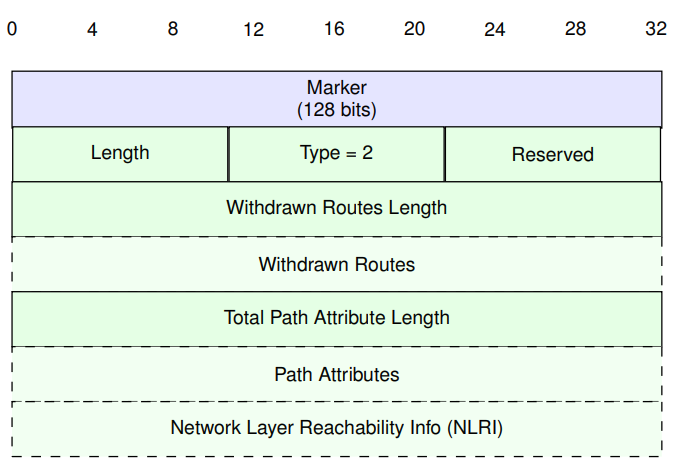

### BGP NOTIFICATION Message Format (Type=3)

- Sent when a fatal error is detected in dthe BGP session
- Used to terminate the connection gracefully
- Includes information to help the peer identify the reason:
	+ __Error Code__
	+ __Error Subcode__
	+ __Data (optional)__ - aditional error context
- Upon sending, thesession is closed immediately
- Common causes:
	+ Malformed messages
	+ Incopatible parameters
	+ Hold timer expirity
	
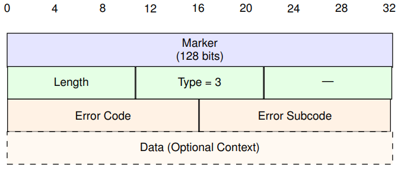

### BGP KEEPALIVE Message Format (Type=4)

- Ensures session liveliness between BGP peers
- Sent periodically after session reaches __Established__
- Also used to acknowledfe reception of a valid __OPEN__ message
- Contains only a header - no payload
- Must be received before the __HoldTimer__ expires
- If missing, triggers session termination via __NOTIFICATION__

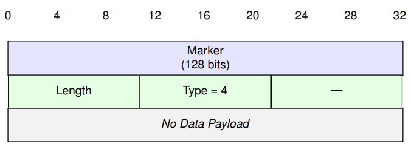

### BGP Finite State Machine (FSM)

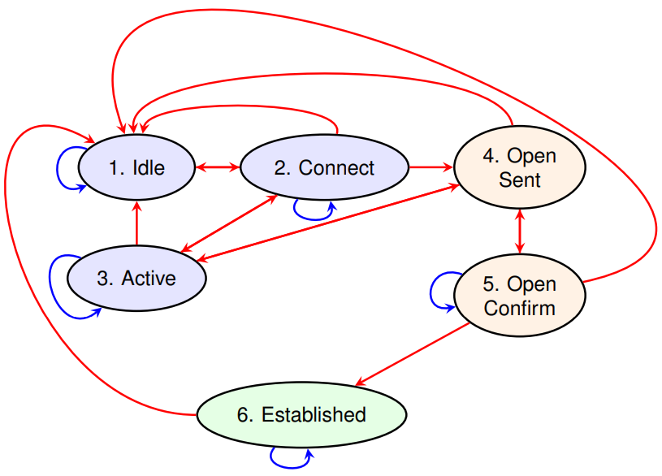

1. __Idle__: BGP starts and waits for or initiates a TPC connection. No BGP message exchanged
2. __Connect__: Attempts TCP connection (port 179). If it fails, trasitions to __Active__
3. __Active__: Retries TCP connection or passively waits for one. Success leads to __OpenSent__
4. __OpenSent__: Sends a __BGP OPEN__ message with version, ASN, router ID, and capabilities. Waits for a matching OPEN
5. __OpenConfirm__: Awaits a __KEEPALIVE__ to confirm session setup
6. __Established__: BGP session is active. Exchanges __UPDATE__ and periodic __KEEPALIVE__ messages

__NOTES__:

- Errors at any stage reset FSM to __Idle__ and trigger a __NOTIFICATION__ message
- __Hold Timer__: If it expires, reverts to __Idle__

### BGP Timer Types and Functions

| Timer | Used in State(s) | Function |  
| ----- | ---------------- | -------- |
| __ConnectRetryTimer__ | Idle, Connect, Active | Retries TCP connection after failure. Controls the interval between attenpts |  
| __HoldTimer__ | OpenSent, OpenConfirm, Established | Starts after receiving an OPEN message. If no KEEPALIVE or UPDATE is received before expirity, the session is terminated |  
| __Keepalive Timer__ | Established | Triggers periodic KEEPALIVE messages to ensure the session remains active |  

> All three timers help detect session failure and ensure timely recovery or reset

### Timers Across BGP FSM States

| State          | Timer(s)          | Purpose |
| -------------- | ----------------- | ------- | 
| 1. Idle        | ConnectRetryTimer | Schedule TCP connection attemps |
| 2. Connect     | ConnectRetryTimer | Await TCP handshake success |
| 3. Active      | ConnectRetryTimer | Retry or wait for TCP session |
| 4. OpenSent    | HoldTimer         | Await OPEN from peer |
| 5. OpenConfirm | HoldTimer         | Await KEEPALIVE to finalize session |
| 6. Established | KeepaliveTimer, HoldTimer | Maintain session via KEEPALIVE and validate peer |

> All BGP states use timers to detect loss of connectivity or unresponsive peers. Timeout events typically lead to a transition back to __Idle__

---

## BGP Route Advertisements

### Default Behavior of BGP Advertisement

- By default, BGP propagates __all known prefixes__ to all BGP neighbors 
- This behavior is almost never desirable in real/world deployments
- Without filters, a dual-homed customer may inadvertently __transit traffic between providers__
- Route filtering is essential to enforce commercial relationships and traffic policies
- __Example__: Client connected to two ISPs could relay ISP1 <-> ISP2 traffic, which should be avoided

### BGP Route Advertisement: Core Mechanisms

- Receives `UPDATE` messages carrying __Network Layer Reachability Information
(NLRI)__ (prefixes) and __path attributes__ from neighbors
- Applies __import policy__ to filter/modify inbound routes
- Runs the __decision process__ to select the best path per prefix
- State is kept in:
	+ __Control plane__: contains routing information bases with known prefixes
	+ __Data plane__: contains forwarding information for installed paths
- Applies __export policy__ to build per-neighbour information bases and send `UPDATEs`

### BGP Route Management — Control vs Data Plane

- The __BGP control plane__ is driven by `UPDATE` messages carrying __NLRI__ (prefixes) and __path attributes__
- Control-plane state is kept in __Routing Information Bases (RIBs)__:
	+ __Adj-RIB-In__ - per-neighbor routes as received (pre decision)
	+ __Loc-RIB__ - one _best path per prefix_ selected by the decision process
	+ __Adj-RIB-Out__ -  per-neighbor routes chosen for advertisement (after export policy)
- The __data plane__ uses the __Forwarding Information Base (FIB)__ — the IP forwarding table:
	+ Programmed from the __Loc-RIB__ (installed best paths)
	+ Used for packet forwarding; may also include IGP/static/connected routes
	+ __Important__: The FIB is _not_ the same as the RIBs; it contains only installed best routes
	
### BGP Route Processing (per Router)

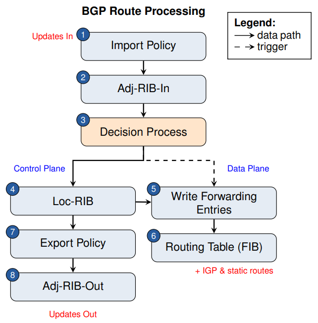

Step-by-step:

1. __Import Policy__ - inbound filters/sets applied to received UPDATEs
2. __Adj-RIB-In__ - holds routes as received (per peer), pre-decision
3. __Decision Process__ - selects one best path per prefix using attributes
4. __Loc-RIB__ - stores best paths chosen by the router
5. __Write Forwarding Entries__ - installs best next-hops into the FIB
6. __Routing Table (FIB)__ - used for data-plane forwarding; also includes IGP/static
7. __Export Policy__ - per-neighbor policy to filter/modify what is advertised
8. __Adj-RIB-Out__ -  per-peer set of routes ready to be sent

> __Notes__: Loc-RIB → FIB is one-way; changes in policy or IGP can retrigger selection

### BGP NEXT_HOP Behaviour Across AS Boundaries

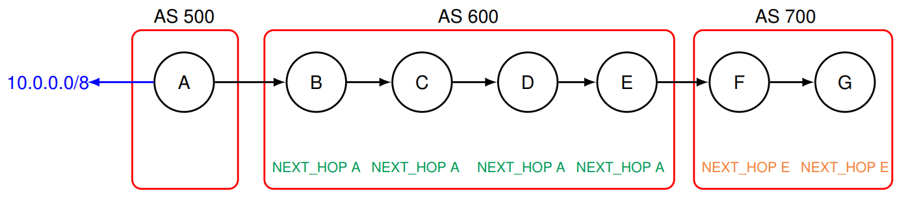

__The Next Hop Problem__:

- Prefix `10.0.0.0/8` is originated by router A in `AS 500`
- It is advertised via eBGP to B (`AS 600`), then via iBGP to `C`, `D` and `E`
- BGP `NEXT_HOP` remains as router `A` unless explicitly changed
- Routers `C`, `D`, and `E` will fail to reach the prefix if their IGP has no route to `A`

__Solution__:

- As `NEXT_HOP` stays unchanged across iBGP, a special setting is required to ensure reachability
- Configure `next-hop-self` on `B` to rewrite `NEXT_HOP` to its own IP
- The `next-hop-self` ensures all iBGP routers can forward correctly using IGP

__Configuration example for NEXT_HOP with `next-hop-self`__

```txt
router bgp <ASN>
	neighbor <iBGP-peer> remote-as <ASN>
	neighbor <iBGP-peer> next-hop-self  
```  

```txt
! Router B adds next-hop-self to iBGP neighbors --------------------------------
B(config)# router bgp 600
B(config-router)# neighbor 192.168.0.2 remote-as 600
B(config-router)# neighbor 192.168.0.3 remote-as 600

! Rewrite NEXT_HOP to B’s IP ---------------------------------------------------
B(config-router)# neighbor 192.168.0.2 next-hop-self
B(config-router)# neighbor 192.168.0.3 next-hop-self

! Routers C, D, and E now use B as NEXT_HOP ------------------------------------ 
```

> __Note__: `next-hop-self` ensures the route is reachable via IGP inside `AS 600`. This is critical when the original NEXT_HOP (Router A) is external

### BGP Route Decision Process

- __Decision process__:
	+ Applies to received routes and stores results in the __Loc-RIB__ (global to the BGP speaker)
	+ Selects one route per prefix among all received in the different __Adj-RIB-In__
	+ For each network prefix, only one best route is selected
- __When sending to neighbors__:
	+ Decides whether to send routes based on __export policy__
	+ May aggregate multiple routes into one, if applicable
	+ Stores selected routes in the __Adj-RIB-Out__ (one per BGP peer)
	+ Only routes learned via __eBGP__ are sent to __iBGP__ neighbors (iBGP-learned routes are not re-advertised to other iBGP peers)
	+ Sends `UPDATE` messages when __Adj-RIB-Out__ is changed
- __Route instalation in forwarding table:__
	+ Routes are installed either directly or via redistribution into the __IGP__
	
### Export Policy: Prefix Selection by Relationship

__Best practice__: Exported prefixes depend on the type of BGP relationship

- __To Providers or Peers__:
	- Only advertise your __own prefixes__ and __those of your direct customers__
	- __Do not__ advertise prefixes learned from other providers or peers
* __To costumers__
	- Advertise __all reachable prefixes__ (your own + all upstream and peer routes)
	
__Goal__: Prevent route leaks and enforce economic policy boundaries

### Consulting Adj-RIB-In (as received)

```txt
router bgp 65000
	neighbor 192.0.2.2 remote-as 65100
	neighbor 192.0.2.2 soft-reconfiguration inbound
```

Option A - Store Adj-RIB-In (classic way)

```txt
! Shows routes exactly as learned (pre-import policy)
R1 # show ip bgp neighbors 192.0.2.2 received-routes
```

Option B - Without storing (modern route-refresh)

```txt
! Shows routes accepted from the neighbor (post-import policy)
R1 # clear ip bgp 192.0.2.2 in refresh
R1 # show ip bgp neighbors 192.0.2.2 routes
```

__Notes__:

- `received-routes` = _pre-policy_; requires `soft-reconfiguration inbound`
- `routes` = _post-policy_ (what made it into your Adj-RIB-In after import policy)

### Consulting Loc-RIB (best path per prefix)

```txt
! Global BGP table; best path per prefix is marked (e.g., *>) ------------------
R1 # show ip bgp

! Drill into a single prefix (NLRI) to see attributes and the selected best ----
R1 # show ip bgp 203.0.113.0

! Filter entries whose AS-PATH ends in 65100 -----------------------------------
R1 # show ip bgp regexp _65100$

! Context: sessions, prefixes received/advertised, memory, timers --------------
R1 # show ip bgp summary  
```

__Notes__:

- The __Loc-RIB__ holds one best path per prefix (result of the decision process).
- In Cisco outputs, the best is typically marked (e.g., *>); only bests are candidates to install in the FIB
- If a best path isn’t installed, check `show ip bgp rib-failure` for the reason (AD, IGP, etc.)

### Consulting Adj-RIB-Out (advertised to a neighbor)

```txt
ip prefix-list TO-NBR seq 5 permit 203.0.113.0/24
route-map TO-NBR permit 10
match ip address prefix-list TO-NBR

router bgp 65000
neighbor 192.0.2.2 remote-as 65100
neighbor 192.0.2.2 route-map TO-NBR out  
```

Export policy example (optional)

```txt
! What your router advertises to 192.0.2.2 (post-export policy, per-neighbor Adj-RIB-Out)
R1# show ip bgp neighbors 192.0.2.2 advertised-routes  
```

__Notes__:

- Reflects _post-export policy_ content prepared for that neighbor
- Use it to verify route-maps, communities, MED, next-hop rewrites, etc.
- If the session is down, output may show what would be advertised (platform-dependent)

### Consulting the FIB (forwarding table)

```txt
! Installed route used by the data plane (FIB entry) -------------------------
R1 # show ip route 203.0.113.0

! Next-hop adjacency / interface resolution for that prefix ------------------
R1 # show ip cef 203.0.113.0 detail
```

__Notes__:

- The __FIB__ is programmed from __Loc-RIB__ best paths; it’s distinct from BGP RIBs
- `show ip route` confirms which path is installed; `show ip cef` shows actual forwarding
- For ECMP, expect multiple next-hops in CEF; for unresolved next-hops, check IGP reachability

---

## BGP Route Attributes

- A BGP __route announcement__ consists of two components:
	+ __Prefix (Destination Network)__: IP address block in CIDR format Example: 192.0.2.0/24 represents the destination network
	+ __Attributes__: Metadata used to describe or select the path
- A route announcement indicates __reachability__, but not how to forward packets (that role is assured by the Interior Gateway Protocol (IGP)

__BGP Route Announcement = Prefix + Attribute Values__

### BGP Attribute Families

| Class | Subtype | Attributes | Description | Key |
| ----- | ------- | ---------- | ----------- | --- |
| Well=Know | Mandatory | ORIGIN, AS-PATH, NEXTHOP | __Must be present__ in every route; all BGP speakers __must understand__ them | WN-M |
| Well=Know | Discretionary | ATOMIC-AGGREGATE, LOCAL-PREF | __Not required__ in every route, but __still recognized__ by all BGP speakers | WN-D |
| Optional | Transite |
| Optional | Non-Transit | WEIGHT (Cisco proprietary), MULTI EXIT DISCRIMINATOR (MED) | __Not propagated__ to other ASes; local use only. | O-NT |

__Notes__:

- Attribute classes determine whether BGP attributes are mandatory, propagated across ASes, or ignored if unknown
- Keys: WN-M = Well-Known Mandatory, WN-D = Well-Known Discretionary, O-T = Optional Transitive, O-NT = Optional Non-Transitive

### BGP Path Selection Criteria (Receiver’s Speaker Perspective)

| Step | Criteria/Attribute Used | Purpose                  | Source AS | Key |
| ---- | ----------------------- | ------------------------ | --------- | --- |
| 1  | __Weight__ (Cisco proprietary) | Local override to manually prefer paths | Local | O-NT |
| 2  | __Local Preference__ | Sets AS-wide outbound routing policy | Local | WN-D |
| 3  | __Locally Originated__ | Prefer routes injected by the local router | Local | - |
| 4  | __AS-PATH Length__ | Prefer shorter AS paths across domains | Remote | WN-M |
| 5  | __ORIGIN__ | Priority: IGP > EGP > incomplete | Remote | WN-M |
| 6  | __MED (Multi-Exit Disc)__ | Set by local AS to influence inbound traffic | Remote | O-NT |
| 7  | __eBGP over iBGP__ | Prefer external over internal paths | Local | - |
| 8  | __IGP Metric to Next-Hop__ | Prefer path whose BGP next-hop is closest by IGP | Local | - |
| 9  | __Router ID__ | Deterministic tie-breaker: lowest router ID | Local | - |
| 10 | __Neighbor IP Address__ | Final tie-breaker: lowest neighbor IP | Local | - |

__Notes__:

- Source AS: Local = decided/configured in our AS; Remote = attribute value originates outside our AS
- Keys: WN-M = Well-Known Mandatory, WN-D = Well-Known Discretionary, O-T = Optional Transitive, O-NT = Optional Non-Transitive

### Step 1: BGP Attribute WEIGHT (Cisco Proprietary)

__Concept__

- Used whern the __same prefix__  is learned via multiple neighbors
- __Higher value wins__. Default is 0
- __Local to the router__ — not advertised to peers
- Evaluated __before Local Preference__ in Cisco’s path selection

__Example__

- Several prefixes are received from R2 and R3
- R1 prefers R2 (__Weight 100__) over R3 (Weight 50)

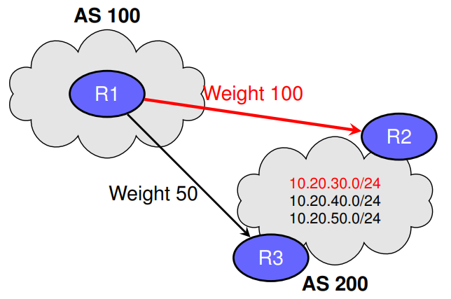

#### BGP Attribute WEIGHT - Configuration Examples

__Per-Neighbor Configuration (default)__

- Applies the same WEIGHT to all routes learned from a neighbour,
- All routes from R2 are preferred over R3

```txt
router bgp 100
	neighbor 192.0.2.2 remote-as 200         ! R2
	neighbor 192.0.2.3 remote-as 200         ! R3
	neighbor 192.0.2.2 weight 100
	neighbor 192.0.2.3 weight 50 
```

__Route Map Configuration (advanced filtering)__

- Only `10.20.30.0/24` from __R2__ is given higher priority
- Using this method, the higher WEIGHT is only applied to selected prefixes and selected neighbours

```txt
ip prefix-list PFX10 seq 5 permit 10.20.30.0/24
route-map PREFER-R2 permit 10
	match ip address prefix-list PFX10
	set weight 100
router bgp 100
	neighbor 192.0.2.2 route-map PREFER-R2 in  
```

> __Note__: Both methods are __local__ (to R1) and not advertised to other ASes

### Step 2: BGP Attribute LOCAL_PREF (Well-Known Discretionary)

__Concept__

- Sets the preferred exit point for the __entire AS__
- __Higher value wins__. Default is 100 (Cisco)
- __Propagated to all iBGP peers__ inside the AS
- Evaluated __after WEIGHT and before__ the “eBGP over iBGP” rule

__Example__

- __Policy on R6__: set `LOCAL_PREF 200` for routes learned from __R4__ (path via R2/AS300) and `100` for routes learned from __R5__ (path via R3/AS200)
- R6 __propagates__ these LOCAL_PREF values via iBGP; as a result, all routers in AS100 (including R5) prefer the R4→R2 exit for the affected routes

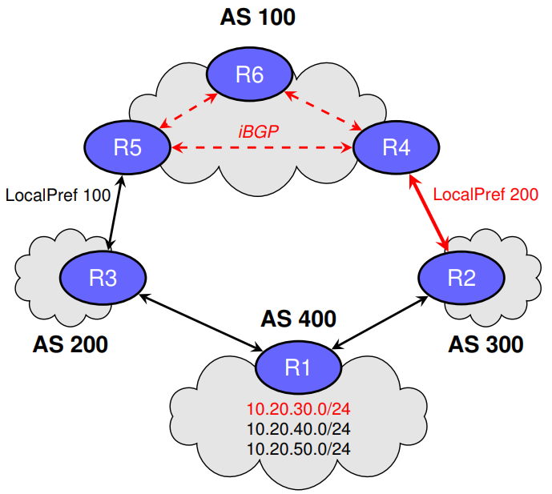

#### LOCAL_PREF - Configuration Examples on R6

__Uniform LOCAL_PREF by Neighbor (all routes)__

```txt
! On R6 (iBGP with R4 and R5) ---------------------------------------------
router bgp 100
neighbor 10.0.0.4 remote-as 100

! R4 ----------------------------------------------------------------------
neighbor 10.0.0.4 update-source lo0
neighbor 10.0.0.4 route-map LP_FROM_R4 in
neighbor 10.0.0.5 remote-as 100

! R5 ----------------------------------------------------------------------
neighbor 10.0.0.5 update-source lo0
neighbor 10.0.0.5 route-map LP_FROM_R5 in
route-map LP_FROM_R4 permit 10
set local-preference 200
route-map LP_FROM_R5 permit 10
set local-preference 100  
```

> Effect: R6 tags R4-learned paths with LP=200 and LP=100 from R5, then propagates across iBGP peers

__Selective LOCAL_PREF by Prefix (from R4)__

- Boost only `10.20.30.0/24` (from __R4__) to __LP=200__
- All other routes (from R4 or R5) keep default

```txt
! On R6 ----------------------------------------------------------------------
ip prefix-list PFX30 seq 5 permit 10.20.30.0/24
route-map LP_FROM_R4_SEL permit 10
	match ip address prefix-list PFX30
	set local-preference 200
route-map LP_FROM_R4_SEL permit 20
	set local-preference 100

# all other prefixes ----------------------------------------------------------
router bgp 100
	neighbor 10.0.0.4 route-map
LP_FROM_R4_SEL in  
```

> Effect: Only 10.20.30.0/24 via R4 is LP=200; AS100 prefers the R4→R2 exit just for that prefix

### Step 3: BGP Attribute Locally Originated (Implicit)

__Concept__

- A route is considered __locally originated__ if it was:
	+ Injected with a `network` statement.
	+ Redistributed from another routing protocol into BGP
	+ Advertised via `aggregate-address`
- Attribute applies __only on the router that originated the route__
- Preferred over any route learned via iBGP or eBGP for the __same prefix__

__Example__

- R1 originates `10.20.30.0/24` via `network`
- R1 also learns the same prefix via iBGP from R4 (which learned it from R3 in AS200)
- R1 selects its own originated route over the iBGP-learned alternative

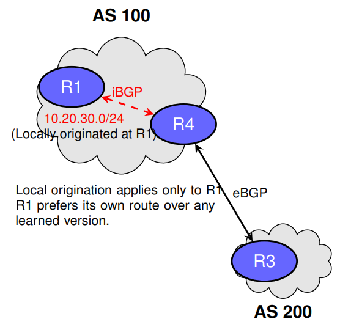

### Step 4: BGP Attribute AS-PATH Length (Well-Known Mandatory)

__Concept__

- __AS-PATH__: the set of AS numbers a route has traversed
- __Shorter path is preferred__ — fewer AS hops are generally assumed to be better
- __Prevents loops__: routes with the router’s own AS in AS-PATH are rejected
- Evaluated __after LOCAL_PREF__ in the BGP decision

__Example__

- R6 receives `10.20.30.0/24` from:
	+ R4 via AS300 (AS-PATH = {300, 400}) — length 2
	+ R5 via AS200, AS500, AS400 (AS-PATH = {200, 500, 400}) — length 3
- Both paths have equal LOCAL_PREF, so R6 prefers the path via R4 (shorter AS-PATH)

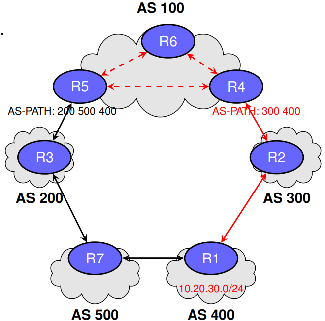

### Step 5: BGP Attribute ORIGIN (Well-Known Mandatory)

__Concept__

- Describes __how__ a prefix entered BGP at the __origin AS__
- Encoded in UPDATE messages; passed between BGP peers
- Three possible values (in order of preference):
	+ 1. __IGP__ - originated within the AS via `network` statement or aggregate
	+ 2. __EGP__ - originated by legacy EGP (before BGP - obsolete)
	+ 3. __INCOMPLETE__ - redistributed from a static route or from another routing protocol
- If tied so far, prefer the route with the __lowest__ ORIGIN type

__Example__

- R1 originates `10.20.30.0/24` with ORIGIN = IGP
- R4 learns the same prefix from R3 in AS200 with ORIGIN = INCOMPLETE
- If all other attributes are equal, both R1 and R4 prefer the path with ORIGIN = IGP

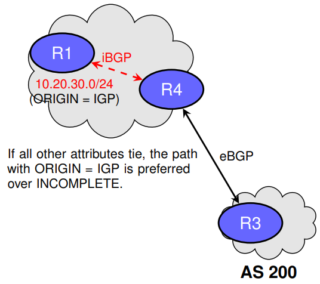

### Step 6: BGP Attribute Multi-Exit Discriminator (MED) - Optional-Non Transitive

__Conccept__

- Suggests preferred entry point into the advertising AS for an __external neighbour__ in UPDATE messages
- __Lower value wins__
- Compared only among routes received from the __same neighboring AS__
- Commonly used when two ASes are connected in multiple locations

__Example__

- AS200 is connected to AS100 via R2 and R3
- R2 advertises `10.20.30.0/24` to AS100 with MED 50
- R3 advertises the same prefix with MED 200
- AS100 prefers the path via R2 (lower MED)

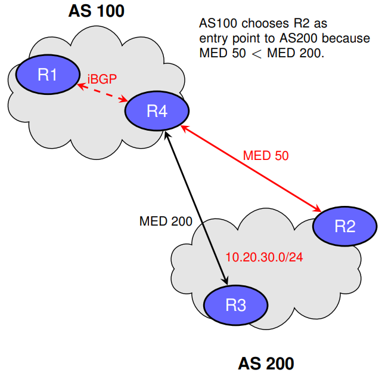

#### BGP Attribute MED — Configuration Examples (on AS200)

__Uniform MED per eBGP Neighbor__

- __R2__ advertises all routes to AS100 with __MED 50__
- __R3__ advertises all routes to AS100 with __MED 200__

```txt
! R2 (AS200) toward R4 in AS100 -----------------------------------------------
router bgp 200
neighbor 192.0.2.4 remote-as 100             ! R4
neighbor 192.0.2.4 route-map MED_50 out
route-map MED_50 permit 10
set metric 50                                ! MED

! R3 (AS200) toward R4 in AS100 -----------------------------------------------
router bgp 200
neighbor 192.0.2.14 remote-as 100            ! R4
neighbor 192.0.2.14 route-map MED_200 out
route-map MED_200 permit 10
set metric 200  
```

__Selective MED by Prefix (same neighbor)__

- Only `10.20.30.0/24` gets MED __50__ from R2
- Other prefixes keep default

```txt
! R2 (AS200) — MED only for 10.20.30.0/24 --------------------------------------
ip prefix-list PFX30 seq 5 permit 10.20.30.0/24
route-map MED_50_PFX permit 10
match ip address prefix-list PFX30
set metric 50
route-map MED_50_PFX permit 20
set metric 0 # or omit to leave MED unchanged
router bgp 200
neighbor 192.0.2.4 remote-as 100
neighbor 192.0.2.4 route-map MED_50_PFX out  
```

> Notes: AS100 (R4/R1) prefers the R2 path since both paths are from the __same neighbor AS__

### Step 7: BGP Path Selection - eBGP over iBGP

__Concept__

- Prefer routes learned via __external BGP__ over those learned via __internal BGP__
- Helps keep traffic exiting the AS as close to the entry point as possible
- Scope: Local decision on the router

__Example__

- R1 learns `10.20.30.0/24` from R2 via eBGP
- It also learns the same prefix via iBGP from R3
- R1 prefers the eBGP-learned path

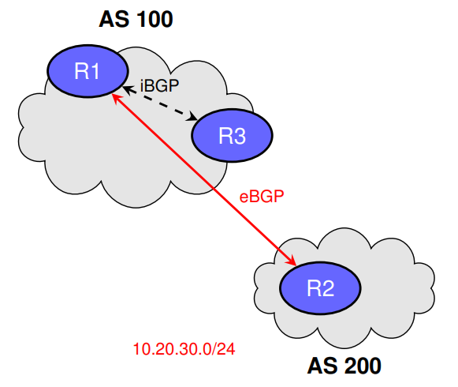

### Step 8: BGP Path Selection — IGP Metric to Next-Hop

__Concept__

- Prefer the path whose BGP __next-hop__ is __closest__ according to the IGP metric
- Ensures the shortest internal path to the egress point
- Scope: Local to the router

__Example__

- AS 200 and AS 300 each advertising the same prefix - 10.20.30.0/24
- R1 has two egress points (R2 and R3) for 10.20.30.0/24
- IGP cost to R2 = 10; to R3 = 20
- R1 selects the path via R2

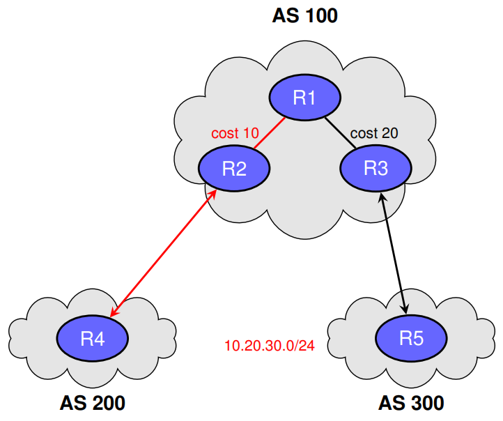

### Step 9: BGP Path Selection — Router ID

__Concept__

- If all previous attributes tie, prefer the path from the __BGP router__ with the __lowest Router ID (RID)__
- The Router ID is a 32-bit value, often set to the highest loopback IP, unless manually configured
- Scope: Local to the router

__Example__

- AS 200 and AS 300 both advertise `10.20.30.0/24`
- R1 learns the route via R2 (RID 2.2.2.2) and R3 (RID 3.3.3.3)
- IGP cost to R2 = 10; to R3 = 10 (tie)
- R1 selects the path via R2 because its RID is lower


### Step 10: BGP Path Selection — Neighbor IP Address

__Concept__

- Final tie-breaker: prefer the path learned from the neighbor with the __lowest IP address__
- Used only if all previous attributes (including Router ID) tie
- Scope: Local to the router

__Example__

- AS 200 and AS 300 both advertise `10.20.30.0/24`
- R1 learns the route from R2 (IP 192.0.2.2) and R3 (IP 192.0.2.3)
- IGP cost, Router ID, and other attributes are equal
- R1 selects the path via R2 because 192.0.2.2 is the lower neighbor IP

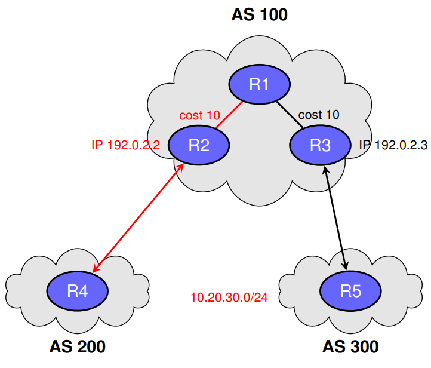

### Other BGP Attributes

__Context__

BGP includes additional attributes involved in best path selection, providing __additional control__, __route tagging__, or __topology information__. 

Key characteristics are the following:

- Influence __routing policies__ without changing the selected path
- Manage __traffic engineering__, __scalability__, or __coordination__ between ASes
- Recognised by __all BGP speakers__ even if not used in the decision process

__Examples__:

- `COMMUNITY` - Tags routes for policy-based actions
- `ATOMIC_AGGREGATE` - Indicates summarisation of routes
- `AGGREGATOR` -  Identifies the router performing aggregation
- `CLUSTER_LIST` -  Records route reflection path

### BGP Well-Known Communities

| Community  Value | Description | Example Use Case |
| ---------------- | ----------- | ---------------- |
| __no-export__    | Do not advertise to eBGP peers outside the local AS | Prevent upstream providers from learning internal prefixes |
| __no-advertise__ | Do not advertise to any BGP peer (iBGP or eBGP) | Keep a route only for internal diagnostics or testing |
| __internet__     | Advertise to all BGP peers globally | Publish a public service prefix to the entire Internet |
| __local-as__     | Do not advertise outside the local confederation | Hide routes from peers external to the confederation |

- Well-known communities are recognised by all BGP speakers and allow consistent routing policy enforcement across networks
- Communities are carried in the __UPDATE__ message, within the `COMMUNITIES` attribute
- Attribute Type: __Optional Transitive__ (preserved across AS boundaries)

#### BGP Well-Known Community — no-export

__Concept__

- Route is __not advertised__ to eBGP peers outside the local AS
- Still propagated to all iBGP peers within the AS
- Attribute Type: Optional Transitive

__Example__

- AS 100 originates `10.20.30.0/24` with the `no-export` community
- Internal routers receive it, but it is not sent to upstream AS 200

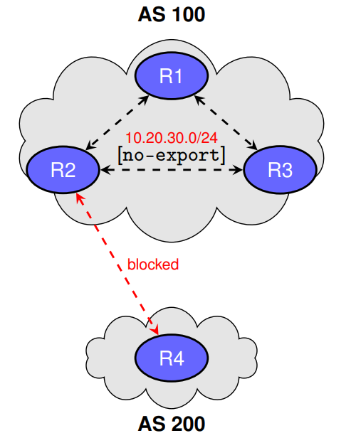

#### BGP Well-Known Community — no-export (Configuration Example)

__Objective__: Prevent advertising `10.20.30.0/24` to eBGP peers outside AS 100 while sharing with iBGP peers

__Configuration on R1 (Cisco IOS)__

- Define a route-map to set the `no-export` community for the prefix
- Apply the route-map to the network statement or redistribution process

__Example__

```txt
ip prefix-list PFX-NOEXPORT seq 5 permit 10.20.30.0/24
route-map SET-NOEXPORT permit 10
	match ip address prefix-list PFX-NOEXPORT
	set community no-export additive
router bgp 100
	neighbor 192.0.2.2 route-map SET-NOEXPORT out
```

__Key Notes__:

- The keyword `additive` ensures existing communities are preserved
- The community attribute is carried in the BGP __UPDATE__ message
- Optional Transitive — preserved across AS boundaries unless filtered

#### BGP Well-Known Community — no-advertise

__Concept__

- Route is __not advertised__ to any BGP peer (iBGP or eBGP)
- Remains local to the router that learned or originated it
- Attribute Type: Optional Transitive

__Example__

- AS 100 originates 10.20.30.0/24 with the `no-advertise` community
- Prefix is kept only on R1, not sent to R2, R3, or external peers

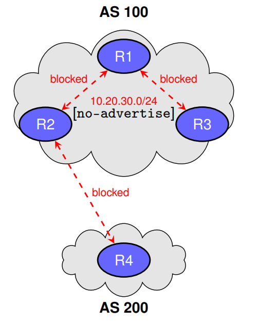

#### BGP Well-Known Community — no-advertise (Configuration Example)

__Objective__: Prevent advertising `10.20.30.0/24` to __any__ BGP peer (iBGP or eBGP)

__Configuration on R1 (Cisco IOS)__

- Define a route-map to set the `no-advertise` community for the prefix
- Apply the route-map to the network statement or redistribution process

__Example__

```txt
ip prefix-list PFX-NOADVERTISE seq 5 permit 10.20.30.0/24
route-map SET-NOADVERTISE permit 10
	match ip address prefix-list PFX-NOADVERTISE
	set community no-advertise additive
router bgp 100
	neighbor 192.0.2.2 route-map SET-NOADVERTISE out
```

__Key Notes__:

- This community prevents the route from leaving the local router’s BGP table
- Commonly used for internal testing or diagnostics
- Optional Transitive — preserved if sent, but this prevents sending entirely

#### BGP Well-Known Community — internet

__Concept__

- Route is advertised to __all BGP peers globally__
- No restrictions — full propagation
- Attribute Type: Optional Transitive

__Example__

- AS 100 originates `10.20.30.0/24` with the internet community
- All internal and external peers receive the route

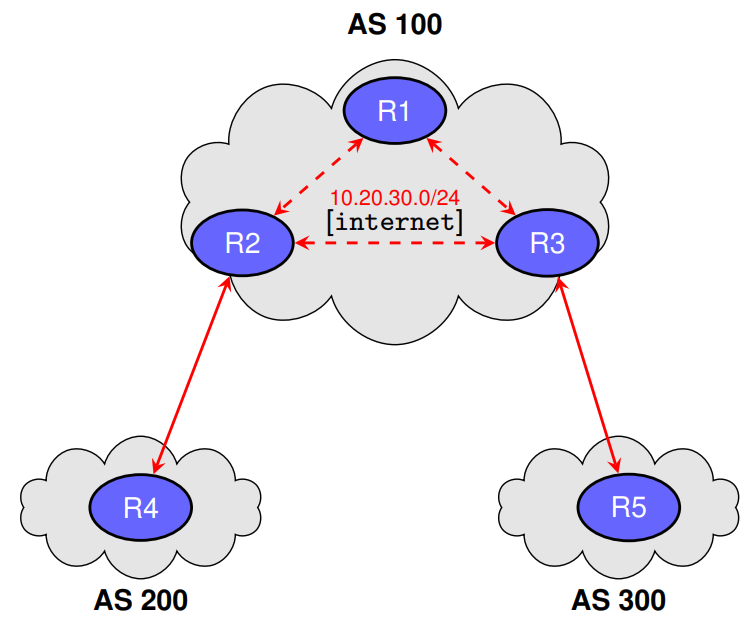

#### BGP Well-Known Community — internet (Configuration Example)

__Objective__: Ensure `10.20.30.0/24` is advertised to __all__ BGP peers globally

__Configuration on R1 (Cisco IOS)

- Define a route-map to set the `internet` community for the prefix
- Apply the route-map to the network statement or redistribution process

__Example__:

```txt
ip prefix-list PFX-INTERNET seq 5 permit 10.20.30.0/24
route-map SET-INTERNET permit 10
	match ip address prefix-list PFX-INTERNET
	set community internet additive
router bgp 100
	neighbor 192.0.2.2 route-map SET-INTERNET out
```

__Key Notes__:

- Indicates the route is suitable for advertisement to the entire Internet
- Common for public service prefixes (e.g., web, email)
- Optional Transitive — retained across AS boundaries

#### BGP Well-Known Community — local-as

__Concept__

- Route is not advertised outside the local __confederation__
- Still propagated to members of the same confederation
- Attribute Type: Optional Transitive

__Example__

- AS 65001 and AS 65002 are part of the same confederation
- Prefix `10.20.30.0/24` is sent within the confederation but not to upstream AS 200

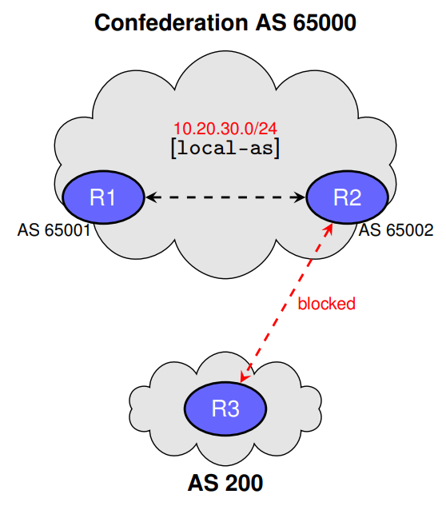

#### BGP Well-Known Community — local-as (Configuration Example)

__Objective__: Prevent advertising `10.20.30.0/24` to peers outside the local __confederation__

__Configuration on R1 (Cisco IOS)__

- Define a route-map to set the `local-as` community for the prefix
- Apply the route-map to the network statement or redistribution process

__Example__:

```txt
ip prefix-list PFX-LOCALAS seq 5 permit 10.20.30.0/24
route-map SET-LOCALAS permit 10
	match ip address prefix-list PFX-LOCALAS
	set community local-as additive
router bgp 65000
	neighbor 198.51.100.2 route-map SET-LOCALAS out  
```

__Key Notes__:

- Used in BGP confederations to hide routes from external peers
- Maintains control over routing visibility across sub-AS boundaries
- Optional Transitive — preserved if passed within the confederation

#### BGP Attribute — ATOMIC_AGGREGATE

__Concept__

- __Well-Known, Discretionary__; length = 0 (flag in UPDATE optional attributes)
- Set when BGP summarises more-specific routes (`aggregate-address`) and __drops AS_PATH detail__ (no as-set)
- With `summary-only`, specifics are suppressed in UPDATEs but kept in the RIB for forwarding
- Warns that the full AS_PATH is not preserved; prefer more-specific routes when available
- Often sent with AGGREGATOR to identify the summarising router

__Example__

- AS 100 summarises `10.20.30.0/24` and `10.20.31.0/24` into `10.20.0.0/16`
- __ATOMIC_AGGREGATE__ is attached to warn downstream ASes
- _Note_: Using `as-set` preserves the union of ASNs and avoids losing path detail

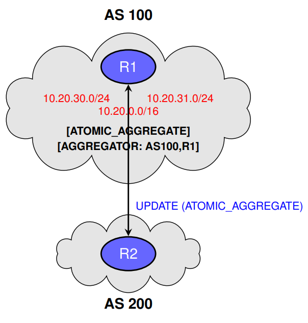

#### BGP Attribute — AGGREGATOR

__Concept__

- Often appears with __ATOMIC_AGGREGATE__ when aggregation removes AS_PATH detail
- __Optional, Transitive__ attribute; length = 6 bytes (ASN + IPv4 address of the router that formed the aggregate)
- Automatically added when a router creates an aggregate using `aggregate-address`
- Records the __ASN__ and __BGP Identifier__ (router ID) of the summarising router
- Used for __auditing, troubleshooting, and policy decisions__ by downstream ASes

__Forwarding / Policy Role__

- Provides traceability for where and by whom the route was summarised
- Helps operators understand the path history when specifics are not advertised

__Benefit__: Improves route transparency without increasing routing table size

__Example__:

- AS 100 aggregates `10.20.30.0/24` and `10.20.31.0/24` into `10.20.0.0/16`
- __BGP UPDATE to AS 200__:
	+ `ATOMIC_AGGREGATE`
	+ `AGGREGATOR: AS100, 1.1.1.1`
- __Meaning__:
	+ ASN = 100 → summarising AS
	+ Router ID = 1.1.1.1 → device that performed the aggregation
	
#### ATOMIC_AGGREGATE — Configuration (Cisco IOS)

__Baseline__

- R1 (AS 100) aggregates `10.20.30.0/24` and `10.20.31.0/24` into `10.20.0.0/16`
- eBGP to R2 (AS 200)

__Case A - Without as-set (ATOMIC_AGGREGATE expected)__

```txt
router bgp 100
	neighbor 198.51.100.2 remote-as 200
	! Summarise and hide specifics
	
! Ensure a matching route exists for the summary
ip route 10.20.0.0 255.255.0.0 Null0
```

__Case B - With as-set (preserves ASN union)__

```txt
router bgp 100
	neighbor 198.51.100.2 remote-as 200
	aggregate-address 10.20.0.0 255.255.0.0 summary-only as-set
ip route 10.20.0.0 255.255.0.0 Null0 
```

#### Purpose of the Null0 Route in BGP Aggregation

__Why it's needed__:
	
- BGP only advertises an __aggregate__ if a matching prefix exists in the routing table (RIB)
- The static route to `Null0` creates the aggregate prefix in the RIB
- Without it, BGP will not originate the summary

__Forwarding behaviour__:

- Routers always use the __longest prefix match__
- If a more-specific route exists (/24), it is preferred over the /16 Null0 route
- The /16 Null0 route is only used when no matching more-specific route exists

__Benefit__: Fewer __routing entries__ and __loop prevention__ by discarding traffic to unused parts of the aggregate

__Example__:

- __RIB contains__:
	+ `10.20.30.0/24` → Next hop: real interface
	+ `10.20.31.0/24` → Next hop: real interface
	+ `10.20.0.0/16` → Next hop: `Null0`
- __Forwarding__:
	+ Packet to `10.20.30.5` → match /24 → forwarded normally
	+ Packet to `10.20.99.1` → match /16 → sent to Null0 (discarded)

#### ATOMIC_AGGREGATE — Verification (Case A: No as-set)

__On R1 (AS 100)__

```txt
R1# show ip bgp 10.20.0.0
BGP routing table entry for 10.20.0.0/16
	Local
		0.0.0.0 from 0.0.0.0 (1.1.1.1)
			Origin IGP, localpref 100, weight 32768
			ATOMIC_AGGREGATE
			Aggregator: AS100, 1.1.1.1  
```

__On R2 (AS 200) - Received UPDATE__

```txt
R2# show ip bgp 10.20.0.0
BGP routing table entry for 10.20.0.0/16
	Received from 198.51.100.1 (eBGP)
	ATOMIC_AGGREGATE
	Aggregator: AS100, 1.1.1.1
	AS_PATH: 100  
```

#### ATOMIC_AGGREGATE — Verification (Case B: With as-set)

__On R1 (AS 100)__

```txt
R1# show ip bgp 10.20.0.0
BGP routing table entry for 10.20.0.0/16
	Local
		0.0.0.0 from 0.0.0.0 (1.1.1.1)
		Origin IGP, localpref 100, weight 32768
		Aggregator: AS100, 1.1.1.1  
```

__On R2 (AS 200) — Received UPDATE__

```txt
R2# show ip bgp 10.20.0.0
BGP routing table entry for 10.20.0.0/16
	Received from 198.51.100.1 (eBGP)
	Aggregator: AS100, 1.1.1.1
	AS_PATH: {65010 65020} 100
```

#### BGP Attribute — CLUSTER_LIST

__Concept__

- __Optional, Transitive__ attribute used in Route Reflection to prevent loops
- __Contains the __Cluster IDs__ of all RRs that have processed the route
- Each Route Reflector appends its own Cluster ID when reflecting the route
- If a router sees its own Cluster ID in the list, it discards the route

__Example__

- Route from AS 200 enters AS 100 at RR1 (CID: `10.10.10.10`) and is reflected to RR2 (CID: `20.20.20.20`)
- __CLUSTER_LIST grows as it is reflected__: `[10.10.10.10]` → `[10.10.10.10, 20.20.20.20]`
- If RR2 receives a route already containing 20.20.20.20, it rejects it to avoid a loop

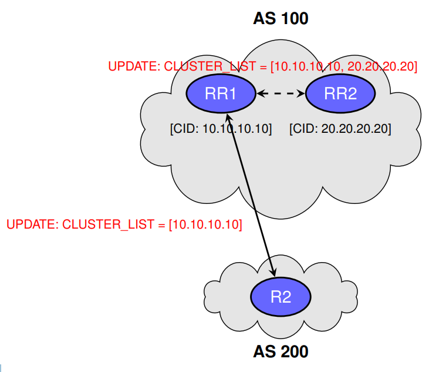

#### BGP Route Reflection — Cluster ID Configuration (Cisco IOS)

__Baseline__

- R1 and R3 are Route Reflectors in AS 100
- They serve the same clients (R2 and R4) in a single cluster
- To ensure loop prevention, both RRs must share the same __Cluster ID__

__Default behaviour__

- If not configured, the __Cluster ID__ = BGP Router ID
- This can cause different IDs in the same cluster, breaking loop detection

__Manual configuration (recommended)__

```txt
router bgp 100
	bgp cluster-id 10.10.10.10
	neighbor 192.0.2.2 route-reflector-client
	neighbor 192.0.2.3 route-reflector-client  
```

__Notes__:

- Use the same `bgp cluster-id` on all RRs in the cluster
- Ensures the CLUSTER_LIST is consistent and loop prevention works

---

## BGP Traffic Optimization