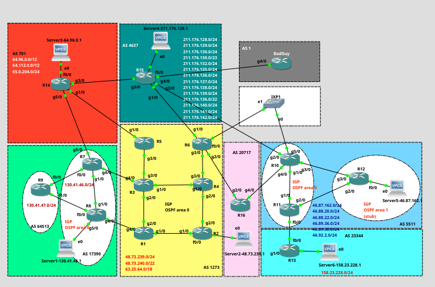

# Lab Project N.º 2 - BGP ROUTING CONFIGURATIONS

> REDES DE INTERNET (RI) 2025-2026

---

## Group 1 - Class 51D

### Professor Luís Mata

> luis.mata@isel.pt

- 45824 Nuno Venâncio
- 49420 André Carrilho
- 51454 Hugo Leal



<div style="page-break-after: always"></div>

## Index

- Introduction
- 1 - Phase 1 - IGP Configuration
	+ 1.1 - Objectives
	+ 1.2 - Implementation
	+ 1.3 - Test and Validation
	+ 1.4 - Practical Questions
- 2 - Phase 2 - iBGP and eBGP Without Routing Policies
	+ 2.1 - Objectives
	+ 2.2 - Implementation
	+ 2.3 - Test and Validation
	+ 2.4 - Practical Questions
- 3 - Phase 3 - Routing Policies Implementation
	+ 3.1 - Objectives
	+ 3.2 - Implementation
	+ 3.3 - Test and Validation
	+ 3.4 - Practical Questions
- 4 - Phase 4 - Influence the Internet Routing
	+ 4.1 - Objectives
	+ 4.2 - Implementation
	+ 4.3 - Test and Validation
	+ 4.4 - Practical Questions
- 5 - Phase 5 - Security Practices
	+ 5.1 - Objectives
	+ 5.2 - Implementation
	+ 5.3 - Test and Validation
	+ 5.4 - Practical Questions
- Conclusion
- Appendices
	+ IP Addressing for Lab Topology
	+ TCLSH (Tool Control Language) Shell for Testing
	
<div style="page-break-after: always"></div>

## Introduction

__TODO__

<div style="page-break-after: always"></div>

## 1 - Phase 1 - IGP Configuration

### 1.1 Objectives

- Configure the IP addresses for all the interfaces
- Configure the OSPF as per the design rules on the ASes
- Implement the OSPF multi-area topology in AS 5511: area 0 and area 1 (stub)
- Test the private infrastructure connectivity’s inside the ASes
- Test the interfaces connectivity between the ASes

### 1.2 Implementation

We assign IP addresses to all interfaces according to table 1 in Appendice _IP Addressing for Lab Topology_

Router example:

```txt
interface Loopback0
 ip address 10.1.1.1 255.255.255.255
!
interface Loopback1
 ip address 48.73.239.11 255.255.255.255
!
interface GigabitEthernet1/0
 ip address 10.1.2.1 255.255.255.252
 no shutdown
!
interface GigabitEthernet2/0
 ip address 10.1.3.1 255.255.255.252
 no shutdown
!
interface GigabitEthernet3/0
 ip address 48.73.240.1 255.255.255.252
 no shutdown
```

Server example:

```txt
ip 130.41.46.1 130.41.46.2 30
set pcname Server1
```

#### OSPF Configuration

__AS 1273__ - Vodafone

```txt
! All Routers -------------------------------------------------------------
router ospf 1

! ROUTER 1 ----------------------------------------------------------------
router-id 10.1.1.1
passive-interface default               ! block all interfaces from talk OSPF 
network 10.1.1.1 0.0.0.0 area 0         ! Lo0
network 48.73.239.11 0.0.0.0 area 0     ! Lo1
network 10.1.2.1 0.0.0.0 area 0         ! g1/0 -> R2
network 10.1.3.1 0.0.0.0 area 0         ! g2/0 -> R3
network 48.73.240.1 0.0.0.3 area 0      ! g3/0 - route for AS 17390
no passive-interface GigabitEthernet1/0 ! unlock OSPF g1/0 
no passive-interface GigabitEthernet2/0 ! unlock OSPF g2/0

! ROUTER 2 ----------------------------------------------------------------
router-id 10.2.2.2
passive-interface default               ! block all interfaces from talk OSPF
network 10.2.2.2 0.0.0.0 area 0         ! Lo0
network 48.73.239.22 0.0.0.0 area 0     ! Lo1
network 48.73.239.2 0.0.0.3 area 0      ! fa0/0 - route to AS 20717
network 10.1.2.2 0.0.0.0 area 0         ! g1/0 -> R1
network 10.2.4.1 0.0.0.0 area 0         ! g2/0 -> R4 
no passive-interface GigabitEthernet1/0 ! unlock OSPF on g1/0
no passive-interface GigabitEthernet2/0 ! unlock OSPF on g2/0

! ROUTER 3 ----------------------------------------------------------------
router-id 10.3.3.3
passive-interface default               ! block all interfaces from talk OSPF
network 10.3.3.3 0.0.0.0 area 0         ! Lo0
network 48.73.239.33 0.0.0.0 area 0     ! Lo1 
network 10.3.4.1 0.0.0.0 area 0         ! g1/0 -> R4
network 10.1.3.2 0.0.0.0 area 0         ! g2/0 -> R1
network 10.3.5.1 0.0.0.0 area 0         ! g3/0 -> R5
network 48.73.240.5 0.0.0.3 area 0      ! g4/0 - route to AS 17390
! activate internal interfaces to establish adjacencies
no passive-interface GigabitEthernet1/0
no passive-interface GigabitEthernet2/0
no passive-interface GigabitEthernet3/0

! ROUTER 4 ----------------------------------------------------------------
router-id 10.4.4.4
network 10.4.4.4 0.0.0.0 area 0         ! Lo0
network 48.73.239.44 0.0.0.0 area 0     ! Lo1
network 10.3.4.2 0.0.0.0 area 0         ! g1/0 -> R3
network 10.2.4.2 0.0.0.0 area 0         ! g2/0 -> R2
network 10.4.6.1 0.0.0.0 area 0         ! g3/0 -> R6
! Block Loopbacks from talking OSPF
passive-interface Loopback0
passive-interface Loopback1

! ROUTER 5 ----------------------------------------------------------------
router-id 10.5.5.5
passive-interface default               ! block all interfaces from talk OSPF
network 10.5.5.5 0.0.0.0 area 0         ! Lo0
network 48.73.239.55 0.0.0.0 area 0     ! Lo1
network 64.112.0.2 0.0.0.3 area 0       ! g1/0 - Route to AS 701
network 10.3.5.2 0.0.0.0 area 0         ! g3/0 -> R3
no passive-interface GigabitEthernet3/0 ! unlock OSPF on g3/0

! ROUTER 6 ----------------------------------------------------------------
router-id 10.6.6.6
passive-interface default               ! block all interfaces from talk OSPF
network 10.6.6.6 0.0.0.0 area 0         ! Lo0
network 48.73.239.66 0.0.0.0 area 0     ! Lo1
network 48.73.240.17 0.0.0.3 area 0     ! fa0/0 - Route to AS 5511
network 48.73.240.13 0.0.0.3 area 0     ! g1/0  - Route to AS 4637
network 48.73.240.21 0.0.0.3 area 0     ! g2/0  - Route to AS 20717
network 10.4.6.2 0.0.0.0 area 0         ! g3/0 -> R4
no passive-interface GigabitEthernet3/0 ! unlock OSPF on g3/0
```

__AS 17390__ - IBM

```txt
! ROUTER 7 ----------------------------------------------------------------
outer ospf 1
 router-id 10.7.7.7
 passive-interface default               ! block all interfaces from talk OSPF
 network 10.7.7.7 0.0.0.0 area 0         ! Lo0
 network 130.41.46.77 0.0.0.0 area 0     ! Lo1
 network 130.41.46.9 0.0.0.3 area 0      ! fa0/0 - Route to AS 64513 (private)
 network 10.7.8.1 0.0.0.0 area 0         ! g1/0 -> R8
 network 48.73.240.6 0.0.0.3 area 0      ! g4/0 - Route to AS 1273
 network 64.112.0.6 0.0.0.3 area 0       ! g5/0 - Route to AS 701
 no passive-interface GigabitEthernet1/0 ! unlock to talk OSPF

! ROUTER 8 ----------------------------------------------------------------
router ospf 1
 router-id 10.8.8.8
 passive-interface default               ! block all interfaces from talk OSPF
 network 10.8.8.8 0.0.0.0 area 0         ! Lo0
 network 130.41.46.88 0.0.0.0 area 0     ! Lo1
 network 130.41.46.5 0.0.0.3 area 0      ! fa0/0 - Route to AS 64513 (private)
 network 10.7.8.2 0.0.0.0 area 0         ! g1/0 -> R7
 network 48.73.240.2 0.0.0.3 area 0      ! g4/0 - Route to AS 1273
 network 130.41.46.2 0.0.0.3 area 0      ! g5/0 -> Server1
 no passive-interface GigabitEthernet1/0 ! Unlock interface to run OSPF
```

__AS 5511__ - FTRSI (Orange - Worldwide IP Backbone)

```txt
! ROUTER 10 ---------------------------------------------------------------
router ospf 1
 router-id 10.10.10.10
 passive-interface default             ! block all interfaces from talk OSPF
 network 10.10.10.10 0.0.0.0 area 0    ! Lo0
 network 46.87.162.110 0.0.0.0 area 0  ! Lo1
 network 10.10.11.1 0.0.0.0 area 0     ! g1/0 -> R11
 network 211.176.129.2 0.0.0.3 area 0  ! g2/0 - Route to AS 4637
 network 10.10.12.1 0.0.0.0 area 0     ! g3/0 -> R12
 network 46.88.20.1 0.0.0.3 area 0     ! g4/0 - Route to AS 20717
 ! FALTA a interface G5/0 -> IXP1 -> AS1273 (falar com o professor)
 ! unlock OSPF interfaces
 no passive-interface GigabitEthernet1/0
 no passive-interface GigabitEthernet3/0

! ROUTER 11 ---------------------------------------------------------------
router ospf 1
 router-id 10.11.11.11
 passive-interface default             ! block all interfaces from talk OSPF
 network 10.11.11.11 0.0.0.0 area 0    ! Lo0
 network 46.87.162.111 0.0.0.0 area 0  ! Lo1
 network 46.88.20.5 0.0.0.3 area 0     ! fa0/0 - Route to AS 23344
 network 10.10.11.2 0.0.0.0 area 0     ! g1/0 -> R10
 network 10.11.12.1 0.0.0.0 area 0     ! g2/0 -> R12
 ! unlock OSPF interfaces
 no passive-interface GigabitEthernet1/0
 no passive-interface GigabitEthernet2/0

! ROUTER 12 ---------------------------------------------------------------
router ospf 1
 router-id 10.12.12.12
 passive-interface default             ! block all interfaces from talk OSPF
 network 10.12.12.12 0.0.0.0 area 0    ! Lo0
 network 46.87.162.112 0.0.0.0 area 1  ! Lo1
 network 46.87.162.2 0.0.0.3 area 1    ! fa0/0 -> Server5
 network 10.11.12.2 0.0.0.0 area 0     ! g2/0 -> R11
 network 10.10.12.2 0.0.0.0 area 0     ! g3/0 -> R10
 area 1 stub                           ! area 1 as stub
 ! Unlock interfaces to exchange OSPF Hellos
 no passive-interface GigabitEthernet2/0
 no passive-interface GigabitEthernet3/0
```

### 1.3 Test and Validation

#### Test the private infrastructure connectivity’s inside the ASes

__AS 1273__ - Vodafone

```txt
! From Router 1 - Pings to all other AS routers Loopback 0 --------------

R1#ping 10.2.2.2 ! Router 2 ---------------------------------------------

Type escape sequence to abort.
Sending 5, 100-byte ICMP Echos to 10.2.2.2, timeout is 2 seconds:
!!!!!
Success rate is 100 percent (5/5), round-trip min/avg/max = 12/24/72 ms

R1#ping 10.3.3.3 ! Router 3 ---------------------------------------------

Type escape sequence to abort.
Sending 5, 100-byte ICMP Echos to 10.3.3.3, timeout is 2 seconds:
!!!!!
Success rate is 100 percent (5/5), round-trip min/avg/max = 12/16/36 ms

R1#ping 10.4.4.4 ! Router 4 ---------------------------------------------

Type escape sequence to abort.
Sending 5, 100-byte ICMP Echos to 10.4.4.4, timeout is 2 seconds:
!!!!!
Success rate is 100 percent (5/5), round-trip min/avg/max = 20/26/40 ms

R1#ping 10.5.5.5 ! Router 5 ---------------------------------------------

Type escape sequence to abort.
Sending 5, 100-byte ICMP Echos to 10.5.5.5, timeout is 2 seconds:
!!!!!
Success rate is 100 percent (5/5), round-trip min/avg/max = 24/25/32 ms

R1#ping 10.6.6.6 ! Router 6 ---------------------------------------------

Type escape sequence to abort.
Sending 5, 100-byte ICMP Echos to 10.6.6.6, timeout is 2 seconds:
!!!!!
Success rate is 100 percent (5/5), round-trip min/avg/max = 24/36/52 ms
```

OSPF configuration analysis

```txt
! ROUTER 1 --------------------------------------------------------------
R1#sh ip ospf database

            OSPF Router with ID (10.1.1.1) (Process ID 1)

		Router Link States (Area 0)

Link ID         ADV Router      Age         Seq#       Checksum Link count
10.1.1.1        10.1.1.1        1190        0x80000004 0x00CCE0 5
10.2.2.2        10.2.2.2        1175        0x80000004 0x001F76 5
10.3.3.3        10.3.3.3        1219        0x80000003 0x0054ED 6
10.4.4.4        10.4.4.4        1232        0x80000004 0x004A56 5
10.5.5.5        10.5.5.5        1219        0x80000003 0x0080BB 4
10.6.6.6        10.6.6.6        1185        0x80000003 0x006ADE 6

		Net Link States (Area 0)

Link ID         ADV Router      Age         Seq#       Checksum
10.1.2.2        10.2.2.2        1175        0x80000002 0x00609F
10.1.3.2        10.3.3.3        1219        0x80000002 0x005B9D
10.2.4.2        10.4.4.4        1232        0x80000002 0x00717C
10.3.4.2        10.4.4.4        1232        0x80000002 0x008C5D
10.3.5.2        10.5.5.5        1219        0x80000002 0x00875B
10.4.6.2        10.6.6.6        1185        0x80000002 0x009D3A
            
R1#sh ip route ospf
     48.0.0.0/8 is variably subnetted, 12 subnets, 2 masks
O       48.73.239.22/32 [110/2] via 10.1.2.2, 00:53:45, GigabitEthernet1/0
O       48.73.240.12/30 [110/4] via 10.1.3.2, 00:53:45, GigabitEthernet2/0
                        [110/4] via 10.1.2.2, 00:53:45, GigabitEthernet1/0
O       48.73.240.4/30 [110/2] via 10.1.3.2, 00:53:55, GigabitEthernet2/0
O       48.73.239.0/30 [110/2] via 10.1.2.2, 00:53:45, GigabitEthernet1/0
O       48.73.240.16/30 [110/4] via 10.1.3.2, 00:53:45, GigabitEthernet2/0
                        [110/4] via 10.1.2.2, 00:53:45, GigabitEthernet1/0
O       48.73.240.20/30 [110/4] via 10.1.3.2, 00:53:45, GigabitEthernet2/0
                        [110/4] via 10.1.2.2, 00:53:45, GigabitEthernet1/0
O       48.73.239.55/32 [110/3] via 10.1.3.2, 00:53:45, GigabitEthernet2/0
O       48.73.239.33/32 [110/2] via 10.1.3.2, 00:53:55, GigabitEthernet2/0
O       48.73.239.44/32 [110/3] via 10.1.3.2, 00:53:45, GigabitEthernet2/0
                        [110/3] via 10.1.2.2, 00:53:45, GigabitEthernet1/0
O       48.73.239.66/32 [110/4] via 10.1.3.2, 00:53:45, GigabitEthernet2/0
                        [110/4] via 10.1.2.2, 00:53:45, GigabitEthernet1/0
     64.0.0.0/30 is subnetted, 1 subnets
O       64.112.0.0 [110/3] via 10.1.3.2, 00:53:45, GigabitEthernet2/0
     10.0.0.0/8 is variably subnetted, 12 subnets, 2 masks
O       10.4.6.0/30 [110/3] via 10.1.3.2, 00:53:45, GigabitEthernet2/0
                    [110/3] via 10.1.2.2, 00:53:45, GigabitEthernet1/0
O       10.2.2.2/32 [110/2] via 10.1.2.2, 00:53:45, GigabitEthernet1/0
O       10.3.3.3/32 [110/2] via 10.1.3.2, 00:53:55, GigabitEthernet2/0
O       10.6.6.6/32 [110/4] via 10.1.3.2, 00:53:51, GigabitEthernet2/0
                    [110/4] via 10.1.2.2, 00:53:51, GigabitEthernet1/0
O       10.3.5.0/30 [110/2] via 10.1.3.2, 00:54:01, GigabitEthernet2/0
O       10.2.4.0/30 [110/2] via 10.1.2.2, 00:53:51, GigabitEthernet1/0
O       10.3.4.0/30 [110/2] via 10.1.3.2, 00:54:01, GigabitEthernet2/0
O       10.4.4.4/32 [110/3] via 10.1.3.2, 00:53:51, GigabitEthernet2/0
                    [110/3] via 10.1.2.2, 00:53:51, GigabitEthernet1/0
O       10.5.5.5/32 [110/3] via 10.1.3.2, 00:53:51, GigabitEthernet2/0

R1#sh ip ospf neighbor

Neighbor ID     Pri   State           Dead Time   Address         Interface
10.3.3.3          1   FULL/DR         00:00:38    10.1.3.2        GigabitEthernet2/0
10.2.2.2          1   FULL/DR         00:00:32    10.1.2.2        GigabitEthernet1/0

R1#sh ip ospf interface brief

Interface    PID   Area            IP Address/Mask    Cost  State Nbrs F/C
Lo0          1     0               10.1.1.1/32        1     LOOP  0/0
Lo1          1     0               48.73.239.11/32    1     LOOP  0/0
Gi3/0        1     0               48.73.240.1/30     1     DR    0/0
Gi2/0        1     0               10.1.3.1/30        1     BDR   1/1
Gi1/0        1     0               10.1.2.1/30        1     BDR   1/1
```

```txt
! ROUTER 2 --------------------------------------------------------------
R2#sh ip ospf database

            OSPF Router with ID (10.2.2.2) (Process ID 1)

		Router Link States (Area 0)

Link ID         ADV Router      Age         Seq#       Checksum Link count
10.1.1.1        10.1.1.1        1497        0x80000004 0x00CCE0 5
10.2.2.2        10.2.2.2        1480        0x80000004 0x001F76 5
10.3.3.3        10.3.3.3        1526        0x80000003 0x0054ED 6
10.4.4.4        10.4.4.4        1537        0x80000004 0x004A56 5
10.5.5.5        10.5.5.5        1526        0x80000003 0x0080BB 4
10.6.6.6        10.6.6.6        1490        0x80000003 0x006ADE 6

		Net Link States (Area 0)

Link ID         ADV Router      Age         Seq#       Checksum
10.1.2.2        10.2.2.2        1480        0x80000002 0x00609F
10.1.3.2        10.3.3.3        1526        0x80000002 0x005B9D
10.2.4.2        10.4.4.4        1537        0x80000002 0x00717C
10.3.4.2        10.4.4.4        1537        0x80000002 0x008C5D
10.3.5.2        10.5.5.5        1526        0x80000002 0x00875B
10.4.6.2        10.6.6.6        1490        0x80000002 0x009D3A
            
R2#sh ip ospf neighbor

Neighbor ID     Pri   State           Dead Time   Address         Interface
10.4.4.4          1   FULL/DR         00:00:32    10.2.4.2        GigabitEthernet2/0
10.1.1.1          1   FULL/BDR        00:00:32    10.1.2.1        GigabitEthernet1/0

R2#sh ip route ospf
     48.0.0.0/8 is variably subnetted, 12 subnets, 2 masks
O       48.73.240.12/30 [110/3] via 10.2.4.2, 00:58:38, GigabitEthernet2/0
O       48.73.240.0/30 [110/2] via 10.1.2.1, 00:58:48, GigabitEthernet1/0
O       48.73.240.4/30 [110/3] via 10.2.4.2, 00:58:38, GigabitEthernet2/0
                       [110/3] via 10.1.2.1, 00:58:48, GigabitEthernet1/0
O       48.73.240.16/30 [110/3] via 10.2.4.2, 00:58:38, GigabitEthernet2/0
O       48.73.240.20/30 [110/3] via 10.2.4.2, 00:58:38, GigabitEthernet2/0
O       48.73.239.11/32 [110/2] via 10.1.2.1, 00:58:48, GigabitEthernet1/0
O       48.73.239.55/32 [110/4] via 10.2.4.2, 00:58:38, GigabitEthernet2/0
                        [110/4] via 10.1.2.1, 00:58:48, GigabitEthernet1/0
O       48.73.239.33/32 [110/3] via 10.2.4.2, 00:58:38, GigabitEthernet2/0
                        [110/3] via 10.1.2.1, 00:58:48, GigabitEthernet1/0
O       48.73.239.44/32 [110/2] via 10.2.4.2, 00:58:38, GigabitEthernet2/0
O       48.73.239.66/32 [110/3] via 10.2.4.2, 00:58:38, GigabitEthernet2/0
     64.0.0.0/30 is subnetted, 1 subnets
O       64.112.0.0 [110/4] via 10.2.4.2, 00:58:38, GigabitEthernet2/0
                   [110/4] via 10.1.2.1, 00:58:48, GigabitEthernet1/0
     10.0.0.0/8 is variably subnetted, 12 subnets, 2 masks
O       10.4.6.0/30 [110/2] via 10.2.4.2, 00:58:38, GigabitEthernet2/0
O       10.1.3.0/30 [110/2] via 10.1.2.1, 00:58:48, GigabitEthernet1/0
O       10.3.3.3/32 [110/3] via 10.2.4.2, 00:58:38, GigabitEthernet2/0
                    [110/3] via 10.1.2.1, 00:58:48, GigabitEthernet1/0
O       10.1.1.1/32 [110/2] via 10.1.2.1, 00:58:48, GigabitEthernet1/0
O       10.6.6.6/32 [110/3] via 10.2.4.2, 00:58:43, GigabitEthernet2/0
O       10.3.5.0/30 [110/3] via 10.2.4.2, 00:58:43, GigabitEthernet2/0
                    [110/3] via 10.1.2.1, 00:58:53, GigabitEthernet1/0
O       10.3.4.0/30 [110/2] via 10.2.4.2, 00:58:43, GigabitEthernet2/0
O       10.4.4.4/32 [110/2] via 10.2.4.2, 00:58:43, GigabitEthernet2/0
O       10.5.5.5/32 [110/4] via 10.2.4.2, 00:58:43, GigabitEthernet2/0
                    [110/4] via 10.1.2.1, 00:58:53, GigabitEthernet1/0
                    
R2#sh ip ospf interface brief
Interface    PID   Area            IP Address/Mask    Cost  State Nbrs F/C
Lo0          1     0               10.2.2.2/32        1     LOOP  0/0
Lo1          1     0               48.73.239.22/32    1     LOOP  0/0
Gi2/0        1     0               10.2.4.1/30        1     BDR   1/1
Gi1/0        1     0               10.1.2.2/30        1     DR    1/1
Fa0/0        1     0               48.73.239.2/30     1     DR    0/0
```

```txt
! ROUTER 3 --------------------------------------------------------------
R3#sh ip ospf database

            OSPF Router with ID (10.3.3.3) (Process ID 1)

		Router Link States (Area 0)

Link ID         ADV Router      Age         Seq#       Checksum Link count
10.1.1.1        10.1.1.1        1688        0x80000004 0x00CCE0 5
10.2.2.2        10.2.2.2        1673        0x80000004 0x001F76 5
10.3.3.3        10.3.3.3        1716        0x80000003 0x0054ED 6
10.4.4.4        10.4.4.4        1729        0x80000004 0x004A56 5
10.5.5.5        10.5.5.5        1716        0x80000003 0x0080BB 4
10.6.6.6        10.6.6.6        1682        0x80000003 0x006ADE 6

		Net Link States (Area 0)

Link ID         ADV Router      Age         Seq#       Checksum
10.1.2.2        10.2.2.2        1673        0x80000002 0x00609F
10.1.3.2        10.3.3.3        1716        0x80000002 0x005B9D
10.2.4.2        10.4.4.4        1729        0x80000002 0x00717C
10.3.4.2        10.4.4.4        1729        0x80000002 0x008C5D
10.3.5.2        10.5.5.5        1715        0x80000002 0x00875B
10.4.6.2        10.6.6.6        1682        0x80000002 0x009D3A
            
R3#sh ip route ospf
     48.0.0.0/8 is variably subnetted, 12 subnets, 2 masks
O       48.73.239.22/32 [110/3] via 10.3.4.2, 01:01:23, GigabitEthernet1/0
                        [110/3] via 10.1.3.1, 01:01:23, GigabitEthernet2/0
O       48.73.240.12/30 [110/3] via 10.3.4.2, 01:01:23, GigabitEthernet1/0
O       48.73.240.0/30 [110/2] via 10.1.3.1, 01:01:33, GigabitEthernet2/0
O       48.73.239.0/30 [110/3] via 10.3.4.2, 01:01:23, GigabitEthernet1/0
                       [110/3] via 10.1.3.1, 01:01:23, GigabitEthernet2/0
O       48.73.240.16/30 [110/3] via 10.3.4.2, 01:01:23, GigabitEthernet1/0
O       48.73.240.20/30 [110/3] via 10.3.4.2, 01:01:23, GigabitEthernet1/0
O       48.73.239.11/32 [110/2] via 10.1.3.1, 01:01:33, GigabitEthernet2/0
O       48.73.239.55/32 [110/2] via 10.3.5.2, 01:01:33, GigabitEthernet3/0
O       48.73.239.44/32 [110/2] via 10.3.4.2, 01:01:33, GigabitEthernet1/0
O       48.73.239.66/32 [110/3] via 10.3.4.2, 01:01:23, GigabitEthernet1/0
     64.0.0.0/30 is subnetted, 1 subnets
O       64.112.0.0 [110/2] via 10.3.5.2, 01:01:33, GigabitEthernet3/0
     10.0.0.0/8 is variably subnetted, 12 subnets, 2 masks
O       10.4.6.0/30 [110/2] via 10.3.4.2, 01:01:23, GigabitEthernet1/0
O       10.2.2.2/32 [110/3] via 10.3.4.2, 01:01:23, GigabitEthernet1/0
                    [110/3] via 10.1.3.1, 01:01:23, GigabitEthernet2/0
O       10.1.2.0/30 [110/2] via 10.1.3.1, 01:01:23, GigabitEthernet2/0
O       10.1.1.1/32 [110/2] via 10.1.3.1, 01:01:33, GigabitEthernet2/0
O       10.6.6.6/32 [110/3] via 10.3.4.2, 01:01:23, GigabitEthernet1/0
O       10.2.4.0/30 [110/2] via 10.3.4.2, 01:01:33, GigabitEthernet1/0
O       10.4.4.4/32 [110/2] via 10.3.4.2, 01:01:37, GigabitEthernet1/0
O       10.5.5.5/32 [110/2] via 10.3.5.2, 01:01:37, GigabitEthernet3/0

R3#sh ip ospf neighbor

Neighbor ID     Pri   State           Dead Time   Address         Interface
10.5.5.5          1   FULL/DR         00:00:33    10.3.5.2        GigabitEthernet3/0
10.1.1.1          1   FULL/BDR        00:00:39    10.1.3.1        GigabitEthernet2/0
10.4.4.4          1   FULL/DR         00:00:33    10.3.4.2        GigabitEthernet1/0

R3#sh ip ospf interface brief
Interface    PID   Area            IP Address/Mask    Cost  State Nbrs F/C
Lo0          1     0               10.3.3.3/32        1     LOOP  0/0
Lo1          1     0               48.73.239.33/32    1     LOOP  0/0
Gi4/0        1     0               48.73.240.5/30     1     DR    0/0
Gi3/0        1     0               10.3.5.1/30        1     BDR   1/1
Gi2/0        1     0               10.1.3.2/30        1     DR    1/1
Gi1/0        1     0               10.3.4.1/30        1     BDR   1/1
```

```txt 
! ROUTER 4 --------------------------------------------------------------
R4#sh ip ospf database

            OSPF Router with ID (10.4.4.4) (Process ID 1)

		Router Link States (Area 0)

Link ID         ADV Router      Age         Seq#       Checksum Link count
10.1.1.1        10.1.1.1        1834        0x80000004 0x00CCE0 5
10.2.2.2        10.2.2.2        14          0x80000005 0x001D77 5
10.3.3.3        10.3.3.3        1862        0x80000003 0x0054ED 6
10.4.4.4        10.4.4.4        1873        0x80000004 0x004A56 5
10.5.5.5        10.5.5.5        1861        0x80000003 0x0080BB 4
10.6.6.6        10.6.6.6        1826        0x80000003 0x006ADE 6

		Net Link States (Area 0)

Link ID         ADV Router      Age         Seq#       Checksum
10.1.2.2        10.2.2.2        14          0x80000003 0x005EA0
10.1.3.2        10.3.3.3        1862        0x80000002 0x005B9D
10.2.4.2        10.4.4.4        1873        0x80000002 0x00717C
10.3.4.2        10.4.4.4        1873        0x80000002 0x008C5D
10.3.5.2        10.5.5.5        1861        0x80000002 0x00875B
10.4.6.2        10.6.6.6        1826        0x80000002 0x009D3A

R4#sh ip route ospf
     48.0.0.0/8 is variably subnetted, 12 subnets, 2 masks
O       48.73.239.22/32 [110/2] via 10.2.4.1, 01:03:38, GigabitEthernet2/0
O       48.73.240.12/30 [110/2] via 10.4.6.2, 01:03:38, GigabitEthernet3/0
O       48.73.240.0/30 [110/3] via 10.3.4.1, 01:03:48, GigabitEthernet1/0
                       [110/3] via 10.2.4.1, 01:03:38, GigabitEthernet2/0
O       48.73.240.4/30 [110/2] via 10.3.4.1, 01:03:48, GigabitEthernet1/0
O       48.73.239.0/30 [110/2] via 10.2.4.1, 01:03:38, GigabitEthernet2/0
O       48.73.240.16/30 [110/2] via 10.4.6.2, 01:03:38, GigabitEthernet3/0
O       48.73.240.20/30 [110/2] via 10.4.6.2, 01:03:38, GigabitEthernet3/0
O       48.73.239.11/32 [110/3] via 10.3.4.1, 01:03:48, GigabitEthernet1/0
                        [110/3] via 10.2.4.1, 01:03:38, GigabitEthernet2/0
O       48.73.239.55/32 [110/3] via 10.3.4.1, 01:03:48, GigabitEthernet1/0
O       48.73.239.33/32 [110/2] via 10.3.4.1, 01:03:48, GigabitEthernet1/0
O       48.73.239.66/32 [110/2] via 10.4.6.2, 01:03:38, GigabitEthernet3/0
     64.0.0.0/30 is subnetted, 1 subnets
O       64.112.0.0 [110/3] via 10.3.4.1, 01:03:48, GigabitEthernet1/0
     10.0.0.0/8 is variably subnetted, 12 subnets, 2 masks
O       10.2.2.2/32 [110/2] via 10.2.4.1, 01:03:38, GigabitEthernet2/0
O       10.1.3.0/30 [110/2] via 10.3.4.1, 01:03:48, GigabitEthernet1/0
O       10.3.3.3/32 [110/2] via 10.3.4.1, 01:03:48, GigabitEthernet1/0
O       10.1.2.0/30 [110/2] via 10.2.4.1, 01:03:38, GigabitEthernet2/0
O       10.1.1.1/32 [110/3] via 10.3.4.1, 01:03:48, GigabitEthernet1/0
                    [110/3] via 10.2.4.1, 01:03:38, GigabitEthernet2/0
O       10.6.6.6/32 [110/2] via 10.4.6.2, 01:03:39, GigabitEthernet3/0
O       10.3.5.0/30 [110/2] via 10.3.4.1, 01:03:49, GigabitEthernet1/0
O       10.5.5.5/32 [110/3] via 10.3.4.1, 01:03:49, GigabitEthernet1/0

R4#sh ip ospf neighbor

Neighbor ID     Pri   State           Dead Time   Address         Interface
10.6.6.6          1   FULL/DR         00:00:33    10.4.6.2        GigabitEthernet3/0
10.2.2.2          1   FULL/BDR        00:00:39    10.2.4.1        GigabitEthernet2/0
10.3.3.3          1   FULL/BDR        00:00:31    10.3.4.1        GigabitEthernet1/0

R4#sh ip ospf interface brief
Interface    PID   Area            IP Address/Mask    Cost  State Nbrs F/C
Lo0          1     0               10.4.4.4/32        1     LOOP  0/0
Lo1          1     0               48.73.239.44/32    1     LOOP  0/0
Gi3/0        1     0               10.4.6.1/30        1     BDR   1/1
Gi2/0        1     0               10.2.4.2/30        1     DR    1/1
Gi1/0        1     0               10.3.4.2/30        1     DR    1/1
```

```txt
! ROUTER 5 --------------------------------------------------------------
R5#sh ip ospf database

            OSPF Router with ID (10.5.5.5) (Process ID 1)

		Router Link States (Area 0)

Link ID         ADV Router      Age         Seq#       Checksum Link count
10.1.1.1        10.1.1.1        1966        0x80000004 0x00CCE0 5
10.2.2.2        10.2.2.2        147         0x80000005 0x001D77 5
10.3.3.3        10.3.3.3        1993        0x80000003 0x0054ED 6
10.4.4.4        10.4.4.4        2006        0x80000004 0x004A56 5
10.5.5.5        10.5.5.5        1991        0x80000003 0x0080BB 4
10.6.6.6        10.6.6.6        1959        0x80000003 0x006ADE 6

		Net Link States (Area 0)

Link ID         ADV Router      Age         Seq#       Checksum
10.1.2.2        10.2.2.2        147         0x80000003 0x005EA0
10.1.3.2        10.3.3.3        1993        0x80000002 0x005B9D
10.2.4.2        10.4.4.4        2006        0x80000002 0x00717C
10.3.4.2        10.4.4.4        2006        0x80000002 0x008C5D
10.3.5.2        10.5.5.5        1991        0x80000002 0x00875B
10.4.6.2        10.6.6.6        1959        0x80000002 0x009D3A

R5#sh ip route ospf
     48.0.0.0/8 is variably subnetted, 12 subnets, 2 masks
O       48.73.239.22/32 [110/4] via 10.3.5.1, 01:05:50, GigabitEthernet3/0
O       48.73.240.12/30 [110/4] via 10.3.5.1, 01:05:50, GigabitEthernet3/0
O       48.73.240.0/30 [110/3] via 10.3.5.1, 01:06:00, GigabitEthernet3/0
O       48.73.240.4/30 [110/2] via 10.3.5.1, 01:06:00, GigabitEthernet3/0
O       48.73.239.0/30 [110/4] via 10.3.5.1, 01:05:50, GigabitEthernet3/0
O       48.73.240.16/30 [110/4] via 10.3.5.1, 01:05:50, GigabitEthernet3/0
O       48.73.240.20/30 [110/4] via 10.3.5.1, 01:05:50, GigabitEthernet3/0
O       48.73.239.11/32 [110/3] via 10.3.5.1, 01:06:00, GigabitEthernet3/0
O       48.73.239.33/32 [110/2] via 10.3.5.1, 01:06:00, GigabitEthernet3/0
O       48.73.239.44/32 [110/3] via 10.3.5.1, 01:05:50, GigabitEthernet3/0
O       48.73.239.66/32 [110/4] via 10.3.5.1, 01:05:50, GigabitEthernet3/0
     10.0.0.0/8 is variably subnetted, 12 subnets, 2 masks
O       10.4.6.0/30 [110/3] via 10.3.5.1, 01:05:50, GigabitEthernet3/0
O       10.2.2.2/32 [110/4] via 10.3.5.1, 01:05:50, GigabitEthernet3/0
O       10.1.3.0/30 [110/2] via 10.3.5.1, 01:06:00, GigabitEthernet3/0
O       10.3.3.3/32 [110/2] via 10.3.5.1, 01:06:00, GigabitEthernet3/0
O       10.1.2.0/30 [110/3] via 10.3.5.1, 01:05:50, GigabitEthernet3/0
O       10.1.1.1/32 [110/3] via 10.3.5.1, 01:06:00, GigabitEthernet3/0
O       10.6.6.6/32 [110/4] via 10.3.5.1, 01:05:50, GigabitEthernet3/0
O       10.2.4.0/30 [110/3] via 10.3.5.1, 01:05:50, GigabitEthernet3/0
O       10.3.4.0/30 [110/2] via 10.3.5.1, 01:06:00, GigabitEthernet3/0
O       10.4.4.4/32 [110/3] via 10.3.5.1, 01:05:50, GigabitEthernet3/0

R5#sh ip ospf neighbor

Neighbor ID     Pri   State           Dead Time   Address         Interface
10.3.3.3          1   FULL/BDR        00:00:33    10.3.5.1        GigabitEthernet3/0

R5#sh ip ospf interface brief
Interface    PID   Area            IP Address/Mask    Cost  State Nbrs F/C
Lo0          1     0               10.5.5.5/32        1     LOOP  0/0
Lo1          1     0               48.73.239.55/32    1     LOOP  0/0
Gi3/0        1     0               10.3.5.2/30        1     DR    1/1
Gi1/0        1     0               64.112.0.2/30      1     DR    0/0
```

```txt
! ROUTER 6 --------------------------------------------------------------
R6#sh ip ospf database

            OSPF Router with ID (10.6.6.6) (Process ID 1)

		Router Link States (Area 0)

Link ID         ADV Router      Age         Seq#       Checksum Link count
10.1.1.1        10.1.1.1        62          0x80000005 0x00CAE1 5
10.2.2.2        10.2.2.2        259         0x80000005 0x001D77 5
10.3.3.3        10.3.3.3        104         0x80000004 0x0052EE 6
10.4.4.4        10.4.4.4        100         0x80000005 0x004857 5
10.5.5.5        10.5.5.5        89          0x80000004 0x007EBC 4
10.6.6.6        10.6.6.6        50          0x80000004 0x0068DF 6

		Net Link States (Area 0)

Link ID         ADV Router      Age         Seq#       Checksum
10.1.2.2        10.2.2.2        259         0x80000003 0x005EA0
10.1.3.2        10.3.3.3        104         0x80000003 0x00599E
10.2.4.2        10.4.4.4        100         0x80000003 0x006F7D
10.3.4.2        10.4.4.4        100         0x80000003 0x008A5E
10.3.5.2        10.5.5.5        89          0x80000003 0x00855C
10.4.6.2        10.6.6.6        50          0x80000003 0x009B3B

R6#sh ip route ospf
     48.0.0.0/8 is variably subnetted, 12 subnets, 2 masks
O       48.73.239.22/32 [110/3] via 10.4.6.1, 01:08:43, GigabitEthernet3/0
O       48.73.240.0/30 [110/4] via 10.4.6.1, 01:08:54, GigabitEthernet3/0
O       48.73.240.4/30 [110/3] via 10.4.6.1, 01:08:54, GigabitEthernet3/0
O       48.73.239.0/30 [110/3] via 10.4.6.1, 01:08:44, GigabitEthernet3/0
O       48.73.239.11/32 [110/4] via 10.4.6.1, 01:08:54, GigabitEthernet3/0
O       48.73.239.55/32 [110/4] via 10.4.6.1, 01:08:54, GigabitEthernet3/0
O       48.73.239.33/32 [110/3] via 10.4.6.1, 01:08:54, GigabitEthernet3/0
O       48.73.239.44/32 [110/2] via 10.4.6.1, 01:08:54, GigabitEthernet3/0
     64.0.0.0/30 is subnetted, 1 subnets
O       64.112.0.0 [110/4] via 10.4.6.1, 01:08:54, GigabitEthernet3/0
     10.0.0.0/8 is variably subnetted, 12 subnets, 2 masks
O       10.2.2.2/32 [110/3] via 10.4.6.1, 01:08:44, GigabitEthernet3/0
O       10.1.3.0/30 [110/3] via 10.4.6.1, 01:08:54, GigabitEthernet3/0
O       10.3.3.3/32 [110/3] via 10.4.6.1, 01:08:54, GigabitEthernet3/0
O       10.1.2.0/30 [110/3] via 10.4.6.1, 01:08:44, GigabitEthernet3/0
O       10.1.1.1/32 [110/4] via 10.4.6.1, 01:08:54, GigabitEthernet3/0
O       10.3.5.0/30 [110/3] via 10.4.6.1, 01:08:54, GigabitEthernet3/0
O       10.2.4.0/30 [110/2] via 10.4.6.1, 01:08:54, GigabitEthernet3/0
O       10.3.4.0/30 [110/2] via 10.4.6.1, 01:08:54, GigabitEthernet3/0
O       10.4.4.4/32 [110/2] via 10.4.6.1, 01:08:54, GigabitEthernet3/0
O       10.5.5.5/32 [110/4] via 10.4.6.1, 01:08:54, GigabitEthernet3/0

R6#sh ip ospf neighbor

Neighbor ID     Pri   State           Dead Time   Address         Interface
10.4.4.4          1   FULL/BDR        00:00:37    10.4.6.1        GigabitEthernet3/0

R6#sh ip ospf interface brief
Interface    PID   Area            IP Address/Mask    Cost  State Nbrs F/C
Lo0          1     0               10.6.6.6/32        1     LOOP  0/0
Lo1          1     0               48.73.239.66/32    1     LOOP  0/0
Gi3/0        1     0               10.4.6.2/30        1     DR    1/1
Gi2/0        1     0               48.73.240.21/30    1     DR    0/0
Gi1/0        1     0               48.73.240.13/30    1     DR    0/0
Fa0/0        1     0               48.73.240.17/30    1     DR    0/0
```

__AS 17390__ - IBM

```txt
! From Router 7 - ping Router 8 Loopback 0 ------------------------------
R7#ping 10.8.8.8

Type escape sequence to abort.
Sending 5, 100-byte ICMP Echos to 10.8.8.8, timeout is 2 seconds:
!!!!!
Success rate is 100 percent (5/5), round-trip min/avg/max = 12/21/36 ms
```

OSPF configuration analysis

```txt
! ROUTER 7 --------------------------------------------------------------
R7#sh ip ospf database

            OSPF Router with ID (10.7.7.7) (Process ID 1)

		Router Link States (Area 0)

Link ID         ADV Router      Age         Seq#       Checksum Link count
10.7.7.7        10.7.7.7        888         0x80000004 0x0060C4 6
10.8.8.8        10.8.8.8        841         0x80000004 0x00A9C1 5

		Net Link States (Area 0)

Link ID         ADV Router      Age         Seq#       Checksum
10.7.8.2        10.8.8.8        841         0x80000003 0x00E2D9

R7#sh ip ospf neighbor

Neighbor ID     Pri   State           Dead Time   Address         Interface
10.8.8.8          1   FULL/DR         00:00:31    10.7.8.2        GigabitEthernet1/0

R7#sh ip route ospf
     130.41.0.0/16 is variably subnetted, 5 subnets, 2 masks
O       130.41.46.4/30 [110/2] via 10.7.8.2, 01:21:20, GigabitEthernet1/0
O       130.41.46.0/30 [110/2] via 10.7.8.2, 01:21:20, GigabitEthernet1/0
O       130.41.46.88/32 [110/2] via 10.7.8.2, 01:21:20, GigabitEthernet1/0
     10.0.0.0/8 is variably subnetted, 3 subnets, 2 masks
O       10.8.8.8/32 [110/2] via 10.7.8.2, 01:21:20, GigabitEthernet1/0

R7#sh ip ospf interface brief
Interface    PID   Area            IP Address/Mask    Cost  State Nbrs F/C
Lo0          1     0               10.7.7.7/32        1     LOOP  0/0
Lo1          1     0               130.41.46.77/32    1     LOOP  0/0
Gi5/0        1     0               64.112.0.6/30      1     DR    0/0
Gi4/0        1     0               48.73.240.6/30     1     DR    0/0
Gi1/0        1     0               10.7.8.1/30        1     BDR   1/1
Fa0/0        1     0               130.41.46.9/30     1     DR    0/0
```

```txt
! ROUTER 8 --------------------------------------------------------------
R8#sh ip ospf database

            OSPF Router with ID (10.8.8.8) (Process ID 1)

		Router Link States (Area 0)

Link ID         ADV Router      Age         Seq#       Checksum Link count
10.7.7.7        10.7.7.7        998         0x80000004 0x0060C4 6
10.8.8.8        10.8.8.8        949         0x80000004 0x00A9C1 5

		Net Link States (Area 0)

Link ID         ADV Router      Age         Seq#       Checksum
10.7.8.2        10.8.8.8        949         0x80000003 0x00E2D9

R8#sh ip route ospf
     48.0.0.0/30 is subnetted, 1 subnets
O       48.73.240.4 [110/2] via 10.7.8.1, 01:23:02, GigabitEthernet1/0
     64.0.0.0/30 is subnetted, 1 subnets
O       64.112.0.4 [110/2] via 10.7.8.1, 01:23:02, GigabitEthernet1/0
     130.41.0.0/16 is variably subnetted, 5 subnets, 2 masks
O       130.41.46.8/30 [110/2] via 10.7.8.1, 01:23:02, GigabitEthernet1/0
O       130.41.46.77/32 [110/2] via 10.7.8.1, 01:23:02, GigabitEthernet1/0
     10.0.0.0/8 is variably subnetted, 3 subnets, 2 masks
O       10.7.7.7/32 [110/2] via 10.7.8.1, 01:23:02, GigabitEthernet1/0

R8#sh ip ospf neighbor

Neighbor ID     Pri   State           Dead Time   Address         Interface
10.7.7.7          1   FULL/BDR        00:00:31    10.7.8.1        GigabitEthernet1/0

R8#sh ip ospf interface brief
Interface    PID   Area            IP Address/Mask    Cost  State Nbrs F/C
Lo0          1     0               10.8.8.8/32        1     LOOP  0/0
Lo1          1     0               130.41.46.88/32    1     LOOP  0/0
Gi5/0        1     0               130.41.46.2/30     1     DR    0/0
Gi1/0        1     0               10.7.8.2/30        1     DR    1/1
Fa0/0        1     0               130.41.46.5/30     1     DR    0/0
```

__AS 5511__ - FTRSI (Orange - Worldwide IP Backbone)

```txt
From Router 10 - ping Routers 11 and 12 Loopback 0 ----------------------
R10#ping 10.11.11.11

Type escape sequence to abort.
Sending 5, 100-byte ICMP Echos to 10.11.11.11, timeout is 2 seconds:
!!!!!
Success rate is 100 percent (5/5), round-trip min/avg/max = 8/20/44 ms
R10#ping 10.12.12.12

Type escape sequence to abort.
Sending 5, 100-byte ICMP Echos to 10.12.12.12, timeout is 2 seconds:
!!!!!
Success rate is 100 percent (5/5), round-trip min/avg/max = 16/32/80 ms
```

OSPF configuration analysis

```txt
! ROUTER 10 -------------------------------------------------------------
R10#sh ip ospf database

            OSPF Router with ID (10.10.10.10) (Process ID 1)

		Router Link States (Area 0)

Link ID         ADV Router      Age         Seq#       Checksum Link count
10.10.10.10     10.10.10.10     1067        0x80000004 0x00921B 6
10.11.11.11     10.11.11.11     1080        0x80000004 0x006F41 5
10.12.12.12     10.12.12.12     1124        0x80000004 0x007088 3

		Net Link States (Area 0)

Link ID         ADV Router      Age         Seq#       Checksum
10.10.11.2      10.11.11.11     1080        0x80000003 0x002576
10.10.12.2      10.12.12.12     1124        0x80000003 0x002074
10.11.12.2      10.12.12.12     1124        0x80000003 0x003B55

		Summary Net Link States (Area 0)

Link ID         ADV Router      Age         Seq#       Checksum
46.87.162.0     10.12.12.12     1124        0x80000003 0x00B82E
46.87.162.112   10.12.12.12     1124        0x80000003 0x00660D

R10#sh ip route ospf
     10.0.0.0/8 is variably subnetted, 6 subnets, 2 masks
O       10.11.11.11/32 [110/2] via 10.10.11.2, 01:24:51, GigabitEthernet1/0
O       10.12.12.12/32 [110/2] via 10.10.12.2, 01:24:51, GigabitEthernet3/0
O       10.11.12.0/30 [110/2] via 10.10.12.2, 01:24:51, GigabitEthernet3/0
                      [110/2] via 10.10.11.2, 01:24:51, GigabitEthernet1/0
     46.0.0.0/8 is variably subnetted, 6 subnets, 2 masks
O       46.88.20.4/30 [110/2] via 10.10.11.2, 01:24:51, GigabitEthernet1/0
O IA    46.87.162.112/32 [110/2] via 10.10.12.2, 01:24:51, GigabitEthernet3/0
O       46.87.162.111/32 [110/2] via 10.10.11.2, 01:24:51, GigabitEthernet1/0
O IA    46.87.162.0/30 [110/2] via 10.10.12.2, 01:24:51, GigabitEthernet3/0

R10#sh ip ospf neighbor

Neighbor ID     Pri   State           Dead Time   Address         Interface
10.12.12.12       1   FULL/DR         00:00:32    10.10.12.2      GigabitEthernet3/0
10.11.11.11       1   FULL/DR         00:00:33    10.10.11.2      GigabitEthernet1/0

R10#sh ip ospf interface brief
Interface    PID   Area            IP Address/Mask    Cost  State Nbrs F/C
Lo0          1     0               10.10.10.10/32     1     LOOP  0/0
Lo1          1     0               46.87.162.110/32   1     LOOP  0/0
Gi4/0        1     0               46.88.20.1/30      1     DR    0/0
Gi3/0        1     0               10.10.12.1/30      1     BDR   1/1
Gi2/0        1     0               211.176.129.2/30   1     DR    0/0
Gi1/0        1     0               10.10.11.1/30      1     BDR   1/1
```

```txt
! ROUTER 11 -------------------------------------------------------------
R11#sh ip ospf database

            OSPF Router with ID (10.11.11.11) (Process ID 1)

		Router Link States (Area 0)

Link ID         ADV Router      Age         Seq#       Checksum Link count
10.10.10.10     10.10.10.10     1159        0x80000004 0x00921B 6
10.11.11.11     10.11.11.11     1170        0x80000004 0x006F41 5
10.12.12.12     10.12.12.12     1215        0x80000004 0x007088 3

		Net Link States (Area 0)

Link ID         ADV Router      Age         Seq#       Checksum
10.10.11.2      10.11.11.11     1170        0x80000003 0x002576
10.10.12.2      10.12.12.12     1215        0x80000003 0x002074
10.11.12.2      10.12.12.12     1215        0x80000003 0x003B55

		Summary Net Link States (Area 0)

Link ID         ADV Router      Age         Seq#       Checksum
46.87.162.0     10.12.12.12     1215        0x80000003 0x00B82E
46.87.162.112   10.12.12.12     1215        0x80000003 0x00660D

R11#sh ip route ospf
     211.176.129.0/30 is subnetted, 1 subnets
O       211.176.129.0 [110/2] via 10.10.11.1, 01:26:20, GigabitEthernet1/0
     10.0.0.0/8 is variably subnetted, 6 subnets, 2 masks
O       10.10.10.10/32 [110/2] via 10.10.11.1, 01:26:20, GigabitEthernet1/0
O       10.12.12.12/32 [110/2] via 10.11.12.2, 01:26:20, GigabitEthernet2/0
O       10.10.12.0/30 [110/2] via 10.11.12.2, 01:26:20, GigabitEthernet2/0
                      [110/2] via 10.10.11.1, 01:26:20, GigabitEthernet1/0
     46.0.0.0/8 is variably subnetted, 6 subnets, 2 masks
O       46.88.20.0/30 [110/2] via 10.10.11.1, 01:26:20, GigabitEthernet1/0
O IA    46.87.162.112/32 [110/2] via 10.11.12.2, 01:26:20, GigabitEthernet2/0
O       46.87.162.110/32 [110/2] via 10.10.11.1, 01:26:20, GigabitEthernet1/0
O IA    46.87.162.0/30 [110/2] via 10.11.12.2, 01:26:20, GigabitEthernet2/0

R11#sh ip ospf neighbor

Neighbor ID     Pri   State           Dead Time   Address         Interface
10.12.12.12       1   FULL/DR         00:00:39    10.11.12.2      GigabitEthernet2/0
10.10.10.10       1   FULL/BDR        00:00:35    10.10.11.1      GigabitEthernet1/0

R11#sh ip ospf interface brief
Interface    PID   Area            IP Address/Mask    Cost  State Nbrs F/C
Lo0          1     0               10.11.11.11/32     1     LOOP  0/0
Lo1          1     0               46.87.162.111/32   1     LOOP  0/0
Gi2/0        1     0               10.11.12.1/30      1     BDR   1/1
Gi1/0        1     0               10.10.11.2/30      1     DR    1/1
Fa0/0        1     0               46.88.20.5/30      1     DR    0/0
```

```txt
! ROUTER 12 -------------------------------------------------------------
R12#sh ip ospf database

            OSPF Router with ID (10.12.12.12) (Process ID 1)

		Router Link States (Area 0)

Link ID         ADV Router      Age         Seq#       Checksum Link count
10.10.10.10     10.10.10.10     1300        0x80000004 0x00921B 6
10.11.11.11     10.11.11.11     1312        0x80000004 0x006F41 5
10.12.12.12     10.12.12.12     1355        0x80000004 0x007088 3

		Net Link States (Area 0)

Link ID         ADV Router      Age         Seq#       Checksum
10.10.11.2      10.11.11.11     1312        0x80000003 0x002576
10.10.12.2      10.12.12.12     1355        0x80000003 0x002074
10.11.12.2      10.12.12.12     1355        0x80000003 0x003B55

		Summary Net Link States (Area 0)

Link ID         ADV Router      Age         Seq#       Checksum
46.87.162.0     10.12.12.12     1355        0x80000003 0x00B82E
46.87.162.112   10.12.12.12     1355        0x80000003 0x00660D

                Router Link States (Area 1)

Link ID         ADV Router      Age         Seq#       Checksum Link count
10.12.12.12     10.12.12.12     1355        0x80000003 0x00A164 2

		Summary Net Link States (Area 1)

Link ID         ADV Router      Age         Seq#       Checksum
0.0.0.0         10.12.12.12     1357        0x80000003 0x0056B7
10.10.10.10     10.12.12.12     1357        0x80000003 0x009252
10.10.11.0      10.12.12.12     1357        0x80000003 0x00D917
10.10.12.0      10.12.12.12     1357        0x80000003 0x00C42C
10.11.11.11     10.12.12.12     1357        0x80000003 0x007170
10.11.12.0      10.12.12.12     1357        0x80000003 0x00B837
10.12.12.12     10.12.12.12     1357        0x80000003 0x004699
46.87.162.110   10.12.12.12     1357        0x80000003 0x00A2D3
46.87.162.111   10.12.12.12     1357        0x80000003 0x0098DC
46.88.20.0      10.12.12.12     1357        0x80000003 0x00F480
46.88.20.4      10.12.12.12     1357        0x80000003 0x00CCA4
211.176.129.0   10.12.12.12     1357        0x80000003 0x00B356

R12#sh ip route ospf
     211.176.129.0/30 is subnetted, 1 subnets
O       211.176.129.0 [110/2] via 10.10.12.1, 01:28:53, GigabitEthernet3/0
     10.0.0.0/8 is variably subnetted, 6 subnets, 2 masks
O       10.10.10.10/32 [110/2] via 10.10.12.1, 01:28:53, GigabitEthernet3/0
O       10.11.11.11/32 [110/2] via 10.11.12.1, 01:29:03, GigabitEthernet2/0
O       10.10.11.0/30 [110/2] via 10.11.12.1, 01:29:03, GigabitEthernet2/0
                      [110/2] via 10.10.12.1, 01:28:53, GigabitEthernet3/0
     46.0.0.0/8 is variably subnetted, 6 subnets, 2 masks
O       46.88.20.0/30 [110/2] via 10.10.12.1, 01:28:53, GigabitEthernet3/0
O       46.88.20.4/30 [110/2] via 10.11.12.1, 01:29:03, GigabitEthernet2/0
O       46.87.162.111/32 [110/2] via 10.11.12.1, 01:29:03, GigabitEthernet2/0
O       46.87.162.110/32 [110/2] via 10.10.12.1, 01:28:53, GigabitEthernet3/0

R12#sh ip ospf neighbor

Neighbor ID     Pri   State           Dead Time   Address         Interface
10.10.10.10       1   FULL/BDR        00:00:39    10.10.12.1      GigabitEthernet3/0
10.11.11.11       1   FULL/BDR        00:00:36    10.11.12.1      GigabitEthernet2/0

R12#sh ip ospf interface brief
Interface    PID   Area            IP Address/Mask    Cost  State Nbrs F/C
Lo0          1     0               10.12.12.12/32     1     LOOP  0/0
Gi3/0        1     0               10.10.12.2/30      1     DR    1/1
Gi2/0        1     0               10.11.12.2/30      1     DR    1/1
Lo1          1     1               46.87.162.112/32   1     LOOP  0/0
Fa0/0        1     1               46.87.162.2/30     1     DR    0/0
```

#### Test the interfaces connectivity between the ASes

__Example from AS 1273 to AS 17390__

| From | To | Interface | IP Address | Connectivity Success |
| ---- | -- | --------- | ---------- | ------- |
| R1   | R8 | Lo1 | 130.41.46.88     | No      |
| R1   | R8 | g4/0 | 48.73.240.2     | No     |  
| R1   | R8 | g5/0 | 130.41.46.2     | No      |
| R1   | R7 | Lo1  | 130.41.46.77    | No |
| R1   | R7 | f0/0 | 130.41.46.9     | No |
| R1   | R7 | g4/0 | 48.73.240.6     | No |
| R1   | R7 | g5/0 | 130.41.46.2     | No |

We have no connectivity between ASes, even in direct connected liks. To have connectivity between ASes we need to configure BGP.

### 1.4 Practical Questions

#### 1.4.1 - Create a comprehensive table presenting all the connectivity tests carried out and the respective outcome (e.g., success, failure). You don’t need to provide exhaustive snapshots for all test results. Choose only **three example cases**, from different ASes, to include in your report and briefly comment on each selected case.

__TODO__
pings do R1 para os routers do mesmo AS e para R7, R8
pings do AS com area 0 e area 1
pings do AS que tem um AS privado

#### 1.4.2 - Identification of the ASes entities involved in the lab topology

| ASN   | AS Name                                | Country   |
| ----- | -------------------------------------- | --------- |
|  701  | Verizon Business                       | US        |
| 64513 | (Private AS)                           |           |
| 17390 | IBM                                    | US        |
| 4637  | Telstra Global (APNIC)                 | Hong Kong |
| 1273  | Vodafone                               | UK        |
| 1     | Level 3 Parent, LLC                    | US        |
| 20717 | DE-CIX Management GmbH                 | Germany   |
| 5511  | FTRSI (Orange - Worldwide IP Backbone) | France    |
| 23344 | Disney Worldwide Services, Inc.        | US        |

#### 1.4.3 - Explain the concept of an Autonomous System (AS) in the Internet architecture and provide examples associated with the Portuguese Internet ecosystem

In the Internet architecture, an Autonomous System (AS) is a large network or group of networks controlled by a single organization that operates under a unified routing policy. Each AS is assigned a unique Autonomous System Number (ASN) for identification when exchanging traffic with other networks.

Portugal's Internet infrastructure consists of numerous independent networks. There 123 ASNs allocated to Portugal and are managed by various Portuguese ISPs, telecommunications companies, universities, government agencies, banks, or other large enterprises.

[List of Portuguese ASes](https://ipfind.io/autonomous-system/countries/Portugal)

#### 1.4.4 - Classification of each AS in the lab project as Tier-1 or Tier-2. For each classification, describe the evidence you find in the lab topology that justifies it


### Classification of Autonomous Systems

| AS Number | AS Name / Entity | Classification | Evidence from Lab Topology |
| :--- | :--- | :--- | :--- |
| **AS701** | Verizon Business | **Tier-1** | Described as a "Tier 1" AS in the project overview (Section 3.2). It peers with multiple other major ASes (AS1273, AS17390) and does not need to purchase transit from anyone, fitting the definition of a top-level provider. |
| **AS1** | Level 3 Parent, LLC | **Tier-1** | A historically well-known Tier-1 ISP. The topology shows it is directly connected to other major networks (AS4637), and it is mentioned as part of the "Tier 1 and Tier 2" ecosystem. |
| **AS1273** | Vodafone | **Tier-2** | A large telecommunications provider. While global, it acts as a customer of AS701 (purchasing transit), which is a key indicator of a Tier-2. It also peers with multiple other ASes (AS17390, AS20717, AS5511) to reduce its transit costs. |
| **AS4637** | Telstra Global | **Tier-2** | A dominant national provider in Australia, but on the global stage, it functions as a Tier-2. The topology shows it connecting to other major ASes (AS1, AS20717, AS23344), engaging in a mix of peering and transit relationships. |
| **AS5511** | Orange (FTRSI) | **Tier-2** | Another major international telecom operator. Its role in the lab is that of a large provider that peers with others (e.g., via AS20717) but is not depicted as part of the exclusive Tier-1 core. |
| **AS17390** | IBM | **Enterprise (Tier-3)** | This is a corporate enterprise network. Its purpose is to connect its own services (like IBM Cloud) to the internet, not to sell transit to others. It purchases transit from AS1273, making it a classic Tier-3 / "stub" AS. |
| **AS23344** | Disney | **Enterprise (Tier-3)** | This is a content/enterprise network for Disney. It has only one eBGP peering to the internet (with AS4637) and is configured to receive only a default route, which is typical behavior for an enterprise customer. |
| **AS20717** | DE-CIX Management GmbH | **Internet Exchange (IXP)** | This is not a transit provider. It is the AS for the DE-CIX Internet Exchange Point. Its function is to provide a neutral fabric for other ASes to peer, which places it outside the Tier hierarchy. |
| **AS64513** | (Private AS) | **Unclassifiable** | This is a Private AS number (range 64512-65534) used internally, likely for a multihomed customer within AS17390. It is not advertised to the global internet and has no tier classification. |

---

### Justification and Analysis

The classification is based on the core differentiator between tiers: **transit and peering relationships**.

1.  **Tier-1 Evidence:** AS701 and AS1 are presented as the foundational providers in the topology. A key piece of evidence is that **AS1273 (Vodafone) purchases transit from AS701**. The fact that one AS is a customer of another immediately defines the provider (AS701) as higher in the hierarchy. Tier-1 networks form a club that can reach the entire internet via settlement-free peering with each other, and they sell transit to all others.

2.  **Tier-2 Evidence:** AS1273, AS4637, and AS5511 are all massive telecommunications companies. However, their behavior in the lab aligns with Tier-2s:
    *   They operate large backbones and provide transit to their own customers (e.g., AS1273 provides transit to AS17390).
    *   Crucially, they also **purchase transit** from Tier-1s (as seen with AS1273 and AS701).
    *   They engage in extensive **peering** at neutral points (like AS20717) to exchange traffic directly with other networks, reducing their reliance on expensive Tier-1 transit links. This mixed strategy of buying transit and peering for free is the hallmark of a Tier-2.

3.  **Enterprise (Tier-3) Evidence:** AS17390 (IBM) and AS23344 (Disney) are "leaf" networks. Their primary goal is to have their services reachable on the internet. They do not sell transit to any other AS. Instead, they are customers of larger ISPs. Disney's requirement to receive "only the default route" from its provider is a common configuration for enterprise networks that do not want to hold the full internet routing table.

4.  **Special Case - IXP:** AS20717 (DE-CIX) is not a tiered AS. It is infrastructure. It does not buy or sell transit. It exists so that ASes from all tiers (including the Tier-1s, Tier-2s, and Enterprises in this lab) can connect and exchange traffic efficiently.

#### 1.4.5 - Table showcasing all the peering relations established in the provided topology

| AS | Peers |
| --- | --- |
| 1273 | 20717, 4637, 701, 17390, 5511 (falta a g5/0) |
| 17390 | 701, 1273 |
| 701 | 17390, 1273, 4637 |
| 4637 | 701, 1273, 1, 5511 |
| 1 | 4637 |
| 20717 | 1273, 5511 |
| 5511 | 20717, 23344, 1273 (g5/0), 4537 |
| 23344 | 5511 |

#### 1.4.6 - Explain how a Tier-2 benefits from peering instead of buying everything from a Tier-1

A Tier-2 ISP operates on a simple principle: it must pay a Tier-1 for access to the entire internet. However, a significant portion of its traffic is often destined for a handful of other large networks (like other Tier-2s, cloud providers, or content giants like Google and Netflix).

Peering is the strategy of connecting directly with these specific networks to exchange traffic, creating a "shortcut" that bypasses the Tier-1 transit path.

Key Benefits of Peering for a Tier-2:

- Cost Reduction
- Improved Performance and Lower Latency
- Increased Reliability and Redundancy
- Greater Control over Routing

#### 1.4.7 - Identify the neutral public peering interconnections in this lab topology. Elaborate on why they are called neutral and provide examples of real-world implementations of such public interconnections

The neutral public peering interconnection is represented by AS20717 - DE-CIX Management GmbH.

Instead of setting up direct, individual links between each other (private peering), these ASes can all connect to the shared switch fabric of AS20717

Examples of real world implementations:

- DE-CIX (Frankfurt) - de-cix.net (lab)
- AMS-IX (Amsterdam) - ams-ix.net
- LINX (London) - linx.net
- EQUINIX IX (Various) - equinix.com/ix
- NYIIX (New York) - nyiix.net

By connecting to these neutral hubs, the Tier-2 ISPs can exchange a large volume of their traffic directly, locally, and for free, achieving the significant benefits of peering.

#### 1.4.8 - Explain the role of R12 in AS 5511, and how are its interfaces divided between the OSPF areas involved

R12 serves as an Area Border Router (ABR). This is its primary and most important role.

As an ABR, R12 has the following key responsibilities:

Connecting Different OSPF Areas: It has interfaces in two separate OSPF areas: the backbone area (Area 0) and a stub area (Area 1). It is the sole router providing a pathway between these two parts of the network.

Summarizing and Filtering LSAs: It controls the flow of Link-State Advertisements (LSAs) between Area 0 and Area 1.

Injecting a Default Route: As Area 1 is a stub area, R12 does not flood external LSAs (Type 5 LSAs) into it. Instead, it injects a default route (0.0.0.0/0) into Area 1, telling all routers in that area, "if you don't have a more specific route, send the traffic to me to reach external destinations."

#### 1.4.9 - Explain what a stub area is and discuss the resulting advantages and potential limitations. In your discussion, please detail under what conditions would multi-area OSPF be preferred over a single backbone area in real networks

In the OSPF (Open Shortest Path First) routing protocol, the network is divided into **areas** to create a hierarchical structure. This hierarchy is crucial for controlling the flow of routing information and improving scalability.

A **stub area** is a specific type of OSPF area designed to minimize the size of the routing table and the amount of Link-State Advertisement (LSA) traffic flooding into it.

**Core Concept:** A stub area is configured to block external routes from entering. These external routes are routes redistributed into OSPF from other routing protocols (like BGP, EIGRP, or static routes). They are carried by **Type 5 LSAs**.

Instead of learning these potentially vast numbers of external routes, a router in a stub area uses a **default route (0.0.0.0/0)**, injected by the Area Border Router (ABR), to reach any destination outside the OSPF domain.

**Key Characteristics of a Stub Area:**
*   **Blocks Type 5 LSAs:** The ABR does not flood AS External LSAs (Type 5) into the stub area.
*   **Uses a Default Route:** The ABR automatically generates and advertises a default route (Type 3 LSA) into the stub area.
*   **Cannot be a Transit Area:** Traffic from one non-backbone area cannot use a stub area to reach another non-backbone area. Virtual Links cannot be configured through a stub area.
*   **No ASBRs Allowed:** An Autonomous System Boundary Router (ASBR) cannot be located inside a stub area, as its job is to generate the very Type 5 LSAs that are blocked.

There are more specific types of stub areas like **Totally Stubby Areas** (which also block inter-area routes, Type 3 LSAs) and **NSSA (Not-So-Stubby Area)** which allows for limited external route import, but the classic stub area is the foundational concept.

__Advantages__

1.  **Reduced Routing Table Size:** This is the primary benefit. By replacing thousands of external routes with a single default route, the routing tables of routers within the stub area are significantly smaller. This saves memory (RAM).
2.  **Reduced LSA Traffic and CPU Overload:** By blocking Type 5 LSAs, there is less Link-State Update traffic flooding within the area. This reduces the CPU cycles required for OSPF SPF (Shortest Path First) calculations, especially when external networks are flapping.
3.  **Improved Stability:** Instabilities in external networks (e.g., Internet route changes) are completely isolated from the routers inside the stub area. This makes the internal OSPF domain more stable.
4.  **Simpler Configuration and Management:** For remote branch offices that only need a default path to the central data center/Internet, a stub area configuration is simple and logical.

__Potential Limitations__

1.  **Suboptimal Routing:** This is the most significant trade-off. Because internal routers only have a default route, they have no topological awareness of external paths. All traffic destined outside the OSPF domain is sent to the ABR, which may not be the most efficient path if multiple exits exist.
2.  **Loss of Granular Control:** Network administrators lose the ability to make precise routing decisions for external destinations within the stub area, as the specific routes are unknown.
3.  **Restrictive Topology:** The requirement that no ASBR can reside in a stub area limits network design flexibility. You cannot have a branch office that also connects to, for example, a partner network via BGP if it's configured as a stub area (you would use an NSSA instead).

#### 1.4.10 - Discuss why the subnet 46.87.162.0/24 was not placed on the backbone area, considering the OSPF design principles

The fundamental rule is: "Keep the backbone clean." Area 0 should be a high-speed transit core for inter-area traffic, not a place for end-user or server subnets.

Key Reasons for Stub Area Placement:

- Hierarchy & Stability
- Reduced Routing Overhead
- Controlled Traffic Flow
- Scalability

Putting end-user subnets in Area 0 violates OSPF hierarchy, unnecessarily exposes the core to edge network instability, and eliminates the benefits of LSA filtering, leading to a less scalable and resilient network.

<div style="page-break-after: always"></div>

## 2 - Phase 2 - iBGP and eBGP Without Routing Policies

### 2.1 - Objectives

In this phase we have as objectives:

- Establish eBGP sessions between the AS’s
- Inside the AS 1273, establish iBGP sessions between the clients and the two route reflectors, R3 and R4 to avoid the full mesh
- Server subnet public IPs are listed in the internet routing table
- Implement connectivity between the ASes from any routers using the Lo1 and from any server

### 2.2 - Implementation

__TODO__

### 2.3 - Test and Validation

__TODO__

### 2.4 - Practical Questions

#### 2.4.1 - How is the BGP next hop reachability solved inside an AS?

__TODO__  next-hop self????

#### 2.4.2 - Why is it a good practice to use the loopback IP address in the iBGP sessions? 

__TODO__  Resiliency in case of phisical ports went down?

#### 2.4.3 - Create and present a detailed table with all the connectivity tests performed using the TCLSH procedure, as previously outlined

__TODO__

#### 2.4.4 - In the following Local-RIB table output example, how many routes were installed for the destination 46.87.162.0/24? Justify your response explaining the decision process in BGP

```txt
     Network         Next Hop       Metric LocPrf Weight Path
* 46.87.162.0/24     130.41.46.5                       0 17390 1273 20717 5511 i
*>                   130.41.46.9                       0 17390 1273 20717 5511 i
```

__TODO__

#### 2.4.5 - What would have happened in case you didn’t configure the next-hop-self on the iBGP peering definitions? What reasons explain why BGP doesn’t set the next-hop-self as a default setting?

__TODO__

#### 2.4.6 - How are the route prefixes propagated inside the AS when you have route reflectors configured?

__TODO__

#### 2.4.7 - Simulate and explain using Wireshark the BGP messages associated to each BGP state (see: [article](https://www.ciscopress.com/articles/article.asp?p=2756480&seqNum=4) )

__TODO__

<div style="page-break-after: always"></div>

## 3 - Phase 3 - Routing Policies Implementation

### 3.1 - Objectives

In this phase, we have as objectives:

- Aggregate IP prefixes when possible and advertise only the aggregate route on eBGP sessions
- We should not have advertised prefixes longer than /24 in the internet routing table
- The internet peering’s should accept a maximum of 50 prefixes
- We should not have private ASs in the middle from an AS path attribute
- The AS 23344 has only one peering to the internet and want to receive only the default route from the eBGP peering

### 3.2 - Implementation

__TODO__

### 3.3 - Test and Validation

__TODO__

### 3.4 - Practical Questions

#### 3.4.1 - After applying your prefix-list or route-map, compare the output of `show ip bgp` and `show ip bgp neighbors <ip> advertised-routes`. Explain the differences you observe referring to the __Adj-RIB-In__, __Adj-RIB-Out__, and __Loc-RIB__ tables

__TODO__

#### 3.4.2 - Why is the control from the number of prefixes advertised to the internet a good practice?

__TODO__

#### 3.4.3 - What is the private AS number range in BGP? Describe some scenarios where using private ASNs can be useful.

Private ASN Ranges:

| Format | Private Range  |
| ------ | -------------- |
| 2-byte | 64512 to 65534 |
| 4-byte | 4200000000 to 4294967294 |

__TODO__

#### 3.4.4 - Assume that you successfully configured prefix filtering. Based on the __BGP path selection rules__, explain why R12 selects a specific path for the prefix 65.0.204.0/24. Use the following output as reference [link](https://www.cisco.com/en/US/tech/tk365/technologies_tech_note09186a0080094431.shtml):

```txt
R12# sh ip bgp 65.0.204.0
BGP routing table entry for 65.0.204.0/24, version 18717
Paths: (2 available, best #2, table Default-IP-Routing-Table)
   Advertised to update-groups:
       2
  4637 701, (received & used)
    10.10.10.10 (metric 2) from 10.10.10.10 (10.10.10.10)
     Origin IGP, metric 0, localpref 100, valid, internal
  1273 701, (received & used)
    48.73.240.17 from 48.73.240.17 (10.6.6.6)
     Origin IGP, localpref 100, valid, external, best  
```

__TODO__

#### 3.4.5 - Imagine that one of your prefixes was not selected as the best path in your lab. Based on the __BGP decision process__, propose a configuration change (e.g., adjusting local preference, MED, or weight) that would alter the selection. Justify your answer by showing the relevant command(s) and predicting the impact on the routing table.

__TODO__

<div style="page-break-after: always"></div>

## 4 - Phase 4 - Influence the Internet Routing

### 4.1 - Objectives

In this phase the objectives are:

- Enable authentication on eBGP peerings in __AS701__
- Filter Bogon prefixes received from the _“BadGuy”_ router
- Apply __Remote Triggered Black Hole (RTBH)__ filtering to mitigate a DoS attack within __AS1273__

### 4.2 - Implementation

__TODO__

### 4.3 - Test and Validation

__TODO__

### 4.4 - Practical Questions

#### 4.4.1 - Describe in your report the policy options you used to implement the routing policies (include all the details of the configurations (e.g., prefix-list, route-map, etc)

__TODO__

#### 4.4.2 - Provide command output screenshots that demonstrate the successful application of the configured policies

__TODO__

#### 4.4.3 - Discuss other alternative to achieve the same results and comment on their relative pros and cons, compared to your implementation

__TODO__

<div style="page-break-after: always"></div>

## 5 - Phase 5 - Security Practices

### 5.1 Objectives

In this last phase, the objectives are:

- Activate the MD5 authentication on all the eBGP peering’s on the AS701. This a good practice for all the peers nevertheless for the lab proposes will be ok to test on this AS only
- Filter the Bogon prefixes on the peer routers from AS 1273. The BadGuy router is advertising Bogons (see: [link](https://conference.apnic.net/22/docs/tut-routing-pres-bgp-bcp.pdf))
- Implement Remote Triggered Black Hole (RTBH) filtering - a popular and effective technique for the mitigation of denial-of-service (DoS) attack on AS1273 coming from the prefix `63.96.0.115` [link](https://www.cisco.com/c/dam/en_us/about/security/intelligence/blackhole)

### 5.2 - Implementation

__TODO__

### 5.3 - Test and Validation

__TODO__

### 5.4 - Practical Questions

#### 5.4.1 - How does MD5 authentication improve the security of BGP sessions? What happens if it is not enabled?

__TODO__

#### 5.4.2 - Which Bogon ranges did you filter in your lab, and why must they not appear in the global routing table?

__TODO__

#### 5.4.3 - Explain how RTBH was implemented in AS1273. Include a diagram showing how the trigger router propagates the blackhole route

__TODO__

#### 5.4.4 - Describe the role of uRPF in validating traffic source addresses and prevenXng spoofing

__TODO__

#### 5.4.5 - What impact would the attack from 64.96.0.115 have on AS1273 if RTBH was not deployed?

__TODO__

<div style="page-break-after: always"></div>

## Conclusion

__TODO__

<div style="page-break-after: always"></div>

## Appendices

### IP Addressing for Lab Topology

#### Router 1

| Interface | Private IP Address | Public IP Address |
| --------- | ------------------ | ----------------- |
| Lo0       | 10.1.1.1/32        |                   |
| Lo1       |                    | 48.73.239.11/32   |
| g1/0      | 10.1.2.1/30        |                   |
| g2/0      | 10.1.3.1/30        |                   |
| g4/0      |                    | 48.73.240.1/30    |

#### Router 2

| Interface | Private IP Address | Public IP Address |
| --------- | ------------------ | ----------------- |
| Lo0       | 10.2.2.2/32        |                   |
| Lo1       |                    | 48.73.239.22/32   |
| f0/0      |                    | 48.73.239.2/30    |
| g1/0      | 10.1.2.2/30        |                   |
| g2/0      | 10.2.4.1/30        |                   |

#### Router 3

| Interface | Private IP Address | Public IP Address |
| --------- | ------------------ | ----------------- |
| Lo0       | 10.3.3.3/32        |                   |
| Lo1       |                    | 48.73.239.33/32   |
| g1/0      | 10.3.4.1/30        |                   |
| g2/0      | 10.1.3.2/30        |                   |
| g3/0      | 10.3.5.1/30        |                   |
| g4/0      |                    | 48.73.240.5/30    |

#### Router 4

| Interface | Private IP Address | Public IP Address |
| --------- | ------------------ | ----------------- |
| Lo0       | 10.4.4.4/32        |                   |
| Lo1       |                    | 48.73.239.44/32   |
| g1/0      | 10.3.4.2/30        |                   |
| g2/0      | 10.2.4.2/30        |                   |
| g3/0      | 10.4.6.1/30        |                   |


#### Router 5

| Interface | Private IP Address | Public IP Address |
| --------- | ------------------ | ----------------- |
| Lo0       | 10.5.5.5/32        |                   |
| Lo1       |                    | 48.73.239.55/32   |
| g1/0      |                    | 64.112.0.2/30     |
| g3/0      | 10.3.5.2/30        |                   |

#### Router 6

| Interface | Private IP Address | Public IP Address |
| --------- | ------------------ | ----------------- |
| Lo0       | 10.6.6.6/32        |                   |
| Lo1       |                    | 48.73.239.66/32   |
| f0/0      |                    | 48.73.240.17/30   |
| g1/0      |                    | 48.73.240.13/30   |
| g2/0      |                    | 48.73.240.21/30   |
| g3/0      | 10.4.6.2/30        |                   |

#### Router 7

| Interface | Private IP Address | Public IP Address |
| --------- | ------------------ | ----------------- |
| Lo0       | 10.7.7.7/32        |                   |
| Lo1       |                    | 130.41.46.77/32   |
| f0/0      |                    | 130.41.46.9/30    |
| g1/0      | 10.7.8.1/30        |                   |
| g4/0      |                    | 48.73.240.6/30    |
| g5/0      |                    | 64.112.0.6/30     |

#### Router 8

| Interface | Private IP Address | Public IP Address |
| --------- | ------------------ | ----------------- |
| Lo0       | 10.8.8.8/32        |                   |
| Lo1       |                    | 130.41.46.88/32   |
| f0/0      |                    | 130.41.46.5/30    |
| g1/0      | 10.7.8.2/30        |                   |
| g4/0      |                    | 48.73.240.2/30    |
| g5/0      |                    | 130.41.46.2/30    |

#### Router 9

| Interface | Private IP Address | Public IP Address |
| --------- | ------------------ | ----------------- |
| Lo0       | 10.9.9.9/32        |                   |
| Lo1       |                    | 130.41.47.99/32   |
| f0/0      |                    | 130.41.46.10/30   |
| f0/1      |                    | 130.41.46.6/30    |

#### Router 10

| Interface | Private IP Address | Public IP Address |
| --------- | ------------------ | ----------------- |
| Lo0       | 10.10.10.10/32     |                   |
| Lo1       |                    | 46.87.162.110/32  |
| g1/0      | 10.10.11.1/30      |                   |
| g2/0      |                    | 211.176.129.2/30  |
| g3/0      | 10.10.12.1/30      |                   |
| g4/0      |                    | 46.88.20.1/30     |

#### Router 11

| Interface | Private IP Address | Public IP Address |
| --------- | ------------------ | ----------------- |
| Lo0       | 10.11.11.11/32     |                   |
| Lo1       |                    | 46.87.162.111/32  |
| f0/0      |                    | 46.88.20.5/30     |
| g1/0      | 10.10.11.2/30      |                   |
| g2/0      | 10.11.12.1/30      |                   |

#### Router 12

| Interface | Private IP Address | Public IP Address |
| --------- | ------------------ | ----------------- |
| Lo0       | 10.12.12.12/32     |                   |
| Lo1       |                    | 46.87.162.112/32  |
| f0/0      |                    | 46.87.162.2/30    |
| g2/0      | 10.11.12.2/30      |                   |
| g3/0      | 10.10.12.2/30      |                   |
| g5/0      |                    | 48.73.240.18/30   |

#### Router 13

| Interface | Private IP Address | Public IP Address |
| --------- | ------------------ | ----------------- |
| Lo0       | 10.13.13.13/32     |                   |
| Lo1       |                    | 158.23.228.113/32 |
| f0/0      |                    | 46.88.20.6/30     |
| g1/0      |                    | 158.23.228.2/30   |

#### Router 14

| Interface | Private IP Address | Public IP Address |
| --------- | ------------------ | ----------------- |
| Lo0       | 10.14.14.14/32     |                   |
| Lo1       |                    | 64.96.0.114/32    |
| f0/0      |                    | 64.96.0.2/30      |
| g1/0      |                    | 64.112.0.1/30     |
| g3/0      |                    | 64.112.0.9/30     |
| g5/0      |                    | 64.112.0.5/30     |

#### Router 15

| Interface | Private IP Address | Public IP Address |
| --------- | ------------------ | ----------------- |
| Lo0       | 10.15.15.15/32     |                   |
| Lo1       |                    | 211.176.128.115/32 |
| f0/0      |                    | 211.176.128.2/30  |
| g1/0      |                    | 48.73.240.14/30   |
| g2/0      |                    | 211.176.129.1/30  |
| g3/0      |                    | 64.112.0.10/30    |
| g4/0      |                    | 211.176.129.5/30  |

#### Router 16

| Interface | Private IP Address | Public IP Address |
| --------- | ------------------ | ----------------- |
| Lo0       | 10.16.16.16/32     |                   |
| Lo1       |                    |                   |
| g2/0      |                    | 48.73.240.22/30   |
| g4/0      |                    | 48.88.20.2/30     |

#### Badguy

| Interface | Private IP Address | Public IP Address |
| --------- | ------------------ | ----------------- |
| Lo0       | 10.66.66.66/32     |                   |
| g4/0      |                    | 211.176.129.6/30  |

#### Servers

| Name    | Interface | Public IP Address |
| ------- | --------- | ----------------- |
| Server1 | e0        | 130.41.46.1/30    |
| Server2 | e0        | 48.73.239.1/30    |
| Server3 | e0        | 64.96.0.1/30      |
| Server4 | e0        | 211.176.128.1/30  |
| Server5 | e0        | 46.87.162.1/30    |
| Server6 | e0        | 158.23.228.1/30   |

<div style="page-break-after: always"></div>

### TCLSH (Tool Control Language) Shell for Testing

```txt
R9# tclsh
R9(tcl)#
foreach address {
48.73.239.11
48.73.239.22
48.73.239.33
48.73.239.44
48.73.239.55
48.73.239.66
130.41.46.77
130.41.46.88
130.41.47.99
46.87.162.110
46.87.162.111
46.87.162.112
158.23.228.113
64.96.0.114
211.176.128.115
130.41.46.1
48.73.239.1
64.96.0.1
211.176.128.1
46.87.162.1
158.23.228.1
} {ping $address source lo1}
```