# Teorical Assignment 1

## 1.

### Modelo OSI

[ ] a. O nível 1 faz a correção de erros por retransmissão na codificação de linha do canal de transmissão

[x] b. O nível 4 assegura a independência das camadas superiores em relação à camada de rede

[x] c. A estrutura da trama é definida na camada de nível 2

[ ] d. Os PDU de nível 3 designam-se tramas

--- 

## 2.

### Qual é o número máximo de endereços IP que podem ser atribuídos a hosts numa rede local que use a máscara de rede 255.255.255.224?

[ ] a. 14 hosts


[ ] b. 32 hosts


[ ] c. 16 hosts


[x] d. 30 hosts

---

## 3. 

### A rede da figura seguinte tem os routers a executar o protocolo RIPv2 com suporte “Split Horizon with Poisoned Reverse”.

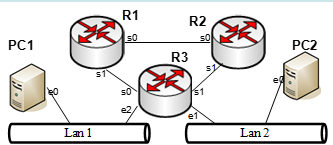

Para a rede apresentada, foi distribuída equitativamente a gama de endereços 10.10.5.0/25 pelas duas redes Lan 1 e Lan 2 e as ligações série 10.10.0.0/30 (R1-R2), 10.10.0.4/30 (R1-R3) e 10.10.0.8/30 (R2-R3). Indique os endereços de rede e broadcast das redes.

__Endereços IP usados nas redes__

| Rede | Mascara | Endereco IP da Rede | Endereco IP de broadcast |
| ---- | ------- | ------------------- | ------------------------ |
| Lan 1 | /26 | 10.10.5.0 | 10.10.5.62 |
| Lan 2 | /26 | 10.10.5.64 | 10.10.5.127 |
| R1-R2 | /30 | 10.10.0.0 | 10.10.0.3 |
| R2-R3 | /30 | 10.10.0.8 | 10.10.0.11 |
| R1-R3 | /30 | 10.10.0.4 | 10.10.0.7 |

---

## 4.

### Quais dos blocos de endereços IPv4 seguintes é possível agregar/sumarizar num único bloco? Indique os blocos escrevendo nos espaços pela ordem do endereço IPv4 do bloco mais baixo para o mais alto a agregar. 

- 10.0.2.0/23
- 10.0.0.128/25
- 10.0.1.0/23
- 10.0.0.0/23
- 10.0.4.0/22
- 10.0.8.0/21

Resposta: [10.0.0.0/23] [10.0.2.0/23] [10.0.4.0/22] [10.0.8.0/21]

---

## 5.

### Relacione as características com o protocolo de encaminhamento mais apropriado:

a) Mantém uma visão completa da topologia da rede: __Link State__

b) Troca apenas vetores de distância com vizinhos: __Distance Vector__

c) Executa o algoritmo de Dijkstra: __Link State__

d) Vulnerável ao problema de "count to infinity": __Distance Vector__

---

## 6. Indique se os equipamentos separam ou não os domínios de colisão e de difusão, para tal, arraste as palavras "Sim", "Não" e "Sim/Não" para os campos pretendidos:

| Equipamento | Dominio de colisao | Dominio de difusao |
| ----------- | ------------------ | ------------------ |
| Repetidor | Nao | Nao |
| Switch | Sim | Nao |
| Router | Sim | Sim |
| Multilayer Switch | Sim | Sim/Nao |

---

## 7.

### Considere a seguinte tabela de encaminhamento de um router:

```txt
Destino         Máscara         Next-Hop     Interface
192.168.1.0     255.255.255.0   -            eth0
10.0.0.0        255.0.0.0       10.0.0.1     eth1
172.16.0.0      255.240.0.0     172.16.0.1   eth2
0.0.0.0         0.0.0.0         192.168.1.1  eth0  
```

Para cada endereço IP destino, qual será o tipo de entrega utilizado?

A) Para o destino 192.168.1.25: __Entrega Direta__

B) Para o destino 10.1.1.1: __Entrega Indireta__

C) Para o destino 8.8.8.8: __Entrega Indireta__

---

## 8.

### Considere as seguintes sub-redes: 192.168.0.0/26, 192.168.0.64/26, 192.168.0.160/27, 192.168.0.192/27, 192.168.0.224/27:


[ ] a. Podem ser sumarizadas em 192.168.0.0/25, 192.168.0.160/26 e 192.168.0.224/27


[x] b. Podem ser sumarizadas em 192.168.0.0/25, 192.168.0.160/27 e 192.168.0.192/26


[ ] c. Podem ser sumarizadas em 192.168.0.0/24


[ ] d. Podem ser sumarizadas em 192.168.0.0/25 e 192.168.0.160/26


---

## 9.

### Foi atribuída a rede 206.143.5.0/30 à Empresa A pelo seu ISP. O administrador da empresa utilizou o comando Router-EmpresaA(config)# ip route 0.0.0.0 0.0.0.0 10.143.5.2 para configurar o acesso à internet a toda a rede. Que frases são verdadeiras?

[x] a. Foi usada a rota por omissão e especificado o next hop, mas poderia também ter-se usado a interface de saída


[x] b. Foi usada a rota por omissão e especificado o next hop


[ ] c. O comando correto a executar seria Router-EmpresaA(config-router)# network 206.143.5.0


[ ] d. O comando usado não permite cumprir os objetivos pretendidos.

---

## 10.

### Pretende-se sumarizar as rotas de um router para as seguintes redes: 5.5.10.0/24, 5.5.11.0/25, 5.5.11.128/25 e 5.5.13.0/24

A agregação de rotas será:

[ ] a. Nenhuma das opções


[x] b. 5.5.10.0/23 e 5.5.13.0/24


[ ] c. 5.5.10.0/24, 5.5.11.0/24 e 5.5.12.0/23


[ ] d. 5.5.10.0/22


[ ] e. 5.5.10.0/23 e 5.5.12.0/23

---

## 11.

### O endereço 10.11.12.25 é um endereço IPv4 do tipo?


[ ] a. Broadcast

[x] b. Privado

[ ] c. Multicast

[ ] d. Público

---

## 12.

### Numa rede VLSM, que máscara utilizaria numa ligação ponto-a-ponto por forma a reduzir ao mínimo o desperdício de endereços IP?


[ ] a. /30
 
[x] b. /31

[ ] c. /29

[ ] d. /28

---

## 13. 

### Qual é o endereço da sub-rede a que o endereço 192.168.210.8/29 pertence


[ ] a. 192.168.210.7

[x] b. 192.168.210.8

[ ] c. 192.168.210.0

[ ] d. 192.168.210.6

---

## 14.

### Dado o endereço IP 10.11.12.65/24, quais das seguintes afirmações são verdadeiras?


[x] a. O endereço mais baixo atribuível dentro da rede é o 10.11.12.1 255.255.255.0.

[ ] b. O endereço de rede é o 10.11.12.0 255.255.255.128.

[ ] c. O último endereço válido na rede é o 10.11.12.256 255.255.255.0.

[x] d. O endereço de broadcast desta rede é o 10.11.12.255 255.255.255.0.

---

## 15.

### Considere uma interface num router com o endereço IP 192.168.192.10/29. Qual é o endereço de broadcast que os hosts associados a esta rede irão utilizar?

[ ] a. 192.168.192.31

[ ] b. 192.168.192.63

[x] c. 192.168.192.15

[ ] d. 192.168.192.127

---

## 16. 

### Em que situações são necessários links virtuais em OSPF?

[x] a. Quando uma área está isolada da backbone (área 0).

[ ] b. Para evitar o uso de LSAs do tipo 3.

[x] c. Para ligar áreas não contíguas à área 0.

[ ] d. Quando é necessário usar redistribuição de rotas.

---

## 17.

### Um switch

[x] a. Nunca há colisões numa ligação ponto-a-ponto full-duplex de um switch a um PC

[ ] b. Preenche a forwarding database a partir dos endereços de destino das tramas que por ele passam

[ ] c. É um comutador de nível 3

[ ] d. Envia sempre uma trama recebida por todas as portas, exceto por aquela por onde foi recebida

---

## 18.

### Que dispositivos de nível 1 podem ser usados para alargar a área de cobertura de um segmento de LAN?

[ ] a. NIC

[ ] b. RJ45 Transceiver

[x] c. Hub

[x] d. Repetidor

[ ] e. Switch

---

## 19.

### Nas VLAN:


[x] a. As tramas de difusão (broadcast) são difundidas apenas na VLAN onde são enviadas.

[ ] b. As VLAN evitam os ciclos das redes não sendo necessário utilizar o algoritmo Spanning Tree.

[x] c. Os switches garantem que, se não houver interligação de VLAN, o tráfego que circula numa VLAN não é enviado para as outras VLAN.

[ ] d. Cada switch usa o identificador de VLAN para distinguir as VLAN e quando altera uma trama de uma VLAN para outra necessita recalcular o valor de FCS.

[ ] e. Uma ligação trunk permite interligar várias VLAN entre si.

---

## 20.

### Quais dos seguintes são benefícios das VLAN?

[x] a. As VLAN aumentam o número de domínios de Broadcast, mas reduzem a sua dimensão

[x] b. As VLAN permitem o agrupamento lógico de utilizadores de acordo com a sua função.

[ ] c. As VLAN simplificam a administração dos switches

[ ] d. As VLAN aumentam a dimensão dos domínios de Broadcast e reduzem o número de domínios de colisão

[ ] e. As VLAN evitam os ciclos de rede não existindo de usar o algoritmo de STP

[ ] f. As VLAN aumentam a dimensão dos domínios de colisão

[x] g. As VLAN aumentam a segurança da rede

---

## 21.

### Considere a rede da figura seguinte e a norma IEEE802.1Q:

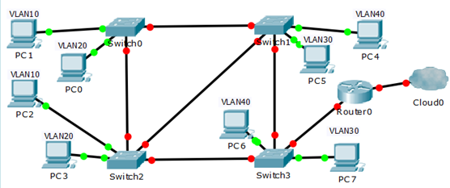

[ ] a. Na ligação entre o Router0 e o Switch 3 as tramas não transportam etiquetas VLAN.

[x] b. As tramas nas ligações aos PC não têm etiqueta.

[x] c. A comunicação entre o PC1 e PC2 é feita apenas através dos switches.

[ ] d. Os switches podem operar no modo de comutação Cut-through.

---

## 22.

### Considere a seguinte topologia de rede composta por routers (R1), switches (SWx) e hubs (Hub1) e que todas as portas dos switches se encontram ligadas na VLAN de omissão. Considere ainda que existem ligações Gigabit Ethernet, Fast Ethernet e Ethernet assinaladas na legenda da figura. Assuma ainda que os switches têm os endereços MAC da tabela e que todos têm a prioridade por omissão.

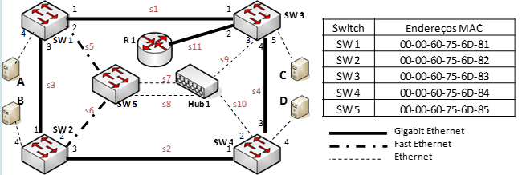

#### a) Tendo a topologia da figura anterior em consideração e as 4 máquinas A, B, C e D com endereços IP e máscaras dentro da mesma rede local (mesmo bloco IP) e interligadas por switches com configurações por omissão:

[x] Considerando as tabelas de ARP vazias, se a máquina A quiser fazer o primeiro ping para outra máquina necessita enviar tramas de ARP primeiro.

[ ] Qualquer troca de mensagens entre as máquinas é feita por entrega indireta.

[x] A máquina A consegue fazer Ping para qualquer das outras máquinas.

[ ] A máquina A só consegue fazer Ping para outra a máquina se for configurado um router na rede.

#### b) Tendo a topologia da figura anterior em consideração e as 4 máquinas A, B, C e D configuradas com os seguintes endereços IP e máscaras: A:100.100.21.17/29, B:100.100.21.25/29, C:100.100.21.22/29, D:100.100.21.28/29, interligadas através dos switches à mesma VLAN, sem qualquer outra configuração adicional e com o router desativado.

[ ] A máquina A consegue fazer Ping para a máquina B.

[ ] Para a máquina A fazer Ping à máquina C precisa de enviar mensagem através de um router.

[x] A máquina A consegue fazer Ping para a máquina C.

[x] Para a máquina A fazer Ping à máquina B precisa de enviar mensagem através de um router.

---

## 23.

### A figura seguinte ilustra a topologia de um ISP que fornece serviço a 3 clientes. O cliente 1 possui atribuída a VLAN 10, o 2 a VLAN 20 e o cliente 3 utiliza a VLAN de default. Já que o operador possui fibra ótica entre as duas localizações, assuma que é sempre fornecida redundância de layer 2. O R1 é o GW dos clientes no SW3 e o R2 o GW do cliente 3.

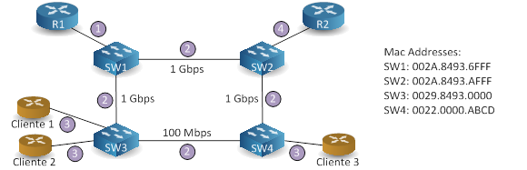

#### a) Assuma que os switches possuem a configuração por omissão em termos de STP. Qual a root bridge para cada VLAN (escolha a opção correta):

1: __SW4__
        
10: __SW4__

20: __SW4__

#### b) Indique o estado/modo das portas dos switches nas ligações (escolha a opção correta):

1: __Trunk__

2: __Trunk__

3: __Access__

4: __Access__

---

## 24.

### Um administrador de rede está a verificar a configuração do encaminhamento entre VLANs. Os utilizadores reclamam que o PC2 não consegue comunicar com o PC1. Com base na saída, qual é a possível causa do problema?

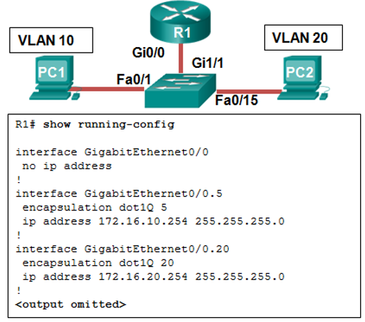

[ ] a. Não há endereço IP configurado na interface Gi0/0.

[ ] b. Comando no shutdown não foi inserido nas subinterfaces.

[ ] c. Gi0/0 não está configurado como uma porta trunk.

[x] d. Comando encapsulation dot1Q5 contém a VLAN errada.

---

## 25.

### VLAN:

[x] a. Fornecem maior segurança e isolamento.

[ ] b. As VLAN não adicionam qualquer tipo de flexibilidade.

[x] c. Uma VLAN pode ser considerado um domínio de broadcast.

[x] d. Permitem criar segmentação das LAN.

---

## 26.

### Numa rede que utilize VLAN IEEE802.1Q:

[x] a. Quando o endereço MAC destino está indicado na Forwarding Database como pertencente a uma porta noutra VLAN, o switch não transfere a trama entre VLAN diferentes.

[ ] b. O switch ao passar as tramas entre portas “etiquetadas” (tagged) e portas de acesso altera o endereço MAC origem para o seu e remove a identificação de VLAN (tag) e prioridade.

[ ] c. Como nas ligações tagged a dimensão máxima da trama aumenta 4 bytes, o MTU usado pelo IP pode subir para 1504.

[x] d. Duas máquinas em VLAN distintas apenas comunicam entre elas se houver um router pelo meio.

---

## 27.

### Para uma rede com suporte de VLAN considere:

[x] a. As tramas de broadcast apenas são encaminhadas pelas portas dos switches pertencentes à mesma VLAN por daquela por onde entrou.

[ ] b. As VLAN configuram-se através de mensagens DHCP.

[ ] c. O algoritmo Spanning Tree não pode ser utilizado numa rede com várias VLAN.

[ ] d. Numa ligação trunk nunca circulam tramas marcadas (802.1Q Tagged) em conjunto com tramas não marcadas.

---

## 28.

### Um administrador de rede configurou o router CiscoVille com os comandos abaixo para fornecer encaminhamento entre VLANs. Qual comando  essencial necessário num switch ligado à interface Gi0/0 do router CiscoVille para possibilitar o encaminhamento entre VLANs por este?

```txt
CiscoVille# configure terminal
Enter configuration commands, one per line. End with CTRL/Z
CiscoVille(config)# interface gigabitethernet 0/0
CiscoVille(config-if)# no ip address
CiscoVille(config-if)# interface gigabitethernet 0/0.10
CiscoVille(config-subif)# encapsulation dotQ 10
CiscoVille(config-subif)# ip address 192.168.10.254 255.255.255.0
CiscoVille(config-subif)# interface gigabitethernet 0/0.20
CiscoVille(config-subif)# encapsulation dotQ 20
CiscoVille(config-subif)# ip address 192.168.20.254 255.255.255.0
CiscoVille(config-subif)# exit
CiscoVille(config)# interface gigabitethernet 0/0
CiscoVille(config-if)# no shutdown
```

[ ] a. no switchport

[ ] b. switchport mode access

[ ] c. switchport mode dynamic desirable

[x] d. switchport mode trunk

---

## 29.

### Considere a seguinte rede privada e a norma de redes virtuais IEEE802.1Q.

#### Considere a seguinte rede de uma empresa. Cada um dos 4 departamentos está afeto a uma das VLAN que comunicam entre si e têm acesso à Cloud0. A gama global de endereços privados utilizados na empresa é 10.0.0.0/16. Assuma ligações Gigabit Ethernet em full-duplex e que os switches, com parâmetros por omissão, têm identificadores de acordo com a sua numeração (Sw0 -> BridgeID menor -> …).

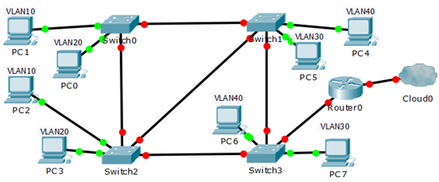

Preencha a tabela indicando na rede privada (excluir ligação à Clould0) a quantidade de :

| Dominios de colisao | Dominios de difusao | Ligacoes em modo access | Ligacoes em modo trunk |
| ------ | ------ | ------ | ------ |
| 0 | 4 | 8 | 6 |

---

## 30.

### Foram criadas as VLAN 1, 2, 3 e 4 e as ligações feitas de acordo com a figura e configurado o modo STP (PVST):

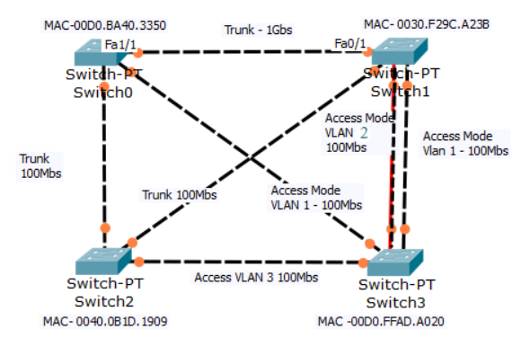

#### Identifique na tabela abaixo, por VLAN, qual a topologia lógica de cada VLAN na rede tendo em consideração a aplicação do algoritmo STP.

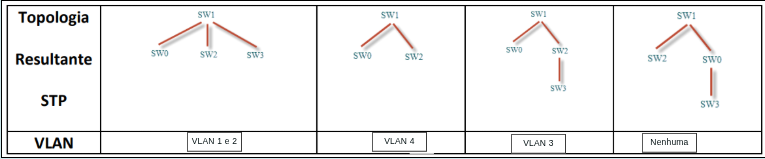

---

## 31.

### Em relação ao processo de convergência do RSTP:

[Verdadeiro] O RSTP utiliza propostas e acordos (proposal/agreement) para transição rápida para o estado forwarding.

[Falso] O tempo de convergência no RSTP é sempre fixo em 30 segundos.

[Verdadeiro] O RSTP permite que portas point-to-point transitem mais rapidamente para o estado forwarding.

[Falso] No RSTP, todas as portas precisam esperar pelo menos 15 segundos antes de entrar em forwarding.

---

## 32.
 
### Considere os protocolos STP (IEEE802.1D) e RSTP (IEEE802.1W)

[x] a. Os três estados em STP Disable, Blocking e Listening são agrupados num único estado Discarding em RSTP

[x] b. Uma porta no estado Backup cria redundância na conetividade do mesmo switch para um dado segmento

[ ] c. Em STP apenas a flag de TCN-BPDU é utilizada, enquanto em RSTP são usadas 8 flags distintas

[ ] d. Em ambos os protocolos apenas a root bridge envia BPDU periódicos

---

## 33.

### Que linha de comando irá configurar uma porta de switch para utilizar o standard IEEE para inserir informação de VLAN em tramas de ethernet?

[ ] a. Switch(config-if)# switchport trunk encapsulation isl

[ ] b. Switch(config)# switchport trunk encapsulation ietf

[ ] c. Switch(config)# switchport trunk encapsulation isl

[x] d. Switch(config-if)# switchport trunk encapsulation dot1q

---

## 34.

### Quais as informações que são usadas para a determinação da designated port, quando está a ser executado o protocolo STP:

[x] a. Custo do caminho até à root bridge

[x] b. Endereço MAC (faz parte do bridgId)

[x] c. Prioridade

[x] d. ID da porta

---

## 35.

### Indique a respostas verdadeiras sobre uma porta Alternate em RSTP (IEEE802.1W)

[ ] a. Garante alternativa de conetividade do mesmo switch à root bridge

[x] b. Recebe, mas não envia BPDU

[ ] c. Este estado é semelhante ao estado “Backup” em STP (IEEE802.1D)

[x] d. Encontra-se no estado Discarding (bloqueada porque recebeu um BPDU superior)

---

## 36.

### Como é transmitido o BID de um switch aos switches vizinhos 

[ ] a. Via broadcast durante o processo de convergência 

[ ] b. Durante os estados de convergência STP

[ ] c. Através do protocolo STP

[x] d. Através de mensagens multicast e controlo (BPDUs)

---

## 37.

### Se nenhuma prioridade das bridges for configurada no PVST, quais critérios são considerados ao escolher a bridge raiz?

[ ] a. Endereço IP mais baixo

[ ] b. Endereço MAC mais alto

[ ] c. Endereço IP mais alto

[x] d. Endereço MAC mais baixo

---

## 38.

### Que função de porta é atribuída à porta do switch que tem o custo mais baixo para alcançar a bridge raiz?

[ ] a. Porta desabilitada (blocked)

[x] b. Root Port

[ ] c. Designated port

[ ] d. Alternated Port

---

## 39.

### Em STP (IEEE802.1D) quais as afirmações verdadeiras:

| Pergunta | Resposta e explicacao |
| -------- | --------------------- |
| a. Do ponto de vista de um segmento, uma designated port indica um caminho para a root bridge. | Verdadeira: De um segmento o único caminho ativo na árvore em direção à root bridge, para as tramas de dados, é via a designated port do segmento (só há uma por segmento). Isto apesar da porta designated não indicar necessariamente "um caminho para a root bridge", mas sim um caminho preferencial para o segmento na topologia ativa. Pensando em tramas de dados numa topologia estabilizada vai dar no mesmo. |
| b. Após uma alteração de topologia, o algoritmo demora cerca de 15 segundos a convergir | Falsa |
| c. A transição para o estado Listening é desencadeado por Timer interno do protocolo STP | Falsa: A transição do estado de Blocking para o estado de Listening é desencadeada automaticamente a partir do momento em que as portas decidem se vão ser root, designated ou blocked, com base na troca inicial de BPDUs e no processo de seleção da topologia de árvore pelo Spanning Tree Protocol. Não é usado nenhum timer tipo Forwarding Delay. |
| d. A transição para o estado Forwarding é efetuada após a conclusão do estado Listening | Falsa: Há o learning pelo meio para evitar uma tempestade de broadcasts at+e os switches aprenderem quem está onde (Macs). |

---

## 40.

### Considere a topologia de rede que consta na figura junta composta por switches (SW x) e hubs (Hub x) e que todas as portas dos switches se encontram ligadas na VLAN de omissão. Considere ainda que existem ligações Gigabit Ethernet, Fast Ethernet e Ethernet assinaladas na legenda da figura. Assuma ainda que os switches têm identificadores correspondentes aos endereços MAC da tabela e que todos têm a prioridade de omissão, exceto o switch SW2 que possui uma prioridade de 8192 e o SW3 de 48k.

Assuma ainda que:

- Todas as ligações são full-duplex;
- O algoritmo utilizado é o STP.

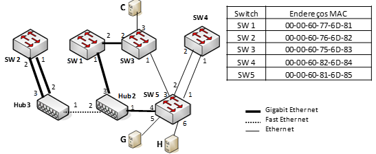

Preencha a tabela com os valores correspondentes à topologia ativa da rede.

NOTAS:

- Deve utilizar os custos definidos para o STP na resolução deste exercício;
- Preencha as colunas PC, RPC e DPC com um valor numérico de acordo com as portas relevantes na topologia e coloque um hífen (-) quando o valor for 0;
- Preencha as colunas RP, DP e Block com uma cruz (x) de acordo com o tipo das portas relevantes na topologia e coloque um hífen (-) nas restantes portas.

| Porta      | PC  | RPC | RP | DPC | DP | Block |
| ---------- | --- | --- | -- | --- | -- | ----- |
| __SW1-P1__ | 4   | 4   | X  | 108 | -  | -  |
| __SW1-P2__ | 4   | 108 | -  | 4   | X  | -  |
| __SW2-P1__ | 4   | -   | -  | 0   | X  | -  |
| __SW2-P2__ | 4   | -   | -  | 0   | -  | X  |
| __SW3-P1__ | 100 | 104 | -  | 8   | -  | X  |
| __SW3-P2__ | 4   | 8   | X  | 104 | -  | -  | 
| __SW3-P3__ | 100 | -   | -  | 8   | X  | -  |
| __SW4-P1__ | 100 | 104 | X  | 104 | -  | -  |
| __SW4-P2__ | 100 | 104 | -  | 104 | -  | X  |
| __SW5-P1__ | 100 | 204 | -  | 4   | X  | -  |
| __SW5-P2__ | 100 | 204 | -  | 4   | X  | -  |
| __SW5-P3__ | 100 | 108 | -  | 4   | X  | -  |
| __SW5-P4__ | 4   | 4   | X  | 108 | -  | -  | 
| __SW5-P5__ | 100 | -   | -  | 4   | X  | -  |
| __SW5-P6__ | 100 | -   | -  | 4   | X  | -  |

---

## 41.

### Acerca do Rapid Spanning Tree Protocol (RSTP):

[Verdadeiro]  O RSTP reduz significativamente o tempo de convergência em comparação com o STP tradicional.

[Falso] No RSTP, uma porta em estado discarding ainda pode encaminhar tramas de dados.

[Verdadeiro]  Uma porta Alternate fornece um caminho alternativo para a root bridge e permanece em estado discarding.

[Falso]  No RSTP, todos os switches precisam de passar pelos estados listening e learning antes de passar para forwarding.

---

## 42.

### Quais das seguintes afirmações são verdadeiras no que se refere ao STP e sem usar VLAN?

[x] a. Podem existir várias designated ports em cada bridge

[ ] b. Podem existir várias designated port por cada segmento Ethernet

[x] c. Existe só uma root port por cada bridge que não seja root

[ ] d. Todas as bridges têm sempre pelo menos uma porta root

---

## 43.

### No RSTP:

[x] a. Um switch pode ter várias portas Alternate.

[ ] b. O Switch root pode ter portas Backup.

[ ] c. Uma edge port demora 30 segundos a passar para designated.

[ ] d. O root switch pode ter portas Alternate.

---

## 44.

### Quais das seguintes afirmações são verdadeiras, relativamente ao comando: ip route 209.165.201.2 255.255.255.0 209.165.202.3 2?

[ ] a. O endereço IP de next-hop está associado a uma interface

[X] b. É usado para definir uma rota estática

[ ] c. O comando configura uma rota default

[ ] d. Está a ser utilizada a distância administrativa por omissão

---

## 45.

### Qual das afirmações é verdadeira relativamente aos protocolos de routing classless?

[X] a. O OSPF é um protocolo classless

[X] b. O uso de VLSM é permitido

[ ] c. O uso de redes descontínuas não é permitido

[ ] d. O RIPv1 suporta classless routing

---

## 46.

### Que frase descreve melhor uma topologia STP (IEEE802.1D) que já convergiu?

[ ] a. Todas as portas dos switches/bridges estão definidas como root ports ou designated ports

[ ] b. Todas as portas dos switches/bridges estão em estado blocking ou looping

[ ] c. Todas as portas dos switches/bridges estão no estado de forwarding

[X] d. Todas as portas dos switches/bridges estão ou no estado de forwarding ou blocking

---

## 47.

### Qual é o endereço da rede para um host associado ao endereço IP 200.10.5.68/28?

[ ] a. 200.10.5.32

[X] b. 200.10.5.64

[ ] c. 200.10.5.56

[ ] d. 200.10.5.0

---

## 48.

### Uma Instituição usa a VLAN15 para rede do um laboratório e VLAN30 para a rede do corpo docente. O que é necessário para habilitar a comunicação entre essas duas VLANs ao usar a abordagem de router fixo?

[X] a. Um switch com uma porta configurada como trunk, ligada ao router.


[ ] b. É necessário um router com pelo menos duas interfaces.


[ ] c. É necessário um switch multicamadas.


[ ] d. São necessários dois grupos de switches, cada um com portas configuradas para uma VLAN.

---

## 49.

### Um administrador de rede está a configurar encaminhamento entre VLANs de uma rede. Por enquanto, apenas uma VLAN está a ser usada, mas mais serão adicionadas em breve. Qual é o parâmetro ausente que é mostrado como o ponto de interrogação destacado na figura?


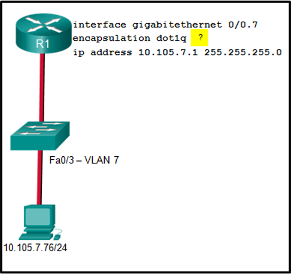


[ ] a. Tipo de encapsulamento usado.

[ ] b. Número de hosts permitidos na interface.

[X] c. Número da VLAN.

[ ] d. Identificação da subinterface.

---

## 50.

### O PC1 não consegue comunicar com o servidor 1. O administrador da rede mostra o comando show interfaces trunk para iniciar a solução do problema. Que conclusão pode ser feita com base na saída deste comando?

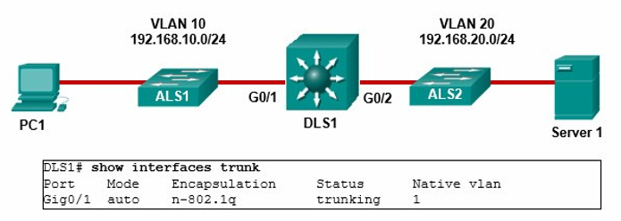

[ ] a. Encapsulamento na interface G0/2 está incorreto.

[ ] b. Encapsulamento na interface G0/1 está incorreto.

[X] c. A interface G0/2 não está configurada como trunk.

[ ] d. A VLAN 20 não foi criada.

---

## 51.

### O comprimentos mínimo e máximo das tramas Ethernet, quando se utiliza IEEE 802.1Q (VLAN), passam respetivamente a:

[ ] a. 68 bytes e 1522 bytes

[ ] b. 64 bytes e 1518 bytes

[ ] c. 68 bytes e 1518 bytes

[X] d. 64 bytes e 1522 bytes

---

## 52. 

### Nas VLAN:

[X] a. É possível interligar VLAN através de um router.

[ ] b. As VLAN aumentam a velocidade de transmissão das tramas.

[X] c. Podem circular tramas sem identificador de VLAN nas ligações trunk.

[ ] d. As VLAN reduzem o número de domínios de difusão.

---

## 53.

### Tendo em consideração a norma IEEE 802.1Q (VLAN):

[ ] a. Se o endereço MAC destino estiver indicado na Forwarding Database do switch como pertencente a uma porta noutra VLAN, o switch transfere a trama entre as diferentes VLAN.

[ ] b. A eficiência é superior graça à utilização pela norma do protocolo Spanning Tree.

[ ] c. Qualquer máquina (por exemplo: PC, MAC) que esteja ligado a um switch que suporte a norma IEEE 802.1Q também tem de a suportar.

[X] d. Nas ligações tagged a dimensão máxima das tramas Ethernet passa a ser 1522 bytes.

---

## 54.

### Considerando as VLAN:

[X] a. O 802.1Q define cerca de 4096 identificadores de VLAN que podem ser utilizados.

[ ] b. Se uma trama tiver como destino uma máquina que se encontre noutra VLAN, qualquer switch que tenhas as duas VLAN pode passar a trama de uma VLAN para a outra.

[X] c. Para dar suporte ao 802.1Q todas as tramas MAC passaram a ter uma dimensão de mais quatro bytes (só as que tem a tag).

[ ] d. Uma porta trunk só pode levar metade das VLAN definidas num switch.

---

## 55.

### Num switch que utilize VLAN IEEE802.1Q:

[ ] a. As tramas que transportam BPDU não incluem tags.

[ ] b. Só as tramas que saem das portas access é que transportam tags.

[X] c. Só as tramas que saem de portas trunk é que podem trazer tags.

[ ] d. Todas as tramas em qualquer porta incluem tags.

---

## 56.

### Considere as VLAN:

[ ] a. A comutação de tráfego entre as VLAN pode ser efetuada num switch (nível 2).

[ ] b. Dividir uma rede em várias VLAN aumenta o número de domínios de colisão.

[ ] c. A passagem de tráfego entre as VLAN só pode ser efetuada nos routers (nível 3).

[X] d. Dividir uma rede em várias VLAN aumenta o número de domínios de broadcast.

---

## 57.

### Considere a norma de redes virtuais IEEE802.1Q:

[X] a. O campo com a etiqueta de VLAN (nos trunks) tem a dimensão de 4 bytes.

[ ] b. Uma trama MAC de broadcast não é propagada nas ligações trunk.

[ ] c. Nas ligações trunk não podem circular tramas sem etiqueta de VLAN.

[ ] d. A etiqueta de VLAN é inserida pelas máquinas ligadas aos switches.

---

## 58.

### VLAN:

[ ] a. Ao receber uma trama Ethernet uma máquina sabe se esta inclui uma tag verificando se a dimensão original da trama foi acrescida de 4 bytes.

[X] b. Uma trama Ethernet que utilize VLAN IEEE802.1Q pode ter até uma dimensão de 1522 bytes.

[X] c. Ao serem inseridos os campos que suportam a existência de VLAN numa trama Ethernet o CRC desta tem de ser recalculado.

[ ] d. A norma IEEE802.1Q suporta até 2048 VLAN distintas.

---

## 59.

### Uma porta trunk pode ser ligada entre um switch e um:

[X] a. Router

[X] b. Switch

[X] c. Servidor

[X] d. Ponto de acesso de rede sem fios

[ ] e. Repetidor

---

## 60.

### Relativamente à norma IEEE802.1Q (VLAN):

[ ] a. Nas ligações aos PC uma trama pode ter a dimensão máxima de 1522 bytes.

[ ] b. Todas as tramas que transitam entre os switches incluem tags com 4 bytes.

[X] c. Uma trama MAC de multicast não é propagada entre as VLAN.

[ ] d. As tramas nas ligações entre switches têm no campo Tag Protocol Identifier (TPID) da etiqueta o valor 36778, em Ethernet.

---

## 61.

### VLAN:

[X] a. Num esquema de “router on a stick” (todas ligadas ao mesmo), não é necessário rotas estáticas nem protocolos de routing devido às redes estarem diretamente ligadas.

[ ] b. Um trunk não substitui a necessidade de ligar diversos cabos de um switch a um router para suporte de várias VLAN.

[X] c. É necessário um router para que se consiga encaminhar tráfego entre várias VLAN.

[X] d. Num esquema de atribuição de endereçamento a uma VLAN, recomendam as boas práticas que se equacione um possível crescimento.

---

## 62.

### Nas tramas que saem por portas dos switch configuradas em modo de acesso quais as tramas que possuem etiquetas?

[ ] a. Somente a tramas destinadas a endereços de grupo (multicast e broadcast).

[ ] b. Todas, com a indicação da VLAN a que pertencem.

[ ] c. Só as que não pertencem à VLAN por omissão.

[X] d. Nenhumas.

---

## 63.

### Segundo a norma IEEE802.1Q o campo que indica qual o número da VLAN a que a trama pertence possui quantos bits de dimensão?

[ ] a. 9

[ ] b. 10

[ ] c. 11

[X] d. 12

[ ] e. 13

---

## 64.

### Qual dos seguintes é um padrão IEEE para frame tagging?
Pergunta 64Resposta

[X] a. 802.1q

[ ] b. 802.3z

[ ] c. 802.3u

[ ] d. 802.3

---

## 65.

### Quais das seguintes afirmações descrevem corretamente uma porta de transporte (trunk)?

[ ] a. Portas de transporte (trunk) são normalmente utilizadas na ligação entre switches e PCs.

[X] b. Dispositivos ligados a uma porta de transporte (trunk) precisam de compreender o tipo de encapsulamento adotado ou irão descartar a trama recebida.

[X] c. Portas de transporte (trunk) transmitem informações de múltiplas VLANs simultaneamente.

[ ] d. Os switches removem qualquer identificação de VLANs da trama antes de a encaminhar para uma porta de transporte (trunk).

---

## 66.

### Quais das seguintes afirmações são verdadeiras relativamente às portas de acesso?

[ ] a. Dispositivos ligados a portas de acesso comunicam-se com elementos associadas à outra VLAN, sem necessidade de uma elemento de camada 3 (router).

[X] b. Portas de acesso são normalmente utilizadas na ligação entre switches e PCs.

[ ] c. Podem ser associadas a várias VLANs.

[X] d. Os switches removem qualquer identificação de VLAN da trama antes de a encaminhar para uma porta de acesso.

---

## 67.

### Quais das seguintes afirmações são verdadeiras com relação às portas de transporte (trunk)?

[X] a. Portas de transporte (trunk) podem ser ativadas em interface 10 base T.

[ ] b. Portas de transporte (trunk) funcionam apenas em ligações entre switches.

[ ] c. Por omissão, todas as portas de um switch encontram-se ativadas no modo transporte (trunk).

[ ] d. Por omissão, as portas de transporte (trunk) encaminham tramas originadas em todas as VLANs. VLANs não desejadas devem ser manualmente bloqueadas.

---

## 68.

### Em que situações um switch deve rotular a trama com o número da VLAN?

[X] a. Sempre que enviar uma trama por uma ligação partilhada.

[ ] b. É opcional, nem sempre o faz.

[ ] c. Sempre que enviar uma trama para a própria VLAN.

[ ] d. Não tem que rotular.

---

## 69. 

### Quais são os dois modos possíveis de se associar VLANs às portas de um switch?

[X] a. Estaticamente.

[ ] b. Dinamicamente, via um servidor DHCP.

[ ] c. Dinamicamente, via uma base de dados VTP.

[X] d. Dinamicamente, via servidor VMPS.

---

## 70.

### Quais dos seguintes métodos podem ser usados em links de transporte para identificar VLANs?

[ ] a. Virtual Trunk Protocol

[X] b. Cisco ISL

[ ] c. IEEE 802.1ad

[X] d. IEEE 802.1q

---

## 71.

### Num switch:

[ ] a. No modo half-duplex é implementado o CSMA/CA para ajudar a reduzir e detetar colisões.

[ ] b. A configuração dos modos de comunicação duplex não são feitas por cada porta.

[ ] c. Podem implementar os dois modos: half-duplex e full-duplex, estando em ambos os circuitos de deteção de colisão ativos

[X] d. No modo full-duplex, o circuito de deteção de colisão CSMA/CD é desativado.

---

## 72.

### Que comandos pode usar para verificar a atribuição de portos às VLANs num switch?

[ ] a. Comandos: show vlan brief e show running-config

[X] b. Comandos: show vlan, show vlan brief e show running-config

[ ] c. Comandos: show vlan e show running-config

[ ] d. Comandos: show vlan e show vlan brief 

---

## 73.

### O método de comutação que verifica somente o endereço MAC destino no cabeçalho da trama antes de encaminhar a trama para a porta de saída é:

[ ] a. Store and Forward 

[X] b. Cut-Through

[ ] c. Fragment Free

[ ] d. Fragment Check

---

## 74.

### O método de comutação que executa o CRC antes de encaminhar a trama é:

[ ] a. Cut-Through

[X] b. Store and Forward 

[ ] c. Fragment Check

[ ] d. Fragment Free

---

## 75.

### Qual o tamanho máximo de uma trama Ethernet dot1q.

[ ] a. 1518 bytes

[ ] b. 4200 bytes

[X] c. 1500 bytes

[ ] d. 1522 bytes

---

## 76.

### Considere a configuração de uma VLAN. Indique as afirmações verdadeiras:

[X] Quando existem “tagged ports” o tamanho máximo da trama passa a 1530 bytes (incluindo o Preâmbulo)

[ ] A VLAN nativa caracteriza-se por ter a VLAN “tag” 01

[X] Um “access port” ou  “untagged port” pode transportar tráfego para apenas uma VLAN

[ ] Em “trunk ports” pode ser transportado tráfego de um número até 65536 VLAN’s

---

## 77.

### Como é que um switch ao receber uma trama Ethernet por uma porta trunk sabe se essa trama inclui ou não uma tag?

[X] a. A trama inclui um novo campo  tipo (mais um) com um valor que indica transportar uma tag.

[ ] b. A dimensão da trama é maior pelo que isso indica que está nela incluída uma tag.

[ ] c. Se inclui tag, o valor da tag permite diferenciar de qualquer outro tipo de conteúdo.

[ ] d. Todas as tramas que entram num switch por uma porta trunk incluem tag.

---

## 78.

### O que acontece se em 2 switches isolados que suportam VLAN se interligar uma porta de acesso de cada switch, associadas a diferentes VLAN?

[ ] a. As portas bloqueiam dado detetarem tags distintas.

[X] b. As duas VLAN passam a funcionar a nível 2 como apenas uma.

[ ] c. As portas passam automaticamente ao modo trunk.

[ ] d. As tramas passam a conter duas tags (uma de cada VLAN).

---

## 79.

### Em OSPF, o algoritmo Dijkstra para calcular as melhores rotas dentro de uma área é aplicado sobre:

[X] a. LSA tipo 2

[ ] b. LSA tipo 4

[ ] c. LSA tipo 5

[X] d. LSA tipo 1

[ ] e. LSA tipo 3

---

## 80.

### No OSPF:

[ ] a. O OSPFv2 trata ele próprio da correção de eventuais erros nas mensagens

[ ] b. Cada área tem, no máximo, um DR

[X] c. A tabela de routing de um router a correr OSPF pode conter rotas que não tenham sido calculadas pelo algoritmo Dijskstra

[X] d. OS LSA 3 e 5 indicam as rotas para o exterior da área onde o router se encontra

---

## 81.

### Considere o seguinte grafo resultante da execução de um algoritmo distance vector, onde os números nas ligações representam os custos:

A
B
C
5
3
 Na primeira iteração do algoritmo Distance Vector, após as trocas iniciais de vetores de distância:
a) Qual será a distância conhecida por A para chegar a C?
Resposta 1 Pergunta 81
8

b) Qual será o next-hop registado na tabela de encaminhamento de A para chegar a C?
Resposta 2 Pergunta 81
B

c) Complete a tabela de encaminhamento inicial de B:

Destino A, Distância: Resposta 3 Pergunta 81
Considere o seguinte grafo resultante da execução de um algoritmo distance vector, onde os números nas ligações representam os custos:

__A -- 5 -- B -- 3 -- C__

Na primeira iteração do algoritmo Distance Vector, após as trocas iniciais de vetores de distância:

a) Qual será a distância conhecida por A para chegar a C?

__8__

b) Qual será o next-hop registado na tabela de encaminhamento de A para chegar a C?

__B__

c) Complete a tabela de encaminhamento inicial de B:

Destino A, Distância: __5__

Destino B, Distância: __0__

Destino C, Distância: __3__

---

## 82.

### OSPFv2:

[X] a. Um router mesmo possuindo a sua interface física ligada a um segmento nível 2 OSI de rede comum e possuindo esta o maior endereço IP de entre os routers que estão ligados no mesmo segmento/rede nível 2, poderá nunca ser eleito DR

[ ] b. O routerID é usado como endereço IP de um router a correr OSPF

[ ] c. Para um router possuir um routerID tem de ter pelo menos uma interface loopback configurada

[X] d. Nas redes tipo NBMA as mensagens são enviadas com endereços IP destino unicast

---

## 83.

### Como se pode evitar que um router participe na eleição de DR/BDR numa interface OSPF?

[ ] a. ip ospf cost 0

[X] b. ospf network point-to-point

[ ] c. no ospf dr bdr

[X] d. ip ospf priority 0

---

## 84.

### Sobre o processo de convergência em protocolos Distance Vector:

Em que momento se considera que a convergência foi atingida?

[ ] Quando todos os routers receberam pelo menos um update

[X] Quando todas as tabelas de routing na rede contêm a mesma informação

[ ] Quando os timers expiram

[ ] Quando não há mais tráfego na rede

---

## 85.

### No caso de haver apenas uma área OSPF num domínio OSPF:

[ ] a. Não existem LSA tipo 5

[ ] b. Não existem LSA tipo 1

[X] c. Não existem LSA tipo 7

[ ] d. Não existem LSA tipo 2
