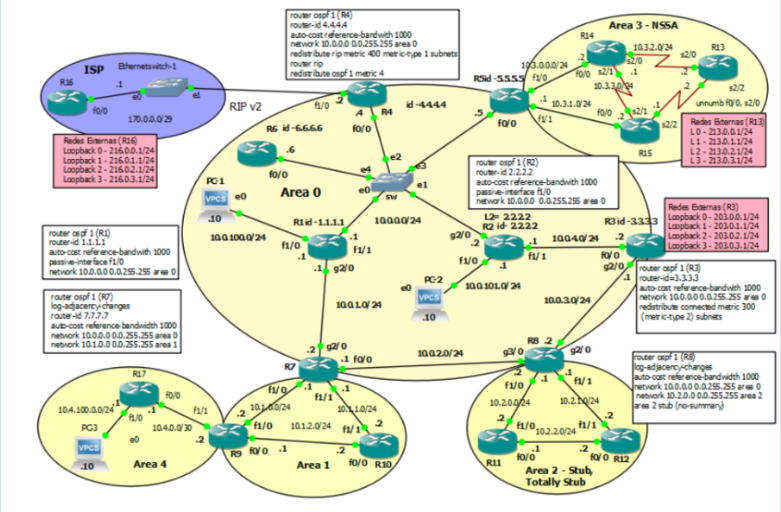
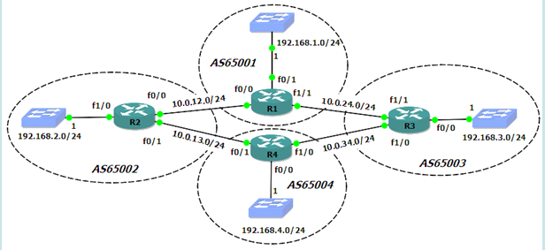
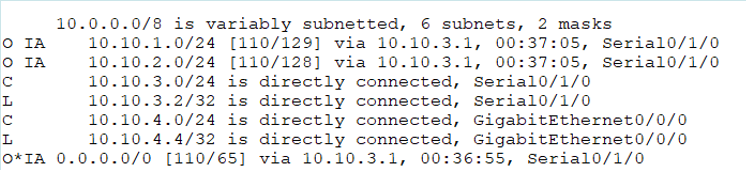
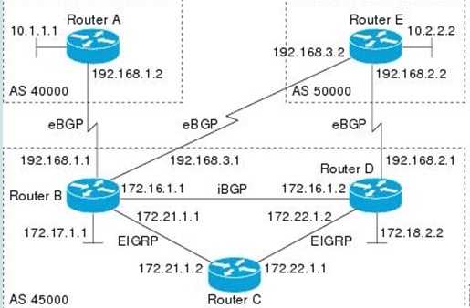
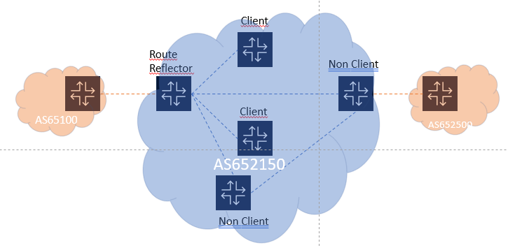
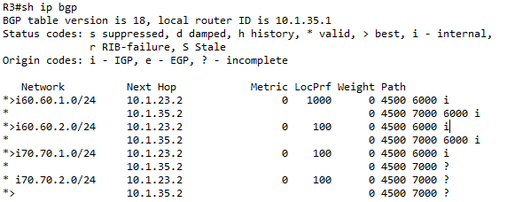
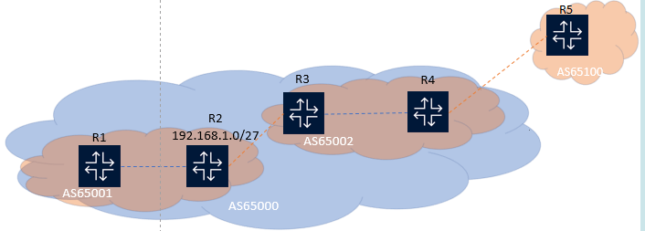
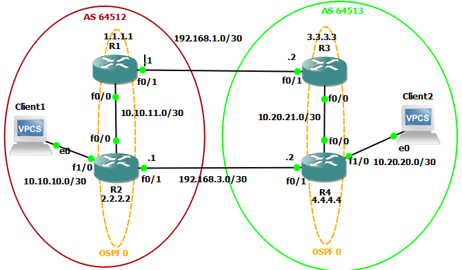

# Teorical Assignment 2

## 1.

### Considere o protocolo OSPFv2. Selecione apenas as afirmações corretas.

[ ] a. O router que termina um virtual link pode não ser um ABR.

[X] b. Um router pode estabelecer vizinhanças com routers de áreas diferentes.

[ ] c. Um router pode estabelecer adjacências com routers de áreas diferentes.

[X] d. Todas as áreas no OSPF requerem conectividade lógica com a área 0 (área backbone).

---

## 2.

### Selecione apenas as afirmações verdadeiras sobre configuração de peerings BGP e redistribuição de rotas.


[X] a. O comando "route-map" pode ser aplicado para controlar quais rotas são trocadas com o vizinho.

[ ] b. A configuração de peering BGP não requer a definição de um AS remoto.

[X] c. É possível utilizar uma ACL para negar rotas de um prefixo específico ao configurar um peer BGP.

[ ] d. A configuração de peering BGP é automática e não requer intervenção do administrador.

---

## 3. 

### Considere o protocolo OSPFv2. Selecione apenas as afirmações verdadeiras.


[ ] a. O DR e o BDR são eleitos apenas em redes ponto-a-ponto.

[ ] b. O DR é responsável pela eleição do Backup-DR (BDR)

[ ] c. O Designated Router (DR) estabelece adjacências apenas com alguns routers numa rede multi-acesso.

[X] d. O DR reduz a quantidade de tráfego numa rede multi-acesso.

---

## 4. 

### Relativamente à segurança no BGP, selecione as afirmações corretas.

[X] a. A autenticação MD5 pode ser usada para garantir a integridade das sessões BGP.

[X] b. A configuração de filtros e listas de acesso (ACLs) ajuda a proteger as rotas no BGP.

[ ] c. O BGP é seguro por padrão, sem necessidade de configurações adicionais.

[ ] d. O BGP não suporta mecanismos de autenticação.

---

##  5.

### Sobre o conceito de vizinhança (peering) no BGP, selecione as opções corretas.


[X] a. As sessões de peering no BGP podem ser internas (iBGP) ou externas (eBGP).

[X] b. Os routers que correm BGP estabelecem sessões de peering com outros routers BGP para trocar rotas.

[ ] c. No BGP, os routers estabelecem peering automaticamente sem configuração manual.

[ ] d. Apenas routers no mesmo AS podem estabelecer sessões de peering.

---

## 6.

### Aponte a causa mais provável para uma sessão BGP que ficou bloqueada no estado "Connect" no router 1

[X] a. O router 1 está a tentar ativamente estabelecer uma sessão TCP com o router 2, mas não recebe resposta

[ ] b. Uma mensagem Open foi enviada do router 1 para router 2, mas sem resposta

[ ] c. O router 1 está à escuta para uma ligação TCP iniciada pelo peer remoto (router 2), mas não consegue responder.

[ ] d. Uma mensagem keep alive foi enviada do router 1 para router 2, mas sem resposta

---

## 7.

### Considere ainda a figura 2. Faça a correspondência entre o número de rotas existente na tabela de encaminhamento de cada router na respetiva área OSPF, considerando os seguintes tipos de rota: C; O; O IA; O E1; O E2; ON2.



| Router | Numero de Rotas |
| ------ | --------------- |
| Router 13 / Área 3 (Totally NSSA) – NSSA | 5;3;1;0;0;0 |
| Router 2 / Área 0 | 4; 4; 12; 5; 8; 0 |
| Router 12 / Área 2 (Stub) – Stub | 2; 1; 18; 0; 0; 0 |
| Router 10 / Área 1 | 2; 1; 17; 5; 8; 0 |
| Router 17 / Área 4 (Virtual-link) – Virtual-Link | 2; 0; 18; 5; 8; 0 |
| Router 12 / Área 2 (Totally Stub) – Totally Stub | 2; 1; 1; 0; 0; 0 |
| Router 14 / Área 3 (NSSA) – Totally NSSA | 3; 1; 16; 0; 0; 4 |
| Router 13 / Área 3 (NSSA) – NSSA | 5; 3; 16; 0; 0; 0 |

---

## 8.

### Considere a seguinte rede, onde os routers têm como IP das interfaces físicas o endereço acabado no seu número pertencente à rede onde estão ligados (Ex.: R2 (f0/1)=10.0.13.2/24). E, têm como endereço da interface de loopback um endereço IP terminado no seu número retirado do bloco de endereços IP 172.16.0.0/24 (com máscara /32). Por exemplo o R1 (lo0)=172.16.0.1/32. Assuma que o AS65004 é um AS multihomed e não é um AS de trânsito.



#### a) Se o BGP for configurado correctamente, no R1 qual será a informação de ASPath recebida para a rede 192.168.4.0/24?

[X] 65002 65004

[ ] 65001 65001

[ ] 65004 65002 65001

[X] 65003 65004

#### b) No R3, qual será o next-hop para a rede 192.168.2.0/24?

[X] 10.0.24.1

[ ] 10.0.34.3

[ ] 10.0.34.4

[ ] 192.168.2.2

[ ] 10.0.12.2

#### c) Se o AS 65003 pretender usar como ligação preferencial para tráfego de saída (com destino o AS65002) a ligação ao AS65004, deve:

[ ] Alterar o atributo Weight usando um valor mais alto nas rotas recebidas do AS 65004.

[ ] Alterar o atributo Weight usando um valor mais alto nas rotas enviadas para o AS 65004.

[ ] Alterar o atributo MED usando um valor mais baixo nas rotas recebidas do AS 65001.

[ ] Alterar o atributo MED usando um valor mais baixo nas rotas recebidas do AS 65002.

[X] Nenhuma das anteriores funciona.

---

## 9.

### Qual das afirmações é verdadeira no ponto de vista de uma sessão BGP de um router que se encontra em OpenConfirm


[ ] a. O router encontra-se a trocar updates com o seu vizinho


[ ] b. O router enviou uma mensagem Open para o seu vizinho e aguarda a recepção de uma mensagem de Open


[X] c. O router enviou uma mensagem de keepalive e aguarda pela recepção de um keepalive 


[ ] d. O router recebeu uma mensagem de keepalive e está pronto para trocar updates

---

## 10.

### Considere o protocolo OSPFv2. Selecione apenas as afirmações verdadeiras.

[ ] a. O LSA de tipo 4 é utilizado exclusivamente para redes ponto-a-ponto.

[X] b. Caso o ASBR seja também ABR não é necessário gerar uma LSA de tipo 4.

[ ] c. O LSA de tipo 4 é usado para descrever rotas externas dentro de uma área.

[X] d. O LSA de tipo 4 é anunciado pelo ABR e indica como alcançar o ASBR com menor custo.

---

## 11.

### Considere o protocolo OSPFv2. Selecione apenas as afirmações verdadeiras.

[ ] a. A eleição do DR e o BDR é obrigatória em todas as áreas OSPF, independentemente do tipo de rede.

[ ] b. O DR é sempre escolhido como o router de prioridade mais baixa.

[X] c. O comando “IP ospf priority 0” na interface de ligação à rede multi-acesso retira o router da eleição de DR.

[X] d. Os routers que fazem parte de uma rede OSPF enviam pacotes de Hello para o endereço de multicast 224.0.0.5.

---

## 12.

### Selecione apenas as afirmações verdadeiras sobre o resultado de aplicar a linha de comando: route-map [nome da PBR] permit 10.


[ ] a. Estabelecer uma sessão de peering BGP.

[X] b. Aplicar uma política de PBR que permite o tráfego definido por uma ACL.

[ ] c. Negar todo o tráfego de entrada na interface.

[ ] d. Filtrar rotas de saída para um vizinho BGP.

---

## 13.

### Relativamente ao atributo MED (Multi-Exit Discriminator) no BGP, selecione as opções corretas.


[ ] a. É ignorado quando o BGP seleciona rotas entre o mesmo AS.

[X] b. É utilizado para influenciar a escolha de rotas entre diferentes AS.

[X] c. É usado para indicar uma preferência de saída em rotas eBGP.

[ ] d. É obrigatório em todas as atualizações de BGP.

---

## 14.

### Considere a figura 2 que ilustra uma topologia de rede com várias áreas OSPF. Faça a correspondência entre o número de LSAs dos tipo 1, 2, 3, 4, 5 e 7, respetivamente, em cada área OSPF.


#### Considere a figura 2 que ilustra uma topologia de rede com várias áreas OSPF. Faça a correspondência entre o número de LSAs dos tipo 1, 2, 3, 4, 5 e 7, respetivamente, em cada área OSPF.

| Area | # LSAs of types 1, 2, 3, 4, 5 and 7 |
| ---- | ----------------------------------- |
| Área 2 – Totally Stub | 3; 3; 1; 0; 0; 0 |
| Área 1 | 3; 3; 17; 6; 13; 0 |
| Área 4 – Virtual-Link	| 2; 1; 18; 3; 13; 0 |
| Área 2 – Stub	| 3; 3; 18; 0; 0; 0 |
| Área 3 – Totally NSSA	| 4; 2; 1; 0; 0; 4 |
| Área 0 | 9; 5; 15; 0; 13; 0 |
| Área 3 – NSSA	| 4; 2; 16; 0; 0; 4 |

---

## 15.

### Quais os passos necessários para a utilização de uma interface de loopback nas sessões de iBGP (escolha duas)

[X] a. Assegurar que os endereços de loopback estão acessiveis via IGP

[X] b. Configurar o neighbor com a opção "update-source" 

[ ] c. Assegurar que os dois neighbors estão directamente ligados

[ ] d. Verificar que cada neighbor tem interfaces físicas redundantes

---

## 16.

### Considere o protocolo OSPFv2. Selecione apenas as afirmações verdadeiras.

[ ] a. O endereço de multicast 224.0.0.6 é utilizado para enviar mensagens para todos os routers OSPF.

[X] b. O endereço de multicast 224.0.0.6 é usado para enviar pacotes de Hello ao DR e ao BDR.

[ ] c. O endereço de multicast 224.0.0.5 é usado para enviar pacotes de Hello apenas para o DR.

[X] d. O endereço de multicast 224.0.0.5 é utilizado para enviar pacotes de Hello para todos os routers OSPF na rede.

---

## 17.

### Selecione as afirmações corretas sobre Políticas de Encaminhamento (PBR) em BGP.

[ ] a. A utilização de confederações em BGP visa exclusivamente resolver problemas de ciclos de encaminhamento entre diferentes Sistemas Autónomos (AS), sem nenhuma relação com a escalabilidade da rede.

[X] b. As ACLs são usadas para identificar tráfego específico que será encaminhado de acordo com políticas definidas.

[ ] c. A utilização de route reflectors numa rede BGP elimina a necessidade de protocolos de encaminhamento internos, tais como OSPF ou RIP, pois assegura a troca de informação sobre rotas internas e externas.

[X] d. A PBR permite que o encaminhamento seja feito com base no endereço de origem de um pacote IP.

---

## 18.

### Sobre a convergência do BGP, selecione as opções corretas.

[X] a. A convergência tende a ser mais lenta face a outros protocolos de encaminhamento.

[ ] b. O BGP utiliza atualizações rápidas para convergir em menos de um segundo.

[X] c. A convergência do BGP pode ser otimizada com o uso de timers.

[ ] d. O BGP não é afetado por alterações de topologia em AS externos.

---

## 19.

### Considere o protocolo OSPFv2. Selecione apenas as afirmações verdadeiras.

[ ] a. Numa área, as link-state database existentes nos vários routers, são todas distintas entre si.

[ ] b. Todas as áreas no OSPF requerem conectividade física com a área 0 (área backbone).

[X] c. Um ABR é um router com interfaces em mais do que uma área.

[X] d. O router que termina um virtual link é obrigatoriamente um ABR.

---

## 20.

### Relacione as seguintes afirmações

| Afirmacao 1 | Afirmacao 2 |
| ----------- | ----------- |
| Entidade que atribui os AS aos ISPs e empresas | regional registrars (AfrNIC, APNIC, ARIN, LACNIC, RIP NCC) |
| Internet Exchange | Localizacao de peers BGP que permitem ligacao entre ISPs, empresas de conteudos media e sites de internet, para custo beneficio mutuo |
| Peering | Ligacao para troca de rotas via BGP e trafego |
| BGP | forma de troca de informacoes NLRI entre ASes aplicando politicas administrativas |
| Autonomous System | Alocados pelo ICANN/IANA aos registars |
| Tier Level | relacao hierarquica entre providers de internet |
| Transit Provider | Entidade que fornece servicos de internet a varios ISPs e ou empresas atraves da sua ifraestrutura |

> Provavelmente incorreto

---

## 21.

### Considere a figura 1 que ilustra o excerto de um comando executado num router. Selecione apenas as afirmações verdadeiras.



[ ] a. As rotas marcadas com IA referem-se a rotas intra-área.

[X] b. A área não pode ser uma Totally Stubby Area.

[X] c. A rota marcada com O*IA é uma externa redistribuída pelo OSPF

[ ] d. A rota para a rede 10.10.4.0/24 é anunciada por um ASBR.

---

## 22.

### Selecione as opções verdadeiras sobre atributos obrigatórios no BGP.

[X] a. O atributo AS-Path é obrigatório em todas as atualizações BGP.

[X] b. O atributo Next-Hop é utilizado para indicar o próximo salto na rota BGP.

[ ] c. O atributo Local Preference é obrigatório em todas as atualizações eBGP.

[ ] d. O atributo MED é sempre aplicado nas atualizações internas de iBGP.

---

## 23.

### Considere o protocolo OSPFv2. Selecione apenas as afirmações verdadeiras.

[ ] a. Só na área 0 (área backbone) é possível a redistribuição de rotas entre áreas.

[X] b. A segmentação da rede em diferentes áreas permite melhorar a escalabilidade.

[ ] c. Todas as áreas partilham a mesma topologia de rede.

[ ] d. A topologia da rede é contruída com base em LSBs.

---

## 24.

### Considere o protocolo OSPFv2. Selecione apenas as afirmações verdadeiras.

[X] a. O LSA de tipo 7 é usado em áreas NSSA para permitir a introdução de rotas externas, contornando o filtro de LSAs tipo 5 em áreas Stub.

[ ] b. O LSA tipo 7 é diretamente propagado para todas as áreas sem conversão.

[X] c. O LSA tipo 7 é convertido em LSA tipo 5 pelo ABR antes de ser propagado para outras áreas.

[ ] d. O LSA tipo 7 é idêntico ao LSA tipo 5, sendo usado em áreas Stub para substituir os LSAs tipo 5.

---

## 25.

### Considere o protocolo OSPFv2. Selecione apenas as afirmações verdadeiras.

[ ] a. O LSA de tipo 3 é utilizado para descrever redes dentro da mesma área OSPF.

[X] b. O LSA de tipo 3 é gerado por ABRs e é usado para descrever rotas inter-áreas.

[ ] c. O LSA de tipo 3 não é propagado fora da área onde foi criado.

[ ] d. O LSA de tipo 3 é gerado pelo DR e descreve a topologia da rede multi-acesso.

---

## 26.



Assumindo que ao cenário de BGP acima se aplica a seguinte parametrização base, exceto se no enunciado da pergunta se indicarem outros valores:

- O MED em todos os envios de rotas seja de 100 exceto no de D para E que é 50
- A LOCAL-PREFERENCE por omissão é 100.
- Na receção de rotas vindas de E, os routers B e D aplicam o LOCAL-PREFERENCE de 200.
- Na receção de rotas vindas de B e D, o router E aplica o LOCAL-PREFERENCE de 200.
- O AS-PATH das rotas anunciadas pelo router D ao router E é acrescentado de 5 vezes o número do próprio AS (45000 45000 45000 45000 45000).
- O router C não correr BGP.
- Os AS40000 e AS50000 fornecerem trânsito para a Internet.


### a) Em relação ao cenário de uso de BGP acima ilustrado, como consegue o AS45000 influenciar o percurso do seu tráfego para a Internet de forma a sair sempre via o AS40000?

[ ] Atribuindo a community Internet às rotas recebidas de A.

[ ] Solicitando a quem gere o router E para que este envie MED = 1000 e a quem gere o router A que este envie MED = 500.

[X] Atribuindo um LOCAL-PREFERENCE de 100 às rotas recebidas do router A e de 50 às recebidas do router E.

### b) Por que routers passa o tráfego proveniente do AS50000 para rede 172.18.0.0/16 (ligada ao router D)?

[ ] E -> D

[ ] E -> B -> C -> D

[X] E -> B -> D

### c) Por que routers passa o tráfego originado na rede 172.18.0.0/16 (ligada ao router D) e destinado à Internet?


[X] D -> E

[ ] D -> B -> E

[ ] D -> C -> B -> A

[ ] D -> B -> A

### d) Qual o percurso preferido do tráfego proveniente da Internet para o AS45000?

[ ] Via AS40000

[ ] Via AS50000

[ ] Via AS50000, entrando pelo router B.

[X] Não existe preferência.

### e) Assuma a seguinte configuração num router de um AS 300 anunciando a rede 11.0.0.0/8 para um vizinho 2.0.0.2, via eBGP, no AS 400:

```txt
route map addAS permit 10

set as-path prepend 300 300
```

Como fica o atributo AS-Path da rede 11.0.0.0/8 no router do AS 400?

[ ] 300 300

[X] 300 300 300

[ ] 400 300 300

[ ] 300 400

### f) Considere um cenário em que o AS100 recebe através do protocolo BGP as rotas 192.136.150.0/24 e 192.136.180.0/24 classificadas com COMMUNITY no-export e as rotas 192.136.190.0/24 e 192.136.0.0/16 classificadas com COMMUNITY Internet. Estas rotas foram enviadas pelo AS200 através de 2 caminhos alternativos. Indique para o router que recebeu as rotas:

Quantas destas rotas vai ter a sua tabela de encaminhamento: `4`

Quantas destas rotas este router envia para outro qualquer AS: `2`

---

## 27.

### Selecione apenas as afirmações verdadeiras sobre práticas de configuração e otimização no BGP.

[ ] a. O BGP atualiza automaticamente o Next-Hop para o endereço IP de qualquer vizinho iBGP sem necessidade de configuração adicional.

[X] b. O recurso de agregação de rotas permite consolidar múltiplos prefixos num único anúncio, reduzindo a quantidade de entradas na tabela de encaminhamento.

[ ] c. É possível modificar o Next-Hop ao anunciar rotas para vizinhos eBGP, garantindo que os routers internos usem um caminho acessível na rede.

[X] d. A aplicação de regras de filtragem permite controlar as rotas BGP que são anunciadas para AS vizinhos.

---

## 28.

### Selecione apenas as afirmações verdadeiras sobre o resultado de aplicar a linha de comando: neighbor [IP do vizinho] filter-list [nome da ACL] in.

[ ] a. Anunciar todas as rotas para o vizinho BGP.

[X] b. Filtrar rotas recebidas de um vizinho BGP com base em uma ACL.

[ ] c. Permitir todas as rotas de um prefixo específico.

[ ] d. Negar todo o tráfego de entrada na interface.

---

## 29.

### Relativamente à escolha de rotas no BGP, selecione as afirmações verdadeiras.

[ ] a. O BGP ignora políticas configuradas manualmente para seleção de rotas.

[ ] b. O BGP escolhe sempre a rota com menos hops, independentemente de outros critérios.

[X] c. O administrador de rede pode definir políticas para influenciar a escolha de rotas no BGP.

[X] d. O BGP utiliza atributos como o AS-Path para determinar a melhor rota.

---

## 30.

### Sobre iBGP e eBGP, selecione as afirmações verdadeiras.

[ ] a. O iBGP e eBGP utilizam portas diferentes para se comunicarem.

[X] b. O iBGP é utilizado para troca de informações de encaminhamento dentro do mesmo AS.

[ ] c. O eBGP não permite a troca de rotas externas entre AS diferentes.

[X] d. O eBGP refere-se a sessões de BGP entre routers de diferentes AS.

---

## 31.

### Ao configurar um router com BGP, qual comando é utilizado para permitir que um router BGP anuncie uma rota padrão para uma vizinhança BGP?

[ ] a. network 0.0.0.0

[ ] b. neighbor default-route

[X] c. default-information originate

[ ] d. default-route advertise

---

## 32.

### Selecione as afirmações corretas sobre atributos BGP.

[X] a. O AS-Path é um atributo que mostra a lista de ASs que uma rota atravessa.

[ ] b. Por omissão, quando um router a executar BGP anuncia uma rota aprendida de um vizinho eBGP para um vizinho iBGP, o atributo Next-Hop é alterado para o endereço IP da interface do router que está a anunciar a rota.

[ ] c. O atributo MED é ignorado quando se utilizam rotas internas no BGP.

[X] d. O atributo MED é utilizado para influenciar a escolha de rotas entre diferentes Sistemas Autónomos.

---

## 33.

### Em relação ao comportamento de um Route refletor configurado com vários clientes e non-clients, selecione as afirmações corretas:



[X] a. Updates recebidos dos clientes por iBGP são propagados para as sessões eBGP e iBGP

[ ] b. Updates recebidos por eBGP são propagados apenas para as sessões iBGP com os seus clientes

[ ] c. Updates recebidos dos clientes por iBGP são propagados apenas para as sessões eBGP

[X] d. Updates recebidos dos non-clientes por iBGP são propagados para o eBGP e refletidos para os seus clientes via iBGP

---

## 34.

### Selecione as afirmações verdadeiras sobre a configuração de BGP em routers Cisco.

[ ] a. É impossível configurar o BGP sem ter um vizinho eBGP definido na rede.

[ ] b. O comando “network” é utilizado no BGP para anunciar redes específicas que o router pretende propagar aos seus vizinhos.

[X] c. A configuração de BGP em routers Cisco envolve a definição de um número de AS.

[X] d. O comando “neighbor” é utilizado para configurar sessões de peering no BGP.

---

## 35.

### Considere o protocolo OSPFv2. Selecione apenas as afirmações verdadeiras.

[ ] a. Todos os routers vizinhos numa rede BMA são adjacentes entre si e do DR da respetiva rede.

[X] b. O intervalo de Dead é sempre maior ou igual ao intervalo de Hello.

[X] c. O tempo de vida máximo dos LSA (normais) sem atualização é 3600 segundos.

[ ] d. Todos os routers vizinhos numa rede BMA trocam as suas Link State Databases (LSDB) entre si.

---

## 36.

### Considere o protocolo OSPFv2. Selecione apenas as afirmações verdadeiras.

[ ] a. Num troço de rede entre um router e um PC são gerados LSAs de tipo 2.

[X] b. É gerado um LSA de tipo 2 por cada rede multi-acesso existente na área OSPF.

[ ] c. O LSA tipo 2 é gerado por routers ABR e descreve rotas externas.

[X] d. O LSA tipo 2 é gerado pelo DR e contém a lista dos Router IDs dos routers conetados e a máscara da rede multi-acesso existente (ex: rede trânsito).

---

## 37.

### Considere o protocolo OSPFv2. Selecione apenas as afirmações verdadeiras.

[ ] a. As rotas por omissão são importadas com métrica tipo 1.

[ ] b. A agregação de rotas no ASBR é feita com o comando range area x.

[X] c. A importação de rotas externas de um sistema autónomo (SA) é feito através do comando redistribute.

[ ] d. As rotas por omissão são importadas em classfull.

---

## 38.

### Selecione as afirmações correctas em relação à definição de Autonomous Systems (AS)

[X] a. Routers da mesma rede administrativa e que apresentam uma policy routing consistente em relação aos outros ASs

[ ] b. AS é identificado por um número de 1 byte

[ ] c. Um conjunto de routers que partilham a mesma tabela de routing

[ ] d. O AS number é atribuído por DHCP no estabelecimento do acesso à internet

---

## 39.

### Considere o protocolo OSPFv2. Selecione apenas as afirmações verdadeiras.

[ ] a. Áreas NSSA bloqueiam completamente a redistribuição de rotas externas.

[X] b. Áreas Totally Stubby bloqueiam quer as LSAs de tipo 3 quer as de tipo 5, reduzindo a utilização de recursos (memória e processamento).

[X] c. Áreas Stub reduzem a utilização de recursos (memória e processamento) ao bloquear LSAs tipo 5 (rotas externas).

[ ] d. Qualquer área pode ser configurada como área Stub.

---

## 40.

### Selecione apenas as afirmações verdadeiras sobre o resultado de aplicar a linha de comando: neighbor [IP do vizinho] remote-as [AS do vizinho].

[ ] a. Configurar a tabela de encaminhamento do router.

[ ] b. Anunciar rotas para todos os vizinhos BGP.

[ ] c. Definir a interface de saída para tráfego.

[X] d. Estabelecer uma sessão de peering BGP com um vizinho específico.

---

## 41.

### Sobre as tabelas de encaminhamento BGP, selecione as afirmações verdadeiras.

[X] a. As rotas escolhidas pelo BGP são baseadas em políticas configuradas pelo administrador.

[X] b. A tabela de encaminhamento BGP inclui as melhores rotas recebidas de outros AS.

[ ] c. A tabela de encaminhamento BGP contém apenas rotas internas de uma rede.

[ ] d. O BGP ignora políticas e seleciona sempre as rotas mais curtas.

---

## 42.

### Em relação ao uso de políticas no BGP, selecione as afirmações corretas.

[X] a. Podem ser configuradas para aceitar ou rejeitar rotas específicas.

[ ] b. O BGP aplica políticas automaticamente, sem necessidade de configuração manual.

[ ] c. As políticas definidas no BGP não afetam a troca de rotas entre Sistemas Autónomos (AS) diferentes.

[X] d. Pode influenciar a preferência de rotas com base em atributos como Local Preference.

---

## 43.

### Selecione apenas as afirmações verdadeiras sobre o resultado de aplicar a linha de comando: ip access-list standard [nome da ACL] deny [prefixo].

[ ] a. Permitir todas as rotas recebidas de um vizinho BGP.

[ ] b. Anunciar rotas específicas para um vizinho.

[X] c. Negar rotas de um prefixo específico ao configurar um peer BGP.

[ ] d. Filtrar tráfego de entrada na interface.

---

## 44.

### Selecione apenas as afirmações verdadeiras sobre o resultado de aplicar a linha de comando: set ip next-hop [IP desejado].

[ ] a. Filtrar rotas recebidas de um vizinho BGP.

[ ] b. Estabelecer uma sessão de peering BGP com um vizinho.

[ ] c. Permitir todas as rotas num route-map.

[X] d. Definir o próximo salto para o tráfego redirecionado em uma política de PBR.

---

## 45.

### Considere o protocolo OSPFv2. Selecione apenas as afirmações verdadeiras.

[ ] a. O mesmo router pode ser DR e BDR

[X] b. O mesmo router pode ser ABR e ASBR

[X] c. O mesmo router pode ser ABR de várias áreas

[ ] d. Um router que estabelece uma ligação virtual (virtual-link) torna-se num novo ABR

---

## 46.

### Considere o funcionamento do BGP. Selecione as afirmações corretas.

[ ] a. O BGP é um protocolo de encaminhamento do tipo link-state.

[X] b. O BGP é um protocolo baseado em TCP e utiliza a porta 179 para estabelecer ligações.

[ ] c. O BGP não suporta autenticação entre routers vizinhos.

[X] d. O BGP utiliza o conceito de AS para definir domínios de encaminhamento.

---

## 47.

### Considere o protocolo BGP:

[ ] a. O eBGP utiliza o UDP.

[ ] b. Um AS stub pode deixar passar através dele tráfego dos AS vizinhos.

[X] c. A utilização de Prepending não provoca loops.

[X] d. Dentro de um AS se não se usarem refletores ou confederações todos os routers iBGP têm de ter uma ligação TCP a todos os outros routers iBGP.

---

## 48.

### Considere o protocolo OSPFv2. Selecione apenas as afirmações verdadeiras.

[ ] a. O LSA tipo 1 é gerado apenas por ABRs e descreve rotas externas.

[X] b. O LSA tipo 1 é gerado por todos os routers dentro de uma área e descreve os respetivos links e interfaces.

[X] c. O LSA tipo 1 não é propagado fora da área onde foi criado.

[ ] d. O LSA tipo 1 não é utilizado em áreas Stub.

---

## 49.

### Considere a seguinte tabela BGP:



[X] a. A melhor rota para a rede 60.60.2.0/24 foi selecionada pelo atributo AS-Path.

[ ] b. A melhor rota para a rede 60.60.1.0/24 foi selecionada pelo atributo AS-Path.

[ ] c. A melhor rota para a rede 60.60.2.0/24 foi selecionada com base no atributo Next Hop.

[ ] d. A melhor rota para a rede 60.60.1.0/24 foi selecionada pela preferência de rotas iBGP face a eBGP.

---

## 50.

### Em relação ao BGP e às suas sessões de peering, selecione as opções corretas.

[ ] a. O BGP utiliza UDP para enviar pacotes de encaminhamento .

[X] b. O estabelecimento de sessões BGP entre routers requer configuração manual dos peers.

[ ] c. As sessões de BGP são automaticamente estabelecidas com todos os routers do AS.

[X] d. A conexão TCP usada pelo BGP é essencial para manter a confiabilidade das atualizações.

---

## 51.

### O que o atributo "Origin" indica no BGP?

[ ] a. Evita loops na rede

[ ] b. Define a rota mais curta até o destino

[ ] c. Define a preferência local

[X] d. Indica a origem da rota

---

## 52.

### Selecione as afirmações corretas sobre o protocolo BGP.

[X] a. O BGP é um protocolo de encaminhamento entre sistemas autónomos (AS).

[X] b. A função do BGP é trocar informações de encaminhamento entre diferentes AS.

[ ] c. O BGP é utilizado para configurar VLANs em redes internas.

[ ] d. O BGP opera apenas em redes locais (LANs).

---

## 53.

### No contexto da configuração BGP num router, qual comando que é usado para definir o número de vezes que um router deve esperar antes de tentar reestabelecer a ligação BGP com uma vizinhança?

[X] a. bgp reconnect-time

[ ] b. bgp timers restart

[ ] c. bgp graceful-restart

[ ] d. bgp connect-timeout

---

## 54.

### O Router R2 anuncia o prefixo 192.168.1.0/27 com a community "no-export" para o AS 65002. Quais os routers que receberão um update para este prefixo?



[ ] a. Apenas o router R4

[X] b. Apenas os routers R3 e R4

[ ] c. Apenas o router R3

[ ] d. Os routers R3, R4 e R5

---

## 55.

### Considere o protocolo OSPFv2. Selecione apenas as afirmações verdadeiras.

[X] a. O LSA de tipo 5 adiciona rotas externas à LSDB, permitindo que o router saiba como alcançar outras redes fora do domínio OSPF.

[ ] b. O LSA de tipo 5 é descreve a topologia da área 0.

[X] c. É gerado um LSA de tipo 5 por cada rede anunciada pelo ASBR que faça a redistribuição de rotas anunciadas por outros protocolos de routing (ex: RIP).

[ ] d. O LSA de tipo 5 é gerado apenas por ABRs para descrever rotas inter-áreas.

---

## 56.

### Selecione as afirmações verdadeiras sobre a configuração de PBR em routers Cisco.

[X] a. A PBR pode ser utilizada para aplicar políticas de QoS (Quality of Service) a diferentes tipos de tráfego.

[ ] b. A utilização de PBR requer a desativação de quaisquer protocolos de encaminhamento dinâmico definidos na interface configurada.

[ ] c. A PBR é aplicada apenas a pacotes de entrada e não pode influenciar o tráfego de saída.

[X] d. A configuração de PBR permite que o tráfego seja redirecionado para interfaces específicas com base em critérios definidos pelo administrador.

---

## 57.

### Selecione as afirmações verdadeiras sobre o uso de Access Lists (ACLs) na PBR.

[X] a. As ACLs permitem que a PBR defina critérios precisos para selecionar o tráfego a ser encaminhado.

[X] b. As ACLs podem basear-se em endereços IP de origem e destino para encaminhar tráfego na PBR.

[ ] c. A PBR não permite o uso de ACLs para controlo do tráfego.

[ ] d. A PBR não usa ACLs, mas sim listas de prefixos.

---

## 58.

### Em relação à topologia apresentada e o seguinte output, selecione as afirmações verdadeiras



```txt
R2# show ip bgp 10.20.20.0
BGP routing table entry for 10.20.20.0/30, version 5
Paths: (2 available, best #1, table Default-IP-Routing-Table)
	Advertise to upgrade-groups:
		2
	64513
	  192.168.3.2 from 192.168.3.2 (4.4.4.4)
	  	Origin IGP, metric 0, localpref 100, valid, external, best
	64513
	  192.168.1.2 (inacessible) from 1.1.1.1 (1.1.1.1)
	  	Origin IGP, metric 0, localpref 200, valid, internal	
```

[X] a. O prefixo 10.20.20.0/30 é aprendido por dois peers BGP

[X] b. O endereço 192.168.1.2 é o next-hop attribute do prefixo aprendido de R1

[ ] c. O router R2 tem dois caminhos BGP validos para chegar a 10.20.20.0/30 e faz load sharing.

[ ] d. O prefixo 10.20.20.0/30 não será colocado na forwarding table do router do R2.

[X] e. O tráfego de R2 para 10.20.20.0 é enviado para o 192.168.3.2

[ ] f. A rota para 10.20.20.0 colocada na tabela de routing é via 192.168.1.2 porque tem o maior Local preference.
